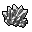

# { .sprite } Oegyth crystal

| Stat | Value |
|---|---|
| Class | construct |
| HP | 0 |
| Max AP | 10 |
| Attack cost | 10 |
| Move cost | 10 |
| Damage | 0 |
| Attack chance | 0 |
| Block chance | 0 |
| Damage resistance | 0 |
| Critical skill | 0 |
| Critical multiplier | 0 |

!!! note "Immune to critical hits"
    Monsters of this class cannot be critically hit.

## Found on

- [galmore_cavea_2](../maps/galmore_cavea_2.md)

<small>Monster ID: `mg2_cavea_throdna` · Data from v0.8.18</small>
