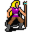

# { .sprite } Teccow

**Where to find Teccow:** Stoutford: [wild22](../maps/wild22.md#pin-npc-mg2_starwatcher)

<div class="infobox" markdown>

<p class="ib-img">{ .sprite }</p>

| | |
|---|---|
| **Type** | NPC (can be spoken to; cannot be attacked) |
| **Role** | Starts [The exploded star](../quests/mg2_exploded_star.md) |
| **Found in** | Stoutford |
| **Entry ID** | `mg2_starwatcher` |
| **Introduced** | [v0.8.14](../versions/0.8.14.md) |

</div>

## Quests

- [The exploded star](../quests/mg2_exploded_star.md): stages 5, 10, 15, 20, 30, 40, 45, 46, 50
- [mg2_exploded_star_nd (hidden flag)](../quests/mg2_exploded_star_nd.md): stages 90, 91

## Dialogue simulator

Set the quest stages, items and other conditions that apply to your game, then start the conversation with Teccow. The simulator applies the game's own rules: it performs the same silent checks, offers only the options that would be shown in the game, and applies their effects (quest stages, items handed over, rewards) as the conversation proceeds.

<div class="dlg-sim" data-src="../../assets/dialogue/mg2_starwatcher.json" data-npc="Teccow" markdown="0"><noscript>The simulator needs JavaScript. The full dialogue is listed below.</noscript></div>

<p class="verified">Rules verified against v0.8.18 game code (ConversationController.java) and dialogue data.</p>

??? quote "Dialogue (35 lines)"

    *What the dialogue says, exactly as in the game files. Lines are listed once; links jump to the line a choice leads to.*

    <span id="d-mg2_starwatcher"></span>**`mg2_starwatcher`** Teccow: “Hello kid.”

    - “Hello oldie.” → *conversation ends*
    - “What are you doing here?” *(if NOT reached stage 10 of [The exploded star](../quests/mg2_exploded_star.md#stage-10); NOT reached stage 80 of [Beer Bootlegging](../quests/beer_bootlegging.md#stage-80))* → [mg2_starwatcher_1](#d-mg2_starwatcher_1)
    - “What are you doing here?” *(if NOT reached stage 10 of [The exploded star](../quests/mg2_exploded_star.md#stage-10); reached stage 80 of [Beer Bootlegging](../quests/beer_bootlegging.md#stage-80); NOT reached stage 91 of [mg2_exploded_star_nd (hidden flag)](../quests/mg2_exploded_star_nd.md#stage-91))* → [mg2_starwatcher_2](#d-mg2_starwatcher_2)
    - “About the falling star ...” *(if reached stage 15 of [The exploded star](../quests/mg2_exploded_star.md#stage-15); NOT reached stage 45 of [The exploded star](../quests/mg2_exploded_star.md#stage-45); NOT reached stage 50 of [The exploded star](../quests/mg2_exploded_star.md#stage-50); NOT reached stage 91 of [mg2_exploded_star_nd (hidden flag)](../quests/mg2_exploded_star_nd.md#stage-91))* → [mg2_starwatcher_20](#d-mg2_starwatcher_20)
    - “About the falling star ...” *(if reached stage 10 of [The exploded star](../quests/mg2_exploded_star.md#stage-10); NOT reached stage 15 of [The exploded star](../quests/mg2_exploded_star.md#stage-15); NOT reached stage 45 of [The exploded star](../quests/mg2_exploded_star.md#stage-45); NOT reached stage 46 of [The exploded star](../quests/mg2_exploded_star.md#stage-46); NOT reached stage 50 of [The exploded star](../quests/mg2_exploded_star.md#stage-50); NOT reached stage 91 of [mg2_exploded_star_nd (hidden flag)](../quests/mg2_exploded_star_nd.md#stage-91))* → [mg2_starwatcher_3](#d-mg2_starwatcher_3)

    <span id="d-mg2_starwatcher_1"></span>**`mg2_starwatcher_1`** Teccow: “I'm doing adult things. Come back when you're much stronger. Then we can talk.” — **effects:** sets stage 5 of [The exploded star](../quests/mg2_exploded_star.md#stage-5)

    - “Just you wait, I'll show you.” → *conversation ends*

    <span id="d-mg2_starwatcher_2"></span>**`mg2_starwatcher_2`** Teccow: “You saw it too, didn't you?”

    - “Sure.” → [mg2_starwatcher_3](#d-mg2_starwatcher_3)
    - “What do you mean?” → [mg2_starwatcher_3](#d-mg2_starwatcher_3)
    - “No, I haven't had any mead today.” → *conversation ends*

    <span id="d-mg2_starwatcher_20"></span>**`mg2_starwatcher_20`** Teccow: “Kid, I have told you it wasn't a falling star.”

    - “Anyway, I haven't found any pieces yet.” *(if NOT faction “mg2_exploded_star” ≥ 1)* → [mg2_starwatcher_22](#d-mg2_starwatcher_22)
    - “Anyway, here I have some pieces already.” *(if carry 1× [Piece of bright shining crystal](../items/mg2_exploded_star.md); NOT carry 10× [Piece of bright shining crystal](../items/mg2_exploded_star.md))* → [mg2_starwatcher_24](#d-mg2_starwatcher_24)
    - “I might give you half of them - five pieces.” *(if carry 5× [Piece of bright shining crystal](../items/mg2_exploded_star.md); reached stage 17 of [The exploded star](../quests/mg2_exploded_star.md#stage-17); NOT reached stage 45 of [The exploded star](../quests/mg2_exploded_star.md#stage-45); NOT reached stage 47 of [The exploded star](../quests/mg2_exploded_star.md#stage-47))* → [mg2_starwatcher_25](#d-mg2_starwatcher_25)
    - “I might give you the rest of them - five pieces.” *(if hand over 5× [Piece of bright shining crystal](../items/mg2_exploded_star.md); reached stage 47 of [The exploded star](../quests/mg2_exploded_star.md#stage-47))* → [mg2_starwatcher_28](#d-mg2_starwatcher_28)
    - “Anyway, I have found all of the ten pieces.” *(if reached stage 110 of [The exploded star](../quests/mg2_exploded_star.md#stage-110); NOT reached stage 20 of [The exploded star](../quests/mg2_exploded_star.md#stage-20); NOT reached stage 40 of [The exploded star](../quests/mg2_exploded_star.md#stage-40); NOT reached stage 45 of [The exploded star](../quests/mg2_exploded_star.md#stage-45); NOT reached stage 46 of [The exploded star](../quests/mg2_exploded_star.md#stage-46); NOT reached stage 52 of [The exploded star](../quests/mg2_exploded_star.md#stage-52))* → [mg2_starwatcher_30](#d-mg2_starwatcher_30)
    - “Anyway, I have found all of the ten pieces, but I have already given them to Kealwea in Sullengard.” *(if reached stage 52 of [The exploded star](../quests/mg2_exploded_star.md#stage-52))* → [mg2_starwatcher_32](#d-mg2_starwatcher_32)

    <span id="d-mg2_starwatcher_3"></span>**`mg2_starwatcher_3`** Teccow: “A tear in the heavens. Not a star falling, but something cast down.”

    - Next → [mg2_starwatcher_4](#d-mg2_starwatcher_4)

    <span id="d-mg2_starwatcher_22"></span>**`mg2_starwatcher_22`** Teccow: “Don't waste time. Go again and find them. It is urgent!”


    <span id="d-mg2_starwatcher_24"></span>**`mg2_starwatcher_24`** Teccow: “Good, good. But these are not all of them. It must be ten - where are the others?”


    <span id="d-mg2_starwatcher_25"></span>**`mg2_starwatcher_25`** Teccow: “You must be out of your mind! They are deadly - let me destroy all of them.”

    - “OK, you are right. Here take them and do what you must.” *(if hand over 10× [Piece of bright shining crystal](../items/mg2_exploded_star.md))* → [mg2_starwatcher_50](#d-mg2_starwatcher_50)
    - “No, I will give you only half of them.” *(if hand over 5× [Piece of bright shining crystal](../items/mg2_exploded_star.md))* → [mg2_starwatcher_26](#d-mg2_starwatcher_26)

    <span id="d-mg2_starwatcher_28"></span>**`mg2_starwatcher_28`** Teccow: “Good, good. I'll destroy these dangerous things.” — **effects:** sets stage 46 of [The exploded star](../quests/mg2_exploded_star.md#stage-46)

    - “Great to hear. And now I have to go and find my brother at last.” → *conversation ends*

    <span id="d-mg2_starwatcher_30"></span>**`mg2_starwatcher_30`** Teccow: “Good, good. Give them to me. I'll destroy these dangerous things.” — **effects:** sets stage 30 of [The exploded star](../quests/mg2_exploded_star.md#stage-30)

    - “I seem to have lost them. Just a minute, I'll look for them ...” *(if NOT carry 10× [Piece of bright shining crystal](../items/mg2_exploded_star.md); NOT reached stage 52 of [The exploded star](../quests/mg2_exploded_star.md#stage-52))* → *conversation ends*
    - “But I have already given them to Kealwea in Sullengard.” *(if reached stage 52 of [The exploded star](../quests/mg2_exploded_star.md#stage-52))* → [mg2_starwatcher_32](#d-mg2_starwatcher_32)
    - “Here you go. Take it and do what you have to do.” *(if hand over 10× [Piece of bright shining crystal](../items/mg2_exploded_star.md))* → [mg2_starwatcher_50](#d-mg2_starwatcher_50)
    - “I've changed my mind. These glittery things are too pretty to be destroyed.” *(if carry 10× [Piece of bright shining crystal](../items/mg2_exploded_star.md))* → [mg2_starwatcher_40](#d-mg2_starwatcher_40)
    - “Hmm, I still have to think about it. I'll be back...” → *conversation ends*

    <span id="d-mg2_starwatcher_32"></span>**`mg2_starwatcher_32`** Teccow: “You fool!” — **effects:** sets stage 91 of [mg2_exploded_star_nd (hidden flag)](../quests/mg2_exploded_star_nd.md#stage-91)

    - “It was the right thing to do.” → [mg2_starwatcher_34](#d-mg2_starwatcher_34)

    <span id="d-mg2_starwatcher_4"></span>**`mg2_starwatcher_4`** Teccow: “It wept fire. And the mountain answered with a shudder. Such things are not random.”

    - Next → [mg2_starwatcher_5](#d-mg2_starwatcher_5)

    <span id="d-mg2_starwatcher_50"></span>**`mg2_starwatcher_50`** Teccow: “Wonderful. You have no idea what terrible things this crystal could have done.” — **effects:** sets stage 50 of [The exploded star](../quests/mg2_exploded_star.md#stage-50)

    - “Yes - whatever it was exactly.” → [mg2_starwatcher_52](#d-mg2_starwatcher_52)

    <span id="d-mg2_starwatcher_26"></span>**`mg2_starwatcher_26`** Teccow: “Well, I am going to destroy these five. I hope you will be careful with the others and don't rue your decision.” — **effects:** sets stage 45 of [The exploded star](../quests/mg2_exploded_star.md#stage-45)

    - “I might throw the remaining ones at Andor. Hmm ...” *(if carry 1× [Piece of bright shining crystal](../items/mg2_exploded_star.md))* → [mg2_starwatcher_27](#d-mg2_starwatcher_27)

    <span id="d-mg2_starwatcher_40"></span>**`mg2_starwatcher_40`** Teccow: “You must be out of your mind! Free yourself from them or you are lost!”

    - “No. I will keep them.” → [mg2_starwatcher_42](#d-mg2_starwatcher_42)
    - “You are certainly right. Take it and do what you have to do.” *(if hand over 10× [Piece of bright shining crystal](../items/mg2_exploded_star.md))* → [mg2_starwatcher_50](#d-mg2_starwatcher_50)

    <span id="d-mg2_starwatcher_34"></span>**`mg2_starwatcher_34`** Teccow: “It is bad. But I won't talk about it anymore.”


    <span id="d-mg2_starwatcher_5"></span>**`mg2_starwatcher_5`** [Dummy NPC](../monsters/none.md): “He gestured to the dark Galmore montains in the distant south.”

    - Next → [mg2_starwatcher_10](#d-mg2_starwatcher_10)

    <span id="d-mg2_starwatcher_52"></span>**`mg2_starwatcher_52`** Teccow: “You did the right thing. The whole world is grateful to you.”

    - “I do something like that every other day.” → *conversation ends*
    - “I can't buy anything with words of thanks.” → [mg2_starwatcher_54](#d-mg2_starwatcher_54)

    <span id="d-mg2_starwatcher_27"></span>**`mg2_starwatcher_27`** Teccow: “What???”

    - “Nothing. Bye.” → *conversation ends*

    <span id="d-mg2_starwatcher_42"></span>**`mg2_starwatcher_42`** Teccow: “NOOOOO!!” — **effects:** sets stage 40 of [The exploded star](../quests/mg2_exploded_star.md#stage-40), sets stage 91 of [mg2_exploded_star_nd (hidden flag)](../quests/mg2_exploded_star_nd.md#stage-91)

    - “Now you're exaggerating. I'll go then.” → *conversation ends*

    <span id="d-mg2_starwatcher_10"></span>**`mg2_starwatcher_10`** [Teccow](../monsters/mg2_starwatcher.md): “Ten fragments of that burning star scattered along Galmore's bones. They are still warm. Still ... humming.” — **effects:** sets stage 10 of [The exploded star](../quests/mg2_exploded_star.md#stage-10)

    - “Can I help?” → [mg2_starwatcher_14](#d-mg2_starwatcher_14)
    - “How do you know there are ten pieces?” → [mg2_starwatcher_12](#d-mg2_starwatcher_12)
    - “Ten tongues of light, each flickering in defiance of the dark.” *(if reached stage 12 of [The exploded star](../quests/mg2_exploded_star.md#stage-12))* → [mg2_starwatcher_11](#d-mg2_starwatcher_11)

    <span id="d-mg2_starwatcher_54"></span>**`mg2_starwatcher_54`** Teccow: “Oh. I understand.”

    - Next → [mg2_starwatcher_56](#d-mg2_starwatcher_56)

    <span id="d-mg2_starwatcher_14"></span>**`mg2_starwatcher_14`** Teccow: “[Ominous voice] In The Ash I Saw Them - Ten Tongues Of Light, Each Flickering In Defiance Of The Dark.”

    - Next → [mg2_starwatcher_15](#d-mg2_starwatcher_15)

    <span id="d-mg2_starwatcher_12"></span>**`mg2_starwatcher_12`** Teccow: “I can feel it.”

    - “You can feel that there are ten? Wow.” → [mg2_starwatcher_14](#d-mg2_starwatcher_14)

    <span id="d-mg2_starwatcher_11"></span>**`mg2_starwatcher_11`** Teccow: “How do you know?!”

    - “Kealwea, priest of Sullengard, told me so. Now go on.” → [mg2_starwatcher_16](#d-mg2_starwatcher_16)

    <span id="d-mg2_starwatcher_56"></span>**`mg2_starwatcher_56`** Teccow: “I have no gold to give...”

    - “No?” → [mg2_starwatcher_60](#d-mg2_starwatcher_60)

    <span id="d-mg2_starwatcher_15"></span>**`mg2_starwatcher_15`** Teccow: “Their Number Is Ten. Not Nine. Not Eleven. Ten.”

    - “All right, all right. Ten.” → [mg2_starwatcher_16](#d-mg2_starwatcher_16)

    <span id="d-mg2_starwatcher_16"></span>**`mg2_starwatcher_16`** Teccow: “So if you have no more questions ...”

    - “Well, why don't you go and collect them?” → [mg2_starwatcher_17](#d-mg2_starwatcher_17)

    <span id="d-mg2_starwatcher_60"></span>**`mg2_starwatcher_60`** Teccow: “But this necklace with a medal on it will remind you of your heroic deed at any time.” — **effects:** gives 1× [Necklace with a medal from Teccow](../items/mg2_rewarded_necklace.md)

    - “Thank you.” → *conversation ends*

    <span id="d-mg2_starwatcher_17"></span>**`mg2_starwatcher_17`** Teccow: “Only little children could ask such a stupid question. Of course I can't go. Stoutford needs me here.”

    - “What for?” → [mg2_starwatcher_17b](#d-mg2_starwatcher_17b)

    <span id="d-mg2_starwatcher_17b"></span>**`mg2_starwatcher_17b`** Teccow: “Silence now!”

    - Next → [mg2_starwatcher_18](#d-mg2_starwatcher_18)

    <span id="d-mg2_starwatcher_18"></span>**`mg2_starwatcher_18`** Teccow: “'Bring these shards to me now. Before the mountain's curse draws worse than beasts to them!” — **effects:** sets stage 15 of [The exploded star](../quests/mg2_exploded_star.md#stage-15)

    - “But ...” *(if NOT faction “mg2_exploded_star” ≥ 1)* → [mg2_starwatcher_19](#d-mg2_starwatcher_19)
    - “In fact I have already found some of these stars.” *(if faction “mg2_exploded_star” ≥ 1)* → [mg2_starwatcher_20](#d-mg2_starwatcher_20)

    <span id="d-mg2_starwatcher_19"></span>**`mg2_starwatcher_19`** Teccow: “[Ominous voice] Bring The Ten Pieces ...”

    - “Enough, please! I can't think when you are talking like this.” → *conversation ends*
    - “Forget it, do it yourself.” → [mg2_starwatcher_19a](#d-mg2_starwatcher_19a)

    <span id="d-mg2_starwatcher_19a"></span>**`mg2_starwatcher_19a`** Teccow: “So you really don't want to help? And save the world from this disaster?”

    - “Maybe later. I have to go now.” → *conversation ends*
    - “No, I have enough other things to do.” → [mg2_starwatcher_19b](#d-mg2_starwatcher_19b)

    <span id="d-mg2_starwatcher_19b"></span>**`mg2_starwatcher_19b`** Teccow: “Woe, woe! Then leave me. I hope you can live with the guilt.” — **effects:** sets stage 20 of [The exploded star](../quests/mg2_exploded_star.md#stage-20), sets stage 90 of [mg2_exploded_star_nd (hidden flag)](../quests/mg2_exploded_star_nd.md#stage-90), sets stage 91 of [mg2_exploded_star_nd (hidden flag)](../quests/mg2_exploded_star_nd.md#stage-91)


## Version history

| Version | Change |
|---|---|
| [v0.8.14](../versions/0.8.14.md) | Added<br>Dialogue: 35 lines added |

<p class="verified">Verified against v0.8.18 and every earlier release back to v0.7.0 (game data compared release by release).</p>


??? info "Technical information"

    | | |
    |---|---|
    | Entry ID | `mg2_starwatcher` |
    | Spawn group | `mg2_starwatcher` |
    | Loot table | – |
    | Conversation | `mg2_starwatcher` |
    | Faction | – |
    | Movement | – |
    | Icon | `monsters_ld1:230` |
    | Defined in | `res/raw/monsterlist_mt_galmore2.json` |

    Raw data:

    ```json
    {
     "id": "mg2_starwatcher",
     "name": "Teccow",
     "iconID": "monsters_ld1:230",
     "monsterClass": "humanoid",
     "spawnGroup": "mg2_starwatcher",
     "phraseID": "mg2_starwatcher"
    }
    ```


## Community notes

<small>Written by players, not generated from game data. **Observations**: what players notice in-game · **Lore**: the in-world story · **Trivia**: real-world facts, references, development history · **Theory / speculation**: unconfirmed ideas; may just be unfinished content</small>

### Observations

*No notes yet. Contributions are welcome: [add a note](https://github.com/asdfghjkl628/Andor-s-Trail-Wikiiii/new/main/notes/monsters?filename=mg2_starwatcher.md&value=%23%23%20Observations%0A%0A%3C%21--%20what%20players%20notice%20in-game%20--%3E%0A%0A%23%23%20Lore%0A%0A%3C%21--%20the%20in-world%20story%20--%3E%0A%0A%23%23%20Trivia%0A%0A%3C%21--%20real-world%20facts%2C%20references%2C%20development%20history%20--%3E%0A%0A%23%23%20Theory%20/%20speculation%0A%0A%3C%21--%20unconfirmed%20ideas%3B%20may%20just%20be%20unfinished%20content%20--%3E%0A).*

### Lore

*No notes yet. Contributions are welcome: [add a note](https://github.com/asdfghjkl628/Andor-s-Trail-Wikiiii/new/main/notes/monsters?filename=mg2_starwatcher.md&value=%23%23%20Observations%0A%0A%3C%21--%20what%20players%20notice%20in-game%20--%3E%0A%0A%23%23%20Lore%0A%0A%3C%21--%20the%20in-world%20story%20--%3E%0A%0A%23%23%20Trivia%0A%0A%3C%21--%20real-world%20facts%2C%20references%2C%20development%20history%20--%3E%0A%0A%23%23%20Theory%20/%20speculation%0A%0A%3C%21--%20unconfirmed%20ideas%3B%20may%20just%20be%20unfinished%20content%20--%3E%0A).*

### Trivia

*No notes yet. Contributions are welcome: [add a note](https://github.com/asdfghjkl628/Andor-s-Trail-Wikiiii/new/main/notes/monsters?filename=mg2_starwatcher.md&value=%23%23%20Observations%0A%0A%3C%21--%20what%20players%20notice%20in-game%20--%3E%0A%0A%23%23%20Lore%0A%0A%3C%21--%20the%20in-world%20story%20--%3E%0A%0A%23%23%20Trivia%0A%0A%3C%21--%20real-world%20facts%2C%20references%2C%20development%20history%20--%3E%0A%0A%23%23%20Theory%20/%20speculation%0A%0A%3C%21--%20unconfirmed%20ideas%3B%20may%20just%20be%20unfinished%20content%20--%3E%0A).*

### Theory / speculation

*No notes yet. Contributions are welcome: [add a note](https://github.com/asdfghjkl628/Andor-s-Trail-Wikiiii/new/main/notes/monsters?filename=mg2_starwatcher.md&value=%23%23%20Observations%0A%0A%3C%21--%20what%20players%20notice%20in-game%20--%3E%0A%0A%23%23%20Lore%0A%0A%3C%21--%20the%20in-world%20story%20--%3E%0A%0A%23%23%20Trivia%0A%0A%3C%21--%20real-world%20facts%2C%20references%2C%20development%20history%20--%3E%0A%0A%23%23%20Theory%20/%20speculation%0A%0A%3C%21--%20unconfirmed%20ideas%3B%20may%20just%20be%20unfinished%20content%20--%3E%0A).*


<small>Data from v0.8.18</small>
