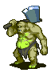

# { .sprite } Sleepy giant ogre

| Stat | Value |
|---|---|
| Class | giant |
| HP | 590 |
| Max AP | 10 |
| Attack cost | 9 |
| Move cost | 8 |
| Damage | 20 to 60 |
| Attack chance | 90 |
| Block chance | 90 |
| Damage resistance | 15 |
| Critical skill | 0 |
| Critical multiplier | 0 |

## On hit

- **On target:** Stunned (magnitude 1, 5 rounds, 5% chance)

## Drops

| Item | Chance | Qty |
|---|---|---|
| [Gold coins](../items/gold.md) | 100% | 30 to 130 |
| [Bone](../items/bone.md) | 100% | 1 |
| [Small rock](../items/rock.md) | 100% | 1 to 3 |

## Found on

- [galmore_18](../maps/galmore_18.md)

<small>Monster ID: `mg2_troll` · Data from v0.8.18</small>
