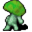

# { .sprite } Angry fungi

| Stat | Value |
|---|---|
| Class | animal |
| HP | 35 |
| Max AP | 10 |
| Attack cost | 5 |
| Move cost | 5 |
| Damage | 3 to 6 |
| Attack chance | 80 |
| Block chance | 8 |
| Damage resistance | 0 |
| Critical skill | 0 |
| Critical multiplier | 0 |

## On hit

- **On target:** Spore poisoning (magnitude 1, 2 rounds, 10% chance)

## Drops

| Item | Chance | Qty |
|---|---|---|
| [Spores of the giant mushroom](../items/fungi_panic_spores.md) | 100% | 1 to 2 |
| [Bogsten's mushroom](../items/mushroom_bogsten.md) | 10% | 1 |

## Found on

- [mushroom_m3_2](../maps/mushroom_m3_2.md)

<small>Monster ID: `mid_fungi_1` · Data from v0.8.18</small>
