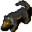

# { .sprite } Mountain wolf

| Stat | Value |
|---|---|
| Class | animal |
| HP | 49 |
| Max AP | 10 |
| Attack cost | 5 |
| Move cost | 5 |
| Damage | 3 to 9 |
| Attack chance | 150 |
| Block chance | 60 |
| Damage resistance | 3 |
| Critical skill | 0 |
| Critical multiplier | 0 |

## Drops

| Item | Chance | Qty |
|---|---|---|
| [Gold coins](../items/gold.md) | 70% | 3 to 6 |
| [Glass gem](../items/gem1.md) | 5% | 1 |
| [Meat](../items/meat.md) | 30% | 1 |

## Found on

- [blackwater_mountain10](../maps/blackwater_mountain10.md)
- [blackwater_mountain12](../maps/blackwater_mountain12.md)
- [blackwater_mountain14](../maps/blackwater_mountain14.md)
- [bwmfill2](../maps/bwmfill2.md)
- [bwmfill5](../maps/bwmfill5.md)
- [bwmfill6](../maps/bwmfill6.md)
- [bwmfill7](../maps/bwmfill7.md)
- [mountainlake8_cave](../maps/mountainlake8_cave.md)
- [ratdom_bwm1](../maps/ratdom_bwm1.md)

<small>Monster ID: `mountain_wolf` · Data from v0.8.18</small>
