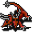

# { .sprite } Mutated harrowback

**Found in:** Mt. Galmore: [Galmore 34](../maps/galmore_34.md), Mt. Galmore: [Galmore 43](../maps/galmore_43.md), Mt. Galmore: [Galmore 44](../maps/galmore_44.md), Mt. Galmore: [Galmore 45](../maps/galmore_45.md) (+2 more)

<div class="infobox" markdown>

<p class="ib-img">{ .sprite }</p>

| | |
|---|---|
| **Type** | Enemy (hostile on sight) |
| **Found in** | Mt. Galmore |
| **Class** | Animal |
| **HP** | 197 |
| **XP when defeated** | 519 |
| **Entry ID** | `mutated_harrowback` |
| **Introduced** | [v0.8.14](../versions/0.8.14.md) |

</div>

## Combat statistics

| Statistic | Value |
|---|---|
| Class | Animal |
| HP | 197 |
| XP when defeated | 519 |
| Damage | 10 to 13 |
| Attack chance | 201 |
| Block chance | 135 |
| Damage resistance | 0 |
| Max AP | 14 |
| Attack cost | 3 AP |
| Attacks per turn | 4 |
| Move cost | 3 AP |
| Critical skill | 0 |
| Critical multiplier | – |
| Critical hit chance | None (requires both critical skill and a critical multiplier) |

**On hit:** Restore AP: 1


<p class="verified">Verified against v0.8.18 monster data and game code (`MonsterTypeParser.java`).</p>

## Drops

| Item | Chance | Qty |
|---|---|---|
| [Meat](../items/meat.md) | 20% | 1 to 2 |
| [Gold coins](../items/gold.md) | 15% | 8 to 20 |
| [Bone](../items/bone.md) | 25% | 1 to 2 |

## Locations

| Map | Region | Up to | Notes |
|---|---|---|---|
| [Galmore 34](../maps/galmore_34.md) | Mt. Galmore | 3 | – |
| [Galmore 43](../maps/galmore_43.md) | Mt. Galmore | 2 | – |
| [Galmore 44](../maps/galmore_44.md) | Mt. Galmore | 12 | – |
| [Galmore 45](../maps/galmore_45.md) | Mt. Galmore | 14 | – |
| [Galmore 46](../maps/galmore_46.md) | Mt. Galmore | 7 | – |
| [Galmore 54](../maps/galmore_54.md) | Mt. Galmore | 3 | – |


## Version history

| Version | Change |
|---|---|
| [v0.8.14](../versions/0.8.14.md) | Added |

<p class="verified">Verified against v0.8.18 and every earlier release back to v0.7.0 (game data compared release by release).</p>


??? info "Technical information"

    | | |
    |---|---|
    | Entry ID | `mutated_harrowback` |
    | Spawn group | `mutated_harrowback` |
    | Loot table | `harrowback_dl` |
    | Conversation | – |
    | Faction | – |
    | Movement | – |
    | Icon | `monsters_tometik1:84` |
    | Defined in | `res/raw/monsterlist_mt_galmore2.json` |

    Raw data:

    ```json
    {
     "id": "mutated_harrowback",
     "name": "Mutated harrowback",
     "iconID": "monsters_tometik1:84",
     "maxHP": 197,
     "maxAP": 14,
     "moveCost": 3,
     "monsterClass": "animal",
     "attackDamage": {
      "min": 10,
      "max": 13
     },
     "droplistID": "harrowback_dl",
     "attackCost": 3,
     "attackChance": 201,
     "blockChance": 135,
     "hitEffect": {
      "increaseCurrentAP": {
       "min": 1,
       "max": 1
      }
     }
    }
    ```


??? info "How the XP value is calculated"

    The game computes each enemy's experience value when it loads the data (`MonsterTypeParser.java`):

    XP = ⌈(attacks per turn × attack chance × average damage × (1 + critical skill × critical multiplier) × 3 + HP × (1 + block chance) + 9 × damage resistance) × 0.7⌉

    Percentages are used as fractions (e.g. 60% = 0.6). Enemies whose attacks inflict a condition are worth 50 XP more. The More Exp skill adds a percentage on top.


## Community notes

<small>Written by players, not generated from game data. **Observations**: what players notice in-game · **Lore**: the in-world story · **Trivia**: real-world facts, references, development history · **Theory / speculation**: unconfirmed ideas; may just be unfinished content</small>

### Observations

*No notes yet. Contributions are welcome: [add a note](https://github.com/asdfghjkl628/Andor-s-Trail-Wikiiii/new/main/notes/monsters?filename=mutated_harrowback.md&value=%23%23%20Observations%0A%0A%3C%21--%20what%20players%20notice%20in-game%20--%3E%0A%0A%23%23%20Lore%0A%0A%3C%21--%20the%20in-world%20story%20--%3E%0A%0A%23%23%20Trivia%0A%0A%3C%21--%20real-world%20facts%2C%20references%2C%20development%20history%20--%3E%0A%0A%23%23%20Theory%20/%20speculation%0A%0A%3C%21--%20unconfirmed%20ideas%3B%20may%20just%20be%20unfinished%20content%20--%3E%0A).*

### Lore

*No notes yet. Contributions are welcome: [add a note](https://github.com/asdfghjkl628/Andor-s-Trail-Wikiiii/new/main/notes/monsters?filename=mutated_harrowback.md&value=%23%23%20Observations%0A%0A%3C%21--%20what%20players%20notice%20in-game%20--%3E%0A%0A%23%23%20Lore%0A%0A%3C%21--%20the%20in-world%20story%20--%3E%0A%0A%23%23%20Trivia%0A%0A%3C%21--%20real-world%20facts%2C%20references%2C%20development%20history%20--%3E%0A%0A%23%23%20Theory%20/%20speculation%0A%0A%3C%21--%20unconfirmed%20ideas%3B%20may%20just%20be%20unfinished%20content%20--%3E%0A).*

### Trivia

*No notes yet. Contributions are welcome: [add a note](https://github.com/asdfghjkl628/Andor-s-Trail-Wikiiii/new/main/notes/monsters?filename=mutated_harrowback.md&value=%23%23%20Observations%0A%0A%3C%21--%20what%20players%20notice%20in-game%20--%3E%0A%0A%23%23%20Lore%0A%0A%3C%21--%20the%20in-world%20story%20--%3E%0A%0A%23%23%20Trivia%0A%0A%3C%21--%20real-world%20facts%2C%20references%2C%20development%20history%20--%3E%0A%0A%23%23%20Theory%20/%20speculation%0A%0A%3C%21--%20unconfirmed%20ideas%3B%20may%20just%20be%20unfinished%20content%20--%3E%0A).*

### Theory / speculation

*No notes yet. Contributions are welcome: [add a note](https://github.com/asdfghjkl628/Andor-s-Trail-Wikiiii/new/main/notes/monsters?filename=mutated_harrowback.md&value=%23%23%20Observations%0A%0A%3C%21--%20what%20players%20notice%20in-game%20--%3E%0A%0A%23%23%20Lore%0A%0A%3C%21--%20the%20in-world%20story%20--%3E%0A%0A%23%23%20Trivia%0A%0A%3C%21--%20real-world%20facts%2C%20references%2C%20development%20history%20--%3E%0A%0A%23%23%20Theory%20/%20speculation%0A%0A%3C%21--%20unconfirmed%20ideas%3B%20may%20just%20be%20unfinished%20content%20--%3E%0A).*


<small>Data from v0.8.18</small>
