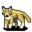

# { .sprite } Young mountain wolf

| Stat | Value |
|---|---|
| Class | animal |
| HP | 52 |
| Max AP | 10 |
| Attack cost | 5 |
| Move cost | 5 |
| Damage | 3 to 7 |
| Attack chance | 80 |
| Block chance | 44 |
| Damage resistance | 3 |
| Critical skill | 10 |
| Critical multiplier | 2.0 |

## Drops

| Item | Chance | Qty |
|---|---|---|
| [Gold coins](../items/gold.md) | 50% | 1 to 5 |
| [Ruby gem](../items/gem2.md) | 1% | 1 |
| [Meat](../items/meat.md) | 5% | 1 |
| [Animal hair](../items/hair.md) | 30% | 1 |

## Found on

- [mountainlake1](../maps/mountainlake1.md)
- [mountainlake10a](../maps/mountainlake10a.md)
- [mountainlake11](../maps/mountainlake11.md)
- [mountainlake12](../maps/mountainlake12.md)
- [mountainlake13](../maps/mountainlake13.md)
- [mountainlake13a](../maps/mountainlake13a.md)
- [waytolake9](../maps/waytolake9.md)

<small>Monster ID: `mwolf_2` · Data from v0.8.18</small>
