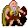

# { .sprite } Old man

**Where to find Old man:** [Fallhaven, Fallhaven north-west](#v-old_man), [Guynmart Castle, Guynmart wood 10](#v-guynmart_wise)

<div class="infobox" markdown>

<p class="ib-img"></p>

| | |
|---|---|
| **Type** | NPC (talk only; never fought) |
| **Role** | Starts [Calomyran secrets](../quests/calomyran.md); starts [Rare delicacies](../quests/guynmart_wise.md) |
| **Found in** | Fallhaven, Guynmart Castle |
| **Introduced** | v0.7.0 or earlier |

</div>

## Fallhaven, Fallhaven north-west { #v-old_man }

**Where:** Fallhaven: [Fallhaven north-west](../maps/fallhaven_nw.md#pin-npc-old_man) · **Role:** Starts [Calomyran secrets](../quests/calomyran.md)

### Quests

- [Calomyran secrets](../quests/calomyran.md): stages 10, 100
- [Darkness in the Daylight](../quests/darkness_in_daylight.md): stages 130, 140

### Dialogue simulator

Talk to Old man as you would in the game. When the conversation depends on your progress (a quest, an item, a dice roll…), the simulator asks you. Try another answer with **Undo**.

<div class="dlg-sim" data-src="../../assets/dialogue/fallhaven_oldman.json" data-npc="Old man" markdown="0"><noscript>The simulator needs JavaScript. The full dialogue is listed below.</noscript></div>

<p class="verified">Follows the game's own conversation rules (v0.8.18).</p>

??? quote "Dialogue (19 lines)"

    *Exactly as in the game files. Each line appears once; links jump to where a choice leads.*

    <span id="d-old_man-fallhaven_oldman"></span>**`fallhaven_oldman`** *(silent check: the first matching branch below is taken)*

    - branch 1 *(if reached stage 110 of [Darkness in the Daylight](../quests/darkness_in_daylight.md#stage-110); NOT reached stage 140 of [Darkness in the Daylight](../quests/darkness_in_daylight.md#stage-140))* → [dds_oldman_10](#d-old_man-dds_oldman_10)
    - branch 2 *(if reached stage 100 of [Calomyran secrets](../quests/calomyran.md#stage-100))* → [fallhaven_oldman_complete_2](#d-old_man-fallhaven_oldman_complete_2)
    - branch 3 *(if reached stage 10 of [Calomyran secrets](../quests/calomyran.md#stage-10))* → [fallhaven_oldman_continue](#d-old_man-fallhaven_oldman_continue)
    - branch 4 → [fallhaven_oldman_1](#d-old_man-fallhaven_oldman_1)

    <span id="d-old_man-dds_oldman_10"></span>**`dds_oldman_10`** Old man: “Who are you? Not here to steal my books, are you?”

    - “I once helped to find your book. Don't be rude!” → [dds_oldman_20](#d-old_man-dds_oldman_20)

    <span id="d-old_man-fallhaven_oldman_complete_2"></span>**`fallhaven_oldman_complete_2`** Old man: “Thank you so much for finding my book!”


    <span id="d-old_man-fallhaven_oldman_continue"></span>**`fallhaven_oldman_continue`** Old man: “How is the search for my book going? It's called 'Calomyran Secrets'. Have you found my book?”

    - “Yes, I found it.” *(if hand over 1× [Calomyran secrets](../items/calomyran_secrets.md))* → [fallhaven_oldman_complete](#d-old_man-fallhaven_oldman_complete)
    - “No, I have not found it yet.” → [fallhaven_oldman_6](#d-old_man-fallhaven_oldman_6)
    - “Could you tell me your story again please?” → [fallhaven_oldman_2](#d-old_man-fallhaven_oldman_2)

    <span id="d-old_man-fallhaven_oldman_1"></span>**`fallhaven_oldman_1`** Old man: “Would you help an old man please?”

    - “Sure, what do you need help with?” → [fallhaven_oldman_2](#d-old_man-fallhaven_oldman_2)
    - “I might. Are we talking about some kind of reward?” → [fallhaven_oldman_2](#d-old_man-fallhaven_oldman_2)
    - “No, I won't help an old timer like you. Bye.” → *conversation ends*

    <span id="d-old_man-dds_oldman_20"></span>**`dds_oldman_20`** Old man: “Sorry, there seem to be folks who want to take my books and not return them.”

    - “In fact, I'd like to borrow your copy of Calomyran Secrets.” → [dds_oldman_30](#d-old_man-dds_oldman_30)

    <span id="d-old_man-fallhaven_oldman_complete"></span>**`fallhaven_oldman_complete`** Old man: “My book! Thank you, thank you! Where was it? No, don't tell me. Here, take these coins for your trouble.” — **effects:** sets stage 100 of [Calomyran secrets](../quests/calomyran.md#stage-100), gives [Gold coins](../items/gold.md)

    - “Thank you. Goodbye.” → *conversation ends*
    - “At last, some gold. Bye.” → *conversation ends*

    <span id="d-old_man-fallhaven_oldman_6"></span>**`fallhaven_oldman_6`** Old man: “I have no idea where it might be. You could go ask Arcir, he seems very fond of his books. [Points at the house to the south]” — **effects:** sets stage 10 of [Calomyran secrets](../quests/calomyran.md#stage-10)

    - “OK, I'll go ask Arcir. Goodbye.” → *conversation ends*

    <span id="d-old_man-fallhaven_oldman_2"></span>**`fallhaven_oldman_2`** Old man: “I recently lost a very valuable book of mine.”

    - Next → [fallhaven_oldman_3](#d-old_man-fallhaven_oldman_3)

    <span id="d-old_man-dds_oldman_30"></span>**`dds_oldman_30`** Old man: “No can do. It's too rare and precious.”

    - “But Dhayavar is at stake!” → [dds_oldman_40](#d-old_man-dds_oldman_40)

    <span id="d-old_man-fallhaven_oldman_3"></span>**`fallhaven_oldman_3`** Old man: “I know I had it with me yesterday. Now I can't seem to find it.”

    - Next → [fallhaven_oldman_4](#d-old_man-fallhaven_oldman_4)

    <span id="d-old_man-dds_oldman_40"></span>**`dds_oldman_40`** Old man: “Sounds serious. But, what's the book got to do with that?”

    - “I need a chant from it to break a Kazaul spell.” → [dds_oldman_50](#d-old_man-dds_oldman_50)

    <span id="d-old_man-fallhaven_oldman_4"></span>**`fallhaven_oldman_4`** Old man: “I never lose things! Someone must have stolen it, that's my guess.”

    - Next → [fallhaven_oldman_5](#d-old_man-fallhaven_oldman_5)

    <span id="d-old_man-dds_oldman_50"></span>**`dds_oldman_50`** Old man: “Copy it then.” — **effects:** sets stage 130 of [Darkness in the Daylight](../quests/darkness_in_daylight.md#stage-130)

    - “OK ... just a second ...” → [dds_oldman_60](#d-old_man-dds_oldman_60)

    <span id="d-old_man-fallhaven_oldman_5"></span>**`fallhaven_oldman_5`** Old man: “Would you please go look for my book? It's called 'Calomyran Secrets'.”

    - Next → [fallhaven_oldman_6](#d-old_man-fallhaven_oldman_6)

    <span id="d-old_man-dds_oldman_60"></span>**`dds_oldman_60`** Old man: “Have you finished yet?”

    - “[Talking to self, while reading] So, this is the chant. Wait, this is half a chant! The books says the rest of the…” → [dds_oldman_62](#d-old_man-dds_oldman_62)

    <span id="d-old_man-dds_oldman_62"></span>**`dds_oldman_62`** Old man: “And stop babbling to yourself!”

    - “Done. Here's your book back, thank you.” → [dds_oldman_64](#d-old_man-dds_oldman_64)

    <span id="d-old_man-dds_oldman_64"></span>**`dds_oldman_64`** Old man: “Do I see greasy fingerprints there?”

    - “However, it is not complete. Do you also have the book Azimyran Secrets?” → [dds_oldman_70](#d-old_man-dds_oldman_70)

    <span id="d-old_man-dds_oldman_70"></span>**`dds_oldman_70`** Old man: “No, sorry. Do let me know if you come across a copy.” — **effects:** sets stage 140 of [Darkness in the Daylight](../quests/darkness_in_daylight.md#stage-140)


### Version history

| Version | Change |
|---|---|
| [v0.7.0](../versions/0.7.0.md) | Present in v0.7.0 (earliest release tracked) |
| [v0.7.2](../versions/0.7.2.md) | Dialogue: 2 lines changed<br>· text: “I have no idea where it might be. You could go ask Arcir, he seems ve…” → “I have no idea where it might be. You could go ask Arcir, he seems ve…” |
| [v0.8.14](../versions/0.8.14.md) | Dialogue: 9 lines added, 1 line changed |

<p class="verified">Verified against v0.8.18 and every earlier release back to v0.7.0 (game data compared release by release).</p>


## Guynmart Castle, Guynmart wood 10 { #v-guynmart_wise }

**Where:** Guynmart Castle: [Guynmart wood 10](../maps/guynmart_wood_10.md#pin-npc-guynmart_wise) · **Role:** Starts [Rare delicacies](../quests/guynmart_wise.md)

### Quests

- [Rare delicacies](../quests/guynmart_wise.md): stages 10, 20, 30, 90
- [Guynmart story flags (hidden flag)](../quests/guynmart_nondisplay.md): stage 35

### Dialogue simulator

Talk to Old man as you would in the game. When the conversation depends on your progress (a quest, an item, a dice roll…), the simulator asks you. Try another answer with **Undo**.

<div class="dlg-sim" data-src="../../assets/dialogue/guynmart_wise_10.json" data-npc="Old man" markdown="0"><noscript>The simulator needs JavaScript. The full dialogue is listed below.</noscript></div>

<p class="verified">Follows the game's own conversation rules (v0.8.18).</p>

??? quote "Dialogue (42 lines)"

    *Exactly as in the game files. Each line appears once; links jump to where a choice leads.*

    <span id="d-guynmart_wise-guynmart_wise_10"></span>**`guynmart_wise_10`** *(silent check: the first matching branch below is taken)*

    - branch 1 *(if reached stage 35 of [Guynmart story flags (hidden flag)](../quests/guynmart_nondisplay.md#stage-35))* → [guynmart_wise_14](#d-guynmart_wise-guynmart_wise_14)
    - branch 2 → [guynmart_wise_12](#d-guynmart_wise-guynmart_wise_12)

    <span id="d-guynmart_wise-guynmart_wise_14"></span>**`guynmart_wise_14`** Old man: “Oh, it is you again. I am delighted!”

    - “De-lighted indeed. Might you need anything?” → [guynmart_wise_110](#d-guynmart_wise-guynmart_wise_110)

    <span id="d-guynmart_wise-guynmart_wise_12"></span>**`guynmart_wise_12`** Old man: “Oh, a visitor. Come closer. Do not be afraid of me.”

    - “I am not afraid. What happened to you?” → [guynmart_wise_20](#d-guynmart_wise-guynmart_wise_20)
    - “Eh, I have to go.” → *conversation ends*

    <span id="d-guynmart_wise-guynmart_wise_110"></span>**`guynmart_wise_110`** *(silent check: the first matching branch below is taken)*

    - branch 1 *(if reached stage 90 of [Rare delicacies](../quests/guynmart_wise.md#stage-90))* → [guynmart_wise_116](#d-guynmart_wise-guynmart_wise_116)
    - branch 2 *(if reached stage 30 of [Rare delicacies](../quests/guynmart_wise.md#stage-30))* → [guynmart_wise_112](#d-guynmart_wise-guynmart_wise_112)
    - branch 3 *(if reached stage 20 of [Rare delicacies](../quests/guynmart_wise.md#stage-20))* → [guynmart_wise_170](#d-guynmart_wise-guynmart_wise_170)
    - branch 4 *(if reached stage 10 of [Rare delicacies](../quests/guynmart_wise.md#stage-10))* → [guynmart_wise_114](#d-guynmart_wise-guynmart_wise_114)
    - branch 5 → [guynmart_wise_118](#d-guynmart_wise-guynmart_wise_118)

    <span id="d-guynmart_wise-guynmart_wise_20"></span>**`guynmart_wise_20`** Old man: “It happened in the mines of Mount Galmore. Don't ask any more, I do not wish to recall the memories. It was horrible.”

    - Next → [guynmart_wise_60](#d-guynmart_wise-guynmart_wise_60)

    <span id="d-guynmart_wise-guynmart_wise_116"></span>**`guynmart_wise_116`** Old man: “No, thank you.”

    - Next → [guynmart_wise_900](#d-guynmart_wise-guynmart_wise_900)

    <span id="d-guynmart_wise-guynmart_wise_112"></span>**`guynmart_wise_112`** Old man: “Do you bring bread and wine, together with my favorite cheddar?”

    - “Yes, finally I got it. I hope the cheddar is still fresh after the long journey.” *(if hand over 2× [Bread](../items/bread.md); hand over 1× [Charwood cheddar](../items/charwood_cheddar.md); hand over 1× [Wine](../items/guynmart_wine.md))* → [guynmart_wise_200](#d-guynmart_wise-guynmart_wise_200)
    - “No, not yet.” → [guynmart_wise_800](#d-guynmart_wise-guynmart_wise_800)

    <span id="d-guynmart_wise-guynmart_wise_170"></span>**`guynmart_wise_170`** Old man: “...”

    - Next → [guynmart_wise_172](#d-guynmart_wise-guynmart_wise_172)

    <span id="d-guynmart_wise-guynmart_wise_114"></span>**`guynmart_wise_114`** Old man: “Do you bring bread, cheese and wine?”

    - “Yes, here you are. Enjoy it!” *(if hand over 2× [Bread](../items/bread.md); hand over 1× [Cheese](../items/cheese.md); hand over 1× [Wine](../items/guynmart_wine.md))* → [guynmart_wise_150](#d-guynmart_wise-guynmart_wise_150)
    - “No, not yet.” → [guynmart_wise_800](#d-guynmart_wise-guynmart_wise_800)

    <span id="d-guynmart_wise-guynmart_wise_118"></span>**`guynmart_wise_118`** Old man: “Just recently my supply of bread has run low again. And I haven't seen eggs for such a long time...”

    - “I can help with that. I can spare 2 loaves of bread.” *(if hand over 2× [Bread](../items/bread.md))* → [guynmart_wise_120](#d-guynmart_wise-guynmart_wise_120)
    - “I could give you 3 eggs.” *(if hand over 3× [Eggs](../items/eggs.md))* → [guynmart_wise_120](#d-guynmart_wise-guynmart_wise_120)
    - “I could spare bread, some cheese and a bottle of red wine.” *(if reached stage 10 of [Rare delicacies](../quests/guynmart_wise.md#stage-10); hand over 2× [Bread](../items/bread.md); hand over 1× [Cheese](../items/cheese.md); hand over 1× [Wine](../items/guynmart_wine.md))* → [guynmart_wise_150](#d-guynmart_wise-guynmart_wise_150)
    - “Unfortunately I have nothing I could give you.” → [guynmart_wise_900](#d-guynmart_wise-guynmart_wise_900)
    - “Sad for you. I have to go now. Bye.” → *conversation ends*

    <span id="d-guynmart_wise-guynmart_wise_60"></span>**`guynmart_wise_60`** Old man: “When I returned here at last, people started to avoid me, whispering behind my back. I got very lonely.”

    - Next → [guynmart_wise_100](#d-guynmart_wise-guynmart_wise_100)

    <span id="d-guynmart_wise-guynmart_wise_900"></span>**`guynmart_wise_900`** Old man: “It was nice to talk to you. Come again, as often as you like!”

    - “Yes, we will meet again.” → *conversation ends*

    <span id="d-guynmart_wise-guynmart_wise_200"></span>**`guynmart_wise_200`** Old man: “Cheddar! I can't believe it!” — **effects:** sets stage 90 of [Rare delicacies](../quests/guynmart_wise.md#stage-90)

    - Next → [guynmart_wise_202](#d-guynmart_wise-guynmart_wise_202)

    <span id="d-guynmart_wise-guynmart_wise_800"></span>**`guynmart_wise_800`** Old man: “Ah - I can see it before my eyes: a loaf of bread with a piece of delicious cheese! No, better two loaves of bread.”

    - Next → [guynmart_wise_802](#d-guynmart_wise-guynmart_wise_802)

    <span id="d-guynmart_wise-guynmart_wise_172"></span>**`guynmart_wise_172`** Old man: “Eh...”

    - “Yes?” → [guynmart_wise_174](#d-guynmart_wise-guynmart_wise_174)

    <span id="d-guynmart_wise-guynmart_wise_150"></span>**`guynmart_wise_150`** Old man: “What a feast! I have no words to thank you!”

    - Next → [guynmart_wise_160](#d-guynmart_wise-guynmart_wise_160)

    <span id="d-guynmart_wise-guynmart_wise_120"></span>**`guynmart_wise_120`** Old man: “Thank you! Thank you very much!”

    - Next → [guynmart_wise_122](#d-guynmart_wise-guynmart_wise_122)

    <span id="d-guynmart_wise-guynmart_wise_100"></span>**`guynmart_wise_100`** Old man: “Eventually I had enough of all the anxious, disturbed looks, so I came up here on this lonely hill.”

    - Next → [guynmart_wise_102](#d-guynmart_wise-guynmart_wise_102)

    <span id="d-guynmart_wise-guynmart_wise_202"></span>**`guynmart_wise_202`** Old man: “[Eating]”

    - Next → [guynmart_wise_900](#d-guynmart_wise-guynmart_wise_900)

    <span id="d-guynmart_wise-guynmart_wise_802"></span>**`guynmart_wise_802`** Old man: “Along with a bottle of good red wine!”

    - Next → [guynmart_wise_804](#d-guynmart_wise-guynmart_wise_804)

    <span id="d-guynmart_wise-guynmart_wise_174"></span>**`guynmart_wise_174`** Old man: “now...”

    - “Oh dear! Just say what is on your mind. What's up?” → [guynmart_wise_180](#d-guynmart_wise-guynmart_wise_180)

    <span id="d-guynmart_wise-guynmart_wise_160"></span>**`guynmart_wise_160`** Old man: “So take this ring as a token of my gratitude. Certain beings in the cellars of Guynmart Castle will not harm you if they see my ring on your finger.” — **effects:** gives 1× [Old man's ring of bone](../items/guynmart_bonering.md), sets stage 20 of [Rare delicacies](../quests/guynmart_wise.md#stage-20)

    - “The ring looks interesting. Thank you.” → [guynmart_wise_170](#d-guynmart_wise-guynmart_wise_170)

    <span id="d-guynmart_wise-guynmart_wise_122"></span>**`guynmart_wise_122`** Old man: “Would it be really outrageous if I asked you to fulfill my heart's desire?”

    - “Sorry, I really must go now.” → [guynmart_wise_900](#d-guynmart_wise-guynmart_wise_900)
    - “Just say what you would like. What can I do for you?” → [guynmart_wise_130](#d-guynmart_wise-guynmart_wise_130)

    <span id="d-guynmart_wise-guynmart_wise_102"></span>**`guynmart_wise_102`** Old man: “From time to time a friendly soul brings me some food, but no one stays for long. I have noticed that their pace uphill is usually much slower than back downhill.” — **effects:** sets stage 35 of [Guynmart story flags (hidden flag)](../quests/guynmart_nondisplay.md#stage-35)

    - Next → [guynmart_wise_110](#d-guynmart_wise-guynmart_wise_110)

    <span id="d-guynmart_wise-guynmart_wise_804"></span>**`guynmart_wise_804`** Old man: “The bread maybe still warm ...”

    - Next → [guynmart_wise_806](#d-guynmart_wise-guynmart_wise_806)

    <span id="d-guynmart_wise-guynmart_wise_180"></span>**`guynmart_wise_180`** Old man: “The cheese that you brought - It was OK. But it is not the best cheese, you know? The best cheese is from Charwood.”

    - “Oh?” → [guynmart_wise_182](#d-guynmart_wise-guynmart_wise_182)

    <span id="d-guynmart_wise-guynmart_wise_130"></span>**`guynmart_wise_130`** Old man: “I long for a meal with bread and cheese and a good bottle of wine. Oh, what would I give for that?” — **effects:** sets stage 10 of [Rare delicacies](../quests/guynmart_wise.md#stage-10)

    - “Here I have bread, some cheese and a bottle of red wine.” *(if hand over 2× [Bread](../items/bread.md); hand over 1× [Cheese](../items/cheese.md); hand over 1× [Wine](../items/guynmart_wine.md))* → [guynmart_wise_150](#d-guynmart_wise-guynmart_wise_150)
    - “Really? That is all? I will come back soon.” → [guynmart_wise_132](#d-guynmart_wise-guynmart_wise_132)
    - “Be content with what you got, you greedy old man.” → *conversation ends*

    <span id="d-guynmart_wise-guynmart_wise_806"></span>**`guynmart_wise_806`** Old man: “Sigh.”

    - Next → [guynmart_wise_810](#d-guynmart_wise-guynmart_wise_810)

    <span id="d-guynmart_wise-guynmart_wise_182"></span>**`guynmart_wise_182`** Old man: “Their Cheddar is a dream! But they sell it only when you explicitly ask for it.” — **effects:** sets stage 30 of [Rare delicacies](../quests/guynmart_wise.md#stage-30)

    - “No problem. I will go and get some.” → [guynmart_wise_190](#d-guynmart_wise-guynmart_wise_190)
    - “I am not going to go all the way to Charwood for some cheddar.” *(if reached stage 19 of [Destined for great things](../quests/charwood1.md#stage-19))* → *conversation ends*
    - “Where is Charwood?” *(if NOT reached stage 19 of [Destined for great things](../quests/charwood1.md#stage-19))* → *conversation ends*

    <span id="d-guynmart_wise-guynmart_wise_132"></span>**`guynmart_wise_132`** Old man: “Oh yes - you get the best cheese in Charwood, if you don't mind!”

    - “Charwood? That's not exactly next door...” *(if reached stage 19 of [Destined for great things](../quests/charwood1.md#stage-19))* → *conversation ends*
    - “I have heard of Charwood, but I don't know where it is.” *(if reached stage 10 of [Destined for great things](../quests/charwood1.md#stage-10); NOT reached stage 19 of [Destined for great things](../quests/charwood1.md#stage-19))* → *conversation ends*
    - “I have heard of Charwood, but I don't know where it is.” *(if reached stage 11 of [Destined for great things](../quests/charwood1.md#stage-11); NOT reached stage 19 of [Destined for great things](../quests/charwood1.md#stage-19))* → *conversation ends*
    - “Charwood? I have never heard of it.” → *conversation ends*

    <span id="d-guynmart_wise-guynmart_wise_810"></span>**`guynmart_wise_810`** Old man: “Two loaves of bread! Hmmmm.”

    - “Well ...” → [guynmart_wise_812](#d-guynmart_wise-guynmart_wise_812)

    <span id="d-guynmart_wise-guynmart_wise_190"></span>**`guynmart_wise_190`** Old man: “Great! I will wait for your return.”


    <span id="d-guynmart_wise-guynmart_wise_812"></span>**`guynmart_wise_812`** Old man: “And cheese - how I missed it!”

    - “But ...” → [guynmart_wise_814](#d-guynmart_wise-guynmart_wise_814)

    <span id="d-guynmart_wise-guynmart_wise_814"></span>**`guynmart_wise_814`** Old man: “A bottle of red wine with it, of course. Ooooh!”

    - “I'm beginning to find your requests outrageous. I have to leave now.” → [guynmart_wise_820](#d-guynmart_wise-guynmart_wise_820)
    - “OK, OK, I understand.” → [guynmart_wise_830](#d-guynmart_wise-guynmart_wise_830)

    <span id="d-guynmart_wise-guynmart_wise_820"></span>**`guynmart_wise_820`** Old man: “Noo! Please, don't go! I didn't mean it.”

    - “Forget it, bye.” → *conversation ends*
    - “OK. Bread, cheese and vine - that's it?” → [guynmart_wise_800](#d-guynmart_wise-guynmart_wise_800)

    <span id="d-guynmart_wise-guynmart_wise_830"></span>**`guynmart_wise_830`** Old man: “Great! It's settled then, I'll wait for you here.”

    - “I'll hurry now. See you soon.” → [guynmart_wise_840](#d-guynmart_wise-guynmart_wise_840)

    <span id="d-guynmart_wise-guynmart_wise_840"></span>**`guynmart_wise_840`** Old man: “Ah - bread ...”

    - Next → [guynmart_wise_841](#d-guynmart_wise-guynmart_wise_841)

    <span id="d-guynmart_wise-guynmart_wise_841"></span>**`guynmart_wise_841`** *(silent check: the first matching branch below is taken)*

    - branch 1 *(if random chance (50%))* → [guynmart_wise_842](#d-guynmart_wise-guynmart_wise_842)
    - branch 2 → [guynmart_wise_844](#d-guynmart_wise-guynmart_wise_844)

    <span id="d-guynmart_wise-guynmart_wise_842"></span>**`guynmart_wise_842`** Old man: “And cheese ...”

    - Next → [guynmart_wise_843](#d-guynmart_wise-guynmart_wise_843)

    <span id="d-guynmart_wise-guynmart_wise_844"></span>**`guynmart_wise_844`** Old man: “Vine ...”

    - Next → [guynmart_wise_845](#d-guynmart_wise-guynmart_wise_845)

    <span id="d-guynmart_wise-guynmart_wise_843"></span>**`guynmart_wise_843`** *(silent check: the first matching branch below is taken)*

    - branch 1 *(if random chance (50%))* → [guynmart_wise_840](#d-guynmart_wise-guynmart_wise_840)
    - branch 2 → [guynmart_wise_844](#d-guynmart_wise-guynmart_wise_844)

    <span id="d-guynmart_wise-guynmart_wise_845"></span>**`guynmart_wise_845`** *(silent check: the first matching branch below is taken)*

    - branch 1 *(if random chance (50%))* → [guynmart_wise_840](#d-guynmart_wise-guynmart_wise_840)
    - branch 2 → [guynmart_wise_842](#d-guynmart_wise-guynmart_wise_842)


### Version history

| Version | Change |
|---|---|
| [v0.7.2](../versions/0.7.2.md) | Added<br>Dialogue: 27 lines added |
| [v0.7.8](../versions/0.7.8.md) | Dialogue: 1 line changed<br>· text: “Cheddar! I can't belive it!” → “Cheddar! I can't believe it!” |
| [v0.7.13](../versions/0.7.13.md) | Dialogue: 1 line changed<br>· text: “It happend in the mines of Mount Galmore. Don't ask any more, I do no…” → “It happened in the mines of Mount Galmore. Don't ask any more, I do n…” |
| [v0.7.14](../versions/0.7.14.md) | Dialogue: 15 lines added, 2 lines changed |

<p class="verified">Verified against v0.8.18 and every earlier release back to v0.7.0 (game data compared release by release).</p>


## Behind the scenes

*How the game data handles this character. Not needed for playing.*

**2 entries.** The game data defines 2 separate characters named Old man. The game makes a new entry whenever a character needs different behaviour (another conversation later in a quest, another place, other stats). Some are the same person at different points in the story; others just share a generic name. Here they differ in: conversation, location, appearance.

| Entry | Type | Section |
|---|---|---|
| `old_man` | NPC | [Fallhaven, Fallhaven north-west](#v-old_man) |
| `guynmart_wise` | NPC | [Guynmart Castle, Guynmart wood 10](#v-guynmart_wise) |

??? info "Technical information: old_man"

    | | |
    |---|---|
    | Entry ID | `old_man` |
    | Type (wiki) | NPC |
    | Spawn group | `fallhaven_oldman` |
    | Loot table | – |
    | Conversation | `fallhaven_oldman` |
    | Faction | – |
    | Movement | – |
    | Icon | `monsters_men:5` |
    | Defined in | `res/raw/monsterlist_fallhaven_npcs.json` |

    Raw data:

    ```json
    {
     "id": "old_man",
     "name": "Old man",
     "iconID": "monsters_men:5",
     "monsterClass": "humanoid",
     "spawnGroup": "fallhaven_oldman",
     "phraseID": "fallhaven_oldman"
    }
    ```

??? info "Technical information: guynmart_wise"

    | | |
    |---|---|
    | Entry ID | `guynmart_wise` |
    | Type (wiki) | NPC |
    | Spawn group | `guynmart_wise` |
    | Loot table | – |
    | Conversation | `guynmart_wise_10` |
    | Faction | – |
    | Movement | – |
    | Icon | `monsters_karvis2:5` |
    | Defined in | `res/raw/monsterlist_guynmart.json` |

    Raw data:

    ```json
    {
     "id": "guynmart_wise",
     "name": "Old man",
     "iconID": "monsters_karvis2:5",
     "unique": 1,
     "monsterClass": "humanoid",
     "phraseID": "guynmart_wise_10"
    }
    ```


## Community notes

<small>Written by players, not generated from game data. **Observations**: what players notice in-game · **Lore**: the in-world story · **Trivia**: real-world facts, references, development history · **Theory / speculation**: unconfirmed ideas; may just be unfinished content</small>

### Observations

*No notes yet. Contributions are welcome: [add a note](https://github.com/asdfghjkl628/Andor-s-Trail-Wikiiii/new/main/notes/monsters?filename=old_man.md&value=%23%23%20Observations%0A%0A%3C%21--%20what%20players%20notice%20in-game%20--%3E%0A%0A%23%23%20Lore%0A%0A%3C%21--%20the%20in-world%20story%20--%3E%0A%0A%23%23%20Trivia%0A%0A%3C%21--%20real-world%20facts%2C%20references%2C%20development%20history%20--%3E%0A%0A%23%23%20Theory%20/%20speculation%0A%0A%3C%21--%20unconfirmed%20ideas%3B%20may%20just%20be%20unfinished%20content%20--%3E%0A).*

### Lore

*No notes yet. Contributions are welcome: [add a note](https://github.com/asdfghjkl628/Andor-s-Trail-Wikiiii/new/main/notes/monsters?filename=old_man.md&value=%23%23%20Observations%0A%0A%3C%21--%20what%20players%20notice%20in-game%20--%3E%0A%0A%23%23%20Lore%0A%0A%3C%21--%20the%20in-world%20story%20--%3E%0A%0A%23%23%20Trivia%0A%0A%3C%21--%20real-world%20facts%2C%20references%2C%20development%20history%20--%3E%0A%0A%23%23%20Theory%20/%20speculation%0A%0A%3C%21--%20unconfirmed%20ideas%3B%20may%20just%20be%20unfinished%20content%20--%3E%0A).*

### Trivia

*No notes yet. Contributions are welcome: [add a note](https://github.com/asdfghjkl628/Andor-s-Trail-Wikiiii/new/main/notes/monsters?filename=old_man.md&value=%23%23%20Observations%0A%0A%3C%21--%20what%20players%20notice%20in-game%20--%3E%0A%0A%23%23%20Lore%0A%0A%3C%21--%20the%20in-world%20story%20--%3E%0A%0A%23%23%20Trivia%0A%0A%3C%21--%20real-world%20facts%2C%20references%2C%20development%20history%20--%3E%0A%0A%23%23%20Theory%20/%20speculation%0A%0A%3C%21--%20unconfirmed%20ideas%3B%20may%20just%20be%20unfinished%20content%20--%3E%0A).*

### Theory / speculation

*No notes yet. Contributions are welcome: [add a note](https://github.com/asdfghjkl628/Andor-s-Trail-Wikiiii/new/main/notes/monsters?filename=old_man.md&value=%23%23%20Observations%0A%0A%3C%21--%20what%20players%20notice%20in-game%20--%3E%0A%0A%23%23%20Lore%0A%0A%3C%21--%20the%20in-world%20story%20--%3E%0A%0A%23%23%20Trivia%0A%0A%3C%21--%20real-world%20facts%2C%20references%2C%20development%20history%20--%3E%0A%0A%23%23%20Theory%20/%20speculation%0A%0A%3C%21--%20unconfirmed%20ideas%3B%20may%20just%20be%20unfinished%20content%20--%3E%0A).*


<small>Data from v0.8.18</small>
