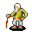

# { .sprite } Old Oromir

**Where to find Old Oromir:** Crossglen: [Crossglen farmhouse](../maps/crossglen_farmhouse.md#pin-npc-old_oromir)

<div class="infobox" markdown>

<p class="ib-img">{ .sprite }</p>

| | |
|---|---|
| **Type** | NPC (can be spoken to; cannot be attacked) |
| **Found in** | Crossglen |
| **Entry ID** | `old_oromir` |
| **Introduced** | [v0.8.14](../versions/0.8.14.md) |

</div>

## Quests

- [A familiar shadow](../quests/familiar_shadow.md): stage 70

## Dialogue simulator

Set your quest stages and items, then talk to Old Oromir. Same rules as the game: same checks, same options, same effects.

<div class="dlg-sim" data-src="../../assets/dialogue/old_oromir_initial_phrase.json" data-npc="Old Oromir" markdown="0"><noscript>The simulator needs JavaScript. The full dialogue is listed below.</noscript></div>

<p class="verified">Rules verified against v0.8.18 game code (ConversationController.java) and dialogue data.</p>

??? quote "Dialogue (19 lines)"

    *Exactly as in the game files. Each line appears once; links jump to where a choice leads.*

    <span id="d-old_oromir_initial_phrase"></span>**`old_oromir_initial_phrase`** Old Oromir: “[Calm, almost welcoming.] Ah, there you are. You've come back to see us, then.”

    - “Oromir? What happened to you two? You look...different.” *(if latest stage of [A familiar shadow](../quests/familiar_shadow.md#stage-60) is 60)* → [old_oromir_10](#d-old_oromir_10)
    - “Oh, it's still so hard to see you like this. But I still have questions.” *(if reached stage 70 of [A familiar shadow](../quests/familiar_shadow.md#stage-70))* → [old_oromir_questions_10](#d-old_oromir_questions_10)

    <span id="d-old_oromir_10"></span>**`old_oromir_10`** [Old Oromir](../monsters/old_oromir.md): “[Thoughtful, but resolute.] Different? Yes, I suppose we are. A weight I didn't even know I carried has been lifted. I feel stronger now, more alive than ever before.”

    - Next → [old_oromir_leta_responds_10](#d-old_oromir_leta_responds_10)

    <span id="d-old_oromir_questions_10"></span>**`old_oromir_questions_10`** [Old Oromir](../monsters/old_oromir.md): “[With a gentle smile.] Of course. Ask what you will. We owe you that much.”

    - “Why were you affected too? Leta was the one possessed by the spirit, not you.” → [old_oromir_questions_bond_10n](#d-old_oromir_questions_bond_10n)
    - “In your basement, I talked to a man, a farmer-looking man that is. I suspect that he is your child. But he is…” *(if reached stage 3 of [Galmore story flags (hidden flag)](../quests/galmore_nondisplayed.md#stage-3))* → [old_oromir_questions_child_10n](#d-old_oromir_questions_child_10n)

    <span id="d-old_oromir_leta_responds_10"></span>**`old_oromir_leta_responds_10`** [Old Leta](../monsters/old_leta.md): “[frail, but smiling warmly] Don't mind him, dear. He's always been dramatic. I may not remember everything, but I know this much--I finally feel at peace.”

    - “Leta...this isn't normal. You look like you've aged decades overnight. How can you be so calm about this?” → [old_oromir_leta_responds_20](#d-old_oromir_leta_responds_20)

    <span id="d-old_oromir_questions_bond_10n"></span>**`old_oromir_questions_bond_10n`** [Dummy NPC](../monsters/none.md): “While sighing, his voice remains steady.”

    - Next → [old_oromir_questions_bond_10](#d-old_oromir_questions_bond_10)

    <span id="d-old_oromir_questions_child_10n"></span>**`old_oromir_questions_child_10n`** [Dummy NPC](../monsters/none.md): “Oromir's voice is somber, yet a slight trember can be heard within it.”

    - “Tomas? How could this happen to him? He's a grown man now, but he acts as if he's still that frightened child.” → [old_oromir_questions_child_10](#d-old_oromir_questions_child_10)

    <span id="d-old_oromir_leta_responds_20"></span>**`old_oromir_leta_responds_20`** [Old Leta](../monsters/old_leta.md): “Oh, time catches up to us all, doesn't it? Better to find peace than cling to what's already gone. Whatever you did, thank you. Truly.”

    - “I didn't do this to you. This doesn't feel right. What happened after the spirit was defeated?” → [old_oromir_20](#d-old_oromir_20)

    <span id="d-old_oromir_questions_bond_10"></span>**`old_oromir_questions_bond_10`** [Old Oromir](../monsters/old_oromir.md): “Well, my child, you see, once I entered into the sacred bond of marriage with Leta, I too became bound to the spirit. Our lives, our fates, were entwined by the very vows we spoke. When she was touched by its darkness, I could not help…”

    - “So, the bond between you two extended even to the curse?” → [old_oromir_questions_bond_20](#d-old_oromir_questions_bond_20)

    <span id="d-old_oromir_questions_child_10"></span>**`old_oromir_questions_child_10`** [Old Oromir](../monsters/old_oromir.md): “Our son...Yes, you are right. That is Tomas. Though, to him, he may as well be a stranger to himself.”

    - “But he...” → [old_oromir_questions_child_20n](#d-old_oromir_questions_child_20n)

    <span id="d-old_oromir_20"></span>**`old_oromir_20`** [Old Oromir](../monsters/old_oromir.md): “[Firmly, but not unkindly.] What happened doesn't matter anymore. What matters is that the darkness is gone, and we can finally live. You should do the same. Let it rest. Ease your mind and later, if you still have questions, please visit…”

    - Next → [old_oromir_and_leta_narrator_10](#d-old_oromir_and_leta_narrator_10)

    <span id="d-old_oromir_questions_bond_20"></span>**`old_oromir_questions_bond_20`** Old Oromir: “Yes. That's the nature of true union, is it not? In love and in struggle, we are as one. Her pain became mine, just as her redemption became ours. The spirit's malice sought to age us, to wear us down. But we endure, thanks to you.”

    - “Do you regret it? Being tied to her curse?” → [old_oromir_questions_bond_30n](#d-old_oromir_questions_bond_30n)

    <span id="d-old_oromir_questions_child_20n"></span>**`old_oromir_questions_child_20n`** [Dummy NPC](../monsters/none.md): “Oromir sighs deeply while clasping his hands.”

    - “...grew older like you both, why does he seem...stuck, mentally?” → [old_oromir_questions_child_20](#d-old_oromir_questions_child_20)

    <span id="d-old_oromir_and_leta_narrator_10"></span>**`old_oromir_and_leta_narrator_10`** [Dummy NPC](../monsters/none.md): “While looking between Leta and Oromir, you are unsettled by their calm acceptance. The house feels peaceful, but the air is heavy with unanswered questions. Leta and Oromir's transformations are undeniable. Their peace is haunting, a…” — **effects:** sets stage 70 of [A familiar shadow](../quests/familiar_shadow.md#stage-70)


    <span id="d-old_oromir_questions_bond_30n"></span>**`old_oromir_questions_bond_30n`** [Dummy NPC](../monsters/none.md): “While shaking his head with a warm smile, Oromir continues...”

    - Next → [old_oromir_questions_bond_30](#d-old_oromir_questions_bond_30)

    <span id="d-old_oromir_questions_child_20"></span>**`old_oromir_questions_child_20`** [Old Oromir](../monsters/old_oromir.md): “When the spirit latched onto Leta, its curse didn't just affect her. It spread to everything close to her--her home, her family, even our boy. He was only two years old when it began...always holding her hand, always by her side. The…”

    - “Oh, I see.” → [old_oromir_questions_child_30](#d-old_oromir_questions_child_30)

    <span id="d-old_oromir_questions_bond_30"></span>**`old_oromir_questions_bond_30`** [Old Oromir](../monsters/old_oromir.md): “Never. Leta is my heart, my reason for every breath. If carrying this weight was the price of sharing my life with her, then I'd pay it a thousand times over. Love isn't just about the light, it's about standing together, even in the…”

    - “[pausing] That's admirable. I hope you both find some peace now.” → [old_oromir_questions_bond_40](#d-old_oromir_questions_bond_40)

    <span id="d-old_oromir_questions_child_30"></span>**`old_oromir_questions_child_30`** Old Oromir: “The spirit didn't just age us. It fed on our memories, our sense of self. Tomas was too young to defend himself from its grasp. It stripped away his connection to who he was. Trapping him in fear and confusion, unable to grow in mind,…”

    - “Is there any way to help him? He's terrified to leave the basement.” → [old_oromir_questions_child_40](#d-old_oromir_questions_child_40)

    <span id="d-old_oromir_questions_bond_40"></span>**`old_oromir_questions_bond_40`** Old Oromir: “We will. Time may have taken its toll, but the darkness is gone. Now, we can live what remains of our days in quiet gratitude. Thank you, truly.”

    - “I still have questions.” → [old_oromir_questions_10](#d-old_oromir_questions_10)

    <span id="d-old_oromir_questions_child_40"></span>**`old_oromir_questions_child_40`** Old Oromir: “Perhaps, with time. The curse is gone, but the scars it left behind are deep. He needs patience, kindness and someone to guide him back to himself. I fear we may not have the strength to do it alone.”

    - “Yes, he needs time. I hope it works out for you three.” → *conversation ends*


## Version history

| Version | Change |
|---|---|
| [v0.8.14](../versions/0.8.14.md) | Added<br>Dialogue: 19 lines added |

<p class="verified">Verified against v0.8.18 and every earlier release back to v0.7.0 (game data compared release by release).</p>


??? info "Technical information"

    | | |
    |---|---|
    | Entry ID | `old_oromir` |
    | Spawn group | `old_oromir` |
    | Loot table | – |
    | Conversation | `old_oromir_initial_phrase` |
    | Faction | – |
    | Movement | – |
    | Icon | `monsters_karvis2:5` |
    | Defined in | `res/raw/monsterlist_mt_galmore2.json` |

    Raw data:

    ```json
    {
     "id": "old_oromir",
     "name": "Old Oromir",
     "iconID": "monsters_karvis2:5",
     "monsterClass": "humanoid",
     "phraseID": "old_oromir_initial_phrase"
    }
    ```


## Community notes

<small>Written by players, not generated from game data. **Observations**: what players notice in-game · **Lore**: the in-world story · **Trivia**: real-world facts, references, development history · **Theory / speculation**: unconfirmed ideas; may just be unfinished content</small>

### Observations

*No notes yet. Contributions are welcome: [add a note](https://github.com/asdfghjkl628/Andor-s-Trail-Wikiiii/new/main/notes/monsters?filename=old_oromir.md&value=%23%23%20Observations%0A%0A%3C%21--%20what%20players%20notice%20in-game%20--%3E%0A%0A%23%23%20Lore%0A%0A%3C%21--%20the%20in-world%20story%20--%3E%0A%0A%23%23%20Trivia%0A%0A%3C%21--%20real-world%20facts%2C%20references%2C%20development%20history%20--%3E%0A%0A%23%23%20Theory%20/%20speculation%0A%0A%3C%21--%20unconfirmed%20ideas%3B%20may%20just%20be%20unfinished%20content%20--%3E%0A).*

### Lore

*No notes yet. Contributions are welcome: [add a note](https://github.com/asdfghjkl628/Andor-s-Trail-Wikiiii/new/main/notes/monsters?filename=old_oromir.md&value=%23%23%20Observations%0A%0A%3C%21--%20what%20players%20notice%20in-game%20--%3E%0A%0A%23%23%20Lore%0A%0A%3C%21--%20the%20in-world%20story%20--%3E%0A%0A%23%23%20Trivia%0A%0A%3C%21--%20real-world%20facts%2C%20references%2C%20development%20history%20--%3E%0A%0A%23%23%20Theory%20/%20speculation%0A%0A%3C%21--%20unconfirmed%20ideas%3B%20may%20just%20be%20unfinished%20content%20--%3E%0A).*

### Trivia

*No notes yet. Contributions are welcome: [add a note](https://github.com/asdfghjkl628/Andor-s-Trail-Wikiiii/new/main/notes/monsters?filename=old_oromir.md&value=%23%23%20Observations%0A%0A%3C%21--%20what%20players%20notice%20in-game%20--%3E%0A%0A%23%23%20Lore%0A%0A%3C%21--%20the%20in-world%20story%20--%3E%0A%0A%23%23%20Trivia%0A%0A%3C%21--%20real-world%20facts%2C%20references%2C%20development%20history%20--%3E%0A%0A%23%23%20Theory%20/%20speculation%0A%0A%3C%21--%20unconfirmed%20ideas%3B%20may%20just%20be%20unfinished%20content%20--%3E%0A).*

### Theory / speculation

*No notes yet. Contributions are welcome: [add a note](https://github.com/asdfghjkl628/Andor-s-Trail-Wikiiii/new/main/notes/monsters?filename=old_oromir.md&value=%23%23%20Observations%0A%0A%3C%21--%20what%20players%20notice%20in-game%20--%3E%0A%0A%23%23%20Lore%0A%0A%3C%21--%20the%20in-world%20story%20--%3E%0A%0A%23%23%20Trivia%0A%0A%3C%21--%20real-world%20facts%2C%20references%2C%20development%20history%20--%3E%0A%0A%23%23%20Theory%20/%20speculation%0A%0A%3C%21--%20unconfirmed%20ideas%3B%20may%20just%20be%20unfinished%20content%20--%3E%0A).*


<small>Data from v0.8.18</small>
