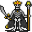

# { .sprite } Dread zombie

| Stat | Value |
|---|---|
| Class | undead |
| HP | 95 |
| Max AP | 10 |
| Attack cost | 5 |
| Move cost | 5 |
| Damage | 2 to 5 |
| Attack chance | 184 |
| Block chance | 102 |
| Damage resistance | 0 |
| Critical skill | 20 |
| Critical multiplier | 3.0 |

## On hit

- **Heal HP:** 2 to 3
- **On target:** Bleeding wound (magnitude 5, 7 rounds, 30% chance)

## Drops

| Item | Chance | Qty |
|---|---|---|
| [Gold coins](../items/gold.md) | 100% | 5 to 30 |
| [Lleglaris' amulet](../items/lleglaris.md) | 100% | 1 |

## Found on

- [oldcave1](../maps/oldcave1.md)

<small>Monster ID: `oldcaveboss` · Data from v0.8.18</small>
