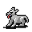

# { .sprite } Orphaned warg pup

| Stat | Value |
|---|---|
| Class | animal |
| HP | 187 |
| Max AP | 10 |
| Attack cost | 4 |
| Move cost | 3 |
| Damage | 10 to 13 |
| Attack chance | 156 |
| Block chance | 187 |
| Damage resistance | 0 |
| Critical skill | 5 |
| Critical multiplier | 2.0 |

## Drops

| Item | Chance | Qty |
|---|---|---|
| [Warg veal](../items/warg_veal.md) | 8% | 1 |
| [Red apple](../items/apple_red.md) | 15% | 1 |

## Found on

- [mt_galmore1_h3](../maps/mt_galmore1_h3.md)

<small>Monster ID: `orphaned_warg_pup` · Data from v0.8.18</small>
