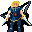

# { .sprite } General Ortholion

<div class="infobox" markdown>

<p class="ib-img">{ .sprite }</p>

| | |
|---|---|
| **Type** | NPC/Enemy (can be spoken to, but can also be fought) |
| **Found in** | Prim |
| **Class** | Humanoid |
| **HP** | 1 |
| **XP when defeated** | 1 |
| **Entries in game data** | 2 |
| **Introduced** | [v0.7.14](../versions/0.7.14.md) |

</div>

!!! info "2 entries in the game data"
    The game's data files define 2 separate characters named General Ortholion. Andor's Trail stores a character as a new entry whenever it needs different behaviour, for example a different conversation at a later stage of a quest, a different location, or different combat statistics. Some entries represent the same person at different points in the story; others are different people who share a generic name. Here the entries differ in: conversation, location, movement. This page combines them; each entry is described in its own section below.

| Entry | Type | Location | Role | HP |
|---|---|---|---|---|
| [`ortholion`](#v-ortholion) | NPC | Prim: [blackwater_mountain29](../maps/blackwater_mountain29.md#pin-npc-ortholion), [blackwater_mountain43](../maps/blackwater_mountain43.md#pin-npc-ortholion) (+2 more) | – | – |
| [`ortholion_hidden`](#v-ortholion_hidden) | Enemy | Prim: [blackwater_mountain11](../maps/blackwater_mountain11.md) | – | 1 |

## Prim, Blackwater mountain29 and 3 more (ortholion) { #v-ortholion }

**Entry ID:** `ortholion` · **Type:** NPC

**Location:** Prim: [blackwater_mountain29](../maps/blackwater_mountain29.md#pin-npc-ortholion), [blackwater_mountain43](../maps/blackwater_mountain43.md#pin-npc-ortholion), [elm5f_2](../maps/elm5f_2.md#pin-npc-ortholion), [elm_mine1](../maps/elm_mine1.md#pin-npc-ortholion)

### Locations

| Map | Region | Up to | Notes |
|---|---|---|---|
| [blackwater_mountain29](../maps/blackwater_mountain29.md) | Prim | 1 | Appears later, during a quest |
| [blackwater_mountain43](../maps/blackwater_mountain43.md) | – | 1 | Appears later, during a quest |
| [elm5f_2](../maps/elm5f_2.md) | – | 2 | Appears later, during a quest |
| [elm_mine1](../maps/elm_mine1.md) | – | 1 | Appears later, during a quest |

### Quests

- [Climbing up is forbidden](../quests/Omi2_bwm1.md): stages 45, 46, 55, 56, 59, 60, 61, 62, 63
- [Hidden: events in bwm (hidden flag)](../quests/bwm72_beginning.md): stages 21, 39, 41, 42

### Dialogue simulator

Set the quest stages, items and other conditions that apply to your game, then start the conversation with General Ortholion. The simulator applies the game's own rules: it performs the same silent checks, offers only the options that would be shown in the game, and applies their effects (quest stages, items handed over, rewards) as the conversation proceeds.

<div class="dlg-sim" data-src="../../assets/dialogue/ortholion_selector.json" data-npc="General Ortholion" markdown="0"><noscript>The simulator needs JavaScript. The full dialogue is listed below.</noscript></div>

<p class="verified">Rules verified against v0.8.18 game code (ConversationController.java) and dialogue data.</p>

??? quote "Dialogue (63 lines)"

    *What the dialogue says, exactly as in the game files. Lines are listed once; links jump to the line a choice leads to.*

    <span id="d-ortholion-ortholion_selector"></span>**`ortholion_selector`** *(silent check: the first matching branch below is taken)*

    - branch 1 *(if reached stage 42 of [Hidden: events in bwm (hidden flag)](../quests/bwm72_beginning.md#stage-42))* → [ortholion_busy](#d-ortholion-ortholion_busy)
    - branch 2 *(if reached stage 56 of [Climbing up is forbidden](../quests/Omi2_bwm1.md#stage-56))* → [ortholion_16d](#d-ortholion-ortholion_16d)
    - branch 3 *(if reached stage 55 of [Climbing up is forbidden](../quests/Omi2_bwm1.md#stage-55))* → [ortholion_16c](#d-ortholion-ortholion_16c)
    - branch 4 *(if reached stage 40 of [Hidden: events in bwm (hidden flag)](../quests/bwm72_beginning.md#stage-40))* → [ortholion_13](#d-ortholion-ortholion_13)
    - branch 5 *(if reached stage 54 of [Climbing up is forbidden](../quests/Omi2_bwm1.md#stage-54))* → [ortholion_9](#d-ortholion-ortholion_9)
    - branch 6 *(if reached stage 39 of [Hidden: events in bwm (hidden flag)](../quests/bwm72_beginning.md#stage-39); NOT reached stage 54 of [Climbing up is forbidden](../quests/Omi2_bwm1.md#stage-54))* → [ortholion_c3](#d-ortholion-ortholion_c3)
    - branch 7 *(if killed 1× [Kamelio](../monsters/kamelio.md); NOT reached stage 39 of [Hidden: events in bwm (hidden flag)](../quests/bwm72_beginning.md#stage-39))* → [ortholion_conscious](#d-ortholion-ortholion_conscious)
    - branch 8 *(if reached stage 51 of [Climbing up is forbidden](../quests/Omi2_bwm1.md#stage-51))* → [ortholion_unconscious](#d-ortholion-ortholion_unconscious)
    - branch 9 *(if carry 1× [Ortholion's signet](../items/ortholion_signet.md))* → [ortholion_8a](#d-ortholion-ortholion_8a)
    - branch 10 *(if reached stage 45 of [Climbing up is forbidden](../quests/Omi2_bwm1.md#stage-45))* → [ortholion_1](#d-ortholion-ortholion_1)
    - branch 11 *(if reached stage 34 of [Climbing up is forbidden](../quests/Omi2_bwm1.md#stage-34))* → [ortholion_conversation2_1](#d-ortholion-ortholion_conversation2_1)
    - branch 12 → [ortholion_conversation2_1](#d-ortholion-ortholion_conversation2_1)

    <span id="d-ortholion-ortholion_busy"></span>**`ortholion_busy`** General Ortholion: “*mumbling* That imprudent Guynm...”

    - Next → [ortholion_busy2](#d-ortholion-ortholion_busy2)

    <span id="d-ortholion-ortholion_16d"></span>**`ortholion_16d`** General Ortholion: “I will ask you again. What in this world is most important to you?”

    - “Gold, sweet gold.” → [ortholion_18b](#d-ortholion-ortholion_18b)
    - “My pride and my honor!” → [ortholion_18c](#d-ortholion-ortholion_18c)
    - “The Shadow's teachings are the only thing that matters.” *(if reached stage 25 of [Climbing up is forbidden](../quests/Omi2_bwm1.md#stage-25))* → [ortholion_18e](#d-ortholion-ortholion_18e)
    - “My family is the most important thing to me.” → [ortholion_18d](#d-ortholion-ortholion_18d)

    <span id="d-ortholion-ortholion_16c"></span>**`ortholion_16c`** General Ortholion: “Well, well. Look who's back.”

    - “Yup, here I am again.” → [ortholion_17](#d-ortholion-ortholion_17)
    - “Hmpf, bye.” → *conversation ends*

    <span id="d-ortholion-ortholion_13"></span>**`ortholion_13`** General Ortholion: “This isn't really the way I planned this.”

    - Next → [ortholion_14](#d-ortholion-ortholion_14)

    <span id="d-ortholion-ortholion_9"></span>**`ortholion_9`** [General Ortholion](../monsters/ortholion.md): “*looks at you* Humilliating. How did I...? How did that guy...?”

    - “Ehrenfest?” → [ortholion_10a](#d-ortholion-ortholion_10a)
    - “You're just weak.” → [ortholion_10b](#d-ortholion-ortholion_10b)

    <span id="d-ortholion-ortholion_c3"></span>**`ortholion_c3`** General Ortholion: “Tsch, you cannot lose! I'm still recovering.”


    <span id="d-ortholion-ortholion_conscious"></span>**`ortholion_conscious`** [General Ortholion](../monsters/ortholion.md): “Uhm... What a thwack. $playername, where's the...”

    - “(Lie) I got rid of him.” → [ortholion_c2](#d-ortholion-ortholion_c2)
    - “He fell off the hill.” → [ortholion_c2](#d-ortholion-ortholion_c2)

    <span id="d-ortholion-ortholion_unconscious"></span>**`ortholion_unconscious`** General Ortholion: “The kick was so brutal that Ortholion fell unconscious.”


    <span id="d-ortholion-ortholion_8a"></span>**`ortholion_8a`** General Ortholion: “Are you still here?! Go, go now!”

    - “Eh...Right.” → *NPC leaves*
    - “Someday you will regret your manners...” → *NPC leaves*
    - “OK, OK! I'm going.” → *NPC leaves*

    <span id="d-ortholion-ortholion_1"></span>**`ortholion_1`** General Ortholion: “Look, I don't have time for you, but I don't kill kids, not yet. So step aside.”

    - “Are you threatening me?” *(if reached stage 34 of [Climbing up is forbidden](../quests/Omi2_bwm1.md#stage-34))* → [ortholion_4c](#d-ortholion-ortholion_4c)
    - “I'm here to inform you about Ehrenfest. He's probably behind some disappearances in Prim.” *(if reached stage 40 of [Climbing up is forbidden](../quests/Omi2_bwm1.md#stage-40))* → [ortholion_2b](#d-ortholion-ortholion_2b)

    <span id="d-ortholion-ortholion_conversation2_1"></span>**`ortholion_conversation2_1`** [General Ortholion](../monsters/ortholion.md): “Ehrenfest, you have come this far just to get rid of me...” — **effects:** removes monsters from blackwater_mountain31

    - “Ehrenfest, here I am to help you.” *(if reached stage 33 of [Climbing up is forbidden](../quests/Omi2_bwm1.md#stage-33))* → [ortholion_conversation2_2a](#d-ortholion-ortholion_conversation2_2a)
    - “Ortholion, beware! He is a dangerous liar!” *(if reached stage 40 of [Climbing up is forbidden](../quests/Omi2_bwm1.md#stage-40))* → [ortholion_conversation2_2b](#d-ortholion-ortholion_conversation2_2b)

    <span id="d-ortholion-ortholion_busy2"></span>**`ortholion_busy2`** General Ortholion: “Oh, $playername...I'm sorry but I have many things to discuss and attend to here, come back later.”


    <span id="d-ortholion-ortholion_18b"></span>**`ortholion_18b`** General Ortholion: “Well, yes. Every old and tired adventurer's dream I guess, but I somewhat expected more of you. Take this and don't bother me anymore. *shows you a medium-sized bag of gold and jewels*”

    - “[Take the gold]” → [ortholion_19a](#d-ortholion-ortholion_19a)
    - “Don't be so greedy. Give me more!” → [ortholion_19b](#d-ortholion-ortholion_19b)

    <span id="d-ortholion-ortholion_18c"></span>**`ortholion_18c`** General Ortholion: “Good answer! That is very inline with any good Feygard soldier thoughts. Since I owe you a favor, let me repay you with this bag of gold.”

    - “[Take the gold] Finally...” → [ortholion_19c](#d-ortholion-ortholion_19c)
    - “I can't accept gold for saving someone's life...” → [ortholion_19d](#d-ortholion-ortholion_19d)

    <span id="d-ortholion-ortholion_18e"></span>**`ortholion_18e`** General Ortholion: “Hah! You really are either so brave or so dumb confessing that in a place full of Feygard soldiers.”

    - “Those who don't believe will eventually be punished!” → [ortholion_19e](#d-ortholion-ortholion_19e)
    - “You couldn't land a single hit on me!” → [ortholion_19e](#d-ortholion-ortholion_19e)

    <span id="d-ortholion-ortholion_18d"></span>**`ortholion_18d`** General Ortholion: “I would say that is a ... very ignorant reply, but I will not judge you today. Go back home and spend some time with your people and your family; then come back. I will need people like you in a few days.” — **effects:** sets stage 63 of [Climbing up is forbidden](../quests/Omi2_bwm1.md#stage-63), sets stage 42 of [Hidden: events in bwm (hidden flag)](../quests/bwm72_beginning.md#stage-42), starts timer “ortholion_next1”

    - “So no reward...hmph, bye.” → *conversation ends*
    - “I'll remember to come back, farewell.” → *conversation ends*

    <span id="d-ortholion-ortholion_17"></span>**`ortholion_17`** General Ortholion: “Let me ask you a question. What in the world is most important to you? Pride and honor? Maybe power and riches?”

    - “I need some time to think about it.” *(if NOT reached stage 56 of [Climbing up is forbidden](../quests/Omi2_bwm1.md#stage-56))* → [ortholion_18a](#d-ortholion-ortholion_18a)
    - “If there's gold, I'm in!” → [ortholion_18b](#d-ortholion-ortholion_18b)
    - “I can't conceive a life without honor.” → [ortholion_18c](#d-ortholion-ortholion_18c)
    - “My faith in the Shadow.” *(if reached stage 25 of [Climbing up is forbidden](../quests/Omi2_bwm1.md#stage-25))* → [ortholion_18e](#d-ortholion-ortholion_18e)
    - “My father, Mikhail, and my brother Andor.” → [ortholion_18d](#d-ortholion-ortholion_18d)

    <span id="d-ortholion-ortholion_14"></span>**`ortholion_14`** General Ortholion: “*looking at you* But thanks to your act of bravery, I'm alive and not injured... Not severely.”

    - “What will you do now?” → [ortholion_15a](#d-ortholion-ortholion_15a)
    - “I still don't trust you.” → [ortholion_15b](#d-ortholion-ortholion_15b)

    <span id="d-ortholion-ortholion_10a"></span>**`ortholion_10a`** General Ortholion: “Did he tell you... *looks around* Better not here.”

    - “Scared?” → [ortholion_11](#d-ortholion-ortholion_11)

    <span id="d-ortholion-ortholion_10b"></span>**`ortholion_10b`** General Ortholion: “I would duel you here and prove you wrong, but this is really no place to talk. These strange creatures don't cease to appear.”

    - Next → [ortholion_11](#d-ortholion-ortholion_11)

    <span id="d-ortholion-ortholion_c2"></span>**`ortholion_c2`** General Ortholion: “Oh. Alright, we will chat later. Now we're going out of the... WATCH OUT!”

    - Next → [kamelio_undead](#d-ortholion-kamelio_undead)

    <span id="d-ortholion-ortholion_4c"></span>**`ortholion_4c`** General Ortholion: “I have no time for this absurd talk. I must be sure this guy's road ends in the Elm mine.”

    - “Do you need anything?” → [ortholion_4a](#d-ortholion-ortholion_4a)
    - “Good luck then, bye.” → [ortholion_5a](#d-ortholion-ortholion_5a)

    <span id="d-ortholion-ortholion_2b"></span>**`ortholion_2b`** General Ortholion: “You mean that weakling is responsible of those missing people from Prim of whom I've been recently informed?”

    - “I do.” → [ortholion_3b2](#d-ortholion-ortholion_3b2)
    - “Weakling? Haven't you seen how he escaped?” → [ortholion_3b](#d-ortholion-ortholion_3b)

    <span id="d-ortholion-ortholion_conversation2_2a"></span>**`ortholion_conversation2_2a`** [Ehrenfest](../monsters/ehrenfest.md): “The crimes you have commited must be punished!”

    - Next → [ortholion_conversation2_3a](#d-ortholion-ortholion_conversation2_3a)

    <span id="d-ortholion-ortholion_conversation2_2b"></span>**`ortholion_conversation2_2b`** [Ehrenfest](../monsters/ehrenfest.md): “I hoped someone else would take the blame for this. But don't worry, soon we shall be unstoppable.”

    - “Stop!” → [ortholion_conversation2_3b](#d-ortholion-ortholion_conversation2_3b)
    - “Do you always talk this much, liar?” → [ortholion_conversation2_3b](#d-ortholion-ortholion_conversation2_3b)

    <span id="d-ortholion-ortholion_19a"></span>**`ortholion_19a`** General Ortholion: “Fine. Now let some days pass and meet me again here. I may need your help and you may want more gold.” — **effects:** gives 2000× [Gold coins](../items/gold.md), starts timer “ortholion_next1”, sets stage 59 of [Climbing up is forbidden](../quests/Omi2_bwm1.md#stage-59), sets stage 42 of [Hidden: events in bwm (hidden flag)](../quests/bwm72_beginning.md#stage-42)

    - “Count on me, general!” → *conversation ends*
    - “I'll think about it. Goodbye.” → *conversation ends*

    <span id="d-ortholion-ortholion_19b"></span>**`ortholion_19b`** General Ortholion: “I see, I see. You're a clever guy *makes signs to two soldiers*. Take this much larger bag full of jewels my men have been gathering... from the mines.”

    - “Great! [Take the large bag]” → [ortholion_20a](#d-ortholion-ortholion_20a)
    - “Ehm... I'd rather take the small bag, thanks. [Take the gold]” → [ortholion_19a](#d-ortholion-ortholion_19a)

    <span id="d-ortholion-ortholion_19c"></span>**`ortholion_19c`** General Ortholion: “Should I be surprised? That shows how valuable your word currently is. Come back in a few days and I may change my opinion if you're willing to help me.” — **effects:** sets stage 61 of [Climbing up is forbidden](../quests/Omi2_bwm1.md#stage-61), sets stage 42 of [Hidden: events in bwm (hidden flag)](../quests/bwm72_beginning.md#stage-42), starts timer “ortholion_next1”, gives 50× [Gold coins](../items/gold.md)

    - “You liar...! Hmpf.” → *conversation ends*
    - “I'll think about it, but you'd better pay me next time!” → *conversation ends*

    <span id="d-ortholion-ortholion_19d"></span>**`ortholion_19d`** General Ortholion: “*Withdraws his hand with the gold bag and makes a nod of approval* Good, good. I accept your choice. Since you said you are not going to accept gold, take this as a sign of my gratitude. We'll talk later. Now we all need some rest.” — **effects:** sets stage 62 of [Climbing up is forbidden](../quests/Omi2_bwm1.md#stage-62), sets stage 42 of [Hidden: events in bwm (hidden flag)](../quests/bwm72_beginning.md#stage-42), starts timer “ortholion_next1”, gives 1× [Ortholion's talisman](../items/ortholion_reward.md)

    - “Your debt is settled, sir.” → *conversation ends*
    - “Thank you, I will keep it as the most valuable treasure.” → *conversation ends*
    - “I will keep it as my most precious treasure. [Lie]” → *conversation ends*

    <span id="d-ortholion-ortholion_19e"></span>**`ortholion_19e`** General Ortholion: “Look, this is simple. The Shadow is the past. We, Feygard, are the future. Fanaticism is never a good companion, but you are still young, you will need time to fully understand my words.”

    - “You forbid the use of Bonemeal!” → [ortholion_20c](#d-ortholion-ortholion_20c)
    - “You put unfair taxes and censor people's beliefs!” → [ortholion_20b](#d-ortholion-ortholion_20b)

    <span id="d-ortholion-ortholion_18a"></span>**`ortholion_18a`** General Ortholion: “I'm patient, but I won't be here forever. Other issues demand my presence.” — **effects:** sets stage 56 of [Climbing up is forbidden](../quests/Omi2_bwm1.md#stage-56)

    - “Cut it out and give me my reward!” *(if NOT reached stage 55 of [Climbing up is forbidden](../quests/Omi2_bwm1.md#stage-55))* → [ortholion_16a](#d-ortholion-ortholion_16a)
    - “I'll be back soon.” → *conversation ends*

    <span id="d-ortholion-ortholion_15a"></span>**`ortholion_15a`** General Ortholion: “I am sorry, but that is none of your concern. As I said you've lent me a hand when I was vulnerable. That won't be forgotten.”

    - “Finally, a reward.” → [ortholion_16a](#d-ortholion-ortholion_16a)
    - “You owe me a favor then.” → [ortholion_16b](#d-ortholion-ortholion_16b)

    <span id="d-ortholion-ortholion_15b"></span>**`ortholion_15b`** General Ortholion: “And you do good. Trust should be neither easy to gain nor easy to lose.”

    - “Yeah, yeah. Where's my reward for saving your life?” → [ortholion_16a](#d-ortholion-ortholion_16a)
    - “What will you do now?” → [ortholion_15a](#d-ortholion-ortholion_15a)

    <span id="d-ortholion-ortholion_11"></span>**`ortholion_11`** General Ortholion: “Yes, yes... I'll get out of this cave. Meet me at the entrance of the mine. There is a large dining room. That will suffice.” — **effects:** sets stage 41 of [Hidden: events in bwm (hidden flag)](../quests/bwm72_beginning.md#stage-41)

    - “You are of no interest to me. Bye.” → *NPC leaves*
    - “OK, sir.” → *NPC leaves*
    - “Are you sure you don't need an escort?” → [ortholion_12](#d-ortholion-ortholion_12)

    <span id="d-ortholion-kamelio_undead"></span>**`kamelio_undead`** [Undead Kamelio](../monsters/kamelio2.md): “...D...Die...” — **effects:** applies condition putrefaction, applies condition putrefaction, applies condition putrefaction, sets stage 39 of [Hidden: events in bwm (hidden flag)](../quests/bwm72_beginning.md#stage-39), spawns monsters on elm5f_2, spawns monsters on elm5f_2

    - “Aah!” → *conversation ends*
    - “Hmpf, I will kill you ten more times if needed.” → *conversation ends*

    <span id="d-ortholion-ortholion_4a"></span>**`ortholion_4a`** General Ortholion: “Hmm...Maybe. You came up this far after all. Go warn my soldiers. They are settled in the tunnel entrance, south of Prim.”

    - “This is getting too complicated. I'd better leave.” → *conversation ends*
    - “I bet they'll pay attention to a kid like me, right?” → [ortholion_6b](#d-ortholion-ortholion_6b)
    - “OK, I will.” → [ortholion_6b](#d-ortholion-ortholion_6b)

    <span id="d-ortholion-ortholion_5a"></span>**`ortholion_5a`** General Ortholion: “Not so fast. Seeing that you reached this place but my scouts couldn't, I think you will be of use.”

    - “What if I don't want to help you?” → [ortholion_6a](#d-ortholion-ortholion_6a)
    - “What is it?” → [ortholion_6b](#d-ortholion-ortholion_6b)

    <span id="d-ortholion-ortholion_3b2"></span>**`ortholion_3b2`** General Ortholion: “There's definitely something off with him. Another Shadow fanatic to get rid of, tsch.”

    - “Shadow fanatic? Do you know him?” → [ortholion_4d](#d-ortholion-ortholion_4d)
    - “Can I be of help?” → [ortholion_4a](#d-ortholion-ortholion_4a)

    <span id="d-ortholion-ortholion_3b"></span>**`ortholion_3b`** General Ortholion: “Nothing impressive. Loyal followers of the Shadow have their tricks, just as I have my own.”

    - “The Shadow? Do you believe in that?” → [ortholion_4b](#d-ortholion-ortholion_4b)
    - “Hope those tricks are better than your chasing abilities.” *(if reached stage 21 of [Hidden: events in bwm (hidden flag)](../quests/bwm72_beginning.md#stage-21))* → [ortholion_4c](#d-ortholion-ortholion_4c)

    <span id="d-ortholion-ortholion_conversation2_3a"></span>**`ortholion_conversation2_3a`** [General Ortholion](../monsters/ortholion.md): “Hmmm... What crimes, evil creature? You even dared to think you had a chance to trick a general of glorious Feygard?!”

    - Next → [ortholion_conversation2_4a](#d-ortholion-ortholion_conversation2_4a)

    <span id="d-ortholion-ortholion_conversation2_3b"></span>**`ortholion_conversation2_3b`** [General Ortholion](../monsters/ortholion.md): “[unsheathes his sword] Well, enough talk. I won't ignore your threats, evil creature.”

    - “Hey, stop you two!” → [ortholion_conversation2_4b](#d-ortholion-ortholion_conversation2_4b)
    - “Ehrenfest, you have many things to explain!” → [ortholion_conversation2_4b](#d-ortholion-ortholion_conversation2_4b)

    <span id="d-ortholion-ortholion_20a"></span>**`ortholion_20a`** General Ortholion: “Fine, it's all for you. Maybe this way you'll learn a lesson. Come see me in some days, you might be of use.” — **effects:** gives 30× [Mundane necklace](../items/junk_necklace0.md), gives 20× [Mundane ring](../items/ring1.md), sets stage 42 of [Hidden: events in bwm (hidden flag)](../quests/bwm72_beginning.md#stage-42), sets stage 60 of [Climbing up is forbidden](../quests/Omi2_bwm1.md#stage-60), starts timer “ortholion_next1”

    - “A bag full of junk necklaces and rings?! No way, trickster!” → *conversation ends*
    - “I...will.” → *conversation ends*

    <span id="d-ortholion-ortholion_20c"></span>**`ortholion_20c`** General Ortholion: “Would you like your bones be used in some sort of ritual to make those potions? Because in winter, when big mammals, erumen lizards, and other beasts hibernate, there's only one kind of bones useful for that: ours.”

    - “That sounds kind of true. You are a very persuasive speaker.” → *conversation ends*

    <span id="d-ortholion-ortholion_20b"></span>**`ortholion_20b`** General Ortholion: “Not everything is black or white. Taxes are needed in this great kingdom in order to keep the peace and the roads safe.”


    <span id="d-ortholion-ortholion_16a"></span>**`ortholion_16a`** General Ortholion: “A reward? This does not work that way...What would Feygard think of my assassination? Who would be blamed for that? The reward is I'm alive and no army will chase you.”

    - “*laughing* Do you think a few drunkards could beat me?” → [ortholion_17a](#d-ortholion-ortholion_17a)
    - “Hmpf, OK. Goodbye...” → *conversation ends*
    - “But at least, you owe me a favor. Where's your honor?” → [ortholion_16b](#d-ortholion-ortholion_16b)

    <span id="d-ortholion-ortholion_16b"></span>**`ortholion_16b`** General Ortholion: “Let me settle that debt then.”

    - Next → [ortholion_17](#d-ortholion-ortholion_17)

    <span id="d-ortholion-ortholion_12"></span>**`ortholion_12`** General Ortholion: “A knight's only trustworthy escorts are his sword and his horse. *gets up* I'm pretty sure you'll find the way out.”

    - “I will.” → *NPC leaves*
    - “Shad... Yeah, let's meet later.” → *NPC leaves*

    <span id="d-ortholion-ortholion_6b"></span>**`ortholion_6b`** General Ortholion: “Take this, and show it to the soldiers stationed near the mining tunnel entrance. Tell them I went to the Elm mine.” — **effects:** gives 1× [Ortholion's signet](../items/ortholion_signet.md), sets stage 46 of [Climbing up is forbidden](../quests/Omi2_bwm1.md#stage-46)

    - “Consider it done.” → *NPC leaves*
    - “Hope they can understand. Bye.” → *NPC leaves*

    <span id="d-ortholion-ortholion_6a"></span>**`ortholion_6a`** General Ortholion: “Then I'll officially accuse you of betrayal and attempted murder against a Feygard general. I'll bring you to Feygard and you will never see your family again.”

    - “How dare you?! Prepare to die!” → [ortholion_7a](#d-ortholion-ortholion_7a)

    <span id="d-ortholion-ortholion_4d"></span>**`ortholion_4d`** General Ortholion: “No. But it's quite obvious by the way he accused me.”

    - “And what will you do, General Slowness?” → [ortholion_4c](#d-ortholion-ortholion_4c)
    - “Well, this is not really my problem. Bye.” → [ortholion_5a](#d-ortholion-ortholion_5a)
    - “Do you need any help?” → [ortholion_4a](#d-ortholion-ortholion_4a)

    <span id="d-ortholion-ortholion_4b"></span>**`ortholion_4b`** General Ortholion: “[Laughs quietly] Only simple minds would see things as black or white. Whether I believe or not, people do, and we in Feygard keep that in mind.”

    - “OK. Now that you're aware of the situation, I'd better leave.” → [ortholion_5a](#d-ortholion-ortholion_5a)
    - “What about "I don't have time to..."?” → [ortholion_4c](#d-ortholion-ortholion_4c)

    <span id="d-ortholion-ortholion_conversation2_4a"></span>**`ortholion_conversation2_4a`** [Ehrenfest](../monsters/ehrenfest.md): “I'm... [stares at you] $playername! It's time to end with all of this!”

    - “Right! Ortholion must pay for killing innocent people from Prim!” → [ortholion_conversation2_5a](#d-ortholion-ortholion_conversation2_5a)
    - “Gladly. Ortholion, prepare to die!” *(if reached stage 35 of [Climbing up is forbidden](../quests/Omi2_bwm1.md#stage-35))* → [ortholion_conversation2_5a2](#d-ortholion-ortholion_conversation2_5a2)

    <span id="d-ortholion-ortholion_conversation2_4b"></span>**`ortholion_conversation2_4b`** [Ehrenfest](../monsters/ehrenfest.md): “[People from the tavern start looking at the place where Ortholion and Ehrenfest are about to have a fight] [looks around] No...Not yet. Argh! You kid, betrayer! You are about to discover how wrongly you have chosen!”

    - Next → [ortholion_conversation2_5b](#d-ortholion-ortholion_conversation2_5b)

    <span id="d-ortholion-ortholion_17a"></span>**`ortholion_17a`** General Ortholion: “Doesn't matter whether they could or not. They won't come after you, and that's what my reward is.” — **effects:** sets stage 55 of [Climbing up is forbidden](../quests/Omi2_bwm1.md#stage-55)

    - “This is absurd. Bye!” → *conversation ends*

    <span id="d-ortholion-ortholion_7a"></span>**`ortholion_7a`** General Ortholion: “[The general effortlessly subdues you, and begins to laugh] Look, take this signet. With this, my soldiers stationed outside the mining tunnel entrance will believe your words. Tell them I went to the Elm mine.” — **effects:** applies condition confusion, gives 1× [Ortholion's signet](../items/ortholion_signet.md), sets stage 46 of [Climbing up is forbidden](../quests/Omi2_bwm1.md#stage-46)

    - “Hmpf...” → [ortholion_8a](#d-ortholion-ortholion_8a)
    - “OK, OK. I will but please don't hurt me anymore.” → [ortholion_8a](#d-ortholion-ortholion_8a)

    <span id="d-ortholion-ortholion_conversation2_5a"></span>**`ortholion_conversation2_5a`** [General Ortholion](../monsters/ortholion.md): “A kid? You come with a kid accusing me of something I never heard about?”

    - Next → [ortholion_conversation2_6a](#d-ortholion-ortholion_conversation2_6a)

    <span id="d-ortholion-ortholion_conversation2_5a2"></span>**`ortholion_conversation2_5a2`** [Dummy NPC](../monsters/none.md): “General Ortholion ignores you and continues to speak to Ehrenfest.”

    - Next → [ortholion_conversation2_6a](#d-ortholion-ortholion_conversation2_6a)

    <span id="d-ortholion-ortholion_conversation2_5b"></span>**`ortholion_conversation2_5b`** [General Ortholion](../monsters/ortholion.md): “[The general tries to land a strike on Ehrenfest, but he just cuts a piece of his cloak. Ehrenfest is gone] Hmpf...” — **effects:** sets stage 45 of [Climbing up is forbidden](../quests/Omi2_bwm1.md#stage-45), removes monsters from blackwater_mountain43

    - “Eh... Greetings, general.” → [ortholion_1](#d-ortholion-ortholion_1)
    - “I thought Feygard generals were faster swinging their blades.” → [ortholion_1](#d-ortholion-ortholion_1)

    <span id="d-ortholion-ortholion_conversation2_6a"></span>**`ortholion_conversation2_6a`** [General Ortholion](../monsters/ortholion.md): “Ehrenfest, you have bothered me more than I am willing to abide. Blackwater Settlement guards will take care of you.”

    - “Those guards are no match for...” *(if reached stage 21 of [Hidden: events in bwm (hidden flag)](../quests/bwm72_beginning.md#stage-21))* → [ortholion_conversation2_7a](#d-ortholion-ortholion_conversation2_7a)
    - “Die!” *(if NOT reached stage 21 of [Hidden: events in bwm (hidden flag)](../quests/bwm72_beginning.md#stage-21))* → [ortholion_conversation2_6a2](#d-ortholion-ortholion_conversation2_6a2)

    <span id="d-ortholion-ortholion_conversation2_7a"></span>**`ortholion_conversation2_7a`** [Ehrenfest](../monsters/ehrenfest.md): “Bah! This is enough. $playername. Weren't you so strong? Pathetic. You only had to distract him and take the blame!”

    - “W...What?!” → [ortholion_conversation2_8a](#d-ortholion-ortholion_conversation2_8a)
    - “Hah. I always knew you were far too shady to be an honest man.” → [ortholion_conversation2_8a](#d-ortholion-ortholion_conversation2_8a)

    <span id="d-ortholion-ortholion_conversation2_6a2"></span>**`ortholion_conversation2_6a2`** [Dummy NPC](../monsters/none.md): “Just before starting to launch an attack, General Ortholion moves and disarms you with a single blow.” — **effects:** sets stage 21 of [Hidden: events in bwm (hidden flag)](../quests/bwm72_beginning.md#stage-21), applies condition confusion

    - Next → [ortholion_conversation2_7a](#d-ortholion-ortholion_conversation2_7a)

    <span id="d-ortholion-ortholion_conversation2_8a"></span>**`ortholion_conversation2_8a`** [Ehrenfest](../monsters/ehrenfest.md): “Ortholion! How much is your life worth? How many people? Prove the honor of your glorious land. Come face me alone! No guards, no witnesses. [Ehrenfest leaps unnaturally high, passing above you, and disappears in the blink of an eye]” — **effects:** sets stage 45 of [Climbing up is forbidden](../quests/Omi2_bwm1.md#stage-45), removes monsters from blackwater_mountain43

    - “Coward....” → *conversation ends*
    - “So, it was a trick...” → *conversation ends*


### Version history

| Version | Change |
|---|---|
| [v0.7.14](../versions/0.7.14.md) | Added<br>Dialogue: 63 lines added |
| [v0.7.15](../versions/0.7.15.md) | Dialogue: 2 lines changed |
| [v0.7.17](../versions/0.7.17.md) | Dialogue: 1 line changed<br>· text: “A reward? This does not work that way...What would Feygard would thin…” → “A reward? This does not work that way...What would Feygard think of m…” |
| [v0.8.4](../versions/0.8.4.md) | Dialogue: 1 line changed<br>· text: “Just before starting to launch any attack, General Ortholion moves an…” → “Just before starting to launch an attack, General Ortholion moves and…” |
| [v0.8.8](../versions/0.8.8.md) | Dialogue: 4 lines changed<br>· text: “You might not be wrong at all... But this is no place to talk, full o…” → “I would duel you here and prove you wrong, but this is really no plac…”<br>· text: “A knight's only trusted escorts are his sword and his horse. I'm pret…” → “A knight's only trustworthy escorts are his sword and his horse. *get…” |
| [v0.8.12.1](../versions/0.8.12.1.md) | Dialogue: 6 lines changed<br>· text: “Ortholion! How much is your life worth? How many people? Prove the ho…” → “Ortholion! How much is your life worth? How many people? Prove the ho…”<br>· text: “*unsheathes his sword* Well, enough talk. I won't ignore your threats…” → “[unsheathes his sword] Well, enough talk. I won't ignore your threats…” |

<p class="verified">Verified against v0.8.18 and every earlier release back to v0.7.0 (game data compared release by release).</p>


??? info "Technical information (ortholion)"

    | | |
    |---|---|
    | Entry ID | `ortholion` |
    | Spawn group | `ortholion` |
    | Loot table | – |
    | Conversation | `ortholion_selector` |
    | Faction | – |
    | Movement | none |
    | Icon | `monsters_omi2:10` |
    | Defined in | `res/raw/monsterlist_omi2.json` |

    Raw data:

    ```json
    {
     "id": "ortholion",
     "name": "General Ortholion",
     "iconID": "monsters_omi2:10",
     "unique": 1,
     "monsterClass": "humanoid",
     "movementAggressionType": "none",
     "spawnGroup": "ortholion",
     "phraseID": "ortholion_selector"
    }
    ```


## Prim, Blackwater mountain11 (ortholion_hidden) { #v-ortholion_hidden }

**Entry ID:** `ortholion_hidden` · **Type:** Enemy

**Location:** Prim: [blackwater_mountain11](../maps/blackwater_mountain11.md)

### Combat statistics

| Statistic | Value |
|---|---|
| Class | Humanoid |
| HP | 1 |
| XP when defeated | 1 |
| Damage | 0 |
| Attack chance | 0 |
| Block chance | 0 |
| Damage resistance | 0 |
| Max AP | 10 |
| Attack cost | 10 AP |
| Attacks per turn | 1 |
| Move cost | 10 AP |
| Critical skill | 0 |
| Critical multiplier | – |
| Critical hit chance | None (requires both critical skill and a critical multiplier) |


<p class="verified">Verified against v0.8.18 monster data and game code (`MonsterTypeParser.java`).</p>

### Locations

| Map | Region | Up to | Notes |
|---|---|---|---|
| [blackwater_mountain11](../maps/blackwater_mountain11.md) | Prim | 1 | – |


### Version history

| Version | Change |
|---|---|
| [v0.7.14](../versions/0.7.14.md) | Added |

<p class="verified">Verified against v0.8.18 and every earlier release back to v0.7.0 (game data compared release by release).</p>


??? info "Technical information (ortholion_hidden)"

    | | |
    |---|---|
    | Entry ID | `ortholion_hidden` |
    | Spawn group | `ortholion_hidden` |
    | Loot table | – |
    | Conversation | – |
    | Faction | – |
    | Movement | – |
    | Icon | `monsters_omi2:10` |
    | Defined in | `res/raw/monsterlist_omi2.json` |

    Raw data:

    ```json
    {
     "id": "ortholion_hidden",
     "name": "General Ortholion",
     "iconID": "monsters_omi2:10",
     "monsterClass": "humanoid",
     "spawnGroup": "ortholion_hidden"
    }
    ```


??? info "How the XP value is calculated"

    The game computes each enemy's experience value when it loads the data (`MonsterTypeParser.java`):

    XP = ⌈(attacks per turn × attack chance × average damage × (1 + critical skill × critical multiplier) × 3 + HP × (1 + block chance) + 9 × damage resistance) × 0.7⌉

    Percentages are used as fractions (e.g. 60% = 0.6). Enemies whose attacks inflict a condition are worth 50 XP more. The More Exp skill adds a percentage on top.


## Community notes

<small>Written by players, not generated from game data. **Observations**: what players notice in-game · **Lore**: the in-world story · **Trivia**: real-world facts, references, development history · **Theory / speculation**: unconfirmed ideas; may just be unfinished content</small>

### Observations

*No notes yet. Contributions are welcome: [add a note](https://github.com/asdfghjkl628/Andor-s-Trail-Wikiiii/new/main/notes/monsters?filename=ortholion.md&value=%23%23%20Observations%0A%0A%3C%21--%20what%20players%20notice%20in-game%20--%3E%0A%0A%23%23%20Lore%0A%0A%3C%21--%20the%20in-world%20story%20--%3E%0A%0A%23%23%20Trivia%0A%0A%3C%21--%20real-world%20facts%2C%20references%2C%20development%20history%20--%3E%0A%0A%23%23%20Theory%20/%20speculation%0A%0A%3C%21--%20unconfirmed%20ideas%3B%20may%20just%20be%20unfinished%20content%20--%3E%0A).*

### Lore

*No notes yet. Contributions are welcome: [add a note](https://github.com/asdfghjkl628/Andor-s-Trail-Wikiiii/new/main/notes/monsters?filename=ortholion.md&value=%23%23%20Observations%0A%0A%3C%21--%20what%20players%20notice%20in-game%20--%3E%0A%0A%23%23%20Lore%0A%0A%3C%21--%20the%20in-world%20story%20--%3E%0A%0A%23%23%20Trivia%0A%0A%3C%21--%20real-world%20facts%2C%20references%2C%20development%20history%20--%3E%0A%0A%23%23%20Theory%20/%20speculation%0A%0A%3C%21--%20unconfirmed%20ideas%3B%20may%20just%20be%20unfinished%20content%20--%3E%0A).*

### Trivia

*No notes yet. Contributions are welcome: [add a note](https://github.com/asdfghjkl628/Andor-s-Trail-Wikiiii/new/main/notes/monsters?filename=ortholion.md&value=%23%23%20Observations%0A%0A%3C%21--%20what%20players%20notice%20in-game%20--%3E%0A%0A%23%23%20Lore%0A%0A%3C%21--%20the%20in-world%20story%20--%3E%0A%0A%23%23%20Trivia%0A%0A%3C%21--%20real-world%20facts%2C%20references%2C%20development%20history%20--%3E%0A%0A%23%23%20Theory%20/%20speculation%0A%0A%3C%21--%20unconfirmed%20ideas%3B%20may%20just%20be%20unfinished%20content%20--%3E%0A).*

### Theory / speculation

*No notes yet. Contributions are welcome: [add a note](https://github.com/asdfghjkl628/Andor-s-Trail-Wikiiii/new/main/notes/monsters?filename=ortholion.md&value=%23%23%20Observations%0A%0A%3C%21--%20what%20players%20notice%20in-game%20--%3E%0A%0A%23%23%20Lore%0A%0A%3C%21--%20the%20in-world%20story%20--%3E%0A%0A%23%23%20Trivia%0A%0A%3C%21--%20real-world%20facts%2C%20references%2C%20development%20history%20--%3E%0A%0A%23%23%20Theory%20/%20speculation%0A%0A%3C%21--%20unconfirmed%20ideas%3B%20may%20just%20be%20unfinished%20content%20--%3E%0A).*


<small>Data from v0.8.18</small>
