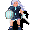

# { .sprite } Subdued Feygard mountain scout

**Where to find Subdued Feygard mountain scout:** Blackwater Mountain: [Blackwater mountain 32](../maps/blackwater_mountain32.md#pin-npc-ortholion_subdued)

<div class="infobox" markdown>

<p class="ib-img"></p>

| | |
|---|---|
| **Type** | NPC/Enemy (talks, but can also be fought) |
| **Found in** | Blackwater Mountain |
| **Class** | Humanoid |
| **HP** | 191 |
| **XP when defeated** | 396 |
| **Introduced** | [v0.7.14](../versions/0.7.14.md) |

</div>

!!! warning "You can fight Subdued Feygard mountain scout"
    The conversation can lead straight into a fight with Subdued Feygard mountain scout.

## Combat

| | |
|---|---|
| Class | Humanoid |
| HP | 191 |
| XP when defeated | 396 |
| Damage | 2 to 5 |
| AC | 150 |
| BC | 95 |
| DR | 5 |
| Attacks per turn | 3 (3 AP each, 10 AP) |
| Crit chance | 15% (×3.0) |

**Its hits:** On target: [Icy wounds](../conditions/frozen2.md) (magnitude 1, 3 rounds, 20% chance)


<p class="verified">Verified against v0.8.18 monster data.</p>

## Drops

| Item | Chance | Qty |
|---|---|---|
| [Feygard iron dagger](../items/feygard_iron_dagger.md) | 50% | 1 |
| [Ring of damage +2](../items/ring_dmg2.md) | 25% | 1 to 2 |
| [Iced leather armor](../items/armor5.md) | 20% | 1 |
| [Gold coins](../items/gold.md) | 50% | 2 to 68 |
| [Ruby gem](../items/gem2.md) | 20% | 1 to 5 |
| [Iced broken wooden buckler](../items/shield8.md) | 100% | 1 |
| [Iced leather boots](../items/boots7.md) | 100% | 1 |
| [Iced leather gloves](../items/gloves5.md) | 100% | 1 |
| [Broken Feygard medallion](../items/feygard_necklace1.md) | 20% | 1 |

## Quests that count defeats

- [Climbing up is forbidden](../quests/Omi2_bwm1.md#stage-41) with stepping on a trigger on [Blackwater mountain 32](../maps/blackwater_mountain32.md) checks that this enemy has been defeated.

## Dialogue simulator

Talk to Subdued Feygard mountain scout as you would in the game. When the conversation depends on your progress (a quest, an item, a dice roll…), the simulator asks you. Try another answer with **Undo**.

<div class="dlg-sim" data-src="../../assets/dialogue/ortholion_subdued_1.json" data-npc="Subdued Feygard mountain scout" markdown="0"><noscript>The simulator needs JavaScript. The full dialogue is listed below.</noscript></div>

<p class="verified">Follows the game's own conversation rules (v0.8.18).</p>

??? quote "Dialogue (3 lines)"

    *Exactly as in the game files. Each line appears once; links jump to where a choice leads.*

    <span id="d-ortholion_subdued_1"></span>**`ortholion_subdued_1`** [Subdued Feygard mountain scout](../monsters/ortholion_subdued.md): “Hmmm... Hmmm....”

    - “Hey! I need to talk with the general, now!” → [ortholion_subdued_2](#d-ortholion_subdued_2)
    - “Step aside, lowly minion. I have business with your boss.” → [ortholion_subdued_2](#d-ortholion_subdued_2)

    <span id="d-ortholion_subdued_2"></span>**`ortholion_subdued_2`** [Dummy NPC](../monsters/none.md): “The scout stares at you with an immeasurable anger. Before you can react, she swings her dagger, opening a wound in your arm.”

    - “Argh! What the...?” → [ortholion_subdued_2a](#d-ortholion_subdued_2a)
    - “How dare you! Prepare to die, Feygard scum.” → [ortholion_subdued_2a](#d-ortholion_subdued_2a)

    <span id="d-ortholion_subdued_2a"></span>**`ortholion_subdued_2a`** *(silent check: the first matching branch below is taken)* — **effects:** applies condition bleeding_wound, applies condition feebleness_minor

    - branch 1 → *fight starts*


## Version history

| Version | Change |
|---|---|
| [v0.7.14](../versions/0.7.14.md) | Added<br>Dialogue: 3 lines added |
| [v0.7.17](../versions/0.7.17.md) | Dialogue: 1 line changed<br>· text: “The scout stares at you with an inconmensurable anger. Before you can…” → “The scout stares at you with an immeasurable anger. Before you can re…” |

<p class="verified">Verified against v0.8.18 and every earlier release back to v0.7.0 (game data compared release by release).</p>


## Behind the scenes

*How the game data handles this character. Not needed for playing.*

??? info "How the XP value is calculated"

    The game computes each enemy's experience value when it loads the data (`MonsterTypeParser.java`):

    XP = ⌈(attacks per turn × attack chance × average damage × (1 + critical skill × critical multiplier) × 3 + HP × (1 + block chance) + 9 × damage resistance) × 0.7⌉

    Percentages are used as fractions (e.g. 60% = 0.6). Enemies whose attacks inflict a condition are worth 50 XP more. The More Exp skill adds a percentage on top.

??? info "Technical information"

    | | |
    |---|---|
    | Entry ID | `ortholion_subdued` |
    | Type (wiki) | NPC/Enemy |
    | Spawn group | `ortholion_subdued` |
    | Loot table | `ortholion_subdued` |
    | Conversation | `ortholion_subdued_1` |
    | Faction | – |
    | Movement | protectSpawn |
    | Icon | `monsters_omi2:11` |
    | Defined in | `res/raw/monsterlist_omi2.json` |

    Raw data:

    ```json
    {
     "id": "ortholion_subdued",
     "name": "Subdued Feygard mountain scout",
     "iconID": "monsters_omi2:11",
     "maxHP": 191,
     "maxAP": 10,
     "unique": 1,
     "monsterClass": "humanoid",
     "movementAggressionType": "protectSpawn",
     "attackDamage": {
      "min": 2,
      "max": 5
     },
     "spawnGroup": "ortholion_subdued",
     "phraseID": "ortholion_subdued_1",
     "droplistID": "ortholion_subdued",
     "attackCost": 3,
     "attackChance": 150,
     "criticalSkill": 20,
     "criticalMultiplier": 3.0,
     "blockChance": 95,
     "damageResistance": 5,
     "hitEffect": {
      "conditionsTarget": [
       {
        "condition": "frozen2",
        "magnitude": 1,
        "duration": 3,
        "chance": "20"
       }
      ]
     }
    }
    ```


## Community notes

<small>Written by players, not generated from game data. **Observations**: what players notice in-game · **Lore**: the in-world story · **Trivia**: real-world facts, references, development history · **Theory / speculation**: unconfirmed ideas; may just be unfinished content</small>

### Observations

*No notes yet. Contributions are welcome: [add a note](https://github.com/asdfghjkl628/Andor-s-Trail-Wikiiii/new/main/notes/monsters?filename=ortholion_subdued.md&value=%23%23%20Observations%0A%0A%3C%21--%20what%20players%20notice%20in-game%20--%3E%0A%0A%23%23%20Lore%0A%0A%3C%21--%20the%20in-world%20story%20--%3E%0A%0A%23%23%20Trivia%0A%0A%3C%21--%20real-world%20facts%2C%20references%2C%20development%20history%20--%3E%0A%0A%23%23%20Theory%20/%20speculation%0A%0A%3C%21--%20unconfirmed%20ideas%3B%20may%20just%20be%20unfinished%20content%20--%3E%0A).*

### Lore

*No notes yet. Contributions are welcome: [add a note](https://github.com/asdfghjkl628/Andor-s-Trail-Wikiiii/new/main/notes/monsters?filename=ortholion_subdued.md&value=%23%23%20Observations%0A%0A%3C%21--%20what%20players%20notice%20in-game%20--%3E%0A%0A%23%23%20Lore%0A%0A%3C%21--%20the%20in-world%20story%20--%3E%0A%0A%23%23%20Trivia%0A%0A%3C%21--%20real-world%20facts%2C%20references%2C%20development%20history%20--%3E%0A%0A%23%23%20Theory%20/%20speculation%0A%0A%3C%21--%20unconfirmed%20ideas%3B%20may%20just%20be%20unfinished%20content%20--%3E%0A).*

### Trivia

*No notes yet. Contributions are welcome: [add a note](https://github.com/asdfghjkl628/Andor-s-Trail-Wikiiii/new/main/notes/monsters?filename=ortholion_subdued.md&value=%23%23%20Observations%0A%0A%3C%21--%20what%20players%20notice%20in-game%20--%3E%0A%0A%23%23%20Lore%0A%0A%3C%21--%20the%20in-world%20story%20--%3E%0A%0A%23%23%20Trivia%0A%0A%3C%21--%20real-world%20facts%2C%20references%2C%20development%20history%20--%3E%0A%0A%23%23%20Theory%20/%20speculation%0A%0A%3C%21--%20unconfirmed%20ideas%3B%20may%20just%20be%20unfinished%20content%20--%3E%0A).*

### Theory / speculation

*No notes yet. Contributions are welcome: [add a note](https://github.com/asdfghjkl628/Andor-s-Trail-Wikiiii/new/main/notes/monsters?filename=ortholion_subdued.md&value=%23%23%20Observations%0A%0A%3C%21--%20what%20players%20notice%20in-game%20--%3E%0A%0A%23%23%20Lore%0A%0A%3C%21--%20the%20in-world%20story%20--%3E%0A%0A%23%23%20Trivia%0A%0A%3C%21--%20real-world%20facts%2C%20references%2C%20development%20history%20--%3E%0A%0A%23%23%20Theory%20/%20speculation%0A%0A%3C%21--%20unconfirmed%20ideas%3B%20may%20just%20be%20unfinished%20content%20--%3E%0A).*


<small>Data from v0.8.18</small>
