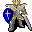

# { .sprite } Feygard soldier

| Stat | Value |
|---|---|
| Class | humanoid |
| HP | 0 |
| Max AP | 10 |
| Attack cost | 10 |
| Move cost | 1 |
| Damage | 0 |
| Attack chance | 0 |
| Block chance | 0 |
| Damage resistance | 0 |
| Critical skill | 0 |
| Critical multiplier | 0 |

## Found on

- [brimhaven4](../maps/brimhaven4.md)
- [crossroads](../maps/crossroads.md)
- [fields6](../maps/fields6.md)
- [remgard0](../maps/remgard0.md)
- [road1](../maps/road1.md)
- [roadbeforecrossroads2](../maps/roadbeforecrossroads2.md)
- [roadbeforecrossroads6](../maps/roadbeforecrossroads6.md)
- [wild6](../maps/wild6.md)

<small>Monster ID: `patrol_roaming` · Data from v0.8.18</small>
