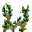

# { .sprite } Poisonous vine

<div class="infobox" markdown>

<p class="ib-img">{ .sprite }</p>

| | |
|---|---|
| **Type** | Enemy (hostile on sight) |
| **Found in** | Island underground 2, Island underground 3, Laerothcave 0 |
| **Class** | Construct |
| **HP** | 90 |
| **XP when defeated** | 187 |
| **Immune to critical hits** | Yes |
| **Entries in game data** | 2 |
| **Introduced** | [v0.8.11](../versions/0.8.11.md) |

</div>

!!! info "2 entries in the game data"
    The game data defines 2 separate characters named Poisonous vine. The game makes a new entry whenever a character needs different behaviour (another conversation later in a quest, another location, other stats). Some are the same person at different story points; others just share a generic name. Here the entries differ in: appearance. Each entry has its own section below.

| Entry | Type | Location | Role | HP |
|---|---|---|---|---|
| [`poison_vine_top`](#v-poison_vine_top) | Enemy | [Island underground 2](../maps/island_underground2.md), [Island underground 3](../maps/island_underground3.md) (+2 more) | – | 90 |
| [`poison_vine_bottom`](#v-poison_vine_bottom) | Enemy | [Island underground 2](../maps/island_underground2.md), [Island underground 3](../maps/island_underground3.md) (+2 more) | – | 90 |

## Island underground 2 and 3 more (poison_vine_top) { #v-poison_vine_top }

**Entry ID:** `poison_vine_top` · **Type:** Enemy

**Location:** [Island underground 2](../maps/island_underground2.md), [Island underground 3](../maps/island_underground3.md), [Laerothcave 0](../maps/laerothcave0.md), [Secretpassage 1](../maps/secretpassage1.md)

### Combat statistics

| Statistic | Value |
|---|---|
| Class | Construct |
| HP | 90 |
| XP when defeated | 187 |
| Damage | 1 to 3 |
| Attack chance | 350 |
| Block chance | 50 |
| Damage resistance | 2 |
| Max AP | 10 |
| Attack cost | 5 AP |
| Attacks per turn | 2 |
| Move cost | 10 AP |
| Critical skill | 0 |
| Critical multiplier | – |
| Critical hit chance | None (requires both critical skill and a critical multiplier) |

!!! note "Immune to critical hits"
    Ghosts, constructs and demons cannot receive critical hits.

**On hit:** On target: [Weak Poison](../conditions/poison_weak.md) (magnitude 3, 5 rounds, 90% chance); [Blistering skin](../conditions/blister.md) (magnitude 3, 4 rounds, 80% chance)


<p class="verified">Verified against v0.8.18 monster data and game code (`MonsterTypeParser.java`).</p>

### Locations

| Map | Region | Up to | Notes |
|---|---|---|---|
| [Island underground 2](../maps/island_underground2.md) | – | 1 | – |
| [Island underground 3](../maps/island_underground3.md) | – | 1 | – |
| [Laerothcave 0](../maps/laerothcave0.md) | – | 2 | – |
| [Secretpassage 1](../maps/secretpassage1.md) | – | 1 | – |


### Version history

| Version | Change |
|---|---|
| [v0.8.11](../versions/0.8.11.md) | Added |

<p class="verified">Verified against v0.8.18 and every earlier release back to v0.7.0 (game data compared release by release).</p>


??? info "Technical information (poison_vine_top)"

    | | |
    |---|---|
    | Entry ID | `poison_vine_top` |
    | Spawn group | `vine_1` |
    | Loot table | – |
    | Conversation | – |
    | Faction | – |
    | Movement | – |
    | Icon | `monsters_guynmart:2` |
    | Defined in | `res/raw/monsterlist_laeroth.json` |

    Raw data:

    ```json
    {
     "id": "poison_vine_top",
     "name": "Poisonous vine",
     "iconID": "monsters_guynmart:2",
     "maxHP": 90,
     "monsterClass": "construct",
     "attackDamage": {
      "min": 1,
      "max": 3
     },
     "spawnGroup": "vine_1",
     "attackCost": 5,
     "attackChance": 350,
     "blockChance": 50,
     "damageResistance": 2,
     "hitEffect": {
      "conditionsTarget": [
       {
        "condition": "poison_weak",
        "magnitude": 3,
        "duration": 5,
        "chance": "90"
       },
       {
        "condition": "blister",
        "magnitude": 3,
        "duration": 4,
        "chance": "80"
       }
      ]
     }
    }
    ```


## Island underground 2 and 3 more (poison_vine_bottom) { #v-poison_vine_bottom }

**Entry ID:** `poison_vine_bottom` · **Type:** Enemy

**Location:** [Island underground 2](../maps/island_underground2.md), [Island underground 3](../maps/island_underground3.md), [Laerothcave 0](../maps/laerothcave0.md), [Secretpassage 1](../maps/secretpassage1.md)

### Combat statistics

| Statistic | Value |
|---|---|
| Class | Construct |
| HP | 90 |
| XP when defeated | 187 |
| Damage | 1 to 3 |
| Attack chance | 350 |
| Block chance | 50 |
| Damage resistance | 2 |
| Max AP | 10 |
| Attack cost | 5 AP |
| Attacks per turn | 2 |
| Move cost | 10 AP |
| Critical skill | 0 |
| Critical multiplier | – |
| Critical hit chance | None (requires both critical skill and a critical multiplier) |

!!! note "Immune to critical hits"
    Ghosts, constructs and demons cannot receive critical hits.

**On hit:** On target: [Weak Poison](../conditions/poison_weak.md) (magnitude 3, 5 rounds, 90% chance); [Blistering skin](../conditions/blister.md) (magnitude 3, 4 rounds, 80% chance)


<p class="verified">Verified against v0.8.18 monster data and game code (`MonsterTypeParser.java`).</p>

### Locations

| Map | Region | Up to | Notes |
|---|---|---|---|
| [Island underground 2](../maps/island_underground2.md) | – | 1 | – |
| [Island underground 3](../maps/island_underground3.md) | – | 1 | – |
| [Laerothcave 0](../maps/laerothcave0.md) | – | 2 | – |
| [Secretpassage 1](../maps/secretpassage1.md) | – | 1 | – |


### Version history

| Version | Change |
|---|---|
| [v0.8.11](../versions/0.8.11.md) | Added |

<p class="verified">Verified against v0.8.18 and every earlier release back to v0.7.0 (game data compared release by release).</p>


??? info "Technical information (poison_vine_bottom)"

    | | |
    |---|---|
    | Entry ID | `poison_vine_bottom` |
    | Spawn group | `vine_2` |
    | Loot table | – |
    | Conversation | – |
    | Faction | – |
    | Movement | – |
    | Icon | `monsters_guynmart:10` |
    | Defined in | `res/raw/monsterlist_laeroth.json` |

    Raw data:

    ```json
    {
     "id": "poison_vine_bottom",
     "name": "Poisonous vine",
     "iconID": "monsters_guynmart:10",
     "maxHP": 90,
     "monsterClass": "construct",
     "attackDamage": {
      "min": 1,
      "max": 3
     },
     "spawnGroup": "vine_2",
     "attackCost": 5,
     "attackChance": 350,
     "blockChance": 50,
     "damageResistance": 2,
     "hitEffect": {
      "conditionsTarget": [
       {
        "condition": "poison_weak",
        "magnitude": 3,
        "duration": 5,
        "chance": "90"
       },
       {
        "condition": "blister",
        "magnitude": 3,
        "duration": 4,
        "chance": "80"
       }
      ]
     }
    }
    ```


??? info "How the XP value is calculated"

    The game computes each enemy's experience value when it loads the data (`MonsterTypeParser.java`):

    XP = ⌈(attacks per turn × attack chance × average damage × (1 + critical skill × critical multiplier) × 3 + HP × (1 + block chance) + 9 × damage resistance) × 0.7⌉

    Percentages are used as fractions (e.g. 60% = 0.6). Enemies whose attacks inflict a condition are worth 50 XP more. The More Exp skill adds a percentage on top.


## Community notes

<small>Written by players, not generated from game data. **Observations**: what players notice in-game · **Lore**: the in-world story · **Trivia**: real-world facts, references, development history · **Theory / speculation**: unconfirmed ideas; may just be unfinished content</small>

### Observations

*No notes yet. Contributions are welcome: [add a note](https://github.com/asdfghjkl628/Andor-s-Trail-Wikiiii/new/main/notes/monsters?filename=poison_vine_top.md&value=%23%23%20Observations%0A%0A%3C%21--%20what%20players%20notice%20in-game%20--%3E%0A%0A%23%23%20Lore%0A%0A%3C%21--%20the%20in-world%20story%20--%3E%0A%0A%23%23%20Trivia%0A%0A%3C%21--%20real-world%20facts%2C%20references%2C%20development%20history%20--%3E%0A%0A%23%23%20Theory%20/%20speculation%0A%0A%3C%21--%20unconfirmed%20ideas%3B%20may%20just%20be%20unfinished%20content%20--%3E%0A).*

### Lore

*No notes yet. Contributions are welcome: [add a note](https://github.com/asdfghjkl628/Andor-s-Trail-Wikiiii/new/main/notes/monsters?filename=poison_vine_top.md&value=%23%23%20Observations%0A%0A%3C%21--%20what%20players%20notice%20in-game%20--%3E%0A%0A%23%23%20Lore%0A%0A%3C%21--%20the%20in-world%20story%20--%3E%0A%0A%23%23%20Trivia%0A%0A%3C%21--%20real-world%20facts%2C%20references%2C%20development%20history%20--%3E%0A%0A%23%23%20Theory%20/%20speculation%0A%0A%3C%21--%20unconfirmed%20ideas%3B%20may%20just%20be%20unfinished%20content%20--%3E%0A).*

### Trivia

*No notes yet. Contributions are welcome: [add a note](https://github.com/asdfghjkl628/Andor-s-Trail-Wikiiii/new/main/notes/monsters?filename=poison_vine_top.md&value=%23%23%20Observations%0A%0A%3C%21--%20what%20players%20notice%20in-game%20--%3E%0A%0A%23%23%20Lore%0A%0A%3C%21--%20the%20in-world%20story%20--%3E%0A%0A%23%23%20Trivia%0A%0A%3C%21--%20real-world%20facts%2C%20references%2C%20development%20history%20--%3E%0A%0A%23%23%20Theory%20/%20speculation%0A%0A%3C%21--%20unconfirmed%20ideas%3B%20may%20just%20be%20unfinished%20content%20--%3E%0A).*

### Theory / speculation

*No notes yet. Contributions are welcome: [add a note](https://github.com/asdfghjkl628/Andor-s-Trail-Wikiiii/new/main/notes/monsters?filename=poison_vine_top.md&value=%23%23%20Observations%0A%0A%3C%21--%20what%20players%20notice%20in-game%20--%3E%0A%0A%23%23%20Lore%0A%0A%3C%21--%20the%20in-world%20story%20--%3E%0A%0A%23%23%20Trivia%0A%0A%3C%21--%20real-world%20facts%2C%20references%2C%20development%20history%20--%3E%0A%0A%23%23%20Theory%20/%20speculation%0A%0A%3C%21--%20unconfirmed%20ideas%3B%20may%20just%20be%20unfinished%20content%20--%3E%0A).*


<small>Data from v0.8.18</small>
