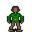

# { .sprite } Polyphem

**Where to find Polyphem:** [Ll 2 cyclops cave](#v-polyphem), [Ll 2 cyclops cave](#v-polyphem_bed), [Ll 2 cyclops cave](#v-polyphem_door)

<div class="infobox" markdown>

<p class="ib-img"></p>

| | |
|---|---|
| **Type** | NPC (talk only; never fought) |
| **Found in** | Ll 2 cyclops cave |
| **Introduced** | [v0.8.18](../versions/0.8.18.md) |

</div>

## Ll 2 cyclops cave { #v-polyphem }

**Where:** [Ll 2 cyclops cave](../maps/ll2_cyclops_cave.md#pin-npc-polyphem)

### Quests

- [A map of the Great Lake Laeroth](../quests/lake_map.md): stages 52, 54, 56, 57

### Dialogue simulator

Talk to Polyphem as you would in the game. When the conversation depends on your progress (a quest, an item, a dice roll…), the simulator asks you. Try another answer with **Undo**.

<div class="dlg-sim" data-src="../../assets/dialogue/polyphem.json" data-npc="Polyphem" markdown="0"><noscript>The simulator needs JavaScript. The full dialogue is listed below.</noscript></div>

<p class="verified">Follows the game's own conversation rules (v0.8.18).</p>

??? quote "Dialogue (56 lines)"

    *Exactly as in the game files. Each line appears once; links jump to where a choice leads.*

    <span id="d-polyphem-polyphem"></span>**`polyphem`** *(silent check: the first matching branch below is taken)*

    - branch 1 *(if reached stage 57 of [A map of the Great Lake Laeroth](../quests/lake_map.md#stage-57))* → [polyphem_57](#d-polyphem-polyphem_57)
    - branch 2 *(if reached stage 56 of [A map of the Great Lake Laeroth](../quests/lake_map.md#stage-56))* → [polyphem_105](#d-polyphem-polyphem_105)
    - branch 3 *(if reached stage 55 of [A map of the Great Lake Laeroth](../quests/lake_map.md#stage-55))* → [polyphem_55](#d-polyphem-polyphem_55)
    - branch 4 *(if reached stage 54 of [A map of the Great Lake Laeroth](../quests/lake_map.md#stage-54))* → [polyphem_54](#d-polyphem-polyphem_54)
    - branch 5 *(if reached stage 52 of [A map of the Great Lake Laeroth](../quests/lake_map.md#stage-52))* → [polyphem_52](#d-polyphem-polyphem_52)
    - branch 6 → [polyphem_10](#d-polyphem-polyphem_10)

    <span id="d-polyphem-polyphem_57"></span>**`polyphem_57`** [Polyphem](../monsters/polyphem.md#v-polyphem_door): “It's a good thing sheep are so easy to distinguish from humans.”

    - “Baaah.” *(if NOT reached stage 58 of [A map of the Great Lake Laeroth](../quests/lake_map.md#stage-58))* → [polyphem_57_10](#d-polyphem-polyphem_57_10)
    - “Baaah.” *(if reached stage 58 of [A map of the Great Lake Laeroth](../quests/lake_map.md#stage-58))* → [polyphem_58](#d-polyphem-polyphem_58)

    <span id="d-polyphem-polyphem_105"></span>**`polyphem_105`** Polyphem: “[angry] YOU! Little one! WHERE ARE YOU?!”

    - Next → [polyphem_106](#d-polyphem-polyphem_106)

    <span id="d-polyphem-polyphem_55"></span>**`polyphem_55`** Polyphem: “Hmmm? [Polyphem opens his eye for a brief moment, but long enough for you.]”

    - “You pour the harsh soapy water directly into Polyphem's eye.” → [polyphem_100](#d-polyphem-polyphem_100)

    <span id="d-polyphem-polyphem_54"></span>**`polyphem_54`** Polyphem: “Hmmm? [Polyphem opens his eye for a brief moment.]”


    <span id="d-polyphem-polyphem_52"></span>**`polyphem_52`** Polyphem: “Without another word, Polyphem falls onto his bed and immediately begins to snore loudly.” — **effects:** removes monsters from ll2_cyclops_cave, spawns monsters on ll2_cyclops_cave, sets stage 54 of [A map of the Great Lake Laeroth](../quests/lake_map.md#stage-54)


    <span id="d-polyphem-polyphem_10"></span>**`polyphem_10`** [Polyphem](../monsters/polyphem.md): “Ah. Good. Nice. Home.”

    - Next → [polyphem_11](#d-polyphem-polyphem_11)

    <span id="d-polyphem-polyphem_57_10"></span>**`polyphem_57_10`** Polyphem: “HA! Are you trying to sneak your way through here acting like a sheep?!”

    - “Does it really catch the eye?” → *conversation ends*

    <span id="d-polyphem-polyphem_58"></span>**`polyphem_58`** Polyphem: “My favorite sheep! Your bleating sounds a bit unusual today. But I recognize you among hundreds by your wool.”

    - Next → [polyphem_58_10](#d-polyphem-polyphem_58_10)

    <span id="d-polyphem-polyphem_106"></span>**`polyphem_106`** Polyphem: “Calm down. Stay calm.”

    - Next → [polyphem_107](#d-polyphem-polyphem_107)

    <span id="d-polyphem-polyphem_100"></span>**`polyphem_100`** Polyphem: “AAAAH - MY EYE!” — **effects:** sets stage 56 of [A map of the Great Lake Laeroth](../quests/lake_map.md#stage-56)

    - Next → [polyphem_101](#d-polyphem-polyphem_101)

    <span id="d-polyphem-polyphem_11"></span>**`polyphem_11`** Polyphem: “[sniffs] Hm. The cave smells... strange today.”

    - Next → [polyphem_12](#d-polyphem-polyphem_12)

    <span id="d-polyphem-polyphem_58_10"></span>**`polyphem_58_10`** Polyphem: “Hop, hop, run outside and enjoy the delicious grass.”


    <span id="d-polyphem-polyphem_107"></span>**`polyphem_107`** Polyphem: “I'll see you again in a minute.”

    - Next → [polyphem_108](#d-polyphem-polyphem_108)

    <span id="d-polyphem-polyphem_101"></span>**`polyphem_101`** Polyphem: “MY GOOD EYE!”

    - Next → [polyphem_102](#d-polyphem-polyphem_102)

    <span id="d-polyphem-polyphem_12"></span>**`polyphem_12`** Polyphem: “Oh, a guest! How unusual.”

    - Next → [polyphem_13](#d-polyphem-polyphem_13)

    <span id="d-polyphem-polyphem_108"></span>**`polyphem_108`** Polyphem: “I CAN'T SEE ANYTHING ANYMORE!”

    - Next → [polyphem_109](#d-polyphem-polyphem_109)

    <span id="d-polyphem-polyphem_102"></span>**`polyphem_102`** Polyphem: “[staggers backward, flailing blindly] That burns!”

    - Next → [polyphem_103](#d-polyphem-polyphem_103)

    <span id="d-polyphem-polyphem_13"></span>**`polyphem_13`** Polyphem: “Don't be alarmed. I'm not alarmed by myself either.”

    - Next → [polyphem_14](#d-polyphem-polyphem_14)

    <span id="d-polyphem-polyphem_109"></span>**`polyphem_109`** Polyphem: “[yells outside] BROTHERS! HELP!”

    - Next → [polyphem_110](#d-polyphem-polyphem_110)

    <span id="d-polyphem-polyphem_103"></span>**`polyphem_103`** Polyphem: “That's cheating!”

    - Next → [polyphem_105](#d-polyphem-polyphem_105)

    <span id="d-polyphem-polyphem_14"></span>**`polyphem_14`** Polyphem: “[looking in the mirror] I just look dangerous.”

    - Next → [polyphem_15](#d-polyphem-polyphem_15)

    <span id="d-polyphem-polyphem_110"></span>**`polyphem_110`** Polyphem: “[bangs against the cave wall] HELP! I'VE BEEN BLINDED!”

    - Next → [polyphem_111](#d-polyphem-polyphem_111)

    <span id="d-polyphem-polyphem_15"></span>**`polyphem_15`** Polyphem: “[to the sheep] Quiet now. The visitor is looking.”

    - Next → [polyphem_16](#d-polyphem-polyphem_16)

    <span id="d-polyphem-polyphem_111"></span>**`polyphem_111`** [Aphem](../monsters/ll2_cyclops2.md): “[voices from outside, muffled, bored] What's wrong, Polyphem?”

    - Next → [polyphem_112](#d-polyphem-polyphem_112)

    <span id="d-polyphem-polyphem_16"></span>**`polyphem_16`** Polyphem: “You're in luck, little one. It's not a holiday today.”

    - Next → [polyphem_17](#d-polyphem-polyphem_17)

    <span id="d-polyphem-polyphem_112"></span>**`polyphem_112`** [Polyphem](../monsters/polyphem.md#v-polyphem_bed): “NOBODY! NOBODY BLINDED ME!”

    - Next → [polyphem_113](#d-polyphem-polyphem_113)

    <span id="d-polyphem-polyphem_17"></span>**`polyphem_17`** Polyphem: “[grins proudly] But it will be soon.”

    - Next → [polyphem_18](#d-polyphem-polyphem_18)

    <span id="d-polyphem-polyphem_113"></span>**`polyphem_113`** [Dummy NPC](../monsters/none.md): “A stunned pause outside.”

    - Next → [polyphem_114](#d-polyphem-polyphem_114)

    <span id="d-polyphem-polyphem_18"></span>**`polyphem_18`** Polyphem: “The door is locked. You can't leave now. Don't be angry. Rules are rules.”

    - Next → [polyphem_18a](#d-polyphem-polyphem_18a)

    <span id="d-polyphem-polyphem_114"></span>**`polyphem_114`** [Aphem](../monsters/ll2_cyclops2.md): “... What?”

    - Next → [polyphem_115](#d-polyphem-polyphem_115)

    <span id="d-polyphem-polyphem_18a"></span>**`polyphem_18a`** Polyphem: “This door has no key. Keys always get lost... It only opens when I look in this mirror. Clever, clever - just like me.”

    - “So I can't just kill you to get out again.” → [polyphem_19a](#d-polyphem-polyphem_19a)
    - “Are you a cyclops?” → [polyphem_19a](#d-polyphem-polyphem_19a)

    <span id="d-polyphem-polyphem_115"></span>**`polyphem_115`** [Polyasem](../monsters/ll2_cyclops1.md): “If nobody blinded you, why are you screaming?”

    - Next → [polyphem_116](#d-polyphem-polyphem_116)

    <span id="d-polyphem-polyphem_19a"></span>**`polyphem_19a`** Polyphem: “What? How you dare? Me the mightiest of all cyclops! Me Polyphem!”

    - Next → [polyphem_19b](#d-polyphem-polyphem_19b)

    <span id="d-polyphem-polyphem_116"></span>**`polyphem_116`** [Polyphem](../monsters/polyphem.md#v-polyphem_bed): “BECAUSE IT HURTS!”

    - Next → [polyphem_117](#d-polyphem-polyphem_117)

    <span id="d-polyphem-polyphem_19b"></span>**`polyphem_19b`** Polyphem: “[beats his chest] My relatives will be coming for the next feast.”

    - Next → [polyphem_20](#d-polyphem-polyphem_20)

    <span id="d-polyphem-polyphem_117"></span>**`polyphem_117`** Polyphem: “[desperately] NOBODY WAS DOING IT!”

    - Next → [polyphem_118](#d-polyphem-polyphem_118)

    <span id="d-polyphem-polyphem_20"></span>**`polyphem_20`** Polyphem: “My hungry brothers.”

    - Next → [polyphem_21](#d-polyphem-polyphem_21)

    <span id="d-polyphem-polyphem_118"></span>**`polyphem_118`** Polyphem: “HE'S STANDING HERE! OR WAS STANDING! NOT ANYMORE!”

    - Next → [polyphem_119](#d-polyphem-polyphem_119)

    <span id="d-polyphem-polyphem_21"></span>**`polyphem_21`** Polyphem: “[leans toward the player] And I'll bring the main course.”

    - Next → [polyphem_23](#d-polyphem-polyphem_23)

    <span id="d-polyphem-polyphem_119"></span>**`polyphem_119`** [Aphem](../monsters/ll2_cyclops2.md): “Then cool your eye.”

    - Next → [polyphem_120](#d-polyphem-polyphem_120)

    <span id="d-polyphem-polyphem_23"></span>**`polyphem_23`** Polyphem: “[straightens up, smugly] You can stay until then. The sheep are nice. They don't talk much.”

    - Next → [polyphem_24](#d-polyphem-polyphem_24)

    <span id="d-polyphem-polyphem_120"></span>**`polyphem_120`** [Polyasem](../monsters/ll2_cyclops1.md): “And stop drinking.”

    - Next → [polyphem_121](#d-polyphem-polyphem_121)

    <span id="d-polyphem-polyphem_24"></span>**`polyphem_24`** Polyphem: “You should take a leaf out of their book.”

    - Next → [polyphem_25](#d-polyphem-polyphem_25)

    <span id="d-polyphem-polyphem_121"></span>**`polyphem_121`** [Dummy NPC](../monsters/none.md): “Laughter outside, footsteps receding.”

    - Next → [polyphem_122](#d-polyphem-polyphem_122)

    <span id="d-polyphem-polyphem_25"></span>**`polyphem_25`** Polyphem: “[turns to the mirror, straightens up] Me too, by the way. Nice, I mean. Very nice, in fact.”

    - Next → [polyphem_26](#d-polyphem-polyphem_26)

    <span id="d-polyphem-polyphem_122"></span>**`polyphem_122`** [Polyphem](../monsters/polyphem.md#v-polyphem_bed): “COME BACK!”

    - Next → [polyphem_123](#d-polyphem-polyphem_123)

    <span id="d-polyphem-polyphem_26"></span>**`polyphem_26`** Polyphem: “They say I have an eye for guests.”

    - Next → [polyphem_30](#d-polyphem-polyphem_30)

    <span id="d-polyphem-polyphem_123"></span>**`polyphem_123`** Polyphem: “HE'S DANGEROUS!”

    - Next → [polyphem_124](#d-polyphem-polyphem_124)

    <span id="d-polyphem-polyphem_30"></span>**`polyphem_30`** Polyphem: “Who are you, anyway?”

    - “My name is Nobody.” → [polyphem_31](#d-polyphem-polyphem_31)

    <span id="d-polyphem-polyphem_124"></span>**`polyphem_124`** Polyphem: “[quieter, offended] Very dangerous indeed. But nothing against me, Polyphem!”

    - Next → [polyphem_125](#d-polyphem-polyphem_125)

    <span id="d-polyphem-polyphem_31"></span>**`polyphem_31`** Polyphem: “Nobody, huh? But that's not important. I just need to know what to call the dish.” — **effects:** sets stage 52 of [A map of the Great Lake Laeroth](../quests/lake_map.md#stage-52)


    <span id="d-polyphem-polyphem_125"></span>**`polyphem_125`** Polyphem: “Coward! Invisible coward!”

    - Next → [polyphem_127](#d-polyphem-polyphem_127)

    <span id="d-polyphem-polyphem_127"></span>**`polyphem_127`** Polyphem: “[sniffs] I can still smell you.”

    - Next → [polyphem_128](#d-polyphem-polyphem_128)

    <span id="d-polyphem-polyphem_128"></span>**`polyphem_128`** Polyphem: “Never mind. You're not getting out of here.”

    - Next → [polyphem_129](#d-polyphem-polyphem_129)

    <span id="d-polyphem-polyphem_129"></span>**`polyphem_129`** Polyphem: “I'll let the sheep out, then I'll find you more easily.” — **effects:** removes monsters from ll2_cyclops_cave, spawns monsters on ll2_cyclops_cave, sets stage 57 of [A map of the Great Lake Laeroth](../quests/lake_map.md#stage-57), clears stage 110 of [Lake Laeroth story flags (hidden flag)](../quests/ll2_nd.md#stage-110), changes map ll2_cyclops_cave, spawns monsters on mountainlake27, spawns monsters on mountainlake27, changes map mountainlake27


### Version history

| Version | Change |
|---|---|
| [v0.8.18](../versions/0.8.18.md) | Added<br>Dialogue: 56 lines added |

<p class="verified">Verified against v0.8.18 and every earlier release back to v0.7.0 (game data compared release by release).</p>


## Ll 2 cyclops cave (2) { #v-polyphem_bed }

**Where:** [Ll 2 cyclops cave](../maps/ll2_cyclops_cave.md#pin-npc-polyphem_bed)

### Quests

- [A map of the Great Lake Laeroth](../quests/lake_map.md): stages 52, 54, 56, 57

### Dialogue simulator

Talk to Polyphem as you would in the game. When the conversation depends on your progress (a quest, an item, a dice roll…), the simulator asks you. Try another answer with **Undo**.

<div class="dlg-sim" data-src="../../assets/dialogue/polyphem.json" data-npc="Polyphem" markdown="0"><noscript>The simulator needs JavaScript. The full dialogue is listed below.</noscript></div>

<p class="verified">Follows the game's own conversation rules (v0.8.18).</p>

The full dialogue for this entry is included in the listing for an earlier entry on this page, starting at [polyphem](#d-polyphem-polyphem).


### Version history

| Version | Change |
|---|---|
| [v0.8.18](../versions/0.8.18.md) | Added<br>Dialogue: 56 lines added |

<p class="verified">Verified against v0.8.18 and every earlier release back to v0.7.0 (game data compared release by release).</p>


## Ll 2 cyclops cave (3) { #v-polyphem_door }

**Where:** [Ll 2 cyclops cave](../maps/ll2_cyclops_cave.md#pin-npc-polyphem_door)

### Quests

- [A map of the Great Lake Laeroth](../quests/lake_map.md): stages 52, 54, 56, 57

### Dialogue simulator

Talk to Polyphem as you would in the game. When the conversation depends on your progress (a quest, an item, a dice roll…), the simulator asks you. Try another answer with **Undo**.

<div class="dlg-sim" data-src="../../assets/dialogue/polyphem.json" data-npc="Polyphem" markdown="0"><noscript>The simulator needs JavaScript. The full dialogue is listed below.</noscript></div>

<p class="verified">Follows the game's own conversation rules (v0.8.18).</p>

The full dialogue for this entry is included in the listing for an earlier entry on this page, starting at [polyphem](#d-polyphem-polyphem).


### Version history

| Version | Change |
|---|---|
| [v0.8.18](../versions/0.8.18.md) | Added<br>Dialogue: 56 lines added |

<p class="verified">Verified against v0.8.18 and every earlier release back to v0.7.0 (game data compared release by release).</p>


## Behind the scenes

*How the game data handles this character. Not needed for playing.*

**3 entries.** The game data defines 3 separate characters named Polyphem. The game makes a new entry whenever a character needs different behaviour (another conversation later in a quest, another place, other stats). Some are the same person at different points in the story; others just share a generic name.

| Entry | Type | Section |
|---|---|---|
| `polyphem` | NPC | [Ll 2 cyclops cave](#v-polyphem) |
| `polyphem_bed` | NPC | [Ll 2 cyclops cave](#v-polyphem_bed) |
| `polyphem_door` | NPC | [Ll 2 cyclops cave](#v-polyphem_door) |

??? info "Technical information: polyphem"

    | | |
    |---|---|
    | Entry ID | `polyphem` |
    | Type (wiki) | NPC |
    | Spawn group | `polyphem` |
    | Loot table | – |
    | Conversation | `polyphem` |
    | Faction | – |
    | Movement | – |
    | Icon | `monsters_ld1:36` |
    | Defined in | `res/raw/monsterlist_lake_laeroth_2.json` |

    Raw data:

    ```json
    {
     "id": "polyphem",
     "name": "Polyphem",
     "iconID": "monsters_ld1:36",
     "monsterClass": "humanoid",
     "spawnGroup": "polyphem",
     "phraseID": "polyphem"
    }
    ```

??? info "Technical information: polyphem_bed"

    | | |
    |---|---|
    | Entry ID | `polyphem_bed` |
    | Type (wiki) | NPC |
    | Spawn group | `polyphem_bed` |
    | Loot table | – |
    | Conversation | `polyphem` |
    | Faction | – |
    | Movement | – |
    | Icon | `monsters_ld1:36` |
    | Defined in | `res/raw/monsterlist_lake_laeroth_2.json` |

    Raw data:

    ```json
    {
     "id": "polyphem_bed",
     "name": "Polyphem",
     "iconID": "monsters_ld1:36",
     "monsterClass": "humanoid",
     "spawnGroup": "polyphem_bed",
     "phraseID": "polyphem"
    }
    ```

??? info "Technical information: polyphem_door"

    | | |
    |---|---|
    | Entry ID | `polyphem_door` |
    | Type (wiki) | NPC |
    | Spawn group | `polyphem_door` |
    | Loot table | – |
    | Conversation | `polyphem` |
    | Faction | – |
    | Movement | – |
    | Icon | `monsters_ld1:36` |
    | Defined in | `res/raw/monsterlist_lake_laeroth_2.json` |

    Raw data:

    ```json
    {
     "id": "polyphem_door",
     "name": "Polyphem",
     "iconID": "monsters_ld1:36",
     "monsterClass": "humanoid",
     "spawnGroup": "polyphem_door",
     "phraseID": "polyphem"
    }
    ```


## Community notes

<small>Written by players, not generated from game data. **Observations**: what players notice in-game · **Lore**: the in-world story · **Trivia**: real-world facts, references, development history · **Theory / speculation**: unconfirmed ideas; may just be unfinished content</small>

### Observations

*No notes yet. Contributions are welcome: [add a note](https://github.com/asdfghjkl628/Andor-s-Trail-Wikiiii/new/main/notes/monsters?filename=polyphem.md&value=%23%23%20Observations%0A%0A%3C%21--%20what%20players%20notice%20in-game%20--%3E%0A%0A%23%23%20Lore%0A%0A%3C%21--%20the%20in-world%20story%20--%3E%0A%0A%23%23%20Trivia%0A%0A%3C%21--%20real-world%20facts%2C%20references%2C%20development%20history%20--%3E%0A%0A%23%23%20Theory%20/%20speculation%0A%0A%3C%21--%20unconfirmed%20ideas%3B%20may%20just%20be%20unfinished%20content%20--%3E%0A).*

### Lore

*No notes yet. Contributions are welcome: [add a note](https://github.com/asdfghjkl628/Andor-s-Trail-Wikiiii/new/main/notes/monsters?filename=polyphem.md&value=%23%23%20Observations%0A%0A%3C%21--%20what%20players%20notice%20in-game%20--%3E%0A%0A%23%23%20Lore%0A%0A%3C%21--%20the%20in-world%20story%20--%3E%0A%0A%23%23%20Trivia%0A%0A%3C%21--%20real-world%20facts%2C%20references%2C%20development%20history%20--%3E%0A%0A%23%23%20Theory%20/%20speculation%0A%0A%3C%21--%20unconfirmed%20ideas%3B%20may%20just%20be%20unfinished%20content%20--%3E%0A).*

### Trivia

*No notes yet. Contributions are welcome: [add a note](https://github.com/asdfghjkl628/Andor-s-Trail-Wikiiii/new/main/notes/monsters?filename=polyphem.md&value=%23%23%20Observations%0A%0A%3C%21--%20what%20players%20notice%20in-game%20--%3E%0A%0A%23%23%20Lore%0A%0A%3C%21--%20the%20in-world%20story%20--%3E%0A%0A%23%23%20Trivia%0A%0A%3C%21--%20real-world%20facts%2C%20references%2C%20development%20history%20--%3E%0A%0A%23%23%20Theory%20/%20speculation%0A%0A%3C%21--%20unconfirmed%20ideas%3B%20may%20just%20be%20unfinished%20content%20--%3E%0A).*

### Theory / speculation

*No notes yet. Contributions are welcome: [add a note](https://github.com/asdfghjkl628/Andor-s-Trail-Wikiiii/new/main/notes/monsters?filename=polyphem.md&value=%23%23%20Observations%0A%0A%3C%21--%20what%20players%20notice%20in-game%20--%3E%0A%0A%23%23%20Lore%0A%0A%3C%21--%20the%20in-world%20story%20--%3E%0A%0A%23%23%20Trivia%0A%0A%3C%21--%20real-world%20facts%2C%20references%2C%20development%20history%20--%3E%0A%0A%23%23%20Theory%20/%20speculation%0A%0A%3C%21--%20unconfirmed%20ideas%3B%20may%20just%20be%20unfinished%20content%20--%3E%0A).*


<small>Data from v0.8.18</small>
