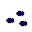

# { .sprite } Pond fish

| Stat | Value |
|---|---|
| Class | ? |
| HP | 0 |
| Max AP | 10 |
| Attack cost | 10 |
| Move cost | 10 |
| Damage | 0 |
| Attack chance | 0 |
| Block chance | 0 |
| Damage resistance | 0 |
| Critical skill | 0 |
| Critical multiplier | 0 |

## Found on

- [galmore_26](../maps/galmore_26.md)
- [galmore_27](../maps/galmore_27.md)
- [galmore_36](../maps/galmore_36.md)
- [galmore_46](../maps/galmore_46.md)
- [laerothisland0](../maps/laerothisland0.md)
- [laerothisland1](../maps/laerothisland1.md)
- [lake_shore_road_3](../maps/lake_shore_road_3.md)
- [lake_shore_road_4](../maps/lake_shore_road_4.md)
- [lake_shore_road_7](../maps/lake_shore_road_7.md)
- [lake_shore_road_8](../maps/lake_shore_road_8.md)
- [sullengard_pond](../maps/sullengard_pond.md)
- [way_to_sullengard_pond_road](../maps/way_to_sullengard_pond_road.md)

<small>Monster ID: `pond_fish` · Data from v0.8.18</small>
