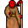

# { .sprite } Kha'zaan Porter

**Where to find Kha'zaan Porter:** [Undertell 4 00](../maps/undertell_4_00.md#pin-npc-porter)

<div class="infobox" markdown>

<p class="ib-img">{ .sprite }</p>

| | |
|---|---|
| **Type** | NPC (talk only; never fought) |
| **Found in** | Undertell 4 00 |
| **Introduced** | [v0.8.18](../versions/0.8.18.md) |

</div>

## Dialogue simulator

Set your quest stages and items, then talk to Kha'zaan Porter. Same rules as the game: same checks, same options, same effects.

<div class="dlg-sim" data-src="../../assets/dialogue/porter_selector.json" data-npc="Kha&#x27;zaan Porter" markdown="0"><noscript>The simulator needs JavaScript. The full dialogue is listed below.</noscript></div>

<p class="verified">Rules verified against v0.8.18 game code (ConversationController.java) and dialogue data.</p>

??? quote "Dialogue (26 lines)"

    *Exactly as in the game files. Each line appears once; links jump to where a choice leads.*

    <span id="d-porter_selector"></span>**`porter_selector`** *(silent check: the first matching branch below is taken)*

    - branch 1 *(if reached stage 78 of [Undertell story flags (hidden flag)](../quests/undertell_hidden.md#stage-78))* → [leave_archival_room_key_selector](#d-leave_archival_room_key_selector)
    - branch 2 *(if NOT reached stage 50 of [About a girl](../quests/about_a_girl.md#stage-50))* → [porter_no_permission_10](#d-porter_no_permission_10)
    - branch 3 *(if reached stage 50 of [About a girl](../quests/about_a_girl.md#stage-50))* → [porter_permission_10](#d-porter_permission_10)

    <span id="d-leave_archival_room_key_selector"></span>**`leave_archival_room_key_selector`** *(silent check: the first matching branch below is taken)*

    - branch 1 *(if wearing [Crown of studied defiance](../items/undertell_lgd_headgear.md))* → [porter_wearing_headgear_10](#d-porter_wearing_headgear_10)
    - branch 2 *(if carry 1× [Crown of studied defiance](../items/undertell_lgd_headgear.md))* → [porter_headgear_inventory_dc_10](#d-porter_headgear_inventory_dc_10)
    - branch 3 *(if reached stage 87 of [Undertell story flags (hidden flag)](../quests/undertell_hidden.md#stage-87))* → [porter_player_took_crown_10](#d-porter_player_took_crown_10)
    - branch 4 → [porter_player_does_not_have_crown_10](#d-porter_player_does_not_have_crown_10)

    <span id="d-porter_no_permission_10"></span>**`porter_no_permission_10`** [Kha'zaan Porter](../monsters/porter.md): “And where do you think you are headed, mortal?”

    - “[while pointing straight ahead] Through that door.” → [porter_no_permission_20](#d-porter_no_permission_20)

    <span id="d-porter_permission_10"></span>**`porter_permission_10`** [Kha'zaan Porter](../monsters/porter.md): “You may proceed, but only for what you were granted allowance for.”

    - “You serve your masters well.” → *conversation ends*

    <span id="d-porter_wearing_headgear_10"></span>**`porter_wearing_headgear_10`** [Kha'zaan Porter](../monsters/porter.md): “You should be so brazen as to walk out here wearing that. Remove it.”

    - “What?” → [porter_wearing_headgear_20](#d-porter_wearing_headgear_20)

    <span id="d-porter_headgear_inventory_dc_10"></span>**`porter_headgear_inventory_dc_10`** [Kha'zaan Porter](../monsters/porter.md): “Wait! My friend Tocsin over hear would like to make sure that you are not trying to sneak one past us.”

    - Next → [porter_headgear_inventory_10](#d-porter_headgear_inventory_10)

    <span id="d-porter_player_took_crown_10"></span>**`porter_player_took_crown_10`** [Kha'zaan Porter](../monsters/porter.md): “You moved restricted material and didn't put it back where you found it. Now go do so!”


    <span id="d-porter_player_does_not_have_crown_10"></span>**`porter_player_does_not_have_crown_10`** [Kha'zaan Porter](../monsters/porter.md): “You may proceed.” — **effects:** clears stage 86 of [Undertell story flags (hidden flag)](../quests/undertell_hidden.md#stage-86), applies condition kazaul_mortality


    <span id="d-porter_no_permission_20"></span>**`porter_no_permission_20`** Kha'zaan Porter: “I was not notified. I'm afraid that you will not be allowed to proceed.”

    - “Oh, sorry about that. I will be on my way then.” → *conversation ends*
    - “[lie] Oh, but I do have permission. One of the masters gave me permission.” *(if reached stage 5 of [Undertell story flags (hidden flag)](../quests/undertell_hidden.md#stage-5))* → [porter_no_permission_lie_10](#d-porter_no_permission_lie_10)
    - “How about some gold? Let's say one-thousand pieces?” *(if have 1,000 gold)* → [porter_no_permission_gold_10](#d-porter_no_permission_gold_10)

    <span id="d-porter_wearing_headgear_20"></span>**`porter_wearing_headgear_20`** Kha'zaan Porter: “That crown does not leave that room. Not worn. Not carried.”

    - “I am just looking at it.” → [porter_wearing_headgear_30](#d-porter_wearing_headgear_30)

    <span id="d-porter_headgear_inventory_10"></span>**`porter_headgear_inventory_10`** [Kha'zaan Porter](../monsters/porter.md): “You are carrying restricted material.”

    - “It was in the archive.” → [porter_headgear_inventory_20](#d-porter_headgear_inventory_20)

    <span id="d-porter_no_permission_lie_10"></span>**`porter_no_permission_lie_10`** Kha'zaan Porter: “Oh, which one would that be?”

    - “Umm...the really wise-looking one.” → [porter_no_permission_lie_20](#d-porter_no_permission_lie_20)

    <span id="d-porter_no_permission_gold_10"></span>**`porter_no_permission_gold_10`** Kha'zaan Porter: “Sure, if you want to give away your gold, I'll take it.”

    - “Here, take the thousand coins and move away.” *(if pay 1,000 gold)* → [porter_no_permission_gold_20](#d-porter_no_permission_gold_20)

    <span id="d-porter_wearing_headgear_30"></span>**`porter_wearing_headgear_30`** Kha'zaan Porter: “Looking was permitted. Possession was not.”

    - “Fine.” → [porter_force_return](#d-porter_force_return)

    <span id="d-porter_headgear_inventory_20"></span>**`porter_headgear_inventory_20`** Kha'zaan Porter: “Yes. That is where it remains.”

    - “So I cannot take it?” → [porter_headgear_inventory_30](#d-porter_headgear_inventory_30)

    <span id="d-porter_no_permission_lie_20"></span>**`porter_no_permission_lie_20`** Kha'zaan Porter: “Leave now before Tocsin over here has an early dinner.”

    - “Calm down! I was just kidding.” → *conversation ends*

    <span id="d-porter_no_permission_gold_20"></span>**`porter_no_permission_gold_20`** [Dummy NPC](../monsters/none.md): “The porter takes the coins and drops them into a bag behind Tocsin.”

    - Next → [porter_no_permission_gold_30](#d-porter_no_permission_gold_30)

    <span id="d-porter_force_return"></span>**`porter_force_return`** Kha'zaan Porter: “Place it back where you found it. Then you may leave.”

    - “What if I pay you to forget you saw it?” → [porter_bribe_response_10](#d-porter_bribe_response_10)
    - “Fine, I will put it back.” → *conversation ends*

    <span id="d-porter_headgear_inventory_30"></span>**`porter_headgear_inventory_30`** Kha'zaan Porter: “You can return it.”

    - “Understood.” → [porter_force_return](#d-porter_force_return)

    <span id="d-porter_no_permission_gold_30"></span>**`porter_no_permission_gold_30`** [Kha'zaan Porter](../monsters/porter.md): “Thanks a lot! Now leave and don't come back until you are proven to be allowed entry.”

    - “What!?” → [porter_no_permission_gold_40](#d-porter_no_permission_gold_40)

    <span id="d-porter_bribe_response_10"></span>**`porter_bribe_response_10`** Kha'zaan Porter: “Payment does not alter restriction.”

    - “Everyone has a price.” → [porter_bribe_response_20](#d-porter_bribe_response_20)

    <span id="d-porter_no_permission_gold_40"></span>**`porter_no_permission_gold_40`** Kha'zaan Porter: “I never said I could be bought. Go now!”


    <span id="d-porter_bribe_response_20"></span>**`porter_bribe_response_20`** Kha'zaan Porter: “Ten thousand gold.”

    - “Take it.” *(if pay 10,000 gold)* → [porter_bribe_complete](#d-porter_bribe_complete)
    - “Forget it.” → [porter_force_return](#d-porter_force_return)

    <span id="d-porter_bribe_complete"></span>**`porter_bribe_complete`** Kha'zaan Porter: “Received.”

    - “Now let me pass.” → [porter_bribe_denial](#d-porter_bribe_denial)

    <span id="d-porter_bribe_denial"></span>**`porter_bribe_denial`** Kha'zaan Porter: “No.”

    - “You said ten thousand.” → [porter_bribe_truth](#d-porter_bribe_truth)

    <span id="d-porter_bribe_truth"></span>**`porter_bribe_truth`** Kha'zaan Porter: “That was the amount.”

    - “Whatever!” → *conversation ends*


## Version history

| Version | Change |
|---|---|
| [v0.8.18](../versions/0.8.18.md) | Added<br>Dialogue: 26 lines added |

<p class="verified">Verified against v0.8.18 and every earlier release back to v0.7.0 (game data compared release by release).</p>


## Behind the scenes

*How the game data handles this character. Not needed for playing.*

??? info "Technical information"

    | | |
    |---|---|
    | Entry ID | `porter` |
    | Type (wiki) | NPC |
    | Spawn group | `porter` |
    | Loot table | – |
    | Conversation | `porter_selector` |
    | Faction | – |
    | Movement | – |
    | Icon | `monsters_ld2:199` |
    | Defined in | `res/raw/monsterlist_undertell.json` |

    Raw data:

    ```json
    {
     "id": "porter",
     "name": "Kha'zaan Porter",
     "iconID": "monsters_ld2:199",
     "monsterClass": "undead",
     "phraseID": "porter_selector"
    }
    ```


## Community notes

<small>Written by players, not generated from game data. **Observations**: what players notice in-game · **Lore**: the in-world story · **Trivia**: real-world facts, references, development history · **Theory / speculation**: unconfirmed ideas; may just be unfinished content</small>

### Observations

*No notes yet. Contributions are welcome: [add a note](https://github.com/asdfghjkl628/Andor-s-Trail-Wikiiii/new/main/notes/monsters?filename=porter.md&value=%23%23%20Observations%0A%0A%3C%21--%20what%20players%20notice%20in-game%20--%3E%0A%0A%23%23%20Lore%0A%0A%3C%21--%20the%20in-world%20story%20--%3E%0A%0A%23%23%20Trivia%0A%0A%3C%21--%20real-world%20facts%2C%20references%2C%20development%20history%20--%3E%0A%0A%23%23%20Theory%20/%20speculation%0A%0A%3C%21--%20unconfirmed%20ideas%3B%20may%20just%20be%20unfinished%20content%20--%3E%0A).*

### Lore

*No notes yet. Contributions are welcome: [add a note](https://github.com/asdfghjkl628/Andor-s-Trail-Wikiiii/new/main/notes/monsters?filename=porter.md&value=%23%23%20Observations%0A%0A%3C%21--%20what%20players%20notice%20in-game%20--%3E%0A%0A%23%23%20Lore%0A%0A%3C%21--%20the%20in-world%20story%20--%3E%0A%0A%23%23%20Trivia%0A%0A%3C%21--%20real-world%20facts%2C%20references%2C%20development%20history%20--%3E%0A%0A%23%23%20Theory%20/%20speculation%0A%0A%3C%21--%20unconfirmed%20ideas%3B%20may%20just%20be%20unfinished%20content%20--%3E%0A).*

### Trivia

*No notes yet. Contributions are welcome: [add a note](https://github.com/asdfghjkl628/Andor-s-Trail-Wikiiii/new/main/notes/monsters?filename=porter.md&value=%23%23%20Observations%0A%0A%3C%21--%20what%20players%20notice%20in-game%20--%3E%0A%0A%23%23%20Lore%0A%0A%3C%21--%20the%20in-world%20story%20--%3E%0A%0A%23%23%20Trivia%0A%0A%3C%21--%20real-world%20facts%2C%20references%2C%20development%20history%20--%3E%0A%0A%23%23%20Theory%20/%20speculation%0A%0A%3C%21--%20unconfirmed%20ideas%3B%20may%20just%20be%20unfinished%20content%20--%3E%0A).*

### Theory / speculation

*No notes yet. Contributions are welcome: [add a note](https://github.com/asdfghjkl628/Andor-s-Trail-Wikiiii/new/main/notes/monsters?filename=porter.md&value=%23%23%20Observations%0A%0A%3C%21--%20what%20players%20notice%20in-game%20--%3E%0A%0A%23%23%20Lore%0A%0A%3C%21--%20the%20in-world%20story%20--%3E%0A%0A%23%23%20Trivia%0A%0A%3C%21--%20real-world%20facts%2C%20references%2C%20development%20history%20--%3E%0A%0A%23%23%20Theory%20/%20speculation%0A%0A%3C%21--%20unconfirmed%20ideas%3B%20may%20just%20be%20unfinished%20content%20--%3E%0A).*


<small>Data from v0.8.18</small>
