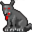

# { .sprite } Rabid hound

| Stat | Value |
|---|---|
| Class | animal |
| HP | 40 |
| Max AP | 10 |
| Attack cost | 5 |
| Move cost | 5 |
| Damage | 3 to 9 |
| Attack chance | 110 |
| Block chance | 30 |
| Damage resistance | 0 |
| Critical skill | 0 |
| Critical multiplier | 0 |

## Drops

| Item | Chance | Qty |
|---|---|---|
| [Gold coins](../items/gold.md) | 70% | 3 to 6 |
| [Glass gem](../items/gem1.md) | 5% | 1 |
| [Meat](../items/meat.md) | 30% | 1 |

## Found on

- [blackwater_mountain1](../maps/blackwater_mountain1.md)
- [guynmart](../maps/guynmart.md)
- [guynmart_wood_1](../maps/guynmart_wood_1.md)
- [guynmart_wood_12](../maps/guynmart_wood_12.md)
- [guynmart_wood_13](../maps/guynmart_wood_13.md)
- [guynmart_wood_2](../maps/guynmart_wood_2.md)
- [guynmart_wood_3](../maps/guynmart_wood_3.md)
- [guynmart_wood_9](../maps/guynmart_wood_9.md)
- [roadbeforecrossroads1](../maps/roadbeforecrossroads1.md)
- [waterwayb1](../maps/waterwayb1.md)
- [waytobrimhaven1](../maps/waytobrimhaven1.md)
- [waytobrimhaven3](../maps/waytobrimhaven3.md)
- [waytobrimhaven5](../maps/waytobrimhaven5.md)
- [waytobrimhaven6](../maps/waytobrimhaven6.md)
- [wild17](../maps/wild17.md)

<small>Monster ID: `rabid_hound` · Data from v0.8.18</small>
