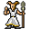

# { .sprite } Ghost

**Where to find Ghost:** [Labyrinth, Ratdom maze 648](#v-ratdom_ghost), [Labyrinth, Ratdom maze 648](#v-ratdom_ghost1), [Labyrinth, Ratdom maze 648](#v-ratdom_ghost2), [Labyrinth, Ratdom maze 648](#v-ratdom_ghost3), [Labyrinth, Ratdom maze 648](#v-ratdom_ghost4)

<div class="infobox" markdown>

<p class="ib-img">{ .sprite }</p>

| | |
|---|---|
| **Type** | Scenery (decoration or dialogue prop) |
| **Found in** | Labyrinth |
| **Introduced** | [v0.8.5](../versions/0.8.5.md) |

</div>

Not a character you meet: Ghost appears as the speaker in conversations with stepping on a trigger on [Ratdom maze 648](../maps/ratdom_maze_648.md). ~~No, you can't take it home.~~

## Labyrinth, Ratdom maze 648 { #v-ratdom_ghost }

**Where:** Labyrinth: [Ratdom maze 648](../maps/ratdom_maze_648.md)


### Version history

| Version | Change |
|---|---|
| [v0.8.5](../versions/0.8.5.md) | Added |

<p class="verified">Verified against v0.8.18 and every earlier release back to v0.7.0 (game data compared release by release).</p>


## Labyrinth, Ratdom maze 648 (2) { #v-ratdom_ghost1 }

**Where:** Labyrinth: [Ratdom maze 648](../maps/ratdom_maze_648.md)


### Version history

| Version | Change |
|---|---|
| [v0.8.5](../versions/0.8.5.md) | Added |

<p class="verified">Verified against v0.8.18 and every earlier release back to v0.7.0 (game data compared release by release).</p>


## Labyrinth, Ratdom maze 648 (3) { #v-ratdom_ghost2 }

**Where:** Labyrinth: [Ratdom maze 648](../maps/ratdom_maze_648.md)


### Version history

| Version | Change |
|---|---|
| [v0.8.5](../versions/0.8.5.md) | Added |

<p class="verified">Verified against v0.8.18 and every earlier release back to v0.7.0 (game data compared release by release).</p>


## Labyrinth, Ratdom maze 648 (4) { #v-ratdom_ghost3 }

**Where:** Labyrinth: [Ratdom maze 648](../maps/ratdom_maze_648.md)


### Version history

| Version | Change |
|---|---|
| [v0.8.5](../versions/0.8.5.md) | Added |

<p class="verified">Verified against v0.8.18 and every earlier release back to v0.7.0 (game data compared release by release).</p>


## Labyrinth, Ratdom maze 648 (5) { #v-ratdom_ghost4 }

**Where:** Labyrinth: [Ratdom maze 648](../maps/ratdom_maze_648.md)


### Version history

| Version | Change |
|---|---|
| [v0.8.5](../versions/0.8.5.md) | Added |

<p class="verified">Verified against v0.8.18 and every earlier release back to v0.7.0 (game data compared release by release).</p>


## Behind the scenes

*How the game data handles this character. Not needed for playing.*

**5 entries.** The game data defines 5 separate characters named Ghost. The game makes a new entry whenever a character needs different behaviour (another conversation later in a quest, another place, other stats). Some are the same person at different points in the story; others just share a generic name. Here they differ in: appearance.

| Entry | Type | Section |
|---|---|---|
| `ratdom_ghost` | Scenery | [Labyrinth, Ratdom maze 648](#v-ratdom_ghost) |
| `ratdom_ghost1` | Scenery | [Labyrinth, Ratdom maze 648](#v-ratdom_ghost1) |
| `ratdom_ghost2` | Scenery | [Labyrinth, Ratdom maze 648](#v-ratdom_ghost2) |
| `ratdom_ghost3` | Scenery | [Labyrinth, Ratdom maze 648](#v-ratdom_ghost3) |
| `ratdom_ghost4` | Scenery | [Labyrinth, Ratdom maze 648](#v-ratdom_ghost4) |

- `ratdom_ghost` has no conversation and no combat statistics. Other conversations use it as their speaker (the `switchToNPC` field), which is how its name and picture appear in dialogue. The game data also places it on Labyrinth: [Ratdom maze 648](../maps/ratdom_maze_648.md).
- `ratdom_ghost1` has no conversation and no combat statistics. It is a decoration, an animal or a figure in a scripted scene.
- `ratdom_ghost2` has no conversation and no combat statistics. It is a decoration, an animal or a figure in a scripted scene.
- `ratdom_ghost3` has no conversation and no combat statistics. It is a decoration, an animal or a figure in a scripted scene.
- `ratdom_ghost4` has no conversation and no combat statistics. It is a decoration, an animal or a figure in a scripted scene.

??? info "Technical information: ratdom_ghost"

    | | |
    |---|---|
    | Entry ID | `ratdom_ghost` |
    | Type (wiki) | Scenery |
    | Spawn group | `ratdom_ghost` |
    | Loot table | – |
    | Conversation | – |
    | Faction | – |
    | Movement | – |
    | Icon | `monsters_tometik2:65` |
    | Defined in | `res/raw/monsterlist_ratdom.json` |

    Raw data:

    ```json
    {
     "id": "ratdom_ghost",
     "name": "Ghost",
     "iconID": "monsters_tometik2:65",
     "moveCost": 5,
     "spawnGroup": "ratdom_ghost"
    }
    ```

??? info "Technical information: ratdom_ghost1"

    | | |
    |---|---|
    | Entry ID | `ratdom_ghost1` |
    | Type (wiki) | Scenery |
    | Spawn group | `ratdom_ghost3` |
    | Loot table | – |
    | Conversation | – |
    | Faction | – |
    | Movement | – |
    | Icon | `monsters_tometik2:65` |
    | Defined in | `res/raw/monsterlist_ratdom.json` |

    Raw data:

    ```json
    {
     "id": "ratdom_ghost1",
     "name": "Ghost",
     "iconID": "monsters_tometik2:65",
     "moveCost": 5,
     "spawnGroup": "ratdom_ghost3"
    }
    ```

??? info "Technical information: ratdom_ghost2"

    | | |
    |---|---|
    | Entry ID | `ratdom_ghost2` |
    | Type (wiki) | Scenery |
    | Spawn group | `ratdom_ghost1` |
    | Loot table | – |
    | Conversation | – |
    | Faction | – |
    | Movement | – |
    | Icon | `monsters_tometik8:24` |
    | Defined in | `res/raw/monsterlist_ratdom.json` |

    Raw data:

    ```json
    {
     "id": "ratdom_ghost2",
     "name": "Ghost",
     "iconID": "monsters_tometik8:24",
     "moveCost": 5,
     "spawnGroup": "ratdom_ghost1"
    }
    ```

??? info "Technical information: ratdom_ghost3"

    | | |
    |---|---|
    | Entry ID | `ratdom_ghost3` |
    | Type (wiki) | Scenery |
    | Spawn group | `ratdom_ghost3` |
    | Loot table | – |
    | Conversation | – |
    | Faction | – |
    | Movement | – |
    | Icon | `monsters_tometik8:50` |
    | Defined in | `res/raw/monsterlist_ratdom.json` |

    Raw data:

    ```json
    {
     "id": "ratdom_ghost3",
     "name": "Ghost",
     "iconID": "monsters_tometik8:50",
     "moveCost": 5,
     "spawnGroup": "ratdom_ghost3"
    }
    ```

??? info "Technical information: ratdom_ghost4"

    | | |
    |---|---|
    | Entry ID | `ratdom_ghost4` |
    | Type (wiki) | Scenery |
    | Spawn group | `ratdom_ghost4` |
    | Loot table | – |
    | Conversation | – |
    | Faction | – |
    | Movement | – |
    | Icon | `monsters_wraiths:0` |
    | Defined in | `res/raw/monsterlist_ratdom.json` |

    Raw data:

    ```json
    {
     "id": "ratdom_ghost4",
     "name": "Ghost",
     "iconID": "monsters_wraiths:0",
     "moveCost": 5,
     "spawnGroup": "ratdom_ghost4"
    }
    ```


## Community notes

<small>Written by players, not generated from game data. **Observations**: what players notice in-game · **Lore**: the in-world story · **Trivia**: real-world facts, references, development history · **Theory / speculation**: unconfirmed ideas; may just be unfinished content</small>

### Observations

*No notes yet. Contributions are welcome: [add a note](https://github.com/asdfghjkl628/Andor-s-Trail-Wikiiii/new/main/notes/monsters?filename=ratdom_ghost.md&value=%23%23%20Observations%0A%0A%3C%21--%20what%20players%20notice%20in-game%20--%3E%0A%0A%23%23%20Lore%0A%0A%3C%21--%20the%20in-world%20story%20--%3E%0A%0A%23%23%20Trivia%0A%0A%3C%21--%20real-world%20facts%2C%20references%2C%20development%20history%20--%3E%0A%0A%23%23%20Theory%20/%20speculation%0A%0A%3C%21--%20unconfirmed%20ideas%3B%20may%20just%20be%20unfinished%20content%20--%3E%0A).*

### Lore

*No notes yet. Contributions are welcome: [add a note](https://github.com/asdfghjkl628/Andor-s-Trail-Wikiiii/new/main/notes/monsters?filename=ratdom_ghost.md&value=%23%23%20Observations%0A%0A%3C%21--%20what%20players%20notice%20in-game%20--%3E%0A%0A%23%23%20Lore%0A%0A%3C%21--%20the%20in-world%20story%20--%3E%0A%0A%23%23%20Trivia%0A%0A%3C%21--%20real-world%20facts%2C%20references%2C%20development%20history%20--%3E%0A%0A%23%23%20Theory%20/%20speculation%0A%0A%3C%21--%20unconfirmed%20ideas%3B%20may%20just%20be%20unfinished%20content%20--%3E%0A).*

### Trivia

*No notes yet. Contributions are welcome: [add a note](https://github.com/asdfghjkl628/Andor-s-Trail-Wikiiii/new/main/notes/monsters?filename=ratdom_ghost.md&value=%23%23%20Observations%0A%0A%3C%21--%20what%20players%20notice%20in-game%20--%3E%0A%0A%23%23%20Lore%0A%0A%3C%21--%20the%20in-world%20story%20--%3E%0A%0A%23%23%20Trivia%0A%0A%3C%21--%20real-world%20facts%2C%20references%2C%20development%20history%20--%3E%0A%0A%23%23%20Theory%20/%20speculation%0A%0A%3C%21--%20unconfirmed%20ideas%3B%20may%20just%20be%20unfinished%20content%20--%3E%0A).*

### Theory / speculation

*No notes yet. Contributions are welcome: [add a note](https://github.com/asdfghjkl628/Andor-s-Trail-Wikiiii/new/main/notes/monsters?filename=ratdom_ghost.md&value=%23%23%20Observations%0A%0A%3C%21--%20what%20players%20notice%20in-game%20--%3E%0A%0A%23%23%20Lore%0A%0A%3C%21--%20the%20in-world%20story%20--%3E%0A%0A%23%23%20Trivia%0A%0A%3C%21--%20real-world%20facts%2C%20references%2C%20development%20history%20--%3E%0A%0A%23%23%20Theory%20/%20speculation%0A%0A%3C%21--%20unconfirmed%20ideas%3B%20may%20just%20be%20unfinished%20content%20--%3E%0A).*


<small>Data from v0.8.18</small>
