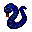

# { .sprite } Nasty cave snake

| Stat | Value |
|---|---|
| Class | reptile |
| HP | 30 |
| Max AP | 10 |
| Attack cost | 5 |
| Move cost | 10 |
| Damage | 5 |
| Attack chance | 110 |
| Block chance | 20 |
| Damage resistance | 0 |
| Critical skill | 40 |
| Critical multiplier | 2.0 |

## On hit

- **On target:** Weak Poison (magnitude 1, 3 rounds, 10% chance)

## Drops

| Item | Chance | Qty |
|---|---|---|
| [Gold coins](../items/gold.md) | 70% | 3 to 6 |
| [Meat](../items/meat.md) | 30% | 1 |
| [Poison gland](../items/gland.md) | 5% | 1 |

## Found on

- [ratdom_maze_525](../maps/ratdom_maze_525.md)
- [ratdom_maze_526](../maps/ratdom_maze_526.md)
- [ratdom_maze_537](../maps/ratdom_maze_537.md)
- [ratdom_maze_547](../maps/ratdom_maze_547.md)
- [ratdom_maze_635](../maps/ratdom_maze_635.md)
- [ratdom_maze_636](../maps/ratdom_maze_636.md)
- [ratdom_maze_644](../maps/ratdom_maze_644.md)
- [ratdom_maze_645](../maps/ratdom_maze_645.md)
- [ratdom_maze_655](../maps/ratdom_maze_655.md)
- [ratdom_maze_664](../maps/ratdom_maze_664.md)

<small>Monster ID: `ratdom_m3b` · Data from v0.8.18</small>
