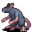

# { .sprite } Gruiik

<div class="infobox" markdown>

<p class="ib-img">{ .sprite }</p>

| | |
|---|---|
| **Monster ID** | `ratdom_mikhail` |
| **Type** | NPC |
| **Class** | ? |
| **HP** | 1 |
| **Found in** | Crossglen |
| **Introduced** | [v0.8.5](../versions/0.8.5.md) |

</div>

## Combat stats

| Stat | Value |
|---|---|
| HP | 1 |
| Damage | 0 |
| Attack chance | 0 |
| Block chance | 0 |
| Damage resistance | 0 |
| Max AP | 10 |
| Attack cost | 10 AP |
| Attacks per turn | 1 |
| Move cost | 10 AP |
| Critical skill | 0 |
| Critical multiplier | – |
| Crit chance | none (needs critical skill and a multiplier) |

**XP formula** (from the game's loader): ⌈(attacks per turn × attack chance × average damage × (1 + critical skill × multiplier) × 3 + HP × (1 + block chance) + 9 × damage resistance) × 0.7⌉, +50 if its hits inflict a condition. More Exp adds a percentage on top.

<p class="verified">Verified against v0.8.18 monster data and game code (`MonsterTypeParser.java`).</p>


## Locations

| Map | Region | Up to | Notes |
|---|---|---|---|
| [home](../maps/home.md) | Crossglen | 1 | appears later in a quest |


## Quests

- [More rats!](../quests/ratdom_mikhail.md): stages 10, 20, 52, 54, 70, 74, 90

## Dialogue simulator

Set up your situation (quest stages, items, kills…), then talk to Gruiik. The simulator follows the game's own rules: it takes the same silent checks, offers only the options you'd really see, and applies their effects (quest stages, items handed over, rewards) as you go.

<div class="dlg-sim" data-src="../../assets/dialogue/ratdom_mikhail.json" data-npc="Gruiik" markdown="0"><noscript>The simulator needs JavaScript. The full dialogue is listed below.</noscript></div>

<p class="verified">Rules verified against v0.8.18 game code (ConversationController.java) and dialogue data.</p>

??? quote "Dialogue (16 lines)"

    *What the dialogue says, exactly as in the game files. Lines are listed once; links jump to the line a choice leads to.*

    <span id="d-ratdom_mikhail"></span>**`ratdom_mikhail`** *(silent check: the first matching branch below is taken)*

    - branch 1 *(if reached stage 90 of [More rats!](../quests/ratdom_mikhail.md#stage-90))* → [ratdom_mikhail_90](#d-ratdom_mikhail_90)
    - branch 2 *(if reached stage 20 of [More rats!](../quests/ratdom_mikhail.md#stage-20); NOT reached stage 52 of [More rats!](../quests/ratdom_mikhail.md#stage-52); NOT reached stage 54 of [More rats!](../quests/ratdom_mikhail.md#stage-54))* → [ratdom_mikhail_50](#d-ratdom_mikhail_50)
    - branch 3 *(if reached stage 20 of [More rats!](../quests/ratdom_mikhail.md#stage-20); NOT reached stage 70 of [More rats!](../quests/ratdom_mikhail.md#stage-70))* → [ratdom_mikhail_10_10](#d-ratdom_mikhail_10_10)
    - branch 4 *(if reached stage 70 of [More rats!](../quests/ratdom_mikhail.md#stage-70))* → [ratdom_mikhail_70](#d-ratdom_mikhail_70)
    - branch 5 → [ratdom_mikhail_01](#d-ratdom_mikhail_01)

    <span id="d-ratdom_mikhail_90"></span>**`ratdom_mikhail_90`** [Dummy NPC](../monsters/none.md): “The huge rat ignores you now.”


    <span id="d-ratdom_mikhail_50"></span>**`ratdom_mikhail_50`** Gruiik: “Is my garden clean of filthy two-legs again?”

    - “No, not yet” → *conversation ends*
    - “Yes, I killed Mara and Tharal in the garden for you.” *(if killed 1× [Mara](../monsters/ratdom_mara.md); killed 1× [Tharal](../monsters/ratdom_tharal.md))* → [ratdom_mikhail_50_2](#d-ratdom_mikhail_50_2)
    - “(lie) I killed Mara and Tharal in the garden for you.” *(if NOT killed 1× [Mara](../monsters/ratdom_mara.md); killed 1× [Tharal](../monsters/ratdom_tharal.md))* → [ratdom_mikhail_50_4](#d-ratdom_mikhail_50_4)
    - “(lie) I killed Mara and Tharal in the garden for you.” *(if killed 1× [Mara](../monsters/ratdom_mara.md); NOT killed 1× [Tharal](../monsters/ratdom_tharal.md))* → [ratdom_mikhail_50_4](#d-ratdom_mikhail_50_4)
    - “(lie) I killed Mara and Tharal in the garden for you.” *(if NOT killed 1× [Mara](../monsters/ratdom_mara.md); NOT killed 1× [Tharal](../monsters/ratdom_tharal.md))* → [ratdom_mikhail_50_4](#d-ratdom_mikhail_50_4)

    <span id="d-ratdom_mikhail_10_10"></span>**`ratdom_mikhail_10_10`** Gruiik: “And I am hungry. Go to the town hall and bring me some bread.” — **effects:** sets stage 70 of [More rats!](../quests/ratdom_mikhail.md#stage-70)

    - “OK.” → *conversation ends*
    - “Forget it.” → *conversation ends*
    - “Here I have some bread for you.” *(if hand over 1× [Bread](../items/bread.md))* → [ratdom_mikhail_10_20](#d-ratdom_mikhail_10_20)

    <span id="d-ratdom_mikhail_70"></span>**`ratdom_mikhail_70`** Gruiik: “Where is my bread? Why does it need to take so long?”

    - “Just a minute.” → *conversation ends*
    - “Forget it.” → *conversation ends*
    - “Here I have some bread for you.” *(if hand over 1× [Bread](../items/bread.md))* → [ratdom_mikhail_74](#d-ratdom_mikhail_74)
    - “Hey - I have brought some bread already.” *(if reached stage 74 of [More rats!](../quests/ratdom_mikhail.md#stage-74))* → [ratdom_mikhail_80](#d-ratdom_mikhail_80)

    <span id="d-ratdom_mikhail_01"></span>**`ratdom_mikhail_01`** Gruiik: “Good. You are awake at last.”

    - “A rat? Here?” → [ratdom_mikhail_02](#d-ratdom_mikhail_02)

    <span id="d-ratdom_mikhail_50_2"></span>**`ratdom_mikhail_50_2`** *(silent check: the first matching branch below is taken)* — **effects:** sets stage 52 of [More rats!](../quests/ratdom_mikhail.md#stage-52)

    - branch 1 → [ratdom_mikhail_50_10](#d-ratdom_mikhail_50_10)

    <span id="d-ratdom_mikhail_50_4"></span>**`ratdom_mikhail_50_4`** *(silent check: the first matching branch below is taken)* — **effects:** sets stage 54 of [More rats!](../quests/ratdom_mikhail.md#stage-54)

    - branch 1 → [ratdom_mikhail_50_10](#d-ratdom_mikhail_50_10)

    <span id="d-ratdom_mikhail_10_20"></span>**`ratdom_mikhail_10_20`** Gruiik: “It's about time.” — **effects:** sets stage 74 of [More rats!](../quests/ratdom_mikhail.md#stage-74)

    - “What - no thanks? Rats.” → *conversation ends*

    <span id="d-ratdom_mikhail_74"></span>**`ratdom_mikhail_74`** *(silent check: the first matching branch below is taken)* — **effects:** sets stage 74 of [More rats!](../quests/ratdom_mikhail.md#stage-74)

    - branch 1 *(if reached stage 52 of [More rats!](../quests/ratdom_mikhail.md#stage-52))* → [ratdom_mikhail_80](#d-ratdom_mikhail_80)
    - branch 2 *(if reached stage 54 of [More rats!](../quests/ratdom_mikhail.md#stage-54))* → [ratdom_mikhail_80](#d-ratdom_mikhail_80)
    - branch 3 → [ratdom_mikhail_10_20](#d-ratdom_mikhail_10_20)

    <span id="d-ratdom_mikhail_80"></span>**`ratdom_mikhail_80`** Gruiik: “Good! Now I don't need you anymore!” — **effects:** sets stage 90 of [More rats!](../quests/ratdom_mikhail.md#stage-90)

    - “OK.” → *conversation ends*
    - “I would have gone anyway.” → *conversation ends*

    <span id="d-ratdom_mikhail_02"></span>**`ratdom_mikhail_02`** Gruiik: “As you see. Did you find your brother Andor already? He hasn't been back home for a while now.”

    - “Eh, what? No, I am still looking for Andor.” → [ratdom_mikhail_03](#d-ratdom_mikhail_03)

    <span id="d-ratdom_mikhail_50_10"></span>**`ratdom_mikhail_50_10`** *(silent check: the first matching branch below is taken)*

    - branch 1 *(if NOT reached stage 70 of [More rats!](../quests/ratdom_mikhail.md#stage-70))* → [ratdom_mikhail_10_10](#d-ratdom_mikhail_10_10)
    - branch 2 *(if NOT reached stage 74 of [More rats!](../quests/ratdom_mikhail.md#stage-74))* → [ratdom_mikhail_70](#d-ratdom_mikhail_70)
    - branch 3 → [ratdom_mikhail_80](#d-ratdom_mikhail_80)

    <span id="d-ratdom_mikhail_03"></span>**`ratdom_mikhail_03`** Gruiik: “I should have guessed. Anyway.”

    - “What are you doing in my house? Where is Mikhail?” → [ratdom_mikhail_04](#d-ratdom_mikhail_04)

    <span id="d-ratdom_mikhail_04"></span>**`ratdom_mikhail_04`** Gruiik: “We rats took over this village. I am Gruiik, their leader.” — **effects:** sets stage 10 of [More rats!](../quests/ratdom_mikhail.md#stage-10)

    - Next → [ratdom_mikhail_10](#d-ratdom_mikhail_10)

    <span id="d-ratdom_mikhail_10"></span>**`ratdom_mikhail_10`** Gruiik: “However, there are two-legs running around in my garden again. Go and kill them.” — **effects:** sets stage 20 of [More rats!](../quests/ratdom_mikhail.md#stage-20)

    - “I'll have a look.” → [ratdom_mikhail_10_10](#d-ratdom_mikhail_10_10)
    - “I would never do that!” → [ratdom_mikhail_10_10](#d-ratdom_mikhail_10_10)


## Version history

| Version | Change |
|---|---|
| [v0.8.5](../versions/0.8.5.md) | Added<br>Dialogue: 16 lines added |
| [v0.8.6.1](../versions/0.8.6.1.md) | Dialogue: 3 lines changed |

<p class="verified">Verified against v0.8.18 and every earlier release back to v0.7.0 (game data compared release by release).</p>


## Community notes

<small>Written by players, not generated from game data. **Observations**: what players notice in-game · **Lore**: the in-world story · **Trivia**: real-world facts, references, development history · **Theory / speculation**: unconfirmed ideas; may just be unfinished content</small>

### Observations

*Nothing here yet. Know something? [Add it](https://github.com/asdfghjkl628/Andor-s-Trail-Wikiiii/new/main/notes/monsters?filename=ratdom_mikhail.md&value=%23%23%20Observations%0A%0A%3C%21--%20what%20players%20notice%20in-game%20--%3E%0A%0A%23%23%20Lore%0A%0A%3C%21--%20the%20in-world%20story%20--%3E%0A%0A%23%23%20Trivia%0A%0A%3C%21--%20real-world%20facts%2C%20references%2C%20development%20history%20--%3E%0A%0A%23%23%20Theory%20/%20speculation%0A%0A%3C%21--%20unconfirmed%20ideas%3B%20may%20just%20be%20unfinished%20content%20--%3E%0A).*

### Lore

*Nothing here yet. Know something? [Add it](https://github.com/asdfghjkl628/Andor-s-Trail-Wikiiii/new/main/notes/monsters?filename=ratdom_mikhail.md&value=%23%23%20Observations%0A%0A%3C%21--%20what%20players%20notice%20in-game%20--%3E%0A%0A%23%23%20Lore%0A%0A%3C%21--%20the%20in-world%20story%20--%3E%0A%0A%23%23%20Trivia%0A%0A%3C%21--%20real-world%20facts%2C%20references%2C%20development%20history%20--%3E%0A%0A%23%23%20Theory%20/%20speculation%0A%0A%3C%21--%20unconfirmed%20ideas%3B%20may%20just%20be%20unfinished%20content%20--%3E%0A).*

### Trivia

*Nothing here yet. Know something? [Add it](https://github.com/asdfghjkl628/Andor-s-Trail-Wikiiii/new/main/notes/monsters?filename=ratdom_mikhail.md&value=%23%23%20Observations%0A%0A%3C%21--%20what%20players%20notice%20in-game%20--%3E%0A%0A%23%23%20Lore%0A%0A%3C%21--%20the%20in-world%20story%20--%3E%0A%0A%23%23%20Trivia%0A%0A%3C%21--%20real-world%20facts%2C%20references%2C%20development%20history%20--%3E%0A%0A%23%23%20Theory%20/%20speculation%0A%0A%3C%21--%20unconfirmed%20ideas%3B%20may%20just%20be%20unfinished%20content%20--%3E%0A).*

### Theory / speculation

*Nothing here yet. Know something? [Add it](https://github.com/asdfghjkl628/Andor-s-Trail-Wikiiii/new/main/notes/monsters?filename=ratdom_mikhail.md&value=%23%23%20Observations%0A%0A%3C%21--%20what%20players%20notice%20in-game%20--%3E%0A%0A%23%23%20Lore%0A%0A%3C%21--%20the%20in-world%20story%20--%3E%0A%0A%23%23%20Trivia%0A%0A%3C%21--%20real-world%20facts%2C%20references%2C%20development%20history%20--%3E%0A%0A%23%23%20Theory%20/%20speculation%0A%0A%3C%21--%20unconfirmed%20ideas%3B%20may%20just%20be%20unfinished%20content%20--%3E%0A).*


??? info "Technical information"

    | | |
    |---|---|
    | Monster ID | `ratdom_mikhail` |
    | Spawn group | `ratdom_mikhail` |
    | Loot table | – |
    | Conversation | `ratdom_mikhail` |
    | Faction | – |
    | Movement | – |
    | Icon | `monsters_rats:3` |
    | Defined in | `res/raw/monsterlist_ratdom.json` |

    Raw data:

    ```json
    {
     "id": "ratdom_mikhail",
     "name": "Gruiik",
     "iconID": "monsters_rats:3",
     "unique": 1,
     "phraseID": "ratdom_mikhail"
    }
    ```


<small>Data from v0.8.18</small>
