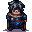

# { .sprite } Andor's statue

| Stat | Value |
|---|---|
| Class | humanoid |
| HP | 90 |
| Max AP | 10 |
| Attack cost | 99 |
| Move cost | 5 |
| Damage | 1 to 4 |
| Attack chance | 60 |
| Block chance | 40 |
| Damage resistance | 0 |
| Critical skill | 0 |
| Critical multiplier | 0 |

## Drops

| Item | Chance | Qty |
|---|---|---|
| [Bread](../items/bread.md) | 100% | 1 to 2 |

## Found on

- [crossglen_cave](../maps/crossglen_cave.md)

## Quests

- [Yellow is it](../quests/ratdom_quest.md): stages 60, 80

## Dialogue simulator

Set up your situation (quest stages, items, kills…), then talk to Andor's statue. The simulator follows the game's own rules: it takes the same silent checks, offers only the options you'd really see, and applies their effects (quest stages, items handed over, rewards) as you go.

<noscript>The simulator needs JavaScript. The full dialogue is listed below.</noscript>

Rules verified against v0.8.18 game code (ConversationController.java) and dialogue data.

??? quote "Dialogue (4 lines)"

    *What the dialogue says, exactly as in the game files. Lines are listed once; links jump to the line a choice leads to.*

    **`ratdom_rat_statue`** *(silent check: the first matching branch below is taken)*

    - branch 1 *(if wearing [Pickhatchet](../items/ratdom_pickaxe.md))* → *fight starts*
    - branch 2 *(if reached stage 82 of [Yellow is it](../quests/ratdom_quest.md#stage-82))* → [ratdom_rat_statue_40](#d-ratdom_rat_statue_40)
    - branch 3 *(if reached stage 70 of [Yellow is it](../quests/ratdom_quest.md#stage-70))* → [ratdom_rat_statue_30](#d-ratdom_rat_statue_30)
    - branch 4 → [ratdom_rat_statue_20](#d-ratdom_rat_statue_20)

    **`ratdom_rat_statue_40`** [Clevred](../monsters/ratdom_rat.md): “When will you finally try to use the pickaxe?”

    **`ratdom_rat_statue_30`** [Clevred](../monsters/ratdom_rat.md): “Andor's statue may be cleared away with a pickaxe. Hadn't I mentioned it?” — **effects:** sets stage 80 of [Yellow is it](../quests/ratdom_quest.md#stage-80)

    **`ratdom_rat_statue_20`** [Dummy NPC](../monsters/none.md): “You see a beautifully crafted statue of your brother Andor.” — **effects:** sets stage 60 of [Yellow is it](../quests/ratdom_quest.md#stage-60)

## Version history

| Version | Change |
|---|---|
| [v0.8.5](../versions/0.8.5.md) | Added Dialogue: 4 lines added |

Verified against v0.8.18 and every earlier release back to v0.7.0 (game data compared release by release).

## Community notes

<small>Written by players, not generated from game data. **Observations**: what players notice in-game · **Lore**: the in-world story · **Trivia**: real-world facts, references, development history · **Theory / speculation**: unconfirmed ideas; may just be unfinished content</small>

### Observations

*Nothing here yet. Know something? [Add it](https://github.com/asdfghjkl628/Andor-s-Trail-Wikiiii/new/main/notes/monsters?filename=ratdom_rat_statue.md&value=%23%23%20Observations%0A%0A%3C%21--%20what%20players%20notice%20in-game%20--%3E%0A%0A%23%23%20Lore%0A%0A%3C%21--%20the%20in-world%20story%20--%3E%0A%0A%23%23%20Trivia%0A%0A%3C%21--%20real-world%20facts%2C%20references%2C%20development%20history%20--%3E%0A%0A%23%23%20Theory%20/%20speculation%0A%0A%3C%21--%20unconfirmed%20ideas%3B%20may%20just%20be%20unfinished%20content%20--%3E%0A).*

### Lore

*Nothing here yet. Know something? [Add it](https://github.com/asdfghjkl628/Andor-s-Trail-Wikiiii/new/main/notes/monsters?filename=ratdom_rat_statue.md&value=%23%23%20Observations%0A%0A%3C%21--%20what%20players%20notice%20in-game%20--%3E%0A%0A%23%23%20Lore%0A%0A%3C%21--%20the%20in-world%20story%20--%3E%0A%0A%23%23%20Trivia%0A%0A%3C%21--%20real-world%20facts%2C%20references%2C%20development%20history%20--%3E%0A%0A%23%23%20Theory%20/%20speculation%0A%0A%3C%21--%20unconfirmed%20ideas%3B%20may%20just%20be%20unfinished%20content%20--%3E%0A).*

### Trivia

*Nothing here yet. Know something? [Add it](https://github.com/asdfghjkl628/Andor-s-Trail-Wikiiii/new/main/notes/monsters?filename=ratdom_rat_statue.md&value=%23%23%20Observations%0A%0A%3C%21--%20what%20players%20notice%20in-game%20--%3E%0A%0A%23%23%20Lore%0A%0A%3C%21--%20the%20in-world%20story%20--%3E%0A%0A%23%23%20Trivia%0A%0A%3C%21--%20real-world%20facts%2C%20references%2C%20development%20history%20--%3E%0A%0A%23%23%20Theory%20/%20speculation%0A%0A%3C%21--%20unconfirmed%20ideas%3B%20may%20just%20be%20unfinished%20content%20--%3E%0A).*

### Theory / speculation

*Nothing here yet. Know something? [Add it](https://github.com/asdfghjkl628/Andor-s-Trail-Wikiiii/new/main/notes/monsters?filename=ratdom_rat_statue.md&value=%23%23%20Observations%0A%0A%3C%21--%20what%20players%20notice%20in-game%20--%3E%0A%0A%23%23%20Lore%0A%0A%3C%21--%20the%20in-world%20story%20--%3E%0A%0A%23%23%20Trivia%0A%0A%3C%21--%20real-world%20facts%2C%20references%2C%20development%20history%20--%3E%0A%0A%23%23%20Theory%20/%20speculation%0A%0A%3C%21--%20unconfirmed%20ideas%3B%20may%20just%20be%20unfinished%20content%20--%3E%0A).*

<small>Monster ID: `ratdom_rat_statue` · Data from v0.8.18</small>
