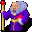

# { .sprite } Wart

<div class="infobox" markdown>

<p class="ib-img">{ .sprite }</p>

| | |
|---|---|
| **Monster ID** | `ratdom_rat_warden2` |
| **Type** | Shopkeeper |
| **Class** | ? |
| **HP** | 1 |
| **Found in** | Museum |
| **Introduced** | [v0.8.5](../versions/0.8.5.md) |

</div>

## Combat stats

| Stat | Value |
|---|---|
| HP | 1 |
| Damage | 0 |
| Attack chance | 0 |
| Block chance | 0 |
| Damage resistance | 0 |
| Max AP | 10 |
| Attack cost | 10 AP |
| Attacks per turn | 1 |
| Move cost | 10 AP |
| Critical skill | 0 |
| Critical multiplier | – |
| Crit chance | none (needs critical skill and a multiplier) |

**XP formula** (from the game's loader): ⌈(attacks per turn × attack chance × average damage × (1 + critical skill × multiplier) × 3 + HP × (1 + block chance) + 9 × damage resistance) × 0.7⌉, +50 if its hits inflict a condition. More Exp adds a percentage on top.

<p class="verified">Verified against v0.8.18 monster data and game code (`MonsterTypeParser.java`).</p>


## Shop stock

| Item | Chance | Qty |
|---|---|---|
| [Orange rat necklace](../items/ratdom_compass_tour.md) | 100% | 5 |
| [Gold coins](../items/gold.md) | 100% | 1 to 5 |

## Locations

| Map | Region | Up to | Notes |
|---|---|---|---|
| [ratdom_maze_515](../maps/ratdom_maze_515.md) | Museum | 1 | – |


## Quests

- [Yellow is it](../quests/ratdom_quest.md): stages 395

## Dialogue simulator

Set up your situation (quest stages, items, kills…), then talk to Wart. The simulator follows the game's own rules: it takes the same silent checks, offers only the options you'd really see, and applies their effects (quest stages, items handed over, rewards) as you go.

<div class="dlg-sim" data-src="../../assets/dialogue/ratdom_rat_warden2.json" data-npc="Wart" markdown="0"><noscript>The simulator needs JavaScript. The full dialogue is listed below.</noscript></div>

<p class="verified">Rules verified against v0.8.18 game code (ConversationController.java) and dialogue data.</p>

??? quote "Dialogue (17 lines)"

    *What the dialogue says, exactly as in the game files. Lines are listed once; links jump to the line a choice leads to.*

    <span id="d-ratdom_rat_warden2"></span>**`ratdom_rat_warden2`** Wart: “Welcome to our great rat memory hall! Shall I tell you something about our great expositions?”

    - “Thank you, I'll find my way.” → *conversation ends*
    - “Why is here an empty pedestal?” *(if NOT reached stage 130 of [ratdom_nondisplay (hidden flag)](../quests/ratdom_nondisplay.md#stage-130))* → [ratdom_rat_warden2_r_1](#d-ratdom_rat_warden2_r_1)
    - “I want to visit Fraedro.” *(if NOT reached stage 130 of [Yellow is it](../quests/ratdom_quest.md#stage-130))* → [ratdom_rat_warden2_r_14](#d-ratdom_rat_warden2_r_14)
    - “Do you have anything for sale?” → *shop opens*
    - “Please give me back my cheese.” *(if faction “ratdom_rat_cheese1” ≥ 1)* → [ratdom_rat_warden2_cheese](#d-ratdom_rat_warden2_cheese)
    - “Please give me back my delicious Charwood cheddar.” *(if NOT faction “ratdom_rat_cheese1” ≥ 1; faction “ratdom_rat_cheese2” ≥ 1)* → [ratdom_rat_warden2_cheese](#d-ratdom_rat_warden2_cheese)
    - “Please give me back my moldy blue cheese.” *(if NOT faction “ratdom_rat_cheese1” ≥ 1; NOT faction “ratdom_rat_cheese2” ≥ 1; faction “ratdom_rat_cheese3” ≥ 1)* → [ratdom_rat_warden2_cheese](#d-ratdom_rat_warden2_cheese)
    - “Please give me back my goat cheese.” *(if NOT faction “ratdom_rat_cheese1” ≥ 1; NOT faction “ratdom_rat_cheese2” ≥ 1; NOT faction “ratdom_rat_cheese3” ≥ 1; faction “ratdom_rat_cheese4” ≥ 1)* → [ratdom_rat_warden2_cheese](#d-ratdom_rat_warden2_cheese)

    <span id="d-ratdom_rat_warden2_r_1"></span>**`ratdom_rat_warden2_r_1`** Wart: “Here stood the statue of King Rah. I told you about it.”

    - Next → [ratdom_rat_warden2_r_2](#d-ratdom_rat_warden2_r_2)

    <span id="d-ratdom_rat_warden2_r_14"></span>**`ratdom_rat_warden2_r_14`** Wart: “For security reasons, we don't let anyone talk with Fraedro until he finally admits everything.”

    - “I did find the skeleton. Can Fraedro be released now?” → [ratdom_rat_warden2_r_15](#d-ratdom_rat_warden2_r_15)
    - “Can I speak to Fraedro? Maybe he regrets what he did and wouldn't do it again.” *(if NOT reached stage 390 of [Yellow is it](../quests/ratdom_quest.md#stage-390))* → [ratdom_rat_warden2_r_16](#d-ratdom_rat_warden2_r_16)
    - “I don't think it was Fraedro.” → [ratdom_rat_warden2_r_17](#d-ratdom_rat_warden2_r_17)

    <span id="d-ratdom_rat_warden2_cheese"></span>**`ratdom_rat_warden2_cheese`** Wart: “Sure. Let's go outside.” — **effects:** spawns monsters on ratdom_maze_624


    <span id="d-ratdom_rat_warden2_r_2"></span>**`ratdom_rat_warden2_r_2`** Wart: “Thank you for bringing the bones back to me. But I still have to put them back together.”

    - Next → [ratdom_rat_warden2_r_3](#d-ratdom_rat_warden2_r_3)

    <span id="d-ratdom_rat_warden2_r_15"></span>**`ratdom_rat_warden2_r_15`** Wart: “Of course not. He would steal the bones just one more time.”

    - “You have a sad opinion of your fellow rats.” → [ratdom_rat_warden2_r_15a](#d-ratdom_rat_warden2_r_15a)
    - “Can I speak to Fraedro? Maybe he regrets what he did and wouldn't do it again.” → [ratdom_rat_warden2_r_16](#d-ratdom_rat_warden2_r_16)

    <span id="d-ratdom_rat_warden2_r_16"></span>**`ratdom_rat_warden2_r_16`** Wart: “No, you can't speak to Fraedro. It is too dangerous.”

    - “Well, I have 100 gold pieces here. Can I speak to Fraedro?” *(if have 100 gold)* → [ratdom_rat_warden2_r_16a](#d-ratdom_rat_warden2_r_16a)
    - “I would like to offer him 100 gold pieces to let me through, but I don't have enough with me.” *(if NOT have 100 gold)* → *conversation ends*
    - “Maybe it wasn't Fraedro after all?” → [ratdom_rat_warden2_r_17](#d-ratdom_rat_warden2_r_17)
    - “Alright, I think I'll take a look at the rest of the exhibition now.” → *conversation ends*

    <span id="d-ratdom_rat_warden2_r_17"></span>**`ratdom_rat_warden2_r_17`** Wart: “Of course he was. It couldn't have been otherwise. Go now please, I have work to do.”


    <span id="d-ratdom_rat_warden2_r_3"></span>**`ratdom_rat_warden2_r_3`** Wart: “Until then, our great museum will have to do without this highlight of the exhibition.”

    - “Too bad.” → [ratdom_rat_warden2_r_14](#d-ratdom_rat_warden2_r_14)

    <span id="d-ratdom_rat_warden2_r_15a"></span>**`ratdom_rat_warden2_r_15a`** Wart: “They're just rats. What do you expect?”

    - “Can I speak to Fraedro? Maybe he regrets what he did and wouldn't do it again.” → [ratdom_rat_warden2_r_16](#d-ratdom_rat_warden2_r_16)

    <span id="d-ratdom_rat_warden2_r_16a"></span>**`ratdom_rat_warden2_r_16a`** Wart: “You think you could bribe me for a ridiculous 100 gold pieces?”

    - “Eh, no. Of course not. Sorry. I'd better leave.” → *conversation ends*
    - “Well, if you don't want the gold ...” *(if pay 100 gold)* → [ratdom_rat_warden2_r_16b](#d-ratdom_rat_warden2_r_16b)

    <span id="d-ratdom_rat_warden2_r_16b"></span>**`ratdom_rat_warden2_r_16b`** Wart: “Wait! [He takes the gold hastily] Sure you can talk to Fraedro. Do you see the stairs over there? Just walk along there, you can't miss it.” — **effects:** sets stage 395 of [Yellow is it](../quests/ratdom_quest.md#stage-395)

    - “OK, bye.” → [ratdom_rat_warden2_r_16c](#d-ratdom_rat_warden2_r_16c)

    <span id="d-ratdom_rat_warden2_r_16c"></span>**`ratdom_rat_warden2_r_16c`** Wart: “I hope you don't think I'll keep the gold for myself. I will use it for the museum.”

    - “Sure, bye.” → [ratdom_rat_warden2_r_16d](#d-ratdom_rat_warden2_r_16d)

    <span id="d-ratdom_rat_warden2_r_16d"></span>**`ratdom_rat_warden2_r_16d`** Wart: “You do not believe me!”

    - “Yes, of course I believe you. But I have to go on.” → [ratdom_rat_warden2_r_16e](#d-ratdom_rat_warden2_r_16e)

    <span id="d-ratdom_rat_warden2_r_16e"></span>**`ratdom_rat_warden2_r_16e`** Wart: “I'm honest as a church rat. Yes indeed.”

    - “Bye.” → [ratdom_rat_warden2_r_16f](#d-ratdom_rat_warden2_r_16f)

    <span id="d-ratdom_rat_warden2_r_16f"></span>**`ratdom_rat_warden2_r_16f`** Wart: “I am a little offended that you would accuse me of something despicable like accepting gold.”

    - “But I just want to go.” → [ratdom_rat_warden2_r_16x](#d-ratdom_rat_warden2_r_16x)

    <span id="d-ratdom_rat_warden2_r_16x"></span>**`ratdom_rat_warden2_r_16x`** Wart: “Yes, go now, and don't keep me from my work.”

    - “??” → *conversation ends*


## Version history

| Version | Change |
|---|---|
| [v0.8.5](../versions/0.8.5.md) | Added<br>Dialogue: 17 lines added |

<p class="verified">Verified against v0.8.18 and every earlier release back to v0.7.0 (game data compared release by release).</p>


## Community notes

<small>Written by players, not generated from game data. **Observations**: what players notice in-game · **Lore**: the in-world story · **Trivia**: real-world facts, references, development history · **Theory / speculation**: unconfirmed ideas; may just be unfinished content</small>

### Observations

*Nothing here yet. Know something? [Add it](https://github.com/asdfghjkl628/Andor-s-Trail-Wikiiii/new/main/notes/monsters?filename=ratdom_rat_warden2.md&value=%23%23%20Observations%0A%0A%3C%21--%20what%20players%20notice%20in-game%20--%3E%0A%0A%23%23%20Lore%0A%0A%3C%21--%20the%20in-world%20story%20--%3E%0A%0A%23%23%20Trivia%0A%0A%3C%21--%20real-world%20facts%2C%20references%2C%20development%20history%20--%3E%0A%0A%23%23%20Theory%20/%20speculation%0A%0A%3C%21--%20unconfirmed%20ideas%3B%20may%20just%20be%20unfinished%20content%20--%3E%0A).*

### Lore

*Nothing here yet. Know something? [Add it](https://github.com/asdfghjkl628/Andor-s-Trail-Wikiiii/new/main/notes/monsters?filename=ratdom_rat_warden2.md&value=%23%23%20Observations%0A%0A%3C%21--%20what%20players%20notice%20in-game%20--%3E%0A%0A%23%23%20Lore%0A%0A%3C%21--%20the%20in-world%20story%20--%3E%0A%0A%23%23%20Trivia%0A%0A%3C%21--%20real-world%20facts%2C%20references%2C%20development%20history%20--%3E%0A%0A%23%23%20Theory%20/%20speculation%0A%0A%3C%21--%20unconfirmed%20ideas%3B%20may%20just%20be%20unfinished%20content%20--%3E%0A).*

### Trivia

*Nothing here yet. Know something? [Add it](https://github.com/asdfghjkl628/Andor-s-Trail-Wikiiii/new/main/notes/monsters?filename=ratdom_rat_warden2.md&value=%23%23%20Observations%0A%0A%3C%21--%20what%20players%20notice%20in-game%20--%3E%0A%0A%23%23%20Lore%0A%0A%3C%21--%20the%20in-world%20story%20--%3E%0A%0A%23%23%20Trivia%0A%0A%3C%21--%20real-world%20facts%2C%20references%2C%20development%20history%20--%3E%0A%0A%23%23%20Theory%20/%20speculation%0A%0A%3C%21--%20unconfirmed%20ideas%3B%20may%20just%20be%20unfinished%20content%20--%3E%0A).*

### Theory / speculation

*Nothing here yet. Know something? [Add it](https://github.com/asdfghjkl628/Andor-s-Trail-Wikiiii/new/main/notes/monsters?filename=ratdom_rat_warden2.md&value=%23%23%20Observations%0A%0A%3C%21--%20what%20players%20notice%20in-game%20--%3E%0A%0A%23%23%20Lore%0A%0A%3C%21--%20the%20in-world%20story%20--%3E%0A%0A%23%23%20Trivia%0A%0A%3C%21--%20real-world%20facts%2C%20references%2C%20development%20history%20--%3E%0A%0A%23%23%20Theory%20/%20speculation%0A%0A%3C%21--%20unconfirmed%20ideas%3B%20may%20just%20be%20unfinished%20content%20--%3E%0A).*


??? info "Technical information"

    | | |
    |---|---|
    | Monster ID | `ratdom_rat_warden2` |
    | Spawn group | `ratdom_rat_warden2` |
    | Loot table | `ratdom_rat_warden2` |
    | Conversation | `ratdom_rat_warden2` |
    | Faction | – |
    | Movement | – |
    | Icon | `monsters_rltiles3:10` |
    | Defined in | `res/raw/monsterlist_ratdom.json` |

    Raw data:

    ```json
    {
     "id": "ratdom_rat_warden2",
     "name": "Wart",
     "iconID": "monsters_rltiles3:10",
     "phraseID": "ratdom_rat_warden2",
     "droplistID": "ratdom_rat_warden2"
    }
    ```


<small>Data from v0.8.18</small>
