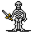

# { .sprite } Skeleton

<div class="infobox" markdown>

<p class="ib-img">{ .sprite }</p>

| | |
|---|---|
| **Monster ID** | `ratdom_skeleton1` |
| **Type** | NPC |
| **Class** | Construct |
| **HP** | 60 |
| **XP when killed** | 118 |
| **Found in** | Bloskelt + Roskelt |
| **Immune to crits** | Yes |
| **Introduced** | [v0.8.5](../versions/0.8.5.md) |

</div>

## Combat stats

| Stat | Value |
|---|---|
| HP | 60 |
| Damage | 10 to 20 |
| Attack chance | 100 |
| Block chance | 0 |
| Damage resistance | 2 |
| Max AP | 10 |
| Attack cost | 5 AP |
| Attacks per turn | 2 |
| Move cost | 10 AP |
| Critical skill | 0 |
| Critical multiplier | – |
| Crit chance | none (needs critical skill and a multiplier) |

!!! note "Immune to critical hits"
    Ghosts, constructs and demons can't be critically hit. Your crit build will have to sit this one out.

**XP formula** (from the game's loader): ⌈(attacks per turn × attack chance × average damage × (1 + critical skill × multiplier) × 3 + HP × (1 + block chance) + 9 × damage resistance) × 0.7⌉, +50 if its hits inflict a condition. More Exp adds a percentage on top.

<p class="verified">Verified against v0.8.18 monster data and game code (`MonsterTypeParser.java`).</p>


## Locations

| Map | Region | Up to | Notes |
|---|---|---|---|
| [ratdom_maze_415](../maps/ratdom_maze_415.md) | Bloskelt + Roskelt | 4 | – |
| [ratdom_maze_425](../maps/ratdom_maze_425.md) | Bloskelt + Roskelt | 2 | – |


## Dialogue simulator

Set up your situation (quest stages, items, kills…), then talk to Skeleton. The simulator follows the game's own rules: it takes the same silent checks, offers only the options you'd really see, and applies their effects (quest stages, items handed over, rewards) as you go.

<div class="dlg-sim" data-src="../../assets/dialogue/ratdom_skeleton1.json" data-npc="Skeleton" markdown="0"><noscript>The simulator needs JavaScript. The full dialogue is listed below.</noscript></div>

<p class="verified">Rules verified against v0.8.18 game code (ConversationController.java) and dialogue data.</p>

??? quote "Dialogue (3 lines)"

    *What the dialogue says, exactly as in the game files. Lines are listed once; links jump to the line a choice leads to.*

    <span id="d-ratdom_skeleton1"></span>**`ratdom_skeleton1`** *(silent check: the first matching branch below is taken)*

    - branch 1 *(if wearing [Old man's ring of bone](../items/guynmart_bonering.md))* → [ratdom_skeleton_10](#d-ratdom_skeleton_10)
    - branch 2 → [ratdom_skeleton1_20](#d-ratdom_skeleton1_20)

    <span id="d-ratdom_skeleton_10"></span>**`ratdom_skeleton_10`** Skeleton: “The ring. This human wears the ring of bone. Let him pass.”

    - “A bit scary - but really useful, this ring.” → *conversation ends*
    - “You are in my way. Attack!” → *fight starts*

    <span id="d-ratdom_skeleton1_20"></span>**`ratdom_skeleton1_20`** *(silent check: the first matching branch below is taken)* — **effects:** faction “ratdom_skeleton1” +10

    - branch 1 → *fight starts*


## Version history

| Version | Change |
|---|---|
| [v0.8.5](../versions/0.8.5.md) | Added<br>Dialogue: 3 lines added |

<p class="verified">Verified against v0.8.18 and every earlier release back to v0.7.0 (game data compared release by release).</p>


## Community notes

<small>Written by players, not generated from game data. **Observations**: what players notice in-game · **Lore**: the in-world story · **Trivia**: real-world facts, references, development history · **Theory / speculation**: unconfirmed ideas; may just be unfinished content</small>

### Observations

*Nothing here yet. Know something? [Add it](https://github.com/asdfghjkl628/Andor-s-Trail-Wikiiii/new/main/notes/monsters?filename=ratdom_skeleton1.md&value=%23%23%20Observations%0A%0A%3C%21--%20what%20players%20notice%20in-game%20--%3E%0A%0A%23%23%20Lore%0A%0A%3C%21--%20the%20in-world%20story%20--%3E%0A%0A%23%23%20Trivia%0A%0A%3C%21--%20real-world%20facts%2C%20references%2C%20development%20history%20--%3E%0A%0A%23%23%20Theory%20/%20speculation%0A%0A%3C%21--%20unconfirmed%20ideas%3B%20may%20just%20be%20unfinished%20content%20--%3E%0A).*

### Lore

*Nothing here yet. Know something? [Add it](https://github.com/asdfghjkl628/Andor-s-Trail-Wikiiii/new/main/notes/monsters?filename=ratdom_skeleton1.md&value=%23%23%20Observations%0A%0A%3C%21--%20what%20players%20notice%20in-game%20--%3E%0A%0A%23%23%20Lore%0A%0A%3C%21--%20the%20in-world%20story%20--%3E%0A%0A%23%23%20Trivia%0A%0A%3C%21--%20real-world%20facts%2C%20references%2C%20development%20history%20--%3E%0A%0A%23%23%20Theory%20/%20speculation%0A%0A%3C%21--%20unconfirmed%20ideas%3B%20may%20just%20be%20unfinished%20content%20--%3E%0A).*

### Trivia

*Nothing here yet. Know something? [Add it](https://github.com/asdfghjkl628/Andor-s-Trail-Wikiiii/new/main/notes/monsters?filename=ratdom_skeleton1.md&value=%23%23%20Observations%0A%0A%3C%21--%20what%20players%20notice%20in-game%20--%3E%0A%0A%23%23%20Lore%0A%0A%3C%21--%20the%20in-world%20story%20--%3E%0A%0A%23%23%20Trivia%0A%0A%3C%21--%20real-world%20facts%2C%20references%2C%20development%20history%20--%3E%0A%0A%23%23%20Theory%20/%20speculation%0A%0A%3C%21--%20unconfirmed%20ideas%3B%20may%20just%20be%20unfinished%20content%20--%3E%0A).*

### Theory / speculation

*Nothing here yet. Know something? [Add it](https://github.com/asdfghjkl628/Andor-s-Trail-Wikiiii/new/main/notes/monsters?filename=ratdom_skeleton1.md&value=%23%23%20Observations%0A%0A%3C%21--%20what%20players%20notice%20in-game%20--%3E%0A%0A%23%23%20Lore%0A%0A%3C%21--%20the%20in-world%20story%20--%3E%0A%0A%23%23%20Trivia%0A%0A%3C%21--%20real-world%20facts%2C%20references%2C%20development%20history%20--%3E%0A%0A%23%23%20Theory%20/%20speculation%0A%0A%3C%21--%20unconfirmed%20ideas%3B%20may%20just%20be%20unfinished%20content%20--%3E%0A).*


??? info "Technical information"

    | | |
    |---|---|
    | Monster ID | `ratdom_skeleton1` |
    | Spawn group | `ratdom_skeleton1` |
    | Loot table | – |
    | Conversation | `ratdom_skeleton1` |
    | Faction | `ratdom_skeleton1` |
    | Movement | protectSpawn |
    | Icon | `monsters_tometik8:35` |
    | Defined in | `res/raw/monsterlist_ratdom.json` |

    Raw data:

    ```json
    {
     "id": "ratdom_skeleton1",
     "name": "Skeleton",
     "iconID": "monsters_tometik8:35",
     "maxHP": 60,
     "maxAP": 10,
     "monsterClass": "construct",
     "movementAggressionType": "protectSpawn",
     "attackDamage": {
      "min": 10,
      "max": 20
     },
     "spawnGroup": "ratdom_skeleton1",
     "faction": "ratdom_skeleton1",
     "phraseID": "ratdom_skeleton1",
     "attackCost": 5,
     "attackChance": 100,
     "damageResistance": 2
    }
    ```


<small>Data from v0.8.18</small>
