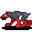

# { .sprite } Tough redfoot beast

**Found in:** Charwood: [Waytominingtown 3](../maps/waytominingtown3.md), Fallhaven: [Waytominingtown 0](../maps/waytominingtown0.md), Foaming Flask Tavern: [Roadbeforecrossroads 8](../maps/roadbeforecrossroads8.md), Foaming Flask Tavern: [Waytominingtown 1](../maps/waytominingtown1.md) (+1 more)

<div class="infobox" markdown>

<p class="ib-img">{ .sprite }</p>

| | |
|---|---|
| **Type** | Enemy (hostile on sight) |
| **Found in** | Foaming Flask Tavern, Fallhaven, Charwood |
| **Class** | Animal |
| **HP** | 39 |
| **XP when defeated** | 98 |
| **Entry ID** | `redft0` |
| **Introduced** | v0.7.0 or earlier |

</div>

## Combat statistics

| Statistic | Value |
|---|---|
| Class | Animal |
| HP | 39 |
| XP when defeated | 98 |
| Damage | 0 to 5 |
| Attack chance | 78 |
| Block chance | 52 |
| Damage resistance | 4 |
| Max AP | 10 |
| Attack cost | 3 AP |
| Attacks per turn | 3 |
| Move cost | 5 AP |
| Critical skill | 50 |
| Critical multiplier | 3.0 |
| Critical hit chance | 26% |


<p class="verified">Verified against v0.8.18 monster data and game code (`MonsterTypeParser.java`).</p>

## Drops

| Item | Chance | Qty |
|---|---|---|
| [Redfoot beast hair](../items/redfthair.md) | 10% | 1 |
| [Meat](../items/meat.md) | 20% | 1 |
| [Bone](../items/bone.md) | 20% | 1 to 3 |

## Locations

| Map | Region | Up to | Notes |
|---|---|---|---|
| [Roadbeforecrossroads 8](../maps/roadbeforecrossroads8.md) | Foaming Flask Tavern | 1 | – |
| [Waytominingtown 0](../maps/waytominingtown0.md) | Fallhaven | 6 | – |
| [Waytominingtown 1](../maps/waytominingtown1.md) | Foaming Flask Tavern | 13 | – |
| [Waytominingtown 1a](../maps/waytominingtown1a.md) | Foaming Flask Tavern | 1 | – |
| [Waytominingtown 3](../maps/waytominingtown3.md) | Charwood | 4 | – |


## Version history

| Version | Change |
|---|---|
| [v0.7.0](../versions/0.7.0.md) | Present in v0.7.0 (earliest release tracked) |
| [v0.7.2](../versions/0.7.2.md) | Attack damage: 0–5 → 0–5 |

<p class="verified">Verified against v0.8.18 and every earlier release back to v0.7.0 (game data compared release by release).</p>


??? info "Technical information"

    | | |
    |---|---|
    | Entry ID | `redft0` |
    | Spawn group | `redft1` |
    | Loot table | `redft` |
    | Conversation | – |
    | Faction | – |
    | Movement | – |
    | Icon | `monsters_rltiles4:9` |
    | Defined in | `res/raw/monsterlist_v070_charwood.json` |

    Raw data:

    ```json
    {
     "id": "redft0",
     "name": "Tough redfoot beast",
     "iconID": "monsters_rltiles4:9",
     "maxHP": 39,
     "moveCost": 5,
     "monsterClass": "animal",
     "attackDamage": {
      "min": 0,
      "max": 5
     },
     "spawnGroup": "redft1",
     "droplistID": "redft",
     "attackCost": 3,
     "attackChance": 78,
     "criticalSkill": 50,
     "criticalMultiplier": 3.0,
     "blockChance": 52,
     "damageResistance": 4
    }
    ```


??? info "How the XP value is calculated"

    The game computes each enemy's experience value when it loads the data (`MonsterTypeParser.java`):

    XP = ⌈(attacks per turn × attack chance × average damage × (1 + critical skill × critical multiplier) × 3 + HP × (1 + block chance) + 9 × damage resistance) × 0.7⌉

    Percentages are used as fractions (e.g. 60% = 0.6). Enemies whose attacks inflict a condition are worth 50 XP more. The More Exp skill adds a percentage on top.


## Community notes

<small>Written by players, not generated from game data. **Observations**: what players notice in-game · **Lore**: the in-world story · **Trivia**: real-world facts, references, development history · **Theory / speculation**: unconfirmed ideas; may just be unfinished content</small>

### Observations

*No notes yet. Contributions are welcome: [add a note](https://github.com/asdfghjkl628/Andor-s-Trail-Wikiiii/new/main/notes/monsters?filename=redft0.md&value=%23%23%20Observations%0A%0A%3C%21--%20what%20players%20notice%20in-game%20--%3E%0A%0A%23%23%20Lore%0A%0A%3C%21--%20the%20in-world%20story%20--%3E%0A%0A%23%23%20Trivia%0A%0A%3C%21--%20real-world%20facts%2C%20references%2C%20development%20history%20--%3E%0A%0A%23%23%20Theory%20/%20speculation%0A%0A%3C%21--%20unconfirmed%20ideas%3B%20may%20just%20be%20unfinished%20content%20--%3E%0A).*

### Lore

*No notes yet. Contributions are welcome: [add a note](https://github.com/asdfghjkl628/Andor-s-Trail-Wikiiii/new/main/notes/monsters?filename=redft0.md&value=%23%23%20Observations%0A%0A%3C%21--%20what%20players%20notice%20in-game%20--%3E%0A%0A%23%23%20Lore%0A%0A%3C%21--%20the%20in-world%20story%20--%3E%0A%0A%23%23%20Trivia%0A%0A%3C%21--%20real-world%20facts%2C%20references%2C%20development%20history%20--%3E%0A%0A%23%23%20Theory%20/%20speculation%0A%0A%3C%21--%20unconfirmed%20ideas%3B%20may%20just%20be%20unfinished%20content%20--%3E%0A).*

### Trivia

*No notes yet. Contributions are welcome: [add a note](https://github.com/asdfghjkl628/Andor-s-Trail-Wikiiii/new/main/notes/monsters?filename=redft0.md&value=%23%23%20Observations%0A%0A%3C%21--%20what%20players%20notice%20in-game%20--%3E%0A%0A%23%23%20Lore%0A%0A%3C%21--%20the%20in-world%20story%20--%3E%0A%0A%23%23%20Trivia%0A%0A%3C%21--%20real-world%20facts%2C%20references%2C%20development%20history%20--%3E%0A%0A%23%23%20Theory%20/%20speculation%0A%0A%3C%21--%20unconfirmed%20ideas%3B%20may%20just%20be%20unfinished%20content%20--%3E%0A).*

### Theory / speculation

*No notes yet. Contributions are welcome: [add a note](https://github.com/asdfghjkl628/Andor-s-Trail-Wikiiii/new/main/notes/monsters?filename=redft0.md&value=%23%23%20Observations%0A%0A%3C%21--%20what%20players%20notice%20in-game%20--%3E%0A%0A%23%23%20Lore%0A%0A%3C%21--%20the%20in-world%20story%20--%3E%0A%0A%23%23%20Trivia%0A%0A%3C%21--%20real-world%20facts%2C%20references%2C%20development%20history%20--%3E%0A%0A%23%23%20Theory%20/%20speculation%0A%0A%3C%21--%20unconfirmed%20ideas%3B%20may%20just%20be%20unfinished%20content%20--%3E%0A).*


<small>Data from v0.8.18</small>
