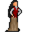

# { .sprite } Gwendolyn

| Stat | Value |
|---|---|
| Class | ? |
| HP | 0 |
| Max AP | 10 |
| Attack cost | 10 |
| Move cost | 10 |
| Damage | 0 |
| Attack chance | 0 |
| Block chance | 0 |
| Damage resistance | 0 |
| Critical skill | 0 |
| Critical multiplier | 0 |

## Found on

- [remgard_church_basement](../maps/remgard_church_basement.md)

## Quests

- [The fifth master](../quests/fifth_master.md): stages 50, 58

??? quote "Dialogue (7 lines)"

    *What the dialogue says, exactly as in the game files. Lines are listed once; links jump to the line a choice leads to.*

    **`gwendolyn_1`** Gwendolyn: “Hello, stranger. What are you doing down here?”

    - “I'm looking for my brother Andor. Have you seen him? He kind of looks like me.” → [gwendolyn_2](#d-gwendolyn_2)
    - “What are you doing down here?” → [gwendolyn_3](#d-gwendolyn_3)
    - “I'm searching for something called "The Ritual of Five Aspects". Have you ever heard of it?” *(if reached stage 40 of [The fifth master](../quests/fifth_master.md#stage-40); NOT reached stage 55 of [The fifth master](../quests/fifth_master.md#stage-55))* → [gwendolyn_kazaul_10](#d-gwendolyn_kazaul_10)
    - “Gwendolyn, do you know anything about a locked box back here?” *(if carry 1× [Ancient locked box](../items/ancient_locked_box.md); latest stage of [The fifth master](../quests/fifth_master.md#stage-55) is 55)* → [gwendolyn_kazaul_locked_box_10](#d-gwendolyn_kazaul_locked_box_10)

    **`gwendolyn_2`** Gwendolyn: “Well, unless he looks like one of these books, I will say "no".”

    - Next → [gwendolyn_3](#d-gwendolyn_3)

    **`gwendolyn_3`** Gwendolyn: “You see, I've been down here all day looking for a book for Skylenar as he really needs it.”

    - “Well, maybe I could help you? What is the name of this book?” → [gwendolyn_4](#d-gwendolyn_4)

    **`gwendolyn_kazaul_10`** Gwendolyn: “"The Ritual of Five Aspects"? No, I can't say that I have. The name sounds ominous though. You're welcome to look through the shelves if you wish. Just be careful with the older scrolls - they crumble if you breathe too hard on them.” — **effects:** sets stage 50 of [The fifth master](../quests/fifth_master.md#stage-50)

    - “Thank you. I'll take a look around.” → *conversation ends*

    **`gwendolyn_kazaul_locked_box_10`** Gwendolyn: “A locked box? No, I've never noticed one. I've been in charge of these archives for years, but I suppose some things manage to hide from even the most watchful eyes. I'm afraid I don't have a key for anything like that.”

    - “Do you know who might have the key?” → [gwendolyn_kazaul_locked_box_20](#d-gwendolyn_kazaul_locked_box_20)
    - “That's all right. I'll figure something out.” → *conversation ends*

    **`gwendolyn_4`** Gwendolyn: “Oh, how nice of you to offer. It's called "The Tome of Veiled Truths", but I don't think you will have much luck finding it.”

    - “Oh, OK. I will let you be then.” → *conversation ends*

    **`gwendolyn_kazaul_locked_box_20`** Gwendolyn: “Hmm...the church keeps spare keys in the rectory upstairs, I think. You might ask Skylenar - he oversees most of what's stored down here. But please, don't break anything. Those boxes could be older than Remgard itself.” — **effects:** sets stage 58 of [The fifth master](../quests/fifth_master.md#stage-58)

    - “I'll ask him. Thank you, Gwendolyn.” → *conversation ends*

## Version history

| Version | Change |
|---|---|
| [v0.8.11](../versions/0.8.11.md) | Added Dialogue: 4 lines added |
| [v0.8.18](../versions/0.8.18.md) | Dialogue: 3 lines added, 1 line changed |

Verified against v0.8.18 and every earlier release back to v0.7.0 (game data compared release by release).

## Community notes

<small>Written by players, not generated from game data. **Observations**: what players notice in-game · **Lore**: the in-world story · **Trivia**: real-world facts, references, development history · **Theory / speculation**: unconfirmed ideas; may just be unfinished content</small>

### Observations

*Nothing here yet. Know something? [Add it](https://github.com/asdfghjkl628/Andor-s-Trail-Wikiiii/new/main/notes/monsters?filename=remgard_gwendolyn.md&value=%23%23%20Observations%0A%0A%3C%21--%20what%20players%20notice%20in-game%20--%3E%0A%0A%23%23%20Lore%0A%0A%3C%21--%20the%20in-world%20story%20--%3E%0A%0A%23%23%20Trivia%0A%0A%3C%21--%20real-world%20facts%2C%20references%2C%20development%20history%20--%3E%0A%0A%23%23%20Theory%20/%20speculation%0A%0A%3C%21--%20unconfirmed%20ideas%3B%20may%20just%20be%20unfinished%20content%20--%3E%0A).*

### Lore

*Nothing here yet. Know something? [Add it](https://github.com/asdfghjkl628/Andor-s-Trail-Wikiiii/new/main/notes/monsters?filename=remgard_gwendolyn.md&value=%23%23%20Observations%0A%0A%3C%21--%20what%20players%20notice%20in-game%20--%3E%0A%0A%23%23%20Lore%0A%0A%3C%21--%20the%20in-world%20story%20--%3E%0A%0A%23%23%20Trivia%0A%0A%3C%21--%20real-world%20facts%2C%20references%2C%20development%20history%20--%3E%0A%0A%23%23%20Theory%20/%20speculation%0A%0A%3C%21--%20unconfirmed%20ideas%3B%20may%20just%20be%20unfinished%20content%20--%3E%0A).*

### Trivia

*Nothing here yet. Know something? [Add it](https://github.com/asdfghjkl628/Andor-s-Trail-Wikiiii/new/main/notes/monsters?filename=remgard_gwendolyn.md&value=%23%23%20Observations%0A%0A%3C%21--%20what%20players%20notice%20in-game%20--%3E%0A%0A%23%23%20Lore%0A%0A%3C%21--%20the%20in-world%20story%20--%3E%0A%0A%23%23%20Trivia%0A%0A%3C%21--%20real-world%20facts%2C%20references%2C%20development%20history%20--%3E%0A%0A%23%23%20Theory%20/%20speculation%0A%0A%3C%21--%20unconfirmed%20ideas%3B%20may%20just%20be%20unfinished%20content%20--%3E%0A).*

### Theory / speculation

*Nothing here yet. Know something? [Add it](https://github.com/asdfghjkl628/Andor-s-Trail-Wikiiii/new/main/notes/monsters?filename=remgard_gwendolyn.md&value=%23%23%20Observations%0A%0A%3C%21--%20what%20players%20notice%20in-game%20--%3E%0A%0A%23%23%20Lore%0A%0A%3C%21--%20the%20in-world%20story%20--%3E%0A%0A%23%23%20Trivia%0A%0A%3C%21--%20real-world%20facts%2C%20references%2C%20development%20history%20--%3E%0A%0A%23%23%20Theory%20/%20speculation%0A%0A%3C%21--%20unconfirmed%20ideas%3B%20may%20just%20be%20unfinished%20content%20--%3E%0A).*

<small>Monster ID: `remgard_gwendolyn` · Data from v0.8.18</small>
