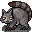

# { .sprite } Scardy aroughcun

**Found in:** Mt. Galmore: [galmore_47](../maps/galmore_47.md), Mt. Galmore: [galmore_57](../maps/galmore_57.md), Mt. Galmore: [galmore_58](../maps/galmore_58.md), Mt. Galmore: [galmore_67](../maps/galmore_67.md) (+1 more)

<div class="infobox" markdown>

<p class="ib-img">{ .sprite }</p>

| | |
|---|---|
| **Type** | Enemy (hostile on sight) |
| **Found in** | Mt. Galmore |
| **Class** | Animal |
| **HP** | 170 |
| **XP when defeated** | 574 |
| **Entry ID** | `scardy_aroughcun` |
| **Introduced** | [v0.8.14](../versions/0.8.14.md) |

</div>

## Combat statistics

| Statistic | Value |
|---|---|
| Class | Animal |
| HP | 170 |
| XP when defeated | 574 |
| Damage | 12 to 17 |
| Attack chance | 191 |
| Block chance | 176 |
| Damage resistance | 9 |
| Max AP | 10 |
| Attack cost | 4 AP |
| Attacks per turn | 2 |
| Move cost | 4 AP |
| Critical skill | 11 |
| Critical multiplier | 1.75 |
| Critical hit chance | 9% |

**On hit:** On target: Rabies (magnitude 2, 2 rounds, 25% chance)


<p class="verified">Verified against v0.8.18 monster data and game code (`MonsterTypeParser.java`).</p>

## Drops

| Item | Chance | Qty |
|---|---|---|
| [Rosethorn apple](../items/rosethorn_apple.md) | 20% | 1 |
| [Bramblefin](../items/bramblefin_fish.md) | 20% | 1 to 2 |
| [Rotten fish](../items/rotten_fish.md) | 25% | 1 |

## Locations

| Map | Region | Up to | Notes |
|---|---|---|---|
| [galmore_47](../maps/galmore_47.md) | Mt. Galmore | 1 | – |
| [galmore_57](../maps/galmore_57.md) | Mt. Galmore | 1 | – |
| [galmore_58](../maps/galmore_58.md) | Mt. Galmore | 3 | – |
| [galmore_67](../maps/galmore_67.md) | Mt. Galmore | 3 | – |
| [galmore_rail_cave](../maps/galmore_rail_cave.md) | Mt. Galmore | 3 | – |


## Version history

| Version | Change |
|---|---|
| [v0.8.14](../versions/0.8.14.md) | Added |

<p class="verified">Verified against v0.8.18 and every earlier release back to v0.7.0 (game data compared release by release).</p>


??? info "Technical information"

    | | |
    |---|---|
    | Entry ID | `scardy_aroughcun` |
    | Spawn group | `scardy_aroughcun` |
    | Loot table | `aroughcun_scardy_dl` |
    | Conversation | – |
    | Faction | – |
    | Movement | – |
    | Icon | `monsters_newb_1:275` |
    | Defined in | `res/raw/monsterlist_mt_galmore2.json` |

    Raw data:

    ```json
    {
     "id": "scardy_aroughcun",
     "name": "Scardy aroughcun",
     "iconID": "monsters_newb_1:275",
     "maxHP": 170,
     "moveCost": 4,
     "monsterClass": "animal",
     "attackDamage": {
      "min": 12,
      "max": 17
     },
     "droplistID": "aroughcun_scardy_dl",
     "attackCost": 4,
     "attackChance": 191,
     "criticalSkill": 11,
     "criticalMultiplier": 1.75,
     "blockChance": 176,
     "damageResistance": 9,
     "hitEffect": {
      "conditionsTarget": [
       {
        "condition": "rabies",
        "magnitude": 2,
        "duration": 2,
        "chance": "25"
       }
      ]
     }
    }
    ```


??? info "How the XP value is calculated"

    The game computes each enemy's experience value when it loads the data (`MonsterTypeParser.java`):

    XP = ⌈(attacks per turn × attack chance × average damage × (1 + critical skill × critical multiplier) × 3 + HP × (1 + block chance) + 9 × damage resistance) × 0.7⌉

    Percentages are used as fractions (e.g. 60% = 0.6). Enemies whose attacks inflict a condition are worth 50 XP more. The More Exp skill adds a percentage on top.


## Community notes

<small>Written by players, not generated from game data. **Observations**: what players notice in-game · **Lore**: the in-world story · **Trivia**: real-world facts, references, development history · **Theory / speculation**: unconfirmed ideas; may just be unfinished content</small>

### Observations

*No notes yet. Contributions are welcome: [add a note](https://github.com/asdfghjkl628/Andor-s-Trail-Wikiiii/new/main/notes/monsters?filename=scardy_aroughcun.md&value=%23%23%20Observations%0A%0A%3C%21--%20what%20players%20notice%20in-game%20--%3E%0A%0A%23%23%20Lore%0A%0A%3C%21--%20the%20in-world%20story%20--%3E%0A%0A%23%23%20Trivia%0A%0A%3C%21--%20real-world%20facts%2C%20references%2C%20development%20history%20--%3E%0A%0A%23%23%20Theory%20/%20speculation%0A%0A%3C%21--%20unconfirmed%20ideas%3B%20may%20just%20be%20unfinished%20content%20--%3E%0A).*

### Lore

*No notes yet. Contributions are welcome: [add a note](https://github.com/asdfghjkl628/Andor-s-Trail-Wikiiii/new/main/notes/monsters?filename=scardy_aroughcun.md&value=%23%23%20Observations%0A%0A%3C%21--%20what%20players%20notice%20in-game%20--%3E%0A%0A%23%23%20Lore%0A%0A%3C%21--%20the%20in-world%20story%20--%3E%0A%0A%23%23%20Trivia%0A%0A%3C%21--%20real-world%20facts%2C%20references%2C%20development%20history%20--%3E%0A%0A%23%23%20Theory%20/%20speculation%0A%0A%3C%21--%20unconfirmed%20ideas%3B%20may%20just%20be%20unfinished%20content%20--%3E%0A).*

### Trivia

*No notes yet. Contributions are welcome: [add a note](https://github.com/asdfghjkl628/Andor-s-Trail-Wikiiii/new/main/notes/monsters?filename=scardy_aroughcun.md&value=%23%23%20Observations%0A%0A%3C%21--%20what%20players%20notice%20in-game%20--%3E%0A%0A%23%23%20Lore%0A%0A%3C%21--%20the%20in-world%20story%20--%3E%0A%0A%23%23%20Trivia%0A%0A%3C%21--%20real-world%20facts%2C%20references%2C%20development%20history%20--%3E%0A%0A%23%23%20Theory%20/%20speculation%0A%0A%3C%21--%20unconfirmed%20ideas%3B%20may%20just%20be%20unfinished%20content%20--%3E%0A).*

### Theory / speculation

*No notes yet. Contributions are welcome: [add a note](https://github.com/asdfghjkl628/Andor-s-Trail-Wikiiii/new/main/notes/monsters?filename=scardy_aroughcun.md&value=%23%23%20Observations%0A%0A%3C%21--%20what%20players%20notice%20in-game%20--%3E%0A%0A%23%23%20Lore%0A%0A%3C%21--%20the%20in-world%20story%20--%3E%0A%0A%23%23%20Trivia%0A%0A%3C%21--%20real-world%20facts%2C%20references%2C%20development%20history%20--%3E%0A%0A%23%23%20Theory%20/%20speculation%0A%0A%3C%21--%20unconfirmed%20ideas%3B%20may%20just%20be%20unfinished%20content%20--%3E%0A).*


<small>Data from v0.8.18</small>
