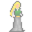

# { .sprite } Shy Cora

| Stat | Value |
|---|---|
| Class | ghost |
| HP | 0 |
| Max AP | 10 |
| Attack cost | 10 |
| Move cost | 10 |
| Damage | 0 |
| Attack chance | 0 |
| Block chance | 0 |
| Damage resistance | 0 |
| Critical skill | 0 |
| Critical multiplier | 0 |

!!! note "Immune to critical hits"
    Monsters of this class cannot be critically hit.

## Shop stock

| Item | Chance | Qty |
|---|---|---|
| [Undertell pickaxe](../items/undertell_pickaxe.md) | 50% | 1 |
| [Emerald](../items/undertell_emerald.md) | 100% | 1 to 2 |
| [Arschleder](../items/arschleder.md) | 100% | 1 |
| [Miner's tunic](../items/miner_tunic.md) | 100% | 1 |
| [Undertell shovel](../items/undertell_shovel.md) | 100% | 1 |
| [Miner's hooded tunic](../items/miner_hood.md) | 100% | 1 |
| [Shredded tunic](../items/shredded_tunic.md) | 100% | 1 to 3 |

## Found on

- [undertell_01](../maps/undertell_01.md)
- [undertell_1_1](../maps/undertell_1_1.md)

<small>Monster ID: `shy_cora` · Data from v0.8.18</small>
