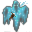

# { .sprite } Sinister wraith

| Stat | Value |
|---|---|
| Class | ghost |
| HP | 255 |
| Max AP | 10 |
| Attack cost | 4 |
| Move cost | 3 |
| Damage | 12 to 18 |
| Attack chance | 199 |
| Block chance | 279 |
| Damage resistance | 15 |
| Critical skill | 30 |
| Critical multiplier | 3.0 |

!!! note "Immune to critical hits"
    Monsters of this class cannot be critically hit.

## Drops

| Item | Chance | Qty |
|---|---|---|
| [Gold coins](../items/gold.md) | 25% | 22 to 28 |
| [Tonic of blood](../items/tonic_of_blood.md) | 20% | 1 to 2 |
| [Jinxed ring of damage resistance](../items/ring_jinxed1.md) | 10% | 1 |

## Found on

- [haunted_underground_3](../maps/haunted_underground_3.md)
- [haunted_underground_4](../maps/haunted_underground_4.md)
- [haunted_underground_5](../maps/haunted_underground_5.md)

<small>Monster ID: `sinister_wraith` · Data from v0.8.18</small>
