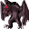

# { .sprite } Ligeia

<div class="infobox" markdown>

<p class="ib-img">{ .sprite }</p>

| | |
|---|---|
| **Monster ID** | `sirene2` |
| **Type** | NPC |
| **Class** | Humanoid |
| **HP** | 1 |
| **Found in** | Lake Laeroth |
| **Introduced** | [v0.8.18](../versions/0.8.18.md) |

</div>

## Combat stats

| Stat | Value |
|---|---|
| HP | 1 |
| Damage | 0 |
| Attack chance | 0 |
| Block chance | 0 |
| Damage resistance | 0 |
| Max AP | 10 |
| Attack cost | 10 AP |
| Attacks per turn | 1 |
| Move cost | 10 AP |
| Critical skill | 0 |
| Critical multiplier | – |
| Crit chance | none (needs critical skill and a multiplier) |

**XP formula** (from the game's loader): ⌈(attacks per turn × attack chance × average damage × (1 + critical skill × multiplier) × 3 + HP × (1 + block chance) + 9 × damage resistance) × 0.7⌉, +50 if its hits inflict a condition. More Exp adds a percentage on top.

<p class="verified">Verified against v0.8.18 monster data and game code (`MonsterTypeParser.java`).</p>


## Locations

| Map | Region | Up to | Notes |
|---|---|---|---|
| [mountainlake21](../maps/mountainlake21.md) | Lake Laeroth | 1 | – |


??? info "Technical information"

    | | |
    |---|---|
    | Monster ID | `sirene2` |
    | Spawn group | `sirene2` |
    | Loot table | – |
    | Conversation | `sirene2` |
    | Faction | – |
    | Movement | – |
    | Icon | `monsters_newb_1:288` |
    | Defined in | `res/raw/monsterlist_lake_laeroth_2.json` |

    Raw data:

    ```json
    {
     "id": "sirene2",
     "name": "Ligeia",
     "iconID": "monsters_newb_1:288",
     "monsterClass": "humanoid",
     "spawnGroup": "sirene2",
     "phraseID": "sirene2"
    }
    ```


<small>Data from v0.8.18</small>
