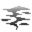

# { .sprite } Sleepless taint

<div class="infobox" markdown>

<p class="ib-img">{ .sprite }</p>

| | |
|---|---|
| **Monster ID** | `sleepless_taint` |
| **Type** | Enemy |
| **Class** | Ghost |
| **HP** | 180 |
| **XP when killed** | 715 |
| **Found in** | haunted_underground_1, haunted_underground_2, haunted_underground_3 |
| **Immune to crits** | Yes |
| **Introduced** | [v0.8.3](../versions/0.8.3.md) |

</div>

## Combat stats

| Stat | Value |
|---|---|
| HP | 180 |
| Damage | 11 to 12 |
| Attack chance | 185 |
| Block chance | 265 |
| Damage resistance | 9 |
| Max AP | 10 |
| Attack cost | 3 AP |
| Attacks per turn | 3 |
| Move cost | 3 AP |
| Critical skill | 5 |
| Critical multiplier | 2.0 |
| Crit chance | 5% |

!!! note "Immune to critical hits"
    Ghosts, constructs and demons can't be critically hit. Your crit build will have to sit this one out.

**On hit:** On target: Sleepwalking (magnitude 1, 2 rounds, 40% chance)

**XP formula** (from the game's loader): ⌈(attacks per turn × attack chance × average damage × (1 + critical skill × multiplier) × 3 + HP × (1 + block chance) + 9 × damage resistance) × 0.7⌉, +50 if its hits inflict a condition. More Exp adds a percentage on top.

<p class="verified">Verified against v0.8.18 monster data and game code (`MonsterTypeParser.java`).</p>


## Drops

| Item | Chance | Qty |
|---|---|---|
| [Gold coins](../items/gold.md) | 15% | 20 to 22 |
| [Regular potion of health](../items/health.md) | 25% | 2 to 3 |

## Locations

| Map | Region | Up to | Notes |
|---|---|---|---|
| [haunted_underground_1](../maps/haunted_underground_1.md) | – | 1 | – |
| [haunted_underground_2](../maps/haunted_underground_2.md) | – | 3 | – |
| [haunted_underground_3](../maps/haunted_underground_3.md) | – | 3 | – |
| [haunted_underground_4](../maps/haunted_underground_4.md) | – | 6 | – |
| [haunted_underground_5](../maps/haunted_underground_5.md) | – | 4 | – |


## Version history

| Version | Change |
|---|---|
| [v0.8.3](../versions/0.8.3.md) | Added |
| [v0.8.4](../versions/0.8.4.md) | monsterClass: undead → ghost |

<p class="verified">Verified against v0.8.18 and every earlier release back to v0.7.0 (game data compared release by release).</p>


## Community notes

<small>Written by players, not generated from game data. **Observations**: what players notice in-game · **Lore**: the in-world story · **Trivia**: real-world facts, references, development history · **Theory / speculation**: unconfirmed ideas; may just be unfinished content</small>

### Observations

*Nothing here yet. Know something? [Add it](https://github.com/asdfghjkl628/Andor-s-Trail-Wikiiii/new/main/notes/monsters?filename=sleepless_taint.md&value=%23%23%20Observations%0A%0A%3C%21--%20what%20players%20notice%20in-game%20--%3E%0A%0A%23%23%20Lore%0A%0A%3C%21--%20the%20in-world%20story%20--%3E%0A%0A%23%23%20Trivia%0A%0A%3C%21--%20real-world%20facts%2C%20references%2C%20development%20history%20--%3E%0A%0A%23%23%20Theory%20/%20speculation%0A%0A%3C%21--%20unconfirmed%20ideas%3B%20may%20just%20be%20unfinished%20content%20--%3E%0A).*

### Lore

*Nothing here yet. Know something? [Add it](https://github.com/asdfghjkl628/Andor-s-Trail-Wikiiii/new/main/notes/monsters?filename=sleepless_taint.md&value=%23%23%20Observations%0A%0A%3C%21--%20what%20players%20notice%20in-game%20--%3E%0A%0A%23%23%20Lore%0A%0A%3C%21--%20the%20in-world%20story%20--%3E%0A%0A%23%23%20Trivia%0A%0A%3C%21--%20real-world%20facts%2C%20references%2C%20development%20history%20--%3E%0A%0A%23%23%20Theory%20/%20speculation%0A%0A%3C%21--%20unconfirmed%20ideas%3B%20may%20just%20be%20unfinished%20content%20--%3E%0A).*

### Trivia

*Nothing here yet. Know something? [Add it](https://github.com/asdfghjkl628/Andor-s-Trail-Wikiiii/new/main/notes/monsters?filename=sleepless_taint.md&value=%23%23%20Observations%0A%0A%3C%21--%20what%20players%20notice%20in-game%20--%3E%0A%0A%23%23%20Lore%0A%0A%3C%21--%20the%20in-world%20story%20--%3E%0A%0A%23%23%20Trivia%0A%0A%3C%21--%20real-world%20facts%2C%20references%2C%20development%20history%20--%3E%0A%0A%23%23%20Theory%20/%20speculation%0A%0A%3C%21--%20unconfirmed%20ideas%3B%20may%20just%20be%20unfinished%20content%20--%3E%0A).*

### Theory / speculation

*Nothing here yet. Know something? [Add it](https://github.com/asdfghjkl628/Andor-s-Trail-Wikiiii/new/main/notes/monsters?filename=sleepless_taint.md&value=%23%23%20Observations%0A%0A%3C%21--%20what%20players%20notice%20in-game%20--%3E%0A%0A%23%23%20Lore%0A%0A%3C%21--%20the%20in-world%20story%20--%3E%0A%0A%23%23%20Trivia%0A%0A%3C%21--%20real-world%20facts%2C%20references%2C%20development%20history%20--%3E%0A%0A%23%23%20Theory%20/%20speculation%0A%0A%3C%21--%20unconfirmed%20ideas%3B%20may%20just%20be%20unfinished%20content%20--%3E%0A).*


??? info "Technical information"

    | | |
    |---|---|
    | Monster ID | `sleepless_taint` |
    | Spawn group | `sleepless_taint` |
    | Loot table | `sleepless_taint_dl` |
    | Conversation | – |
    | Faction | – |
    | Movement | protectSpawn |
    | Icon | `monsters_rltiles2:140` |
    | Defined in | `res/raw/monsterlist_haunted_forest.json` |

    Raw data:

    ```json
    {
     "id": "sleepless_taint",
     "name": "Sleepless taint",
     "iconID": "monsters_rltiles2:140",
     "maxHP": 180,
     "moveCost": 3,
     "monsterClass": "ghost",
     "movementAggressionType": "protectSpawn",
     "attackDamage": {
      "min": 11,
      "max": 12
     },
     "droplistID": "sleepless_taint_dl",
     "attackCost": 3,
     "attackChance": 185,
     "criticalSkill": 5,
     "criticalMultiplier": 2.0,
     "blockChance": 265,
     "damageResistance": 9,
     "hitEffect": {
      "conditionsTarget": [
       {
        "condition": "sleepwalking",
        "magnitude": 1,
        "duration": 2,
        "chance": "40"
       }
      ]
     }
    }
    ```


<small>Data from v0.8.18</small>
