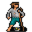

# { .sprite } Outcast

**Where to find Outcast:** [Fallhaven, Woodhouse 2](#v-smuggler1), [Fallhaven, Woodhouse 2](#v-smuggler2), [Fallhaven, Woodhouse 1](#v-smuggler4), [Fallhaven, Woodhouse 0](#v-smuggler5), [Fallhaven, Woodsettlement 0](#v-smuggler6), [Woodhouse 3](#v-smuggler7)

<div class="infobox" markdown>

<p class="ib-img">{ .sprite }</p>

| | |
|---|---|
| **Type** | NPC (talk only; never fought) |
| **Found in** | Fallhaven, Woodhouse 3 |
| **Introduced** | v0.7.0 or earlier |

</div>

## Fallhaven, Woodhouse 2 { #v-smuggler1 }

**Where:** Fallhaven: [Woodhouse 2](../maps/woodhouse2.md#pin-npc-smuggler1)

### Dialogue simulator

Set your quest stages and items, then talk to Outcast. Same rules as the game: same checks, same options, same effects.

<div class="dlg-sim" data-src="../../assets/dialogue/smuggler1_0.json" data-npc="Outcast" markdown="0"><noscript>The simulator needs JavaScript. The full dialogue is listed below.</noscript></div>

<p class="verified">Rules verified against v0.8.18 game code (ConversationController.java) and dialogue data.</p>

??? quote "Dialogue (1 lines)"

    *Exactly as in the game files. Each line appears once; links jump to where a choice leads.*

    <span id="d-smuggler1-smuggler1_0"></span>**`smuggler1_0`** Outcast: “[Mutter] Just one more...”


### Version history

| Version | Change |
|---|---|
| [v0.7.0](../versions/0.7.0.md) | Present in v0.7.0 (earliest release tracked) |
| [v0.7.2](../versions/0.7.2.md) | Dialogue: 1 line changed<br>· text: “[mutter] Just one more...” → “[Mutter] Just one more...” |

<p class="verified">Verified against v0.8.18 and every earlier release back to v0.7.0 (game data compared release by release).</p>


## Fallhaven, Woodhouse 2 (2) { #v-smuggler2 }

**Where:** Fallhaven: [Woodhouse 2](../maps/woodhouse2.md#pin-npc-smuggler2)

### Dialogue simulator

Set your quest stages and items, then talk to Outcast. Same rules as the game: same checks, same options, same effects.

<div class="dlg-sim" data-src="../../assets/dialogue/smuggler2_0.json" data-npc="Outcast" markdown="0"><noscript>The simulator needs JavaScript. The full dialogue is listed below.</noscript></div>

<p class="verified">Rules verified against v0.8.18 game code (ConversationController.java) and dialogue data.</p>

??? quote "Dialogue (1 lines)"

    *Exactly as in the game files. Each line appears once; links jump to where a choice leads.*

    <span id="d-smuggler2-smuggler2_0"></span>**`smuggler2_0`** Outcast: “What? No, you're not it.”


### Version history

| Version | Change |
|---|---|
| [v0.7.0](../versions/0.7.0.md) | Present in v0.7.0 (earliest release tracked) |

<p class="verified">Verified against v0.8.18 and every earlier release back to v0.7.0 (game data compared release by release).</p>


## Fallhaven, Woodhouse 1 { #v-smuggler4 }

**Where:** Fallhaven: [Woodhouse 1](../maps/woodhouse1.md#pin-npc-smuggler4)

### Dialogue simulator

Set your quest stages and items, then talk to Outcast. Same rules as the game: same checks, same options, same effects.

<div class="dlg-sim" data-src="../../assets/dialogue/smuggler4_0.json" data-npc="Outcast" markdown="0"><noscript>The simulator needs JavaScript. The full dialogue is listed below.</noscript></div>

<p class="verified">Rules verified against v0.8.18 game code (ConversationController.java) and dialogue data.</p>

??? quote "Dialogue (3 lines)"

    *Exactly as in the game files. Each line appears once; links jump to where a choice leads.*

    <span id="d-smuggler4-smuggler4_0"></span>**`smuggler4_0`** Outcast: “Uhh. Lowyna sure makes the best stuff!”

    - “What does she do?” → [smuggler4_1](#d-smuggler4-smuggler4_1)

    <span id="d-smuggler4-smuggler4_1"></span>**`smuggler4_1`** Outcast: “These of course! [swings his jug, nearly spilling some of it]”

    - “Where can I find this Lowyna?” → [smuggler4_2](#d-smuggler4-smuggler4_2)
    - “I need to go.” → *conversation ends*

    <span id="d-smuggler4-smuggler4_2"></span>**`smuggler4_2`** Outcast: “She's over there... No. Over there... No. Oh, she's around here somewhere.”


### Version history

| Version | Change |
|---|---|
| [v0.7.0](../versions/0.7.0.md) | Present in v0.7.0 (earliest release tracked) |
| [v0.7.2](../versions/0.7.2.md) | Dialogue: 1 line changed<br>· text: “She's over there .. no. Over there .. no. Oh, she's around here somew…” → “She's over there... No. Over there... No. Oh, she's around here somew…” |

<p class="verified">Verified against v0.8.18 and every earlier release back to v0.7.0 (game data compared release by release).</p>


## Fallhaven, Woodhouse 0 { #v-smuggler5 }

**Where:** Fallhaven: [Woodhouse 0](../maps/woodhouse0.md#pin-npc-smuggler5)

### Dialogue simulator

Set your quest stages and items, then talk to Outcast. Same rules as the game: same checks, same options, same effects.

<div class="dlg-sim" data-src="../../assets/dialogue/smuggler5_1.json" data-npc="Outcast" markdown="0"><noscript>The simulator needs JavaScript. The full dialogue is listed below.</noscript></div>

<p class="verified">Rules verified against v0.8.18 game code (ConversationController.java) and dialogue data.</p>

??? quote "Dialogue (3 lines)"

    *Exactly as in the game files. Each line appears once; links jump to where a choice leads.*

    <span id="d-smuggler5-smuggler5_1"></span>**`smuggler5_1`** Outcast: “[blank stare]”

    - “You're all sweaty and pale, what's wrong?” → [smuggler5_2](#d-smuggler5-smuggler5_2)
    - “I just met a talking pig right over there. [You point in the direction of west]” *(if reached stage 51 of [General story flags (hidden flag)](../quests/nondisplay.md#stage-51))* → [smuggler5_pig](#d-smuggler5-smuggler5_pig)

    <span id="d-smuggler5-smuggler5_2"></span>**`smuggler5_2`** Outcast: “Um. Just one more. Please, just one more.”


    <span id="d-smuggler5-smuggler5_pig"></span>**`smuggler5_pig`** Outcast: “Yeah, I'm sure you didn't. Why don't you go have another one of "Lowyna's special brews"?”


### Version history

| Version | Change |
|---|---|
| [v0.7.0](../versions/0.7.0.md) | Present in v0.7.0 (earliest release tracked) |
| [v0.8.11](../versions/0.8.11.md) | Dialogue: 1 line added, 1 line changed |

<p class="verified">Verified against v0.8.18 and every earlier release back to v0.7.0 (game data compared release by release).</p>


## Fallhaven, Woodsettlement 0 { #v-smuggler6 }

**Where:** Fallhaven: [Woodsettlement 0](../maps/woodsettlement0.md#pin-npc-smuggler6)

### Dialogue simulator

Set your quest stages and items, then talk to Outcast. Same rules as the game: same checks, same options, same effects.

<div class="dlg-sim" data-src="../../assets/dialogue/smuggler6_1.json" data-npc="Outcast" markdown="0"><noscript>The simulator needs JavaScript. The full dialogue is listed below.</noscript></div>

<p class="verified">Rules verified against v0.8.18 game code (ConversationController.java) and dialogue data.</p>

??? quote "Dialogue (3 lines)"

    *Exactly as in the game files. Each line appears once; links jump to where a choice leads.*

    <span id="d-smuggler6-smuggler6_1"></span>**`smuggler6_1`** Outcast: “Can you spare some gold?”

    - “Get away from me!” → *conversation ends*
    - “Here's 5 gold.” *(if pay 5 gold)* → [smuggler6_3](#d-smuggler6-smuggler6_3)
    - “Here's 50 gold.” *(if pay 50 gold)* → [smuggler6_3](#d-smuggler6-smuggler6_3)
    - “Here's 100 gold.” *(if pay 100 gold)* → [smuggler6_2](#d-smuggler6-smuggler6_2)

    <span id="d-smuggler6-smuggler6_3"></span>**`smuggler6_3`** Outcast: “Is that all you have?”


    <span id="d-smuggler6-smuggler6_2"></span>**`smuggler6_2`** Outcast: “Oh, oh! I haven't seen that much gold in my whole life. I'm finally rich!”


### Version history

| Version | Change |
|---|---|
| [v0.7.0](../versions/0.7.0.md) | Present in v0.7.0 (earliest release tracked) |

<p class="verified">Verified against v0.8.18 and every earlier release back to v0.7.0 (game data compared release by release).</p>


## Woodhouse 3 { #v-smuggler7 }

**Where:** [Woodhouse 3](../maps/woodhouse3.md#pin-npc-smuggler7)

### Dialogue simulator

Set your quest stages and items, then talk to Outcast. Same rules as the game: same checks, same options, same effects.

<div class="dlg-sim" data-src="../../assets/dialogue/smuggler7_1.json" data-npc="Outcast" markdown="0"><noscript>The simulator needs JavaScript. The full dialogue is listed below.</noscript></div>

<p class="verified">Rules verified against v0.8.18 game code (ConversationController.java) and dialogue data.</p>

??? quote "Dialogue (2 lines)"

    *Exactly as in the game files. Each line appears once; links jump to where a choice leads.*

    <span id="d-smuggler7-smuggler7_1"></span>**`smuggler7_1`** Outcast: “I've seen them. Their camps.”

    - Next → [smuggler7_2](#d-smuggler7-smuggler7_2)

    <span id="d-smuggler7-smuggler7_2"></span>**`smuggler7_2`** Outcast: “The Sakul are watching us. They're coming.”


### Version history

| Version | Change |
|---|---|
| [v0.7.0](../versions/0.7.0.md) | Present in v0.7.0 (earliest release tracked) |

<p class="verified">Verified against v0.8.18 and every earlier release back to v0.7.0 (game data compared release by release).</p>


## Behind the scenes

*How the game data handles this character. Not needed for playing.*

**6 entries.** The game data defines 6 separate characters named Outcast. The game makes a new entry whenever a character needs different behaviour (another conversation later in a quest, another place, other stats). Some are the same person at different points in the story; others just share a generic name. Here they differ in: conversation, location, appearance.

| Entry | Type | Section |
|---|---|---|
| `smuggler1` | NPC | [Fallhaven, Woodhouse 2](#v-smuggler1) |
| `smuggler2` | NPC | [Fallhaven, Woodhouse 2](#v-smuggler2) |
| `smuggler4` | NPC | [Fallhaven, Woodhouse 1](#v-smuggler4) |
| `smuggler5` | NPC | [Fallhaven, Woodhouse 0](#v-smuggler5) |
| `smuggler6` | NPC | [Fallhaven, Woodsettlement 0](#v-smuggler6) |
| `smuggler7` | NPC | [Woodhouse 3](#v-smuggler7) |

??? info "Technical information: smuggler1"

    | | |
    |---|---|
    | Entry ID | `smuggler1` |
    | Type (wiki) | NPC |
    | Spawn group | `smuggler1` |
    | Loot table | – |
    | Conversation | `smuggler1_0` |
    | Faction | – |
    | Movement | – |
    | Icon | `monsters_ld1:26` |
    | Defined in | `res/raw/monsterlist_v070_npcs.json` |

    Raw data:

    ```json
    {
     "id": "smuggler1",
     "name": "Outcast",
     "iconID": "monsters_ld1:26",
     "phraseID": "smuggler1_0"
    }
    ```

??? info "Technical information: smuggler2"

    | | |
    |---|---|
    | Entry ID | `smuggler2` |
    | Type (wiki) | NPC |
    | Spawn group | `smuggler2` |
    | Loot table | – |
    | Conversation | `smuggler2_0` |
    | Faction | – |
    | Movement | – |
    | Icon | `monsters_ld1:82` |
    | Defined in | `res/raw/monsterlist_v070_npcs.json` |

    Raw data:

    ```json
    {
     "id": "smuggler2",
     "name": "Outcast",
     "iconID": "monsters_ld1:82",
     "phraseID": "smuggler2_0"
    }
    ```

??? info "Technical information: smuggler4"

    | | |
    |---|---|
    | Entry ID | `smuggler4` |
    | Type (wiki) | NPC |
    | Spawn group | `smuggler4` |
    | Loot table | – |
    | Conversation | `smuggler4_0` |
    | Faction | – |
    | Movement | – |
    | Icon | `monsters_tometik2:63` |
    | Defined in | `res/raw/monsterlist_v070_npcs.json` |

    Raw data:

    ```json
    {
     "id": "smuggler4",
     "name": "Outcast",
     "iconID": "monsters_tometik2:63",
     "phraseID": "smuggler4_0"
    }
    ```

??? info "Technical information: smuggler5"

    | | |
    |---|---|
    | Entry ID | `smuggler5` |
    | Type (wiki) | NPC |
    | Spawn group | `smuggler5` |
    | Loot table | – |
    | Conversation | `smuggler5_1` |
    | Faction | – |
    | Movement | – |
    | Icon | `monsters_tometik2:70` |
    | Defined in | `res/raw/monsterlist_v070_npcs.json` |

    Raw data:

    ```json
    {
     "id": "smuggler5",
     "name": "Outcast",
     "iconID": "monsters_tometik2:70",
     "phraseID": "smuggler5_1"
    }
    ```

??? info "Technical information: smuggler6"

    | | |
    |---|---|
    | Entry ID | `smuggler6` |
    | Type (wiki) | NPC |
    | Spawn group | `smuggler6` |
    | Loot table | – |
    | Conversation | `smuggler6_1` |
    | Faction | – |
    | Movement | – |
    | Icon | `monsters_tometik5:0` |
    | Defined in | `res/raw/monsterlist_v070_npcs.json` |

    Raw data:

    ```json
    {
     "id": "smuggler6",
     "name": "Outcast",
     "iconID": "monsters_tometik5:0",
     "phraseID": "smuggler6_1"
    }
    ```

??? info "Technical information: smuggler7"

    | | |
    |---|---|
    | Entry ID | `smuggler7` |
    | Type (wiki) | NPC |
    | Spawn group | `smuggler7` |
    | Loot table | – |
    | Conversation | `smuggler7_1` |
    | Faction | – |
    | Movement | – |
    | Icon | `monsters_tometik7:40` |
    | Defined in | `res/raw/monsterlist_v070_npcs.json` |

    Raw data:

    ```json
    {
     "id": "smuggler7",
     "name": "Outcast",
     "iconID": "monsters_tometik7:40",
     "phraseID": "smuggler7_1"
    }
    ```


## Community notes

<small>Written by players, not generated from game data. **Observations**: what players notice in-game · **Lore**: the in-world story · **Trivia**: real-world facts, references, development history · **Theory / speculation**: unconfirmed ideas; may just be unfinished content</small>

### Observations

*No notes yet. Contributions are welcome: [add a note](https://github.com/asdfghjkl628/Andor-s-Trail-Wikiiii/new/main/notes/monsters?filename=smuggler1.md&value=%23%23%20Observations%0A%0A%3C%21--%20what%20players%20notice%20in-game%20--%3E%0A%0A%23%23%20Lore%0A%0A%3C%21--%20the%20in-world%20story%20--%3E%0A%0A%23%23%20Trivia%0A%0A%3C%21--%20real-world%20facts%2C%20references%2C%20development%20history%20--%3E%0A%0A%23%23%20Theory%20/%20speculation%0A%0A%3C%21--%20unconfirmed%20ideas%3B%20may%20just%20be%20unfinished%20content%20--%3E%0A).*

### Lore

*No notes yet. Contributions are welcome: [add a note](https://github.com/asdfghjkl628/Andor-s-Trail-Wikiiii/new/main/notes/monsters?filename=smuggler1.md&value=%23%23%20Observations%0A%0A%3C%21--%20what%20players%20notice%20in-game%20--%3E%0A%0A%23%23%20Lore%0A%0A%3C%21--%20the%20in-world%20story%20--%3E%0A%0A%23%23%20Trivia%0A%0A%3C%21--%20real-world%20facts%2C%20references%2C%20development%20history%20--%3E%0A%0A%23%23%20Theory%20/%20speculation%0A%0A%3C%21--%20unconfirmed%20ideas%3B%20may%20just%20be%20unfinished%20content%20--%3E%0A).*

### Trivia

*No notes yet. Contributions are welcome: [add a note](https://github.com/asdfghjkl628/Andor-s-Trail-Wikiiii/new/main/notes/monsters?filename=smuggler1.md&value=%23%23%20Observations%0A%0A%3C%21--%20what%20players%20notice%20in-game%20--%3E%0A%0A%23%23%20Lore%0A%0A%3C%21--%20the%20in-world%20story%20--%3E%0A%0A%23%23%20Trivia%0A%0A%3C%21--%20real-world%20facts%2C%20references%2C%20development%20history%20--%3E%0A%0A%23%23%20Theory%20/%20speculation%0A%0A%3C%21--%20unconfirmed%20ideas%3B%20may%20just%20be%20unfinished%20content%20--%3E%0A).*

### Theory / speculation

*No notes yet. Contributions are welcome: [add a note](https://github.com/asdfghjkl628/Andor-s-Trail-Wikiiii/new/main/notes/monsters?filename=smuggler1.md&value=%23%23%20Observations%0A%0A%3C%21--%20what%20players%20notice%20in-game%20--%3E%0A%0A%23%23%20Lore%0A%0A%3C%21--%20the%20in-world%20story%20--%3E%0A%0A%23%23%20Trivia%0A%0A%3C%21--%20real-world%20facts%2C%20references%2C%20development%20history%20--%3E%0A%0A%23%23%20Theory%20/%20speculation%0A%0A%3C%21--%20unconfirmed%20ideas%3B%20may%20just%20be%20unfinished%20content%20--%3E%0A).*


<small>Data from v0.8.18</small>
