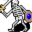

# { .sprite } Skeleton

| Stat | Value |
|---|---|
| Class | construct |
| HP | 100 |
| Max AP | 10 |
| Attack cost | 4 |
| Move cost | 5 |
| Damage | 1 to 4 |
| Attack chance | 40 |
| Block chance | 120 |
| Damage resistance | 5 |
| Critical skill | 0 |
| Critical multiplier | 0 |

!!! note "Immune to critical hits"
    Monsters of this class cannot be critically hit.

## Found on

- [waytogalmore0](../maps/waytogalmore0.md)

<small>Monster ID: `stn_colonel_mons2` · Data from v0.8.18</small>
