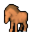

# { .sprite } Horse

<div class="infobox" markdown>

<p class="ib-img">{ .sprite }</p>

| | |
|---|---|
| **Monster ID** | `stn_horse` |
| **Type** | NPC |
| **Class** | Animal |
| **HP** | 1 |
| **Found in** | Flagstone Prison |
| **Introduced** | [v0.7.2](../versions/0.7.2.md) |

</div>

## Combat stats

| Stat | Value |
|---|---|
| HP | 1 |
| Damage | 0 |
| Attack chance | 0 |
| Block chance | 0 |
| Damage resistance | 0 |
| Max AP | 10 |
| Attack cost | 10 AP |
| Attacks per turn | 1 |
| Move cost | 10 AP |
| Critical skill | 0 |
| Critical multiplier | – |
| Crit chance | none (needs critical skill and a multiplier) |

**XP formula** (from the game's loader): ⌈(attacks per turn × attack chance × average damage × (1 + critical skill × multiplier) × 3 + HP × (1 + block chance) + 9 × damage resistance) × 0.7⌉, +50 if its hits inflict a condition. More Exp adds a percentage on top.

<p class="verified">Verified against v0.8.18 monster data and game code (`MonsterTypeParser.java`).</p>


## Locations

| Map | Region | Up to | Notes |
|---|---|---|---|
| [stoutford_castle_stable](../maps/stoutford_castle_stable.md) | Flagstone Prison | 1 | – |


## Quests

- [stn_nondisplay (hidden flag)](../quests/stn_nondisplay.md): stages 6

## Dialogue simulator

Set up your situation (quest stages, items, kills…), then talk to Horse. The simulator follows the game's own rules: it takes the same silent checks, offers only the options you'd really see, and applies their effects (quest stages, items handed over, rewards) as you go.

<div class="dlg-sim" data-src="../../assets/dialogue/stn_horse.json" data-npc="Horse" markdown="0"><noscript>The simulator needs JavaScript. The full dialogue is listed below.</noscript></div>

<p class="verified">Rules verified against v0.8.18 game code (ConversationController.java) and dialogue data.</p>

??? quote "Dialogue (6 lines)"

    *What the dialogue says, exactly as in the game files. Lines are listed once; links jump to the line a choice leads to.*

    <span id="d-stn_horse"></span>**`stn_horse`** *(silent check: the first matching branch below is taken)*

    - branch 1 *(if reached stage 6 of [stn_nondisplay (hidden flag)](../quests/stn_nondisplay.md#stage-6))* → [stn_horse_90](#d-stn_horse_90)
    - branch 2 → [stn_horse_10](#d-stn_horse_10)

    <span id="d-stn_horse_90"></span>**`stn_horse_90`** Horse: “Neigh.”


    <span id="d-stn_horse_10"></span>**`stn_horse_10`** Horse: “Neigh!”

    - “Oh, nice to meet you.” → [stn_horse_12](#d-stn_horse_12)

    <span id="d-stn_horse_12"></span>**`stn_horse_12`** Horse: “Neigh!!!”

    - “One might think that you want something from me.” → [stn_horse_20](#d-stn_horse_20)
    - “Haha, I think I'm going crazy. Horses can't talk.” → *conversation ends*
    - “Neigh.” → [stn_horse_12](#d-stn_horse_12)

    <span id="d-stn_horse_20"></span>**`stn_horse_20`** Horse: “Neigh! Neigh!!! neigh.”

    - “Oh I see now. They left you here without anything to drink. Wait, Here is a bucket of water.” → [stn_horse_30](#d-stn_horse_30)
    - “You are becoming gradually more annoying. I'm leaving now.” → *conversation ends*

    <span id="d-stn_horse_30"></span>**`stn_horse_30`** Horse: “[After drinking greedily] Neiiieieiiigh!!” — **effects:** sets stage 6 of [stn_nondisplay (hidden flag)](../quests/stn_nondisplay.md#stage-6)

    - “There, now you feel better! I have to leave now.” → [stn_horse_90](#d-stn_horse_90)


## Version history

| Version | Change |
|---|---|
| [v0.7.2](../versions/0.7.2.md) | Added<br>Dialogue: 6 lines added |

<p class="verified">Verified against v0.8.18 and every earlier release back to v0.7.0 (game data compared release by release).</p>


## Community notes

<small>Written by players, not generated from game data. **Observations**: what players notice in-game · **Lore**: the in-world story · **Trivia**: real-world facts, references, development history · **Theory / speculation**: unconfirmed ideas; may just be unfinished content</small>

### Observations

*Nothing here yet. Know something? [Add it](https://github.com/asdfghjkl628/Andor-s-Trail-Wikiiii/new/main/notes/monsters?filename=stn_horse.md&value=%23%23%20Observations%0A%0A%3C%21--%20what%20players%20notice%20in-game%20--%3E%0A%0A%23%23%20Lore%0A%0A%3C%21--%20the%20in-world%20story%20--%3E%0A%0A%23%23%20Trivia%0A%0A%3C%21--%20real-world%20facts%2C%20references%2C%20development%20history%20--%3E%0A%0A%23%23%20Theory%20/%20speculation%0A%0A%3C%21--%20unconfirmed%20ideas%3B%20may%20just%20be%20unfinished%20content%20--%3E%0A).*

### Lore

*Nothing here yet. Know something? [Add it](https://github.com/asdfghjkl628/Andor-s-Trail-Wikiiii/new/main/notes/monsters?filename=stn_horse.md&value=%23%23%20Observations%0A%0A%3C%21--%20what%20players%20notice%20in-game%20--%3E%0A%0A%23%23%20Lore%0A%0A%3C%21--%20the%20in-world%20story%20--%3E%0A%0A%23%23%20Trivia%0A%0A%3C%21--%20real-world%20facts%2C%20references%2C%20development%20history%20--%3E%0A%0A%23%23%20Theory%20/%20speculation%0A%0A%3C%21--%20unconfirmed%20ideas%3B%20may%20just%20be%20unfinished%20content%20--%3E%0A).*

### Trivia

*Nothing here yet. Know something? [Add it](https://github.com/asdfghjkl628/Andor-s-Trail-Wikiiii/new/main/notes/monsters?filename=stn_horse.md&value=%23%23%20Observations%0A%0A%3C%21--%20what%20players%20notice%20in-game%20--%3E%0A%0A%23%23%20Lore%0A%0A%3C%21--%20the%20in-world%20story%20--%3E%0A%0A%23%23%20Trivia%0A%0A%3C%21--%20real-world%20facts%2C%20references%2C%20development%20history%20--%3E%0A%0A%23%23%20Theory%20/%20speculation%0A%0A%3C%21--%20unconfirmed%20ideas%3B%20may%20just%20be%20unfinished%20content%20--%3E%0A).*

### Theory / speculation

*Nothing here yet. Know something? [Add it](https://github.com/asdfghjkl628/Andor-s-Trail-Wikiiii/new/main/notes/monsters?filename=stn_horse.md&value=%23%23%20Observations%0A%0A%3C%21--%20what%20players%20notice%20in-game%20--%3E%0A%0A%23%23%20Lore%0A%0A%3C%21--%20the%20in-world%20story%20--%3E%0A%0A%23%23%20Trivia%0A%0A%3C%21--%20real-world%20facts%2C%20references%2C%20development%20history%20--%3E%0A%0A%23%23%20Theory%20/%20speculation%0A%0A%3C%21--%20unconfirmed%20ideas%3B%20may%20just%20be%20unfinished%20content%20--%3E%0A).*


??? info "Technical information"

    | | |
    |---|---|
    | Monster ID | `stn_horse` |
    | Spawn group | `stn_horse` |
    | Loot table | – |
    | Conversation | `stn_horse` |
    | Faction | – |
    | Movement | – |
    | Icon | `monsters_ld2:66` |
    | Defined in | `res/raw/monsterlist_stoutford_combined.json` |

    Raw data:

    ```json
    {
     "id": "stn_horse",
     "name": "Horse",
     "iconID": "monsters_ld2:66",
     "monsterClass": "animal",
     "phraseID": "stn_horse"
    }
    ```


<small>Data from v0.8.18</small>
