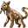

# { .sprite } Stoneclaw prowler

| Stat | Value |
|---|---|
| Class | animal |
| HP | 230 |
| Max AP | 12 |
| Attack cost | 3 |
| Move cost | 4 |
| Damage | 8 to 9 |
| Attack chance | 130 |
| Block chance | 170 |
| Damage resistance | 1 |
| Critical skill | 10 |
| Critical multiplier | 1.25 |

## On hit

- **On target:** Bleeding wound (magnitude 3, 4 rounds, 30% chance)

## Drops

| Item | Chance | Qty |
|---|---|---|
| [Feline fang](../items/feline_fang.md) | 8% | 1 |
| [Feline milk](../items/feline_milk.md) | 10% | 1 |

## Found on

- [galmore_13](../maps/galmore_13.md)
- [galmore_15](../maps/galmore_15.md)
- [galmore_18](../maps/galmore_18.md)
- [lake_shore_road_6](../maps/lake_shore_road_6.md)
- [rat_mountain_1](../maps/rat_mountain_1.md)
- [rat_mountain_2](../maps/rat_mountain_2.md)
- [rat_mountain_4](../maps/rat_mountain_4.md)
- [rat_mountain_5](../maps/rat_mountain_5.md)
- [rat_mountain_6](../maps/rat_mountain_6.md)
- [rat_mountain_7](../maps/rat_mountain_7.md)

<small>Monster ID: `stoneclaw_prowler` · Data from v0.8.18</small>
