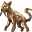

# { .sprite } Stoneclaw prowler

**Found in:** Flagstone Prison: [lake_shore_road_6](../maps/lake_shore_road_6.md), Flagstone Prison: [rat_mountain_1](../maps/rat_mountain_1.md), Flagstone Prison: [rat_mountain_2](../maps/rat_mountain_2.md), Flagstone Prison: [rat_mountain_5](../maps/rat_mountain_5.md) (+6 more)

<div class="infobox" markdown>

<p class="ib-img">{ .sprite }</p>

| | |
|---|---|
| **Type** | Enemy (hostile on sight) |
| **Found in** | Stoutford, Flagstone Prison |
| **Class** | Animal |
| **HP** | 230 |
| **XP when defeated** | 596 |
| **Entry ID** | `stoneclaw_prowler` |
| **Introduced** | [v0.8.8](../versions/0.8.8.md) |

</div>

## Combat statistics

| Statistic | Value |
|---|---|
| Class | Animal |
| HP | 230 |
| XP when defeated | 596 |
| Damage | 8 to 9 |
| Attack chance | 130 |
| Block chance | 170 |
| Damage resistance | 1 |
| Max AP | 12 |
| Attack cost | 3 AP |
| Attacks per turn | 4 |
| Move cost | 4 AP |
| Critical skill | 10 |
| Critical multiplier | 1.25 |
| Critical hit chance | 9% |

**On hit:** On target: Bleeding wound (magnitude 3, 4 rounds, 30% chance)


<p class="verified">Verified against v0.8.18 monster data and game code (`MonsterTypeParser.java`).</p>

## Drops

| Item | Chance | Qty |
|---|---|---|
| [Feline fang](../items/feline_fang.md) | 8% | 1 |
| [Feline milk](../items/feline_milk.md) | 10% | 1 |

## Locations

| Map | Region | Up to | Notes |
|---|---|---|---|
| [galmore_13](../maps/galmore_13.md) | Stoutford | 2 | – |
| [galmore_15](../maps/galmore_15.md) | – | 1 | – |
| [galmore_18](../maps/galmore_18.md) | – | 1 | – |
| [lake_shore_road_6](../maps/lake_shore_road_6.md) | Flagstone Prison | 1 | – |
| [rat_mountain_1](../maps/rat_mountain_1.md) | Flagstone Prison | 1 | – |
| [rat_mountain_2](../maps/rat_mountain_2.md) | Flagstone Prison | 2 | – |
| [rat_mountain_4](../maps/rat_mountain_4.md) | – | 1 | – |
| [rat_mountain_5](../maps/rat_mountain_5.md) | Flagstone Prison | 2 | – |
| [rat_mountain_6](../maps/rat_mountain_6.md) | – | 3 | – |
| [rat_mountain_7](../maps/rat_mountain_7.md) | Flagstone Prison | 3 | – |


## Version history

| Version | Change |
|---|---|
| [v0.8.8](../versions/0.8.8.md) | Added |

<p class="verified">Verified against v0.8.18 and every earlier release back to v0.7.0 (game data compared release by release).</p>


??? info "Technical information"

    | | |
    |---|---|
    | Entry ID | `stoneclaw_prowler` |
    | Spawn group | `stoneclaw_prowler` |
    | Loot table | `stoneclaw_prowler_dl` |
    | Conversation | – |
    | Faction | – |
    | Movement | protectSpawn |
    | Icon | `monsters_newb_1:250` |
    | Defined in | `res/raw/monsterlist_mt_galmore.json` |

    Raw data:

    ```json
    {
     "id": "stoneclaw_prowler",
     "name": "Stoneclaw prowler",
     "iconID": "monsters_newb_1:250",
     "maxHP": 230,
     "maxAP": 12,
     "moveCost": 4,
     "monsterClass": "animal",
     "movementAggressionType": "protectSpawn",
     "attackDamage": {
      "min": 8,
      "max": 9
     },
     "droplistID": "stoneclaw_prowler_dl",
     "attackCost": 3,
     "attackChance": 130,
     "criticalSkill": 10,
     "criticalMultiplier": 1.25,
     "blockChance": 170,
     "damageResistance": 1,
     "hitEffect": {
      "conditionsTarget": [
       {
        "condition": "bleeding_wound",
        "magnitude": 3,
        "duration": 4,
        "chance": "30"
       }
      ]
     }
    }
    ```


??? info "How the XP value is calculated"

    The game computes each enemy's experience value when it loads the data (`MonsterTypeParser.java`):

    XP = ⌈(attacks per turn × attack chance × average damage × (1 + critical skill × critical multiplier) × 3 + HP × (1 + block chance) + 9 × damage resistance) × 0.7⌉

    Percentages are used as fractions (e.g. 60% = 0.6). Enemies whose attacks inflict a condition are worth 50 XP more. The More Exp skill adds a percentage on top.


## Community notes

<small>Written by players, not generated from game data. **Observations**: what players notice in-game · **Lore**: the in-world story · **Trivia**: real-world facts, references, development history · **Theory / speculation**: unconfirmed ideas; may just be unfinished content</small>

### Observations

*No notes yet. Contributions are welcome: [add a note](https://github.com/asdfghjkl628/Andor-s-Trail-Wikiiii/new/main/notes/monsters?filename=stoneclaw_prowler.md&value=%23%23%20Observations%0A%0A%3C%21--%20what%20players%20notice%20in-game%20--%3E%0A%0A%23%23%20Lore%0A%0A%3C%21--%20the%20in-world%20story%20--%3E%0A%0A%23%23%20Trivia%0A%0A%3C%21--%20real-world%20facts%2C%20references%2C%20development%20history%20--%3E%0A%0A%23%23%20Theory%20/%20speculation%0A%0A%3C%21--%20unconfirmed%20ideas%3B%20may%20just%20be%20unfinished%20content%20--%3E%0A).*

### Lore

*No notes yet. Contributions are welcome: [add a note](https://github.com/asdfghjkl628/Andor-s-Trail-Wikiiii/new/main/notes/monsters?filename=stoneclaw_prowler.md&value=%23%23%20Observations%0A%0A%3C%21--%20what%20players%20notice%20in-game%20--%3E%0A%0A%23%23%20Lore%0A%0A%3C%21--%20the%20in-world%20story%20--%3E%0A%0A%23%23%20Trivia%0A%0A%3C%21--%20real-world%20facts%2C%20references%2C%20development%20history%20--%3E%0A%0A%23%23%20Theory%20/%20speculation%0A%0A%3C%21--%20unconfirmed%20ideas%3B%20may%20just%20be%20unfinished%20content%20--%3E%0A).*

### Trivia

*No notes yet. Contributions are welcome: [add a note](https://github.com/asdfghjkl628/Andor-s-Trail-Wikiiii/new/main/notes/monsters?filename=stoneclaw_prowler.md&value=%23%23%20Observations%0A%0A%3C%21--%20what%20players%20notice%20in-game%20--%3E%0A%0A%23%23%20Lore%0A%0A%3C%21--%20the%20in-world%20story%20--%3E%0A%0A%23%23%20Trivia%0A%0A%3C%21--%20real-world%20facts%2C%20references%2C%20development%20history%20--%3E%0A%0A%23%23%20Theory%20/%20speculation%0A%0A%3C%21--%20unconfirmed%20ideas%3B%20may%20just%20be%20unfinished%20content%20--%3E%0A).*

### Theory / speculation

*No notes yet. Contributions are welcome: [add a note](https://github.com/asdfghjkl628/Andor-s-Trail-Wikiiii/new/main/notes/monsters?filename=stoneclaw_prowler.md&value=%23%23%20Observations%0A%0A%3C%21--%20what%20players%20notice%20in-game%20--%3E%0A%0A%23%23%20Lore%0A%0A%3C%21--%20the%20in-world%20story%20--%3E%0A%0A%23%23%20Trivia%0A%0A%3C%21--%20real-world%20facts%2C%20references%2C%20development%20history%20--%3E%0A%0A%23%23%20Theory%20/%20speculation%0A%0A%3C%21--%20unconfirmed%20ideas%3B%20may%20just%20be%20unfinished%20content%20--%3E%0A).*


<small>Data from v0.8.18</small>
