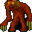

# { .sprite } Strong gornaud

| Stat | Value |
|---|---|
| Class | giant |
| HP | 95 |
| Max AP | 10 |
| Attack cost | 5 |
| Move cost | 5 |
| Damage | 0 to 15 |
| Attack chance | 70 |
| Block chance | 50 |
| Damage resistance | 5 |
| Critical skill | 0 |
| Critical multiplier | 0 |

## On hit

- **On target:** Dazed (magnitude 1, 5 rounds, 70% chance)

## Drops

| Item | Chance | Qty |
|---|---|---|
| [Gold coins](../items/gold.md) | 70% | 1 to 45 |
| [Meat](../items/meat.md) | 5% | 1 to 3 |
| [Animal hair](../items/hair.md) | 10% | 1 |
| [Blackwater brew](../items/bwm_brew.md) | 5% | 10 |

## Found on

- [blackwater_mountain17](../maps/blackwater_mountain17.md)
- [blackwater_mountain18](../maps/blackwater_mountain18.md)
- [blackwater_mountain19](../maps/blackwater_mountain19.md)

<small>Monster ID: `strong_gornaud` · Data from v0.8.18</small>
