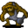

# { .sprite } Strong minotaur

| Stat | Value |
|---|---|
| Class | giant |
| HP | 53 |
| Max AP | 10 |
| Attack cost | 6 |
| Move cost | 10 |
| Damage | 5 |
| Attack chance | 40 |
| Block chance | 50 |
| Damage resistance | 2 |
| Critical skill | 50 |
| Critical multiplier | 3.0 |

## Drops

| Item | Chance | Qty |
|---|---|---|
| [Gold coins](../items/gold.md) | 70% | 4 to 12 |
| [Ruby gem](../items/gem2.md) | 25% | 1 |
| [Iron hammer](../items/hammer0.md) | 5% | 1 |
| [Minor vial of health](../items/health_minor.md) | 25% | 1 |

## Found on

- [jan_pitcave2](../maps/jan_pitcave2.md)

<small>Monster ID: `strong_minotaur` · Data from v0.8.18</small>
