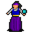

# { .sprite } Beltina

**Where to find Beltina:** Sullengard: [Sullengard 2 northeast house](../maps/sullengard2_northeast_house.md#pin-npc-sullengard_beltina)

<div class="infobox" markdown>

<p class="ib-img">{ .sprite }</p>

| | |
|---|---|
| **Type** | NPC (can be spoken to; cannot be attacked) |
| **Found in** | Sullengard |
| **Entry ID** | `sullengard_beltina` |
| **Introduced** | [v0.8.2](../versions/0.8.2.md) |

</div>

## Dialogue simulator

Set your quest stages and items, then talk to Beltina. Same rules as the game: same checks, same options, same effects.

<div class="dlg-sim" data-src="../../assets/dialogue/sullengard_beltina_10.json" data-npc="Beltina" markdown="0"><noscript>The simulator needs JavaScript. The full dialogue is listed below.</noscript></div>

<p class="verified">Rules verified against v0.8.18 game code (ConversationController.java) and dialogue data.</p>

??? quote "Dialogue (2 lines)"

    *Exactly as in the game files. Each line appears once; links jump to where a choice leads.*

    <span id="d-sullengard_beltina_10"></span>**`sullengard_beltina_10`** Beltina: “Oh, are you here to help my husband, Valhorn to finally win the 'Best beer in festival' competition?”

    - “I'm sorry, but I am not.” → *conversation ends*
    - “"Finally"? How long has it been?” → [sullengard_beltina_20](#d-sullengard_beltina_20)

    <span id="d-sullengard_beltina_20"></span>**`sullengard_beltina_20`** Beltina: “He and his family have never won the competition. Wow! It hurts to say this out loud. The man is a failure. This is why we live in this tiny house.”

    - “I'm sorry.” → *conversation ends*


## Version history

| Version | Change |
|---|---|
| [v0.8.2](../versions/0.8.2.md) | Added<br>Dialogue: 2 lines added |

<p class="verified">Verified against v0.8.18 and every earlier release back to v0.7.0 (game data compared release by release).</p>


??? info "Technical information"

    | | |
    |---|---|
    | Entry ID | `sullengard_beltina` |
    | Spawn group | `sullengard_beltina` |
    | Loot table | – |
    | Conversation | `sullengard_beltina_10` |
    | Faction | – |
    | Movement | – |
    | Icon | `monsters_ld1:166` |
    | Defined in | `res/raw/monsterlist_sullengard.json` |

    Raw data:

    ```json
    {
     "id": "sullengard_beltina",
     "name": "Beltina",
     "iconID": "monsters_ld1:166",
     "unique": 1,
     "monsterClass": "humanoid",
     "spawnGroup": "sullengard_beltina",
     "phraseID": "sullengard_beltina_10"
    }
    ```


## Community notes

<small>Written by players, not generated from game data. **Observations**: what players notice in-game · **Lore**: the in-world story · **Trivia**: real-world facts, references, development history · **Theory / speculation**: unconfirmed ideas; may just be unfinished content</small>

### Observations

*No notes yet. Contributions are welcome: [add a note](https://github.com/asdfghjkl628/Andor-s-Trail-Wikiiii/new/main/notes/monsters?filename=sullengard_beltina.md&value=%23%23%20Observations%0A%0A%3C%21--%20what%20players%20notice%20in-game%20--%3E%0A%0A%23%23%20Lore%0A%0A%3C%21--%20the%20in-world%20story%20--%3E%0A%0A%23%23%20Trivia%0A%0A%3C%21--%20real-world%20facts%2C%20references%2C%20development%20history%20--%3E%0A%0A%23%23%20Theory%20/%20speculation%0A%0A%3C%21--%20unconfirmed%20ideas%3B%20may%20just%20be%20unfinished%20content%20--%3E%0A).*

### Lore

*No notes yet. Contributions are welcome: [add a note](https://github.com/asdfghjkl628/Andor-s-Trail-Wikiiii/new/main/notes/monsters?filename=sullengard_beltina.md&value=%23%23%20Observations%0A%0A%3C%21--%20what%20players%20notice%20in-game%20--%3E%0A%0A%23%23%20Lore%0A%0A%3C%21--%20the%20in-world%20story%20--%3E%0A%0A%23%23%20Trivia%0A%0A%3C%21--%20real-world%20facts%2C%20references%2C%20development%20history%20--%3E%0A%0A%23%23%20Theory%20/%20speculation%0A%0A%3C%21--%20unconfirmed%20ideas%3B%20may%20just%20be%20unfinished%20content%20--%3E%0A).*

### Trivia

*No notes yet. Contributions are welcome: [add a note](https://github.com/asdfghjkl628/Andor-s-Trail-Wikiiii/new/main/notes/monsters?filename=sullengard_beltina.md&value=%23%23%20Observations%0A%0A%3C%21--%20what%20players%20notice%20in-game%20--%3E%0A%0A%23%23%20Lore%0A%0A%3C%21--%20the%20in-world%20story%20--%3E%0A%0A%23%23%20Trivia%0A%0A%3C%21--%20real-world%20facts%2C%20references%2C%20development%20history%20--%3E%0A%0A%23%23%20Theory%20/%20speculation%0A%0A%3C%21--%20unconfirmed%20ideas%3B%20may%20just%20be%20unfinished%20content%20--%3E%0A).*

### Theory / speculation

*No notes yet. Contributions are welcome: [add a note](https://github.com/asdfghjkl628/Andor-s-Trail-Wikiiii/new/main/notes/monsters?filename=sullengard_beltina.md&value=%23%23%20Observations%0A%0A%3C%21--%20what%20players%20notice%20in-game%20--%3E%0A%0A%23%23%20Lore%0A%0A%3C%21--%20the%20in-world%20story%20--%3E%0A%0A%23%23%20Trivia%0A%0A%3C%21--%20real-world%20facts%2C%20references%2C%20development%20history%20--%3E%0A%0A%23%23%20Theory%20/%20speculation%0A%0A%3C%21--%20unconfirmed%20ideas%3B%20may%20just%20be%20unfinished%20content%20--%3E%0A).*


<small>Data from v0.8.18</small>
