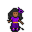

# { .sprite } Grazia

<div class="infobox" markdown>

<p class="ib-img">{ .sprite }</p>

| | |
|---|---|
| **Type** | NPC (can be spoken to; cannot be attacked) |
| **Found in** | Sullengard, way_to_sullengard_east4_bridge |
| **Entries in game data** | 2 |
| **Introduced** | [v0.8.2](../versions/0.8.2.md) |

</div>

!!! info "2 entries in the game data"
    The game's data files define 2 separate characters named Grazia. Andor's Trail stores a character as a new entry whenever it needs different behaviour, for example a different conversation at a later stage of a quest, a different location, or different combat statistics. Some entries represent the same person at different points in the story; others are different people who share a generic name. Here the entries differ in: conversation, location, movement. This page combines them; each entry is described in its own section below.

| Entry | Type | Location | Role |
|---|---|---|---|
| [`sullengard_grazia`](#v-sullengard_grazia) | NPC | Sullengard: [sullengard2_northwest_house](../maps/sullengard2_northwest_house.md#pin-npc-sullengard_grazia) | – |
| [`sull_ravine_grazia`](#v-sull_ravine_grazia) | NPC | [way_to_sullengard_east4_bridge](../maps/way_to_sullengard_east4_bridge.md#pin-npc-sull_ravine_grazia) | – |

## Sullengard, Sullengard2 northwest house (sullengard_grazia) { #v-sullengard_grazia }

**Entry ID:** `sullengard_grazia` · **Type:** NPC

**Location:** Sullengard: [sullengard2_northwest_house](../maps/sullengard2_northwest_house.md#pin-npc-sullengard_grazia)

### Dialogue simulator

Set the quest stages, items and other conditions that apply to your game, then start the conversation with Grazia. The simulator applies the game's own rules: it performs the same silent checks, offers only the options that would be shown in the game, and applies their effects (quest stages, items handed over, rewards) as the conversation proceeds.

<div class="dlg-sim" data-src="../../assets/dialogue/sullengard_grazia_0.json" data-npc="Grazia" markdown="0"><noscript>The simulator needs JavaScript. The full dialogue is listed below.</noscript></div>

<p class="verified">Rules verified against v0.8.18 game code (ConversationController.java) and dialogue data.</p>

??? quote "Dialogue (1 lines)"

    *What the dialogue says, exactly as in the game files. Lines are listed once; links jump to the line a choice leads to.*

    <span id="d-sullengard_grazia-sullengard_grazia_0"></span>**`sullengard_grazia_0`** Grazia: “Thank you again for helping me cross that scary bridge.”

    - “Oh, that? It was my pleasure.” → *conversation ends*


### Version history

| Version | Change |
|---|---|
| [v0.8.2](../versions/0.8.2.md) | Added<br>Dialogue: 1 line added |

<p class="verified">Verified against v0.8.18 and every earlier release back to v0.7.0 (game data compared release by release).</p>


??? info "Technical information (sullengard_grazia)"

    | | |
    |---|---|
    | Entry ID | `sullengard_grazia` |
    | Spawn group | `sullengard_grazia` |
    | Loot table | – |
    | Conversation | `sullengard_grazia_0` |
    | Faction | – |
    | Movement | – |
    | Icon | `monsters_ld1:168` |
    | Defined in | `res/raw/monsterlist_sullengard.json` |

    Raw data:

    ```json
    {
     "id": "sullengard_grazia",
     "name": "Grazia",
     "iconID": "monsters_ld1:168",
     "unique": 1,
     "monsterClass": "humanoid",
     "spawnGroup": "sullengard_grazia",
     "phraseID": "sullengard_grazia_0"
    }
    ```


## Way to sullengard east4 bridge (sull_ravine_grazia) { #v-sull_ravine_grazia }

**Entry ID:** `sull_ravine_grazia` · **Type:** NPC

**Location:** [way_to_sullengard_east4_bridge](../maps/way_to_sullengard_east4_bridge.md#pin-npc-sull_ravine_grazia)

### Quests

- [sullengard_nondisplay (hidden flag)](../quests/sullengard_hidden.md): stages 17, 18

### Dialogue simulator

Set the quest stages, items and other conditions that apply to your game, then start the conversation with Grazia. The simulator applies the game's own rules: it performs the same silent checks, offers only the options that would be shown in the game, and applies their effects (quest stages, items handed over, rewards) as the conversation proceeds.

<div class="dlg-sim" data-src="../../assets/dialogue/sull_ravine_grazia_0.json" data-npc="Grazia" markdown="0"><noscript>The simulator needs JavaScript. The full dialogue is listed below.</noscript></div>

<p class="verified">Rules verified against v0.8.18 game code (ConversationController.java) and dialogue data.</p>

??? quote "Dialogue (12 lines)"

    *What the dialogue says, exactly as in the game files. Lines are listed once; links jump to the line a choice leads to.*

    <span id="d-sull_ravine_grazia-sull_ravine_grazia_0"></span>**`sull_ravine_grazia_0`** *(silent check: the first matching branch below is taken)*

    - Next *(if reached stage 18 of [sullengard_nondisplay (hidden flag)](../quests/sullengard_hidden.md#stage-18))* → *conversation ends*
    - Next *(if reached stage 29 of [sullengard_nondisplay (hidden flag)](../quests/sullengard_hidden.md#stage-29))* → [sull_ravine_grazia_60](#d-sull_ravine_grazia-sull_ravine_grazia_60)
    - Next → [sull_ravine_grazia_1](#d-sull_ravine_grazia-sull_ravine_grazia_1)

    <span id="d-sull_ravine_grazia-sull_ravine_grazia_60"></span>**`sull_ravine_grazia_60`** [Grazia](../monsters/sullengard_grazia.md#v-sull_ravine_grazia): “Thank you so much. I can now continue onto my destination.” — **effects:** sets stage 18 of [sullengard_nondisplay (hidden flag)](../quests/sullengard_hidden.md#stage-18), removes monsters from way_to_sullengard_east4, spawns monsters on sullengard2_northwest_house

    - “Where were you coming from anyway?” → [sull_ravine_grazia_70](#d-sull_ravine_grazia-sull_ravine_grazia_70)

    <span id="d-sull_ravine_grazia-sull_ravine_grazia_1"></span>**`sull_ravine_grazia_1`** Grazia: “Please, please, you have to help me! I tried to, but I am too scared.”

    - “Tried to do what?” → [sull_ravine_grazia_10](#d-sull_ravine_grazia-sull_ravine_grazia_10)

    <span id="d-sull_ravine_grazia-sull_ravine_grazia_70"></span>**`sull_ravine_grazia_70`** Grazia: “I have been traveling from Nor City to Sullengard to visit my aunt and uncle and to help them prepare for the Sullengard beer festival next month. I hope to see you soon.”

    - “Yeah, about seeing you soon. Where is Sullengard?” *(if NOT reached stage 19 of [sullengard_nondisplay (hidden flag)](../quests/sullengard_hidden.md#stage-19))* → [sull_ravine_grazia_80](#d-sull_ravine_grazia-sull_ravine_grazia_80)
    - “I'm looking forward to it.” *(if reached stage 19 of [sullengard_nondisplay (hidden flag)](../quests/sullengard_hidden.md#stage-19))* → [sull_ravine_grazia_90](#d-sull_ravine_grazia-sull_ravine_grazia_90)

    <span id="d-sull_ravine_grazia-sull_ravine_grazia_10"></span>**`sull_ravine_grazia_10`** Grazia: “I tried to do what Hadena said, but I just can't do it.”

    - “Do what?!” → [sull_ravine_grazia_20](#d-sull_ravine_grazia-sull_ravine_grazia_20)
    - “Who is Hadena?” *(if NOT reached stage 16 of [sullengard_nondisplay (hidden flag)](../quests/sullengard_hidden.md#stage-16))* → [sull_ravine_grazia_15](#d-sull_ravine_grazia-sull_ravine_grazia_15)

    <span id="d-sull_ravine_grazia-sull_ravine_grazia_80"></span>**`sull_ravine_grazia_80`** Grazia: “Oh, you've never been there? It is southwest of here.”

    - Next → [sull_ravine_grazia_90](#d-sull_ravine_grazia-sull_ravine_grazia_90)

    <span id="d-sull_ravine_grazia-sull_ravine_grazia_90"></span>**`sull_ravine_grazia_90`** Grazia: “I have to go now. See you there.” — **effects:** sets stage 18 of [sullengard_nondisplay (hidden flag)](../quests/sullengard_hidden.md#stage-18), removes monsters from way_to_sullengard_east4_bridge, spawns monsters on sullengard2_northwest_house


    <span id="d-sull_ravine_grazia-sull_ravine_grazia_20"></span>**`sull_ravine_grazia_20`** Grazia: “To cross the bridge of course.”

    - “Why? It seems easy enough and from here, the bridge looks safe. What's the problem?” → [sull_ravine_grazia_30](#d-sull_ravine_grazia-sull_ravine_grazia_30)

    <span id="d-sull_ravine_grazia-sull_ravine_grazia_15"></span>**`sull_ravine_grazia_15`** Grazia: “Oh, she is a lady who lives in that cabin that you just walked past.”

    - “Oh, I see. Now what is it that you are trying to do?” → [sull_ravine_grazia_20](#d-sull_ravine_grazia-sull_ravine_grazia_20)

    <span id="d-sull_ravine_grazia-sull_ravine_grazia_30"></span>**`sull_ravine_grazia_30`** Grazia: “The wind! It is very scary when the entire bridge sways back and forth while you are crossing over it.”

    - “I'll tell you what, let's cross it together.” → [sull_ravine_grazia_40](#d-sull_ravine_grazia-sull_ravine_grazia_40)

    <span id="d-sull_ravine_grazia-sull_ravine_grazia_40"></span>**`sull_ravine_grazia_40`** Grazia: “How? It's not wide enough for both of us.”

    - “I will go first and you can follow close behind. Sound OK with you?” → [sull_ravine_grazia_50](#d-sull_ravine_grazia-sull_ravine_grazia_50)

    <span id="d-sull_ravine_grazia-sull_ravine_grazia_50"></span>**`sull_ravine_grazia_50`** Grazia: “Yes. Thank you.” — **effects:** sets stage 17 of [sullengard_nondisplay (hidden flag)](../quests/sullengard_hidden.md#stage-17)

    - “No problem. Let's go now.” → *conversation ends*


### Version history

| Version | Change |
|---|---|
| [v0.8.2](../versions/0.8.2.md) | Added<br>Dialogue: 12 lines added |

<p class="verified">Verified against v0.8.18 and every earlier release back to v0.7.0 (game data compared release by release).</p>


??? info "Technical information (sull_ravine_grazia)"

    | | |
    |---|---|
    | Entry ID | `sull_ravine_grazia` |
    | Spawn group | `sull_ravine_grazia` |
    | Loot table | – |
    | Conversation | `sull_ravine_grazia_0` |
    | Faction | – |
    | Movement | wholeMap |
    | Icon | `monsters_ld1:168` |
    | Defined in | `res/raw/monsterlist_sullengard.json` |

    Raw data:

    ```json
    {
     "id": "sull_ravine_grazia",
     "name": "Grazia",
     "iconID": "monsters_ld1:168",
     "moveCost": 3,
     "unique": 1,
     "monsterClass": "humanoid",
     "movementAggressionType": "wholeMap",
     "spawnGroup": "sull_ravine_grazia",
     "phraseID": "sull_ravine_grazia_0"
    }
    ```


## Community notes

<small>Written by players, not generated from game data. **Observations**: what players notice in-game · **Lore**: the in-world story · **Trivia**: real-world facts, references, development history · **Theory / speculation**: unconfirmed ideas; may just be unfinished content</small>

### Observations

*No notes yet. Contributions are welcome: [add a note](https://github.com/asdfghjkl628/Andor-s-Trail-Wikiiii/new/main/notes/monsters?filename=sullengard_grazia.md&value=%23%23%20Observations%0A%0A%3C%21--%20what%20players%20notice%20in-game%20--%3E%0A%0A%23%23%20Lore%0A%0A%3C%21--%20the%20in-world%20story%20--%3E%0A%0A%23%23%20Trivia%0A%0A%3C%21--%20real-world%20facts%2C%20references%2C%20development%20history%20--%3E%0A%0A%23%23%20Theory%20/%20speculation%0A%0A%3C%21--%20unconfirmed%20ideas%3B%20may%20just%20be%20unfinished%20content%20--%3E%0A).*

### Lore

*No notes yet. Contributions are welcome: [add a note](https://github.com/asdfghjkl628/Andor-s-Trail-Wikiiii/new/main/notes/monsters?filename=sullengard_grazia.md&value=%23%23%20Observations%0A%0A%3C%21--%20what%20players%20notice%20in-game%20--%3E%0A%0A%23%23%20Lore%0A%0A%3C%21--%20the%20in-world%20story%20--%3E%0A%0A%23%23%20Trivia%0A%0A%3C%21--%20real-world%20facts%2C%20references%2C%20development%20history%20--%3E%0A%0A%23%23%20Theory%20/%20speculation%0A%0A%3C%21--%20unconfirmed%20ideas%3B%20may%20just%20be%20unfinished%20content%20--%3E%0A).*

### Trivia

*No notes yet. Contributions are welcome: [add a note](https://github.com/asdfghjkl628/Andor-s-Trail-Wikiiii/new/main/notes/monsters?filename=sullengard_grazia.md&value=%23%23%20Observations%0A%0A%3C%21--%20what%20players%20notice%20in-game%20--%3E%0A%0A%23%23%20Lore%0A%0A%3C%21--%20the%20in-world%20story%20--%3E%0A%0A%23%23%20Trivia%0A%0A%3C%21--%20real-world%20facts%2C%20references%2C%20development%20history%20--%3E%0A%0A%23%23%20Theory%20/%20speculation%0A%0A%3C%21--%20unconfirmed%20ideas%3B%20may%20just%20be%20unfinished%20content%20--%3E%0A).*

### Theory / speculation

*No notes yet. Contributions are welcome: [add a note](https://github.com/asdfghjkl628/Andor-s-Trail-Wikiiii/new/main/notes/monsters?filename=sullengard_grazia.md&value=%23%23%20Observations%0A%0A%3C%21--%20what%20players%20notice%20in-game%20--%3E%0A%0A%23%23%20Lore%0A%0A%3C%21--%20the%20in-world%20story%20--%3E%0A%0A%23%23%20Trivia%0A%0A%3C%21--%20real-world%20facts%2C%20references%2C%20development%20history%20--%3E%0A%0A%23%23%20Theory%20/%20speculation%0A%0A%3C%21--%20unconfirmed%20ideas%3B%20may%20just%20be%20unfinished%20content%20--%3E%0A).*


<small>Data from v0.8.18</small>
