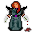

# { .sprite } Lamberta

| Stat | Value |
|---|---|
| Class | humanoid |
| HP | 0 |
| Max AP | 10 |
| Attack cost | 10 |
| Move cost | 10 |
| Damage | 0 |
| Attack chance | 0 |
| Block chance | 0 |
| Damage resistance | 0 |
| Critical skill | 0 |
| Critical multiplier | 0 |

## Shop stock

| Item | Chance | Qty |
|---|---|---|
| [Carpenter's hammer](../items/hammer_carpenter.md) | 100% | 1 to 2 |
| [War Axe of the Shadow](../items/war_axe_shadow.md) | 60% | 1 |
| [Greataxe of broken promises](../items/great_axe_of_bp.md) | 100% | 1 |
| [Darkheart broadsword](../items/dark_heart_sword.md) | 100% | 1 |
| [Thunderguard Copper sword](../items/thunderguard_2h_sword.md) | 50% | 1 |
| [Iron flail](../items/flail_iron.md) | 100% | 1 to 2 |
| [Skullcrusher](../items/hammer_skullcrusher.md) | 100% | 1 to 2 |
| [Balanced heavy iron club](../items/club_wood2.md) | 100% | 2 to 5 |

## Found on

- [sullengard_weapon_shop](../maps/sullengard_weapon_shop.md)

<small>Monster ID: `sullengard_lamberta` · Data from v0.8.18</small>
