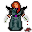

# { .sprite } Lamberta

**Where to find Lamberta:** Sullengard: [sullengard_weapon_shop](../maps/sullengard_weapon_shop.md#pin-npc-sullengard_lamberta)

<div class="infobox" markdown>

<p class="ib-img">{ .sprite }</p>

| | |
|---|---|
| **Type** | NPC (can be spoken to; cannot be attacked) |
| **Role** | Shopkeeper |
| **Found in** | Sullengard |
| **Entry ID** | `sullengard_lamberta` |
| **Introduced** | [v0.8.2](../versions/0.8.2.md) |

</div>

## Shop stock

| Item | Chance | Qty |
|---|---|---|
| [Carpenter's hammer](../items/hammer_carpenter.md) | 100% | 1 to 2 |
| [War Axe of the Shadow](../items/war_axe_shadow.md) | 60% | 1 |
| [Greataxe of broken promises](../items/great_axe_of_bp.md) | 100% | 1 |
| [Darkheart broadsword](../items/dark_heart_sword.md) | 100% | 1 |
| [Thunderguard Copper sword](../items/thunderguard_2h_sword.md) | 50% | 1 |
| [Iron flail](../items/flail_iron.md) | 100% | 1 to 2 |
| [Skullcrusher](../items/hammer_skullcrusher.md) | 100% | 1 to 2 |
| [Balanced heavy iron club](../items/club_wood2.md) | 100% | 2 to 5 |

## Quests

- [sullengard_nondisplay (hidden flag)](../quests/sullengard_hidden.md): stage 24

## Dialogue simulator

Set the quest stages, items and other conditions that apply to your game, then start the conversation with Lamberta. The simulator applies the game's own rules: it performs the same silent checks, offers only the options that would be shown in the game, and applies their effects (quest stages, items handed over, rewards) as the conversation proceeds.

<div class="dlg-sim" data-src="../../assets/dialogue/sullengard_lamberta_0.json" data-npc="Lamberta" markdown="0"><noscript>The simulator needs JavaScript. The full dialogue is listed below.</noscript></div>

<p class="verified">Rules verified against v0.8.18 game code (ConversationController.java) and dialogue data.</p>

??? quote "Dialogue (4 lines)"

    *What the dialogue says, exactly as in the game files. Lines are listed once; links jump to the line a choice leads to.*

    <span id="d-sullengard_lamberta_0"></span>**`sullengard_lamberta_0`** Lamberta: “How can I help you?”

    - “I'm looking into the armory break-in and robbery and I am wondering if you saw or know anything about it?” *(if NOT reached stage 24 of [sullengard_nondisplay (hidden flag)](../quests/sullengard_hidden.md#stage-24); latest stage of [Recovering stolen property](../quests/sullengard_recover_items.md#stage-30) is 30)* → [sullengard_lamberta_10](#d-sullengard_lamberta_10)
    - “I'm looking into the armory break-in and robbery and I am wondering if you saw or know anything about it?” *(if reached stage 24 of [sullengard_nondisplay (hidden flag)](../quests/sullengard_hidden.md#stage-24); latest stage of [Recovering stolen property](../quests/sullengard_recover_items.md#stage-30) is 30)* → [sullengard_lamberta_11](#d-sullengard_lamberta_11)
    - “Can I see what you have for sale?” → [sullengard_lamberta_sell](#d-sullengard_lamberta_sell)

    <span id="d-sullengard_lamberta_10"></span>**`sullengard_lamberta_10`** Lamberta: “No, I'm sorry, I don't. All I know is that I really hope it doesn't happen to me.” — **effects:** sets stage 24 of [sullengard_nondisplay (hidden flag)](../quests/sullengard_hidden.md#stage-24)

    - “Thank you anyway.” → *conversation ends*

    <span id="d-sullengard_lamberta_11"></span>**`sullengard_lamberta_11`** Lamberta: “What wrong with you, kid? I already told you that all I know is that I really hope it doesn't happen to me.”

    - “Oh, yeah. Sorry about that.” → *conversation ends*
    - “Why do you have to be so mean about it? I simply forgot that I already asked you.” → *conversation ends*

    <span id="d-sullengard_lamberta_sell"></span>**`sullengard_lamberta_sell`** Lamberta: “Absolutely.”

    - “Thank you!” → *shop opens*


## Version history

| Version | Change |
|---|---|
| [v0.8.2](../versions/0.8.2.md) | Added<br>Dialogue: 4 lines added |

<p class="verified">Verified against v0.8.18 and every earlier release back to v0.7.0 (game data compared release by release).</p>


??? info "Technical information"

    | | |
    |---|---|
    | Entry ID | `sullengard_lamberta` |
    | Spawn group | `sullengard_lamberta` |
    | Loot table | `sullengard_lamberta_dl` |
    | Conversation | `sullengard_lamberta_0` |
    | Faction | – |
    | Movement | – |
    | Icon | `monsters_omi1:1` |
    | Defined in | `res/raw/monsterlist_sullengard.json` |

    Raw data:

    ```json
    {
     "id": "sullengard_lamberta",
     "name": "Lamberta",
     "iconID": "monsters_omi1:1",
     "unique": 1,
     "monsterClass": "humanoid",
     "spawnGroup": "sullengard_lamberta",
     "phraseID": "sullengard_lamberta_0",
     "droplistID": "sullengard_lamberta_dl"
    }
    ```


## Community notes

<small>Written by players, not generated from game data. **Observations**: what players notice in-game · **Lore**: the in-world story · **Trivia**: real-world facts, references, development history · **Theory / speculation**: unconfirmed ideas; may just be unfinished content</small>

### Observations

*No notes yet. Contributions are welcome: [add a note](https://github.com/asdfghjkl628/Andor-s-Trail-Wikiiii/new/main/notes/monsters?filename=sullengard_lamberta.md&value=%23%23%20Observations%0A%0A%3C%21--%20what%20players%20notice%20in-game%20--%3E%0A%0A%23%23%20Lore%0A%0A%3C%21--%20the%20in-world%20story%20--%3E%0A%0A%23%23%20Trivia%0A%0A%3C%21--%20real-world%20facts%2C%20references%2C%20development%20history%20--%3E%0A%0A%23%23%20Theory%20/%20speculation%0A%0A%3C%21--%20unconfirmed%20ideas%3B%20may%20just%20be%20unfinished%20content%20--%3E%0A).*

### Lore

*No notes yet. Contributions are welcome: [add a note](https://github.com/asdfghjkl628/Andor-s-Trail-Wikiiii/new/main/notes/monsters?filename=sullengard_lamberta.md&value=%23%23%20Observations%0A%0A%3C%21--%20what%20players%20notice%20in-game%20--%3E%0A%0A%23%23%20Lore%0A%0A%3C%21--%20the%20in-world%20story%20--%3E%0A%0A%23%23%20Trivia%0A%0A%3C%21--%20real-world%20facts%2C%20references%2C%20development%20history%20--%3E%0A%0A%23%23%20Theory%20/%20speculation%0A%0A%3C%21--%20unconfirmed%20ideas%3B%20may%20just%20be%20unfinished%20content%20--%3E%0A).*

### Trivia

*No notes yet. Contributions are welcome: [add a note](https://github.com/asdfghjkl628/Andor-s-Trail-Wikiiii/new/main/notes/monsters?filename=sullengard_lamberta.md&value=%23%23%20Observations%0A%0A%3C%21--%20what%20players%20notice%20in-game%20--%3E%0A%0A%23%23%20Lore%0A%0A%3C%21--%20the%20in-world%20story%20--%3E%0A%0A%23%23%20Trivia%0A%0A%3C%21--%20real-world%20facts%2C%20references%2C%20development%20history%20--%3E%0A%0A%23%23%20Theory%20/%20speculation%0A%0A%3C%21--%20unconfirmed%20ideas%3B%20may%20just%20be%20unfinished%20content%20--%3E%0A).*

### Theory / speculation

*No notes yet. Contributions are welcome: [add a note](https://github.com/asdfghjkl628/Andor-s-Trail-Wikiiii/new/main/notes/monsters?filename=sullengard_lamberta.md&value=%23%23%20Observations%0A%0A%3C%21--%20what%20players%20notice%20in-game%20--%3E%0A%0A%23%23%20Lore%0A%0A%3C%21--%20the%20in-world%20story%20--%3E%0A%0A%23%23%20Trivia%0A%0A%3C%21--%20real-world%20facts%2C%20references%2C%20development%20history%20--%3E%0A%0A%23%23%20Theory%20/%20speculation%0A%0A%3C%21--%20unconfirmed%20ideas%3B%20may%20just%20be%20unfinished%20content%20--%3E%0A).*


<small>Data from v0.8.18</small>
