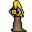

# { .sprite } Maddalena

| Stat | Value |
|---|---|
| Class | ? |
| HP | 0 |
| Max AP | 10 |
| Attack cost | 10 |
| Move cost | 10 |
| Damage | 0 |
| Attack chance | 0 |
| Block chance | 0 |
| Damage resistance | 0 |
| Critical skill | 0 |
| Critical multiplier | 0 |

## Found on

- [sullengard1_townhall](../maps/sullengard1_townhall.md)

## Quests

- [Restless in the grave](../quests/mg_restless_grave.md): stages 125

??? quote "Dialogue (9 lines)"

    *What the dialogue says, exactly as in the game files. Lines are listed once; links jump to the line a choice leads to.*

    **`sullengard_town_clerk_selector`** *(silent check: the first matching branch below is taken)*

    - branch 1 *(if NOT reached stage 75 of [Another ruthless Crackshot](../quests/Thieves04.md#stage-75))* → [sullengard_town_clerk_0](#d-sullengard_town_clerk_0)
    - branch 2 *(if reached stage 75 of [Another ruthless Crackshot](../quests/Thieves04.md#stage-75); NOT reached stage 37 of [sullengard_nondisplay (hidden flag)](../quests/sullengard_hidden.md#stage-37))* → [sullengard_town_clerk_bridge_0](#d-sullengard_town_clerk_bridge_0)
    - branch 3 *(if reached stage 37 of [sullengard_nondisplay (hidden flag)](../quests/sullengard_hidden.md#stage-37))* → [sullengard_town_clerk_bridge_5](#d-sullengard_town_clerk_bridge_5)

    **`sullengard_town_clerk_0`** Maddalena: “Hello. I am Maddalena, the town hall clerk. If you are looking for Mayor Ale, he's back there trying to look busy.”

    - Next → [sullengard_town_clerk_10](#d-sullengard_town_clerk_10)

    **`sullengard_town_clerk_bridge_0`** Maddalena: “With all that gold that you helped us get back, we plan to fix the bridge so we will be able to ship our beer to the west.”

    - “"Bridge"? What bridge? To the west?” *(if NOT reached stage 36 of [sullengard_nondisplay (hidden flag)](../quests/sullengard_hidden.md#stage-36))* → [sullengard_town_clerk_bridge_10](#d-sullengard_town_clerk_bridge_10)
    - “Oh, that's great news indeed! It's going to make my life easier.” *(if reached stage 36 of [sullengard_nondisplay (hidden flag)](../quests/sullengard_hidden.md#stage-36))* → [sullengard_town_clerk_bridge_20](#d-sullengard_town_clerk_bridge_20)

    **`sullengard_town_clerk_bridge_5`** Maddalena: “The bridge that crosses over the Sutdover River has been repaired thanks to you.”

    - “Yes. I am aware. In fact, I've already used it.” → *conversation ends*
    - “I am aware of this, but I am here on another matter.” *(if latest stage of [Restless in the grave](../quests/mg_restless_grave.md#stage-123) is 123)* → [sullengard_town_clerk_celdar_10](#d-sullengard_town_clerk_celdar_10)

    **`sullengard_town_clerk_10`** Maddalena: “If you are here about a tax complaint or a land dispute, then please sign in and I will get to you momentarily.”

    **`sullengard_town_clerk_bridge_10`** Maddalena: “Don't you know? The bridge that crosses over the Sutdover River that flows between here and Stoutford. It's been broken for a while now.”

    - Next → [sullengard_town_clerk_bridge_20](#d-sullengard_town_clerk_bridge_20)

    **`sullengard_town_clerk_bridge_20`** Maddalena: “It should be ready by the time you get there.”

    **`sullengard_town_clerk_celdar_10`** Maddalena: “Oh, how can I help you? It's not Mayor Ale is it?”

    - “What? No. I am looking for Celdar. I've heard she lives here. Is she around by chance?” → [sullengard_town_clerk_celdar_20](#d-sullengard_town_clerk_celdar_20)

    **`sullengard_town_clerk_celdar_20`** Maddalena: “Yes she is a local, but she hasn't been seen around here for a while. Last I heard, she was headed for Brimhaven to do some shopping. Although, it is a long journey so she probably had to rest along the way.” — **effects:** sets stage 125 of [Restless in the grave](../quests/mg_restless_grave.md#stage-125)

## Community notes

<small>Written by players, not generated from game data. **Observations**: what players notice in-game · **Lore**: the in-world story · **Trivia**: real-world facts, references, development history · **Theory / speculation**: unconfirmed ideas; may just be unfinished content</small>

### Observations

*Nothing here yet. Know something? [Add it](https://github.com/asdfghjkl628/Andor-s-Trail-Wikiiii/new/main/notes/monsters?filename=sullengard_town_clerk.md&value=%23%23%20Observations%0A%0A%3C%21--%20what%20players%20notice%20in-game%20--%3E%0A%0A%23%23%20Lore%0A%0A%3C%21--%20the%20in-world%20story%20--%3E%0A%0A%23%23%20Trivia%0A%0A%3C%21--%20real-world%20facts%2C%20references%2C%20development%20history%20--%3E%0A%0A%23%23%20Theory%20/%20speculation%0A%0A%3C%21--%20unconfirmed%20ideas%3B%20may%20just%20be%20unfinished%20content%20--%3E%0A).*

### Lore

*Nothing here yet. Know something? [Add it](https://github.com/asdfghjkl628/Andor-s-Trail-Wikiiii/new/main/notes/monsters?filename=sullengard_town_clerk.md&value=%23%23%20Observations%0A%0A%3C%21--%20what%20players%20notice%20in-game%20--%3E%0A%0A%23%23%20Lore%0A%0A%3C%21--%20the%20in-world%20story%20--%3E%0A%0A%23%23%20Trivia%0A%0A%3C%21--%20real-world%20facts%2C%20references%2C%20development%20history%20--%3E%0A%0A%23%23%20Theory%20/%20speculation%0A%0A%3C%21--%20unconfirmed%20ideas%3B%20may%20just%20be%20unfinished%20content%20--%3E%0A).*

### Trivia

*Nothing here yet. Know something? [Add it](https://github.com/asdfghjkl628/Andor-s-Trail-Wikiiii/new/main/notes/monsters?filename=sullengard_town_clerk.md&value=%23%23%20Observations%0A%0A%3C%21--%20what%20players%20notice%20in-game%20--%3E%0A%0A%23%23%20Lore%0A%0A%3C%21--%20the%20in-world%20story%20--%3E%0A%0A%23%23%20Trivia%0A%0A%3C%21--%20real-world%20facts%2C%20references%2C%20development%20history%20--%3E%0A%0A%23%23%20Theory%20/%20speculation%0A%0A%3C%21--%20unconfirmed%20ideas%3B%20may%20just%20be%20unfinished%20content%20--%3E%0A).*

### Theory / speculation

*Nothing here yet. Know something? [Add it](https://github.com/asdfghjkl628/Andor-s-Trail-Wikiiii/new/main/notes/monsters?filename=sullengard_town_clerk.md&value=%23%23%20Observations%0A%0A%3C%21--%20what%20players%20notice%20in-game%20--%3E%0A%0A%23%23%20Lore%0A%0A%3C%21--%20the%20in-world%20story%20--%3E%0A%0A%23%23%20Trivia%0A%0A%3C%21--%20real-world%20facts%2C%20references%2C%20development%20history%20--%3E%0A%0A%23%23%20Theory%20/%20speculation%0A%0A%3C%21--%20unconfirmed%20ideas%3B%20may%20just%20be%20unfinished%20content%20--%3E%0A).*

<small>Monster ID: `sullengard_town_clerk` · Data from v0.8.18</small>
