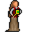

# { .sprite } Winona

**Where to find Winona:** Sullengard: [Sullengard 1 southwest house](../maps/sullengard1_southwest_house.md#pin-npc-sullengard_winona)

<div class="infobox" markdown>

<p class="ib-img">{ .sprite }</p>

| | |
|---|---|
| **Type** | NPC (can be spoken to; cannot be attacked) |
| **Found in** | Sullengard |
| **Entry ID** | `sullengard_winona` |
| **Introduced** | [v0.8.2](../versions/0.8.2.md) |

</div>

## Dialogue simulator

Set your quest stages and items, then talk to Winona. Same rules as the game: same checks, same options, same effects.

<div class="dlg-sim" data-src="../../assets/dialogue/winona_10.json" data-npc="Winona" markdown="0"><noscript>The simulator needs JavaScript. The full dialogue is listed below.</noscript></div>

<p class="verified">Rules verified against v0.8.18 game code (ConversationController.java) and dialogue data.</p>

??? quote "Dialogue (4 lines)"

    *Exactly as in the game files. Each line appears once; links jump to where a choice leads.*

    <span id="d-winona_10"></span>**`winona_10`** Winona: “Hey, traveler. Where are you traveling from?”

    - “Nowhere in particular.” → [winona_20](#d-winona_20)
    - “I found my way here from the Duleian road.” → [winona_20](#d-winona_20)
    - “North of here.” → [winona_20](#d-winona_20)
    - “None of your business.” → *conversation ends*

    <span id="d-winona_20"></span>**`winona_20`** Winona: “Are you familiar with the Sullengard forest?”

    - “Yes, and I have traveled through it. Why do you ask?” *(if reached stage 40 of [Hunting the hunter](../quests/deebo_orchard_hth.md#stage-40))* → [winona_30](#d-winona_30)
    - “Yes, I have been in that forest. Why?” → [winona_30](#d-winona_30)
    - “No. What is so special about it?” *(if NOT reached stage 40 of [Hunting the hunter](../quests/deebo_orchard_hth.md#stage-40); NOT reached stage 27 of [Sullengard story flags (hidden flag)](../quests/sullengard_hidden.md#stage-27))* → [winona_30](#d-winona_30)

    <span id="d-winona_30"></span>**`winona_30`** Winona: “I just love walking in there as nature is so beautiful there.”

    - Next → [winona_40](#d-winona_40)

    <span id="d-winona_40"></span>**`winona_40`** Winona: “There are lots of magnificently tall trees in that forest. The tallest in all of Dhayavar in fact.”


## Version history

| Version | Change |
|---|---|
| [v0.8.2](../versions/0.8.2.md) | Added<br>Dialogue: 4 lines added |

<p class="verified">Verified against v0.8.18 and every earlier release back to v0.7.0 (game data compared release by release).</p>


??? info "Technical information"

    | | |
    |---|---|
    | Entry ID | `sullengard_winona` |
    | Spawn group | `sullengard_winona` |
    | Loot table | – |
    | Conversation | `winona_10` |
    | Faction | – |
    | Movement | – |
    | Icon | `monsters_ld1:222` |
    | Defined in | `res/raw/monsterlist_sullengard.json` |

    Raw data:

    ```json
    {
     "id": "sullengard_winona",
     "name": "Winona",
     "iconID": "monsters_ld1:222",
     "unique": 1,
     "monsterClass": "humanoid",
     "spawnGroup": "sullengard_winona",
     "phraseID": "winona_10"
    }
    ```


## Community notes

<small>Written by players, not generated from game data. **Observations**: what players notice in-game · **Lore**: the in-world story · **Trivia**: real-world facts, references, development history · **Theory / speculation**: unconfirmed ideas; may just be unfinished content</small>

### Observations

*No notes yet. Contributions are welcome: [add a note](https://github.com/asdfghjkl628/Andor-s-Trail-Wikiiii/new/main/notes/monsters?filename=sullengard_winona.md&value=%23%23%20Observations%0A%0A%3C%21--%20what%20players%20notice%20in-game%20--%3E%0A%0A%23%23%20Lore%0A%0A%3C%21--%20the%20in-world%20story%20--%3E%0A%0A%23%23%20Trivia%0A%0A%3C%21--%20real-world%20facts%2C%20references%2C%20development%20history%20--%3E%0A%0A%23%23%20Theory%20/%20speculation%0A%0A%3C%21--%20unconfirmed%20ideas%3B%20may%20just%20be%20unfinished%20content%20--%3E%0A).*

### Lore

*No notes yet. Contributions are welcome: [add a note](https://github.com/asdfghjkl628/Andor-s-Trail-Wikiiii/new/main/notes/monsters?filename=sullengard_winona.md&value=%23%23%20Observations%0A%0A%3C%21--%20what%20players%20notice%20in-game%20--%3E%0A%0A%23%23%20Lore%0A%0A%3C%21--%20the%20in-world%20story%20--%3E%0A%0A%23%23%20Trivia%0A%0A%3C%21--%20real-world%20facts%2C%20references%2C%20development%20history%20--%3E%0A%0A%23%23%20Theory%20/%20speculation%0A%0A%3C%21--%20unconfirmed%20ideas%3B%20may%20just%20be%20unfinished%20content%20--%3E%0A).*

### Trivia

*No notes yet. Contributions are welcome: [add a note](https://github.com/asdfghjkl628/Andor-s-Trail-Wikiiii/new/main/notes/monsters?filename=sullengard_winona.md&value=%23%23%20Observations%0A%0A%3C%21--%20what%20players%20notice%20in-game%20--%3E%0A%0A%23%23%20Lore%0A%0A%3C%21--%20the%20in-world%20story%20--%3E%0A%0A%23%23%20Trivia%0A%0A%3C%21--%20real-world%20facts%2C%20references%2C%20development%20history%20--%3E%0A%0A%23%23%20Theory%20/%20speculation%0A%0A%3C%21--%20unconfirmed%20ideas%3B%20may%20just%20be%20unfinished%20content%20--%3E%0A).*

### Theory / speculation

*No notes yet. Contributions are welcome: [add a note](https://github.com/asdfghjkl628/Andor-s-Trail-Wikiiii/new/main/notes/monsters?filename=sullengard_winona.md&value=%23%23%20Observations%0A%0A%3C%21--%20what%20players%20notice%20in-game%20--%3E%0A%0A%23%23%20Lore%0A%0A%3C%21--%20the%20in-world%20story%20--%3E%0A%0A%23%23%20Trivia%0A%0A%3C%21--%20real-world%20facts%2C%20references%2C%20development%20history%20--%3E%0A%0A%23%23%20Theory%20/%20speculation%0A%0A%3C%21--%20unconfirmed%20ideas%3B%20may%20just%20be%20unfinished%20content%20--%3E%0A).*


<small>Data from v0.8.18</small>
