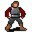

# { .sprite } Zaccheria

| Stat | Value |
|---|---|
| Class | humanoid |
| HP | 0 |
| Max AP | 10 |
| Attack cost | 10 |
| Move cost | 10 |
| Damage | 0 |
| Attack chance | 0 |
| Block chance | 0 |
| Damage resistance | 0 |
| Critical skill | 0 |
| Critical multiplier | 0 |

## Shop stock

| Item | Chance | Qty |
|---|---|---|
| [Boots of Swiftness](../items/boots_6.md) | 100% | 1 |
| [Fancy shirt](../items/fancy_shirt.md) | 100% | 1 |
| [Quilted tunic](../items/tunic_quilted.md) | 100% | 1 |
| [Rigid chain mail](../items/armour_rigid_chain.md) | 100% | 2 |
| [Grips of the warrior](../items/warrior_gloves.md) | 50% | 1 |
| [Bronzed grasps](../items/bronzed_gloves.md) | 100% | 2 |
| [Brutality boots](../items/brutality_boots.md) | 85% | 1 |
| [Bronze helmet](../items/bronze_helmet.md) | 100% | 1 |

## Found on

- [sullengard2_armory](../maps/sullengard2_armory.md)

<small>Monster ID: `sullengard_zaccheria` · Data from v0.8.18</small>
