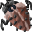

# { .sprite } Swamp beetle

| Stat | Value |
|---|---|
| Class | insect |
| HP | 101 |
| Max AP | 10 |
| Attack cost | 3 |
| Move cost | 6 |
| Damage | 7 to 12 |
| Attack chance | 150 |
| Block chance | 175 |
| Damage resistance | 20 |
| Critical skill | 0 |
| Critical multiplier | 0 |

## On hit

- **On target:** Insect contagion (magnitude 6, 5 rounds, 65% chance)

## Found on

- [galmore_17](../maps/galmore_17.md)
- [galmore_19](../maps/galmore_19.md)
- [galmore_27](../maps/galmore_27.md)
- [galmore_29](../maps/galmore_29.md)
- [galmore_37](../maps/galmore_37.md)

<small>Monster ID: `swamp_bettle` · Data from v0.8.18</small>
