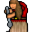

# { .sprite } Madame Mim

<div class="infobox" markdown>

<p class="ib-img">{ .sprite }</p>

| | |
|---|---|
| **Type** | NPC/Enemy (can be spoken to, but can also be fought) |
| **Role** | Shopkeeper |
| **Found in** | Swamp hut |
| **Class** | Humanoid |
| **HP** | 220 |
| **XP when defeated** | 654 |
| **Entries in game data** | 2 |
| **Introduced** | [v0.8.12.1](../versions/0.8.12.1.md) |

</div>

!!! info "2 entries in the game data"
    The game data defines 2 separate characters named Madame Mim. The game makes a new entry whenever a character needs different behaviour (another conversation later in a quest, another location, other stats). Some are the same person at different story points; others just share a generic name. Here the entries differ in: conversation, combat statistics, loot or shop stock. Each entry has its own section below.

| Entry | Type | Location | Role | HP |
|---|---|---|---|---|
| [`swamp_witch`](#v-swamp_witch) | NPC/Enemy | [Swamp hut](../maps/swamp_hut.md#pin-npc-swamp_witch) | shopkeeper | 220 |
| [`swamp_witch_shop`](#v-swamp_witch_shop) | Enemy | [Swamp hut](../maps/swamp_hut.md) | – | 1 |

## Swamp hut (swamp_witch) { #v-swamp_witch }

**Entry ID:** `swamp_witch` · **Type:** NPC/Enemy · **Role:** Shopkeeper

**Location:** [Swamp hut](../maps/swamp_hut.md#pin-npc-swamp_witch)

!!! warning "Can be fought"
    This entry can be talked to, but it can also become an opponent: a conversation with this character can end in combat (a dialogue branch leads to a fight).

### Combat statistics

| Statistic | Value |
|---|---|
| Class | Humanoid |
| HP | 220 |
| XP when defeated | 654 |
| Damage | 5 to 10 |
| Attack chance | 200 |
| Block chance | 200 |
| Damage resistance | 15 |
| Max AP | 10 |
| Attack cost | 7 AP |
| Attacks per turn | 1 |
| Move cost | 10 AP |
| Critical skill | 10 |
| Critical multiplier | 5.0 |
| Critical hit chance | 9% |

**On hit:** Heal HP: 2 to 20; On target: [Chaotic curse](../conditions/chaotic_curse.md) (magnitude 1, 2 rounds, 50% chance); [Confusion](../conditions/confusion.md) (magnitude 1, 2 rounds, 50% chance); [Internal bleeding](../conditions/crit1.md) (magnitude 1, 3 rounds, 10% chance); [Bleeding wound](../conditions/bleeding_wound.md) (magnitude 2, 10 rounds, 50% chance)


<p class="verified">Verified against v0.8.18 monster data and game code (`MonsterTypeParser.java`).</p>

### Shop stock

| Item | Chance | Qty |
|---|---|---|
| [Sharpened gem](../items/gem4.md) | 100% | 1 to 5 |
| [Gold coins](../items/gold.md) | 100% | 300 to 5200 |

### Locations

| Map | Region | Up to | Notes |
|---|---|---|---|
| [Swamp hut](../maps/swamp_hut.md) | – | 1 | – |

### Quests that count defeats

- [Feygard fog (hidden flag)](../quests/feygard_fog.md#stage-9) with stepping on a trigger on [Swamp hut](../maps/swamp_hut.md) checks that this enemy has been defeated.

### Quests

- [Fog in the woods](../quests/fogmonster.md): stages 30, 80, 90, 92
- [Feygard fog (hidden flag)](../quests/feygard_fog.md): stages 1, 2, 3, 4, 5, 7, 8, 9

### Dialogue simulator

Set your quest stages and items, then talk to Madame Mim. Same rules as the game: same checks, same options, same effects.

<div class="dlg-sim" data-src="../../assets/dialogue/swamp_witch.json" data-npc="Madame Mim" markdown="0"><noscript>The simulator needs JavaScript. The full dialogue is listed below.</noscript></div>

<p class="verified">Rules verified against v0.8.18 game code (ConversationController.java) and dialogue data.</p>

??? quote "Dialogue (48 lines)"

    *Exactly as in the game files. Each line appears once; links jump to where a choice leads.*

    <span id="d-swamp_witch-swamp_witch"></span>**`swamp_witch`** *(silent check: the first matching branch below is taken)*

    - Next *(if reached stage 90 of [Fog in the woods](../quests/fogmonster.md#stage-90))* → [swamp_witch_90](#d-swamp_witch-swamp_witch_90)
    - Next *(if reached stage 80 of [Fog in the woods](../quests/fogmonster.md#stage-80))* → [swamp_witch_80](#d-swamp_witch-swamp_witch_80)
    - Next → [swamp_witch_20](#d-swamp_witch-swamp_witch_20)

    <span id="d-swamp_witch-swamp_witch_90"></span>**`swamp_witch_90`** Madame Mim: “Oh - how did you pass through my distraction fence?”

    - Next → [swamp_witch_90_10](#d-swamp_witch-swamp_witch_90_10)

    <span id="d-swamp_witch-swamp_witch_80"></span>**`swamp_witch_80`** Madame Mim: “You again! You promised me peace and solitude!”

    - Next → [swamp_witch_90_10](#d-swamp_witch-swamp_witch_90_10)

    <span id="d-swamp_witch-swamp_witch_20"></span>**`swamp_witch_20`** Madame Mim: “Who dares disturb my solitude? Be gone, or face my wrath!” — **effects:** sets stage 30 of [Fog in the woods](../quests/fogmonster.md#stage-30)

    - “Sorry. I got lost in the fog.” → [swamp_witch_20_10](#d-swamp_witch-swamp_witch_20_10)
    - “I am not afraid of you. (You grope for your weapon)” → [swamp_witch_20_210](#d-swamp_witch-swamp_witch_20_210)

    <span id="d-swamp_witch-swamp_witch_90_10"></span>**`swamp_witch_90_10`** Madame Mim: “Go away!”

    - “OK, sorry for disturbing your peace.” → *conversation ends*
    - “Can I buy more of your medicinal water?” → [swamp_witch_90_20](#d-swamp_witch-swamp_witch_90_20)

    <span id="d-swamp_witch-swamp_witch_20_10"></span>**`swamp_witch_20_10`** Madame Mim: “Oh, how touching. The brave little hero got themselves lost, did they?”

    - Next → [swamp_witch_20_12](#d-swamp_witch-swamp_witch_20_12)

    <span id="d-swamp_witch-swamp_witch_20_210"></span>**`swamp_witch_20_210`** [Dummy NPC](../monsters/none.md): “The old witch raises her hands, chanting ominously.”

    - Next → [swamp_witch_20_212](#d-swamp_witch-swamp_witch_20_212)

    <span id="d-swamp_witch-swamp_witch_90_20"></span>**`swamp_witch_90_20`** [Madame Mim](../monsters/swamp_witch.md#v-swamp_witch_shop): “Well, if you promise to finally leave me alone afterwards.”

    - “Sure” → *shop opens*

    <span id="d-swamp_witch-swamp_witch_20_12"></span>**`swamp_witch_20_12`** Madame Mim: “And now you expect me to help you? Ha!”

    - “Yes, please.” → [swamp_witch_20_30](#d-swamp_witch-swamp_witch_20_30)
    - “No. I can handle myself as always.” → *conversation ends*
    - “I managed to defeat the fog monsters that caused it.” → [swamp_witch_20_20](#d-swamp_witch-swamp_witch_20_20)

    <span id="d-swamp_witch-swamp_witch_20_212"></span>**`swamp_witch_20_212`** [Madame Mim](../monsters/swamp_witch.md): “A curse upon you, little one! May darkness be your companion, and fear be your guide!”

    - “I won't let you curse me! (Draws the weapon)” → [swamp_witch_20_214](#d-swamp_witch-swamp_witch_20_214)
    - “I'm sorry, ma'am. Please forgive me.” → [swamp_witch_20_24](#d-swamp_witch-swamp_witch_20_24)
    - “Wait! Spare me please. I'll give you ...” → [swamp_witch_20_220](#d-swamp_witch-swamp_witch_20_220)

    <span id="d-swamp_witch-swamp_witch_20_30"></span>**`swamp_witch_20_30`** Madame Mim: “[Grumbles] Lost, you say? It's your own fault for wandering where you don't belong. I prefer to be left alone, away from the meddling of outsiders.”

    - “I understand, and I'm really sorry. I promise I'll leave as soon as you point me in the right direction.” → [swamp_witch_20_40](#d-swamp_witch-swamp_witch_20_40)

    <span id="d-swamp_witch-swamp_witch_20_20"></span>**`swamp_witch_20_20`** Madame Mim: “Defeated my fog monsters, did you? Meddlesome brat!”

    - Next → [swamp_witch_20_22](#d-swamp_witch-swamp_witch_20_22)

    <span id="d-swamp_witch-swamp_witch_20_214"></span>**`swamp_witch_20_214`** Madame Mim: “Hahaha! You? Defeat me? We shall see!”

    - “Attack!” → *fight starts*

    <span id="d-swamp_witch-swamp_witch_20_24"></span>**`swamp_witch_20_24`** Madame Mim: “And?”

    - “And I just wanted to find my way to Feygard.” → [swamp_witch_20_40](#d-swamp_witch-swamp_witch_20_40)
    - “I just want to find my way home.” → [swamp_witch_20_40](#d-swamp_witch-swamp_witch_20_40)

    <span id="d-swamp_witch-swamp_witch_20_220"></span>**`swamp_witch_20_220`** Madame Mim: “Oh, the heroic little braveheart, off to save their own skin.”

    - Next → [swamp_witch_20_222](#d-swamp_witch-swamp_witch_20_222)

    <span id="d-swamp_witch-swamp_witch_20_40"></span>**`swamp_witch_20_40`** Madame Mim: “[Grinning wickedly] That is easy. Go outside and far away. As fast as possible.”

    - “Thank you! You're really kind ...” → [swamp_witch_20_42](#d-swamp_witch-swamp_witch_20_42)

    <span id="d-swamp_witch-swamp_witch_20_22"></span>**`swamp_witch_20_22`** Madame Mim: “Those creatures were my only protection from unwanted visitors like you!”

    - “I didn't know. The fog was disorienting ...” → [swamp_witch_20_24](#d-swamp_witch-swamp_witch_20_24)
    - “I'm sorry, I didn't mean to disturb you.” → [swamp_witch_20_24](#d-swamp_witch-swamp_witch_20_24)
    - “Not much of a protection, were they.” → [swamp_witch_20_200](#d-swamp_witch-swamp_witch_20_200)

    <span id="d-swamp_witch-swamp_witch_20_222"></span>**`swamp_witch_20_222`** Madame Mim: “What do you offer me?”

    - “100 gold coins” *(if pay 100 gold)* → [swamp_witch_20_228](#d-swamp_witch-swamp_witch_20_228)
    - “My Ring of the Lesser Shadow” *(if carry 1× [Ring of lesser Shadow](../items/ring_shadow0.md))* → [swamp_witch_20_228](#d-swamp_witch-swamp_witch_20_228)
    - “My Ring of the Lesser Shadow” *(if NOT carry 1× [Ring of lesser Shadow](../items/ring_shadow0.md))* → [swamp_witch_20_228b](#d-swamp_witch-swamp_witch_20_228b)
    - “A quick death” → [swamp_witch_20_214](#d-swamp_witch-swamp_witch_20_214)

    <span id="d-swamp_witch-swamp_witch_20_42"></span>**`swamp_witch_20_42`** Madame Mim: “What?”

    - “... despite what I have always heard about witches in the swamp.” → [swamp_witch_20_50](#d-swamp_witch-swamp_witch_20_50)

    <span id="d-swamp_witch-swamp_witch_20_200"></span>**`swamp_witch_20_200`** Madame Mim: “[Grinning wickedly] I think it's time you learn a lesson, meddling child.”

    - “What are you going to do?” → [swamp_witch_20_210](#d-swamp_witch-swamp_witch_20_210)

    <span id="d-swamp_witch-swamp_witch_20_228"></span>**`swamp_witch_20_228`** Madame Mim: “I have no need for that. But I will take it nevertheless.”

    - “NO! I changed my mind.” → [swamp_witch_20_222](#d-swamp_witch-swamp_witch_20_222)

    <span id="d-swamp_witch-swamp_witch_20_228b"></span>**`swamp_witch_20_228b`** Madame Mim: “You don't even have this ring. Don't show off like that!”

    - “Eh ...” → [swamp_witch_20_222](#d-swamp_witch-swamp_witch_20_222)

    <span id="d-swamp_witch-swamp_witch_20_50"></span>**`swamp_witch_20_50`** Madame Mim: “[Gruffly] Kind? Bah! I simply don't want the likes of you lingering around here.”

    - Next → [swamp_witch_20_60](#d-swamp_witch-swamp_witch_20_60)

    <span id="d-swamp_witch-swamp_witch_20_60"></span>**`swamp_witch_20_60`** Madame Mim: “Now, listen carefully, child. I will wait a few minutes before I create fog again.”

    - Next → [swamp_witch_20_62](#d-swamp_witch-swamp_witch_20_62)

    <span id="d-swamp_witch-swamp_witch_20_62"></span>**`swamp_witch_20_62`** Madame Mim: “Be sure to be out of the area.”

    - “I appreciate your help. I promise I'll be away for good. But can I ask you something else before I leave?” → [swamp_witch_20_70](#d-swamp_witch-swamp_witch_20_70)

    <span id="d-swamp_witch-swamp_witch_20_70"></span>**`swamp_witch_20_70`** Madame Mim: “[Sighs] Make it quick, then. I don't have all night.”

    - “Why do you live all alone in this swamp? Don't you ever get lonely?” → [swamp_witch_20_80](#d-swamp_witch-swamp_witch_20_80)

    <span id="d-swamp_witch-swamp_witch_20_80"></span>**`swamp_witch_20_80`** Madame Mim: “Men used to laugh at me. They threw stones at me and finally tried to burn my house.”

    - Next → [swamp_witch_20_82](#d-swamp_witch-swamp_witch_20_82)

    <span id="d-swamp_witch-swamp_witch_20_82"></span>**`swamp_witch_20_82`** Madame Mim: “All I want is peace and to enjoy my lovely garden outside.”

    - “You mean the swamp?” → [swamp_witch_20_84](#d-swamp_witch-swamp_witch_20_84)
    - “Eh, yes, your garden is beautiful.” → [swamp_witch_20_90](#d-swamp_witch-swamp_witch_20_90)
    - “You want peace and loneliness?” → [swamp_witch_20_100](#d-swamp_witch-swamp_witch_20_100)

    <span id="d-swamp_witch-swamp_witch_20_84"></span>**`swamp_witch_20_84`** Madame Mim: “How dare you!”

    - Next → [swamp_witch_20_200](#d-swamp_witch-swamp_witch_20_200)

    <span id="d-swamp_witch-swamp_witch_20_90"></span>**`swamp_witch_20_90`** Madame Mim: “Yes, it is. At least one person who knows beauty when they see it.”

    - Next → [swamp_witch_20_92](#d-swamp_witch-swamp_witch_20_92)

    <span id="d-swamp_witch-swamp_witch_20_100"></span>**`swamp_witch_20_100`** Madame Mim: “Loneliness is a price I'm willing to pay for my solitude.”

    - Next → [swamp_witch_20_102](#d-swamp_witch-swamp_witch_20_102)

    <span id="d-swamp_witch-swamp_witch_20_92"></span>**`swamp_witch_20_92`** Madame Mim: “Well, I shall spare you... this time. Now leave my sight and never return!”

    - “It was sort of nice to meet you.” → *conversation ends*

    <span id="d-swamp_witch-swamp_witch_20_102"></span>**`swamp_witch_20_102`** Madame Mim: “People fear me because of my powers, and I grow weary of their endless superstitions and suspicions. Here, far from any village, I can be myself without interference.”

    - Next → [swamp_witch_20_104](#d-swamp_witch-swamp_witch_20_104)

    <span id="d-swamp_witch-swamp_witch_20_104"></span>**`swamp_witch_20_104`** Madame Mim: “Here I have found peace at last.”

    - “I'm sorry people treat you that way. But maybe if they got to know you, they wouldn't be so afraid.” → [swamp_witch_20_110](#d-swamp_witch-swamp_witch_20_110)

    <span id="d-swamp_witch-swamp_witch_20_110"></span>**`swamp_witch_20_110`** Madame Mim: “Bah! Humans will always fear what they don't understand.”

    - “Maybe you are right. Let me think ...” → [swamp_witch_20_120](#d-swamp_witch-swamp_witch_20_120)
    - “Right. And now you should fear me - attack!” → *fight starts*

    <span id="d-swamp_witch-swamp_witch_20_120"></span>**`swamp_witch_20_120`** Madame Mim: “Hmph, fine. But be quick about it.”

    - “Shrink the fog in the north.” → [swamp_witch_20_130](#d-swamp_witch-swamp_witch_20_130)
    - “Release the fog.” → [swamp_witch_20_140](#d-swamp_witch-swamp_witch_20_140)

    <span id="d-swamp_witch-swamp_witch_20_130"></span>**`swamp_witch_20_130`** Madame Mim: “[Eyeing you suspiciously] What?!”

    - “People have trouble that the way to Feygard goes through your fog. If you make your fog a little smaller in the north,…” → [swamp_witch_20_132](#d-swamp_witch-swamp_witch_20_132)

    <span id="d-swamp_witch-swamp_witch_20_140"></span>**`swamp_witch_20_140`** Madame Mim: “[Eyeing you suspiciously] What?!”

    - “People have trouble that the way to Feygard is barred by your fog. No fog on the road, no reason to visit you.” → [swamp_witch_20_142](#d-swamp_witch-swamp_witch_20_142)

    <span id="d-swamp_witch-swamp_witch_20_132"></span>**`swamp_witch_20_132`** Madame Mim: “Hmm. Sounds reasonable.”

    - Next → [swamp_witch_20_134](#d-swamp_witch-swamp_witch_20_134)

    <span id="d-swamp_witch-swamp_witch_20_142"></span>**`swamp_witch_20_142`** Madame Mim: “Hmm. Sounds reasonable.”

    - “And being a witch, you can certainly put a spell around your swamp that will distract people from wanting to come here.” → [swamp_witch_20_144](#d-swamp_witch-swamp_witch_20_144)

    <span id="d-swamp_witch-swamp_witch_20_134"></span>**`swamp_witch_20_134`** Madame Mim: “Agreed. Here child, take these sweets and now begone!” — **effects:** sets stage 80 of [Fog in the woods](../quests/fogmonster.md#stage-80), sets stage 8 of [Feygard fog (hidden flag)](../quests/feygard_fog.md#stage-8), sets stage 7 of [Feygard fog (hidden flag)](../quests/feygard_fog.md#stage-7), clears stage 1 of [Feygard fog (hidden flag)](../quests/feygard_fog.md#stage-1), clears stage 6 of [Feygard fog (hidden flag)](../quests/feygard_fog.md#stage-6), spawns monsters on guynmart_wood_14

    - “Thank you.” → *conversation ends*
    - “[grumbling] Sweets - I am no kid anymore.” → *conversation ends*

    <span id="d-swamp_witch-swamp_witch_20_144"></span>**`swamp_witch_20_144`** Madame Mim: “Swamp! what did you name my beautiful peace of land??”

    - “Well, what else is it?” → [swamp_witch_20_84](#d-swamp_witch-swamp_witch_20_84)
    - “Uh, garden, I meant.” → [swamp_witch_20_150](#d-swamp_witch-swamp_witch_20_150)

    <span id="d-swamp_witch-swamp_witch_20_150"></span>**`swamp_witch_20_150`** Madame Mim: “A distraction spell. That I didn't think of it myself ...”

    - Next → [swamp_witch_20_160](#d-swamp_witch-swamp_witch_20_160)

    <span id="d-swamp_witch-swamp_witch_20_160"></span>**`swamp_witch_20_160`** Madame Mim: “Great. You deserve a reward for that. You may choose one thing from these:” — **effects:** sets stage 1 of [Feygard fog (hidden flag)](../quests/feygard_fog.md#stage-1), sets stage 2 of [Feygard fog (hidden flag)](../quests/feygard_fog.md#stage-2), sets stage 3 of [Feygard fog (hidden flag)](../quests/feygard_fog.md#stage-3), sets stage 4 of [Feygard fog (hidden flag)](../quests/feygard_fog.md#stage-4), sets stage 5 of [Feygard fog (hidden flag)](../quests/feygard_fog.md#stage-5), clears stage 6 of [Feygard fog (hidden flag)](../quests/feygard_fog.md#stage-6), clears stage 7 of [Feygard fog (hidden flag)](../quests/feygard_fog.md#stage-7), sets stage 9 of [Feygard fog (hidden flag)](../quests/feygard_fog.md#stage-9), sets stage 90 of [Fog in the woods](../quests/fogmonster.md#stage-90), removes monsters from guynmart_wood_14, removes monsters from swamp2, removes monsters from swamp4, removes monsters from swamp5, removes monsters from swamp6, changes map swamp2, changes map swamp4, changes map swamp6, changes map guynmart_wood_13

    - “Gold and jewels” → [swamp_witch_20_170](#d-swamp_witch-swamp_witch_20_170)
    - “A vial of healing water from the garden” → [swamp_witch_20_180](#d-swamp_witch-swamp_witch_20_180)
    - “Everlasting thankfulness” → [swamp_witch_20_190](#d-swamp_witch-swamp_witch_20_190)

    <span id="d-swamp_witch-swamp_witch_20_170"></span>**`swamp_witch_20_170`** Madame Mim: “Here take this stuff. And now go and finally leave me alone.” — **effects:** gives 200× [Gold coins](../items/gold.md), gives 2× [Madame Mim's Medicine](../items/swampwitch_health.md)


    <span id="d-swamp_witch-swamp_witch_20_180"></span>**`swamp_witch_20_180`** [Madame Mim](../monsters/swamp_witch.md#v-swamp_witch_shop): “Well, choose what you want. Of course you'll have to pay for it.”

    - Next → *shop opens*

    <span id="d-swamp_witch-swamp_witch_20_190"></span>**`swamp_witch_20_190`** Madame Mim: “You have it. And now go and finally leave me alone. Otherwise I'll turn you into a frog. [Muttering] Here, take this bottle.” — **effects:** gives 1× [Madame Mim's Medicine](../items/swampwitch_health.md), sets stage 92 of [Fog in the woods](../quests/fogmonster.md#stage-92)

    - Next → [swamp_witch_20_192](#d-swamp_witch-swamp_witch_20_192)

    <span id="d-swamp_witch-swamp_witch_20_192"></span>**`swamp_witch_20_192`** Madame Mim: “Still here? Begone!”


### Version history

| Version | Change |
|---|---|
| [v0.8.12.1](../versions/0.8.12.1.md) | Added<br>Dialogue: 48 lines added |

<p class="verified">Verified against v0.8.18 and every earlier release back to v0.7.0 (game data compared release by release).</p>


??? info "Technical information (swamp_witch)"

    | | |
    |---|---|
    | Entry ID | `swamp_witch` |
    | Spawn group | `swamp_witch` |
    | Loot table | `swamp_witch` |
    | Conversation | `swamp_witch` |
    | Faction | – |
    | Movement | – |
    | Icon | `monsters_ld2:95` |
    | Defined in | `res/raw/monsterlist_feygard_1.json` |

    Raw data:

    ```json
    {
     "id": "swamp_witch",
     "name": "Madame Mim",
     "iconID": "monsters_ld2:95",
     "maxHP": 220,
     "maxAP": 10,
     "moveCost": 10,
     "unique": 1,
     "monsterClass": "humanoid",
     "attackDamage": {
      "min": 5,
      "max": 10
     },
     "phraseID": "swamp_witch",
     "droplistID": "swamp_witch",
     "attackCost": 7,
     "attackChance": 200,
     "criticalSkill": 10,
     "criticalMultiplier": 5.0,
     "blockChance": 200,
     "damageResistance": 15,
     "hitEffect": {
      "increaseCurrentHP": {
       "min": 2,
       "max": 20
      },
      "conditionsTarget": [
       {
        "condition": "chaotic_curse",
        "magnitude": 1,
        "duration": 2,
        "chance": "50"
       },
       {
        "condition": "confusion",
        "magnitude": 1,
        "duration": 2,
        "chance": "50"
       },
       {
        "condition": "crit1",
        "magnitude": 1,
        "duration": 3,
        "chance": "10"
       },
       {
        "condition": "bleeding_wound",
        "magnitude": 2,
        "duration": 10,
        "chance": "50"
       }
      ]
     }
    }
    ```


## Swamp hut (swamp_witch_shop) { #v-swamp_witch_shop }

**Entry ID:** `swamp_witch_shop` · **Type:** Enemy

**Location:** [Swamp hut](../maps/swamp_hut.md)

### Combat statistics

| Statistic | Value |
|---|---|
| Class | Humanoid |
| HP | 1 |
| XP when defeated | 1 |
| Damage | 0 |
| Attack chance | 0 |
| Block chance | 0 |
| Damage resistance | 0 |
| Max AP | 10 |
| Attack cost | 10 AP |
| Attacks per turn | 1 |
| Move cost | 5 AP |
| Critical skill | 0 |
| Critical multiplier | – |
| Critical hit chance | None (requires both critical skill and a critical multiplier) |


<p class="verified">Verified against v0.8.18 monster data and game code (`MonsterTypeParser.java`).</p>

### Drops

| Item | Chance | Qty |
|---|---|---|
| [Sharpened gem](../items/gem4.md) | 100% | 1 to 5 |
| [Madame Mim's Medicine](../items/swampwitch_health.md) | 100% | 7 |
| [Rat tail](../items/rat_tail.md) | 100% | 2 to 5 |
| [Claws](../items/claws.md) | 100% | 5 to 8 |
| [Pink potion of stomach calming](../items/pink_potion.md) | 100% | 2 to 4 |

### Locations

| Map | Region | Up to | Notes |
|---|---|---|---|
| [Swamp hut](../maps/swamp_hut.md) | – | 1 | – |


### Version history

| Version | Change |
|---|---|
| [v0.8.12.1](../versions/0.8.12.1.md) | Added |

<p class="verified">Verified against v0.8.18 and every earlier release back to v0.7.0 (game data compared release by release).</p>


??? info "Technical information (swamp_witch_shop)"

    | | |
    |---|---|
    | Entry ID | `swamp_witch_shop` |
    | Spawn group | `swamp_witch_shop` |
    | Loot table | `swamp_witch_shop` |
    | Conversation | – |
    | Faction | – |
    | Movement | – |
    | Icon | `monsters_ld2:95` |
    | Defined in | `res/raw/monsterlist_feygard_1.json` |

    Raw data:

    ```json
    {
     "id": "swamp_witch_shop",
     "name": "Madame Mim",
     "iconID": "monsters_ld2:95",
     "moveCost": 5,
     "monsterClass": "humanoid",
     "droplistID": "swamp_witch_shop"
    }
    ```


??? info "How the XP value is calculated"

    The game computes each enemy's experience value when it loads the data (`MonsterTypeParser.java`):

    XP = ⌈(attacks per turn × attack chance × average damage × (1 + critical skill × critical multiplier) × 3 + HP × (1 + block chance) + 9 × damage resistance) × 0.7⌉

    Percentages are used as fractions (e.g. 60% = 0.6). Enemies whose attacks inflict a condition are worth 50 XP more. The More Exp skill adds a percentage on top.


## Community notes

<small>Written by players, not generated from game data. **Observations**: what players notice in-game · **Lore**: the in-world story · **Trivia**: real-world facts, references, development history · **Theory / speculation**: unconfirmed ideas; may just be unfinished content</small>

### Observations

*No notes yet. Contributions are welcome: [add a note](https://github.com/asdfghjkl628/Andor-s-Trail-Wikiiii/new/main/notes/monsters?filename=swamp_witch.md&value=%23%23%20Observations%0A%0A%3C%21--%20what%20players%20notice%20in-game%20--%3E%0A%0A%23%23%20Lore%0A%0A%3C%21--%20the%20in-world%20story%20--%3E%0A%0A%23%23%20Trivia%0A%0A%3C%21--%20real-world%20facts%2C%20references%2C%20development%20history%20--%3E%0A%0A%23%23%20Theory%20/%20speculation%0A%0A%3C%21--%20unconfirmed%20ideas%3B%20may%20just%20be%20unfinished%20content%20--%3E%0A).*

### Lore

*No notes yet. Contributions are welcome: [add a note](https://github.com/asdfghjkl628/Andor-s-Trail-Wikiiii/new/main/notes/monsters?filename=swamp_witch.md&value=%23%23%20Observations%0A%0A%3C%21--%20what%20players%20notice%20in-game%20--%3E%0A%0A%23%23%20Lore%0A%0A%3C%21--%20the%20in-world%20story%20--%3E%0A%0A%23%23%20Trivia%0A%0A%3C%21--%20real-world%20facts%2C%20references%2C%20development%20history%20--%3E%0A%0A%23%23%20Theory%20/%20speculation%0A%0A%3C%21--%20unconfirmed%20ideas%3B%20may%20just%20be%20unfinished%20content%20--%3E%0A).*

### Trivia

*No notes yet. Contributions are welcome: [add a note](https://github.com/asdfghjkl628/Andor-s-Trail-Wikiiii/new/main/notes/monsters?filename=swamp_witch.md&value=%23%23%20Observations%0A%0A%3C%21--%20what%20players%20notice%20in-game%20--%3E%0A%0A%23%23%20Lore%0A%0A%3C%21--%20the%20in-world%20story%20--%3E%0A%0A%23%23%20Trivia%0A%0A%3C%21--%20real-world%20facts%2C%20references%2C%20development%20history%20--%3E%0A%0A%23%23%20Theory%20/%20speculation%0A%0A%3C%21--%20unconfirmed%20ideas%3B%20may%20just%20be%20unfinished%20content%20--%3E%0A).*

### Theory / speculation

*No notes yet. Contributions are welcome: [add a note](https://github.com/asdfghjkl628/Andor-s-Trail-Wikiiii/new/main/notes/monsters?filename=swamp_witch.md&value=%23%23%20Observations%0A%0A%3C%21--%20what%20players%20notice%20in-game%20--%3E%0A%0A%23%23%20Lore%0A%0A%3C%21--%20the%20in-world%20story%20--%3E%0A%0A%23%23%20Trivia%0A%0A%3C%21--%20real-world%20facts%2C%20references%2C%20development%20history%20--%3E%0A%0A%23%23%20Theory%20/%20speculation%0A%0A%3C%21--%20unconfirmed%20ideas%3B%20may%20just%20be%20unfinished%20content%20--%3E%0A).*


<small>Data from v0.8.18</small>
