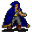

# { .sprite } Sly Seraphina

<div class="infobox" markdown>

<p class="ib-img">{ .sprite }</p>

| | |
|---|---|
| **Monster ID** | `thief_seraphina` |
| **Type** | Shopkeeper |
| **Class** | Humanoid |
| **HP** | 1 |
| **Found in** | lake_shore_road_9 |
| **Introduced** | [v0.8.8](../versions/0.8.8.md) |

</div>

## Combat stats

| Stat | Value |
|---|---|
| HP | 1 |
| Damage | 0 |
| Attack chance | 0 |
| Block chance | 0 |
| Damage resistance | 0 |
| Max AP | 10 |
| Attack cost | 10 AP |
| Attacks per turn | 1 |
| Move cost | 10 AP |
| Critical skill | 0 |
| Critical multiplier | – |
| Crit chance | none (needs critical skill and a multiplier) |

**XP formula** (from the game's loader): ⌈(attacks per turn × attack chance × average damage × (1 + critical skill × multiplier) × 3 + HP × (1 + block chance) + 9 × damage resistance) × 0.7⌉, +50 if its hits inflict a condition. More Exp adds a percentage on top.

<p class="verified">Verified against v0.8.18 monster data and game code (`MonsterTypeParser.java`).</p>


## Shop stock

| Item | Chance | Qty |
|---|---|---|
| [Armored helmet](../items/armored_helmet.md) | 100% | 1 |

## Locations

| Map | Region | Up to | Notes |
|---|---|---|---|
| [lake_shore_road_9](../maps/lake_shore_road_9.md) | – | 1 | – |


## Quests

- [Troubling times](../quests/troubling_times.md): stages 110, 130, 140, 320
- [sullengard_nondisplay (hidden flag)](../quests/sullengard_hidden.md): stages 38

## Dialogue simulator

Set up your situation (quest stages, items, kills…), then talk to Sly Seraphina. The simulator follows the game's own rules: it takes the same silent checks, offers only the options you'd really see, and applies their effects (quest stages, items handed over, rewards) as you go.

<div class="dlg-sim" data-src="../../assets/dialogue/thief_seraphina_selector.json" data-npc="Sly Seraphina" markdown="0"><noscript>The simulator needs JavaScript. The full dialogue is listed below.</noscript></div>

<p class="verified">Rules verified against v0.8.18 game code (ConversationController.java) and dialogue data.</p>

??? quote "Dialogue (59 lines)"

    *What the dialogue says, exactly as in the game files. Lines are listed once; links jump to the line a choice leads to.*

    <span id="d-thief_seraphina_selector"></span>**`thief_seraphina_selector`** *(silent check: the first matching branch below is taken)*

    - Next *(if NOT reached stage 36 of [sullengard_nondisplay (hidden flag)](../quests/sullengard_hidden.md#stage-36); NOT reached stage 75 of [Another ruthless Crackshot](../quests/Thieves04.md#stage-75))* → [thief_seraphina_script_10](#d-thief_seraphina_script_10)
    - Next *(if NOT reached stage 75 of [Another ruthless Crackshot](../quests/Thieves04.md#stage-75); NOT reached stage 38 of [sullengard_nondisplay (hidden flag)](../quests/sullengard_hidden.md#stage-38))* → [thief_seraphina_10](#d-thief_seraphina_10)
    - Next *(if reached stage 75 of [Another ruthless Crackshot](../quests/Thieves04.md#stage-75))* → [thief_seraphina_bridge_fixed](#d-thief_seraphina_bridge_fixed)
    - Next *(if reached stage 38 of [sullengard_nondisplay (hidden flag)](../quests/sullengard_hidden.md#stage-38))* → [thief_seraphina_80](#d-thief_seraphina_80)

    <span id="d-thief_seraphina_script_10"></span>**`thief_seraphina_script_10`** [Sly Seraphina](../monsters/thief_seraphina.md): “Hey, kid! Just where do you think you're going?”

    - “Across the bridge, of course. After all, I can't swim.” → [thief_seraphina_script_20](#d-thief_seraphina_script_20)
    - “Nowhere...I guess.” → *conversation ends*

    <span id="d-thief_seraphina_10"></span>**`thief_seraphina_10`** [Sly Seraphina](../monsters/thief_seraphina.md): “Let me guess, you're wondering if I know how to cross the river?”

    - “Well, do you?” → [thief_seraphina_20](#d-thief_seraphina_20)

    <span id="d-thief_seraphina_bridge_fixed"></span>**`thief_seraphina_bridge_fixed`** [Sly Seraphina](../monsters/thief_seraphina.md): “Please move along. There's nothing to see here.”

    - “I've been wondering, do you have anything to sell?” *(if NOT reached stage 3 of [Sutdove_nondisplay (hidden flag)](../quests/sutdover_hidden.md#stage-3); NOT carry 1× [Armored helmet](../items/armored_helmet.md); NOT wearing [Armored helmet](../items/armored_helmet.md))* → [thief_seraphina_helmet_1](#d-thief_seraphina_helmet_1)
    - “Yes, ma'am.” → *conversation ends*
    - “The Guild needs you. Umar ...” *(if reached stage 100 of [Troubling times](../quests/troubling_times.md#stage-100); NOT reached stage 140 of [Troubling times](../quests/troubling_times.md#stage-140))* → [tt_sly_10](#d-tt_sly_10)
    - “Hi Seraphina, you were away so quickly after you gave me Luthor's ring.” *(if reached stage 270 of [Troubling times](../quests/troubling_times.md#stage-270); NOT reached stage 320 of [Troubling times](../quests/troubling_times.md#stage-320))* → [tt_sly_300](#d-tt_sly_300)

    <span id="d-thief_seraphina_80"></span>**`thief_seraphina_80`** Sly Seraphina: “Why are you looking at me like that?”

    - “I want my gold back. You thief!” → [thief_seraphina_81](#d-thief_seraphina_81)

    <span id="d-thief_seraphina_script_20"></span>**`thief_seraphina_script_20`** Sly Seraphina: “The bridge is broken. You're going nowhere.”


    <span id="d-thief_seraphina_20"></span>**`thief_seraphina_20`** Sly Seraphina: “Well, as a matter of fact, I do. I have a board right here under the bridge that you can place over the hole. But it's going to cost you 1,000 gold.”

    - “Wow! All you thieves are alike. Here, take it.” *(if pay 1,000 gold)* → [thief_seraphina_30](#d-thief_seraphina_30)

    <span id="d-thief_seraphina_helmet_1"></span>**`thief_seraphina_helmet_1`** Sly Seraphina: “What, do I look like a merchant?”

    - “Well...” → [thief_seraphina_helmet_2](#d-thief_seraphina_helmet_2)

    <span id="d-tt_sly_10"></span>**`tt_sly_10`** Sly Seraphina: “Umar? Who's that?”

    - “Oh well: I am nothing. You don't see me.” → [tt_sly_12](#d-tt_sly_12)

    <span id="d-tt_sly_300"></span>**`tt_sly_300`** Sly Seraphina: “What did you expect?”

    - “Well ...” → [tt_sly_310](#d-tt_sly_310)

    <span id="d-thief_seraphina_81"></span>**`thief_seraphina_81`** Sly Seraphina: “Do I know you?”

    - “Oh, you want to play dumb? Umar will hear about this!” → *conversation ends*
    - “No time to joke - the Guild needs you. Umar ...” *(if reached stage 100 of [Troubling times](../quests/troubling_times.md#stage-100); NOT reached stage 140 of [Troubling times](../quests/troubling_times.md#stage-140))* → [tt_sly_10](#d-tt_sly_10)

    <span id="d-thief_seraphina_30"></span>**`thief_seraphina_30`** Sly Seraphina: “Great! Now, let me see. Where is that board?”

    - Next → [thief_seraphina_40](#d-thief_seraphina_40)

    <span id="d-thief_seraphina_helmet_2"></span>**`thief_seraphina_helmet_2`** Sly Seraphina: “Well, I am not. But today is your lucky day.”

    - “It is?” → [thief_seraphina_helmet_3](#d-thief_seraphina_helmet_3)

    <span id="d-tt_sly_12"></span>**`tt_sly_12`** Sly Seraphina: “That's better, little child. Get used to it.”

    - “You are right.” → [tt_sly_20](#d-tt_sly_20)
    - “I'm not a little child anymore!” → [tt_sly_14](#d-tt_sly_14)

    <span id="d-tt_sly_310"></span>**`tt_sly_310`** Sly Seraphina: “OK, I admit that you are quite good.”

    - “Thank you!” → [tt_sly_320](#d-tt_sly_320)

    <span id="d-thief_seraphina_40"></span>**`thief_seraphina_40`** [Dummy NPC](../monsters/none.md): “Seraphina bends down to look under the bridge.”

    - Next → [thief_seraphina_50](#d-thief_seraphina_50)

    <span id="d-thief_seraphina_helmet_3"></span>**`thief_seraphina_helmet_3`** Sly Seraphina: “Yes. You see, I recently "acquired" this "beauty" from a dumb guy trying to cross the bridge before you fixed it. Do you want to take a look”

    - “Yes!” → *shop opens*
    - “No, thanks. I'm leaving.” → *conversation ends*

    <span id="d-tt_sly_20"></span>**`tt_sly_20`** *(silent check: the first matching branch below is taken)*

    - branch 1 *(if reached stage 120 of [Troubling times](../quests/troubling_times.md#stage-120))* → [tt_sly_50](#d-tt_sly_50)
    - branch 2 *(if reached stage 110 of [Troubling times](../quests/troubling_times.md#stage-110))* → [tt_sly_40](#d-tt_sly_40)
    - branch 3 → [tt_sly_30](#d-tt_sly_30)

    <span id="d-tt_sly_14"></span>**`tt_sly_14`** Sly Seraphina: “Then stop stomping on the ground.”

    - Next → [tt_sly_20](#d-tt_sly_20)

    <span id="d-tt_sly_320"></span>**`tt_sly_320`** Sly Seraphina: “I would actually do a job with you again if the opportunity came up.”

    - “Yes, that would be nice.” → [tt_sly_330](#d-tt_sly_330)

    <span id="d-thief_seraphina_50"></span>**`thief_seraphina_50`** [Sly Seraphina](../monsters/thief_seraphina.md): “Um, it's not here.”

    - “What do you mean "it's not here"? Where is it?” → [thief_seraphina_60](#d-thief_seraphina_60)

    <span id="d-tt_sly_50"></span>**`tt_sly_50`** Sly Seraphina: “Now what does Umar want?”

    - “Listen ... [whispering the password] Now you believe me? We have to remove the Striking Spectacle ...” → [tt_sly_52](#d-tt_sly_52)

    <span id="d-tt_sly_40"></span>**`tt_sly_40`** Sly Seraphina: “Now what does Umar want?”

    - “We have to remove the Striking Spectacle Shadow spell from ...” → [tt_sly_42](#d-tt_sly_42)

    <span id="d-tt_sly_30"></span>**`tt_sly_30`** Sly Seraphina: “Now what does Umar want?”

    - “We have to remove the Striking Spectacle Shadow spell from members of the Thieves' Guild. Or the Guild may as well…” → [tt_sly_32](#d-tt_sly_32)

    <span id="d-tt_sly_330"></span>**`tt_sly_330`** Sly Seraphina: “And now buzz off, kid. ... $playername.” — **effects:** sets stage 320 of [Troubling times](../quests/troubling_times.md#stage-320)

    - “[Grinning] See you.” → [tt_sly_350](#d-tt_sly_350)

    <span id="d-thief_seraphina_60"></span>**`thief_seraphina_60`** Sly Seraphina: “It must have drifted down river. Sorry!”

    - “"Sorry"? I want my gold back.” → [thief_seraphina_70](#d-thief_seraphina_70)

    <span id="d-tt_sly_52"></span>**`tt_sly_52`** Sly Seraphina: “You are still repeating yourself.”

    - “Stop that game now and answer me!” → [tt_sly_54](#d-tt_sly_54)

    <span id="d-tt_sly_42"></span>**`tt_sly_42`** Sly Seraphina: “Yes, you've said already. Stop repeating yourself.”

    - “Sure. We need Luthor's ring, and ...” → [tt_sly_44](#d-tt_sly_44)

    <span id="d-tt_sly_32"></span>**`tt_sly_32`** Sly Seraphina: “And what do I have to do with it?”

    - “We need Luthor's ring, and you know ...” → [tt_sly_34](#d-tt_sly_34)

    <span id="d-tt_sly_350"></span>**`tt_sly_350`** Sly Seraphina: “See you.”


    <span id="d-thief_seraphina_70"></span>**`thief_seraphina_70`** Sly Seraphina: “Maybe next time you come by I'll have the board?” — **effects:** sets stage 38 of [sullengard_nondisplay (hidden flag)](../quests/sullengard_hidden.md#stage-38)


    <span id="d-tt_sly_54"></span>**`tt_sly_54`** Sly Seraphina: “All right. Umar wants me to give you Luthor's ring? And unleash evil on all of Dhayavar?”

    - “Why would that ring unleash evil?” → [tt_sly_56](#d-tt_sly_56)

    <span id="d-tt_sly_44"></span>**`tt_sly_44`** Sly Seraphina: “Forget it, kid. Buzz off!”

    - “Sure. We need Luthor's ring, and ...” → [tt_sly_46](#d-tt_sly_46)

    <span id="d-tt_sly_34"></span>**`tt_sly_34`** Sly Seraphina: “Likely story, kid. Buzz off!” — **effects:** sets stage 110 of [Troubling times](../quests/troubling_times.md#stage-110)


    <span id="d-tt_sly_56"></span>**`tt_sly_56`** Sly Seraphina: “Not the ring itself. But the cave does, if the door is opened.”

    - “That makes even less sense. Explain.” → [tt_sly_58](#d-tt_sly_58)

    <span id="d-tt_sly_46"></span>**`tt_sly_46`** Sly Seraphina: “And please, stop repeating yourself.”


    <span id="d-tt_sly_58"></span>**`tt_sly_58`** Sly Seraphina: “Say 'please'.”

    - “No.” *(if random chance (50%))* → [tt_sly_58](#d-tt_sly_58)
    - “Never.” *(if random chance (33%))* → [tt_sly_58](#d-tt_sly_58)
    - “Forget it.” *(if random chance (33%))* → [tt_sly_58](#d-tt_sly_58)
    - “[With rolling eyes] OK - please.” → [tt_sly_60](#d-tt_sly_60)

    <span id="d-tt_sly_60"></span>**`tt_sly_60`** Sly Seraphina: “You might remember Crackshot's hideout, do you?”

    - “Of course. Behind the many ugly larvals.” → [tt_sly_62](#d-tt_sly_62)

    <span id="d-tt_sly_62"></span>**`tt_sly_62`** Sly Seraphina: “Good. Do you know why that cave in the back was sealed?”

    - “No, tell me.” → [tt_sly_70](#d-tt_sly_70)

    <span id="d-tt_sly_70"></span>**`tt_sly_70`** Sly Seraphina: “A while back, when the Thieves' Guild got successful, we managed to acquire many items of value, including magical items.”

    - Next → [tt_sly_72](#d-tt_sly_72)

    <span id="d-tt_sly_72"></span>**`tt_sly_72`** Sly Seraphina: “A place was needed to keep them safely. We heard of this deep cave where you met and bested Crackshot.”

    - “That was no easy fight.” → [tt_sly_74](#d-tt_sly_74)
    - “Phh, child's stuff.” → [tt_sly_74](#d-tt_sly_74)

    <span id="d-tt_sly_74"></span>**`tt_sly_74`** Sly Seraphina: “So, when we created that deep cave hideout for our most precious items, we never imagined that the cave held such terrible monsters. While we were exploring, they came and attacked us!”

    - Next → [tt_sly_76](#d-tt_sly_76)

    <span id="d-tt_sly_76"></span>**`tt_sly_76`** [Dummy NPC](../monsters/none.md): “Seraphina suddenly shivers.”

    - “And then?” → [tt_sly_80](#d-tt_sly_80)

    <span id="d-tt_sly_80"></span>**`tt_sly_80`** [Sly Seraphina](../monsters/thief_seraphina.md): “We're thieves, not warriors. We tried to escape from there. Lost a few members ...”

    - Next → [tt_sly_82](#d-tt_sly_82)

    <span id="d-tt_sly_82"></span>**`tt_sly_82`** [Sly Seraphina](../monsters/thief_seraphina.md): “Lost Luthor's ring in the cave in the scramble to get out.”

    - Next → [tt_sly_84](#d-tt_sly_84)

    <span id="d-tt_sly_84"></span>**`tt_sly_84`** Sly Seraphina: “Still, we managed to hold off the cave monsters, and we managed to seal it.”

    - “Using Luthor's items?” → [tt_sly_90](#d-tt_sly_90)

    <span id="d-tt_sly_90"></span>**`tt_sly_90`** Sly Seraphina: “That's right!”

    - Next → [tt_sly_92](#d-tt_sly_92)

    <span id="d-tt_sly_92"></span>**`tt_sly_92`** Sly Seraphina: “We used Luthor's Key and his gloves to seal it, by creating a magical, impermeable door.”

    - Next → [tt_sly_94](#d-tt_sly_94)

    <span id="d-tt_sly_94"></span>**`tt_sly_94`** Sly Seraphina: “Umar and I decided to separate the key and the gloves. And the two of us never meet, to keep that door permanently sealed.” — **effects:** sets stage 130 of [Troubling times](../quests/troubling_times.md#stage-130)

    - “So that the door may never be opened.” → [tt_sly_96](#d-tt_sly_96)

    <span id="d-tt_sly_96"></span>**`tt_sly_96`** Sly Seraphina: “Exactly.”

    - “But we need to retrieve Luthor's ring now.” → [tt_sly_100](#d-tt_sly_100)

    <span id="d-tt_sly_100"></span>**`tt_sly_100`** Sly Seraphina: “Even Umar's current plea will not change my mind. Whatever ails the Guild - find another solution.”

    - “What?” → [tt_sly_110](#d-tt_sly_110)

    <span id="d-tt_sly_110"></span>**`tt_sly_110`** *(silent check: the first matching branch below is taken)*

    - branch 1 *(if random chance (17%))* → [tt_sly_116](#d-tt_sly_116)
    - branch 2 *(if random chance (20%))* → [tt_sly_115](#d-tt_sly_115)
    - branch 3 *(if random chance (25%))* → [tt_sly_114](#d-tt_sly_114)
    - branch 4 *(if random chance (33%))* → [tt_sly_113](#d-tt_sly_113)
    - branch 5 *(if random chance (50%))* → [tt_sly_112](#d-tt_sly_112)
    - branch 6 → [tt_sly_111](#d-tt_sly_111)

    <span id="d-tt_sly_116"></span>**`tt_sly_116`** *(silent check: the first matching branch below is taken)* — **effects:** spawns monsters on vilegard_s, spawns monsters on vilegard_s, faction “tt_hide” set to 6

    - branch 1 → [tt_sly_120](#d-tt_sly_120)

    <span id="d-tt_sly_115"></span>**`tt_sly_115`** *(silent check: the first matching branch below is taken)* — **effects:** spawns monsters on waterway6, spawns monsters on waterway6, faction “tt_hide” set to 5

    - branch 1 → [tt_sly_120](#d-tt_sly_120)

    <span id="d-tt_sly_114"></span>**`tt_sly_114`** *(silent check: the first matching branch below is taken)* — **effects:** spawns monsters on blackwater_mountain12, spawns monsters on blackwater_mountain12, faction “tt_hide” set to 4

    - branch 1 → [tt_sly_120](#d-tt_sly_120)

    <span id="d-tt_sly_113"></span>**`tt_sly_113`** *(silent check: the first matching branch below is taken)* — **effects:** spawns monsters on waytobrimhaven1, spawns monsters on waytobrimhaven1, faction “tt_hide” set to 3

    - branch 1 → [tt_sly_120](#d-tt_sly_120)

    <span id="d-tt_sly_112"></span>**`tt_sly_112`** *(silent check: the first matching branch below is taken)* — **effects:** spawns monsters on wild21, spawns monsters on wild21, faction “tt_hide” set to 2

    - branch 1 → [tt_sly_120](#d-tt_sly_120)

    <span id="d-tt_sly_111"></span>**`tt_sly_111`** *(silent check: the first matching branch below is taken)* — **effects:** spawns monsters on sullengard3, spawns monsters on sullengard3, faction “tt_hide” set to 1

    - branch 1 → [tt_sly_120](#d-tt_sly_120)

    <span id="d-tt_sly_120"></span>**`tt_sly_120`** Sly Seraphina: “Even us thieves are not so callous as to put Dhayavar in danger. You'll never find me.” — **effects:** sets stage 140 of [Troubling times](../quests/troubling_times.md#stage-140), removes monsters from lake_shore_road_9, removes monsters from lake_shore_road_9

    - “Hey, don't run away!!” → *NPC leaves*


## Version history

| Version | Change |
|---|---|
| [v0.8.8](../versions/0.8.8.md) | Added<br>Dialogue: 13 lines added |
| [v0.8.12.1](../versions/0.8.12.1.md) | droplistID added (thief_seraphina_dl)<br>Dialogue: 3 lines added, 1 line changed |
| [v0.8.13](../versions/0.8.13.md) | Dialogue: 43 lines added, 3 lines changed |
| [v0.8.18](../versions/0.8.18.md) | Dialogue: 1 line changed<br>· text: “Well, as a matter of fact, I do. I have a board right here under the …” → “Well, as a matter of fact, I do. I have a board right here under the …” |

<p class="verified">Verified against v0.8.18 and every earlier release back to v0.7.0 (game data compared release by release).</p>


## Community notes

<small>Written by players, not generated from game data. **Observations**: what players notice in-game · **Lore**: the in-world story · **Trivia**: real-world facts, references, development history · **Theory / speculation**: unconfirmed ideas; may just be unfinished content</small>

### Observations

*Nothing here yet. Know something? [Add it](https://github.com/asdfghjkl628/Andor-s-Trail-Wikiiii/new/main/notes/monsters?filename=thief_seraphina.md&value=%23%23%20Observations%0A%0A%3C%21--%20what%20players%20notice%20in-game%20--%3E%0A%0A%23%23%20Lore%0A%0A%3C%21--%20the%20in-world%20story%20--%3E%0A%0A%23%23%20Trivia%0A%0A%3C%21--%20real-world%20facts%2C%20references%2C%20development%20history%20--%3E%0A%0A%23%23%20Theory%20/%20speculation%0A%0A%3C%21--%20unconfirmed%20ideas%3B%20may%20just%20be%20unfinished%20content%20--%3E%0A).*

### Lore

*Nothing here yet. Know something? [Add it](https://github.com/asdfghjkl628/Andor-s-Trail-Wikiiii/new/main/notes/monsters?filename=thief_seraphina.md&value=%23%23%20Observations%0A%0A%3C%21--%20what%20players%20notice%20in-game%20--%3E%0A%0A%23%23%20Lore%0A%0A%3C%21--%20the%20in-world%20story%20--%3E%0A%0A%23%23%20Trivia%0A%0A%3C%21--%20real-world%20facts%2C%20references%2C%20development%20history%20--%3E%0A%0A%23%23%20Theory%20/%20speculation%0A%0A%3C%21--%20unconfirmed%20ideas%3B%20may%20just%20be%20unfinished%20content%20--%3E%0A).*

### Trivia

*Nothing here yet. Know something? [Add it](https://github.com/asdfghjkl628/Andor-s-Trail-Wikiiii/new/main/notes/monsters?filename=thief_seraphina.md&value=%23%23%20Observations%0A%0A%3C%21--%20what%20players%20notice%20in-game%20--%3E%0A%0A%23%23%20Lore%0A%0A%3C%21--%20the%20in-world%20story%20--%3E%0A%0A%23%23%20Trivia%0A%0A%3C%21--%20real-world%20facts%2C%20references%2C%20development%20history%20--%3E%0A%0A%23%23%20Theory%20/%20speculation%0A%0A%3C%21--%20unconfirmed%20ideas%3B%20may%20just%20be%20unfinished%20content%20--%3E%0A).*

### Theory / speculation

*Nothing here yet. Know something? [Add it](https://github.com/asdfghjkl628/Andor-s-Trail-Wikiiii/new/main/notes/monsters?filename=thief_seraphina.md&value=%23%23%20Observations%0A%0A%3C%21--%20what%20players%20notice%20in-game%20--%3E%0A%0A%23%23%20Lore%0A%0A%3C%21--%20the%20in-world%20story%20--%3E%0A%0A%23%23%20Trivia%0A%0A%3C%21--%20real-world%20facts%2C%20references%2C%20development%20history%20--%3E%0A%0A%23%23%20Theory%20/%20speculation%0A%0A%3C%21--%20unconfirmed%20ideas%3B%20may%20just%20be%20unfinished%20content%20--%3E%0A).*


??? info "Technical information"

    | | |
    |---|---|
    | Monster ID | `thief_seraphina` |
    | Spawn group | `thief_seraphina` |
    | Loot table | `thief_seraphina_dl` |
    | Conversation | `thief_seraphina_selector` |
    | Faction | – |
    | Movement | none |
    | Icon | `monsters_tometik7:38` |
    | Defined in | `res/raw/monsterlist_mt_galmore.json` |

    Raw data:

    ```json
    {
     "id": "thief_seraphina",
     "name": "Sly Seraphina",
     "iconID": "monsters_tometik7:38",
     "unique": 1,
     "monsterClass": "humanoid",
     "movementAggressionType": "none",
     "phraseID": "thief_seraphina_selector",
     "droplistID": "thief_seraphina_dl"
    }
    ```


<small>Data from v0.8.18</small>
