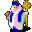

# { .sprite } Thoronir

**Where to find Thoronir:** Fallhaven: [Fallhaven church](../maps/fallhaven_church.md#pin-npc-thoronir)

<div class="infobox" markdown>

<p class="ib-img"></p>

| | |
|---|---|
| **Type** | NPC (talk only; never fought) |
| **Role** | Shopkeeper |
| **Found in** | Fallhaven |
| **Introduced** | v0.7.0 or earlier |

</div>

## Shop stock

| Item | Chance | Qty |
|---|---|---|
| [Bonemeal potion](../items/bonemeal_potion.md) | 100% | 50 |

## Quests

- [Disallowed substance](../quests/bonemeal.md): stages 40, 50, 100, 110
- [Key of Luthor](../quests/bucus.md): stage 20
- [Thief apprentice](../quests/Thieves01.md): stage 50
- [Thieves story flags (hidden flag)](../quests/thieves_hidden.md): stage 80

## Dialogue simulator

Talk to Thoronir as you would in the game. When the conversation depends on your progress (a quest, an item, a dice roll…), the simulator asks you. Try another answer with **Undo**.

<div class="dlg-sim" data-src="../../assets/dialogue/thoronir_default.json" data-npc="Thoronir" markdown="0"><noscript>The simulator needs JavaScript. The full dialogue is listed below.</noscript></div>

<p class="verified">Follows the game's own conversation rules (v0.8.18).</p>

??? quote "Dialogue (35 lines)"

    *Exactly as in the game files. Each line appears once; links jump to where a choice leads.*

    <span id="d-thoronir_default"></span>**`thoronir_default`** *(silent check: the first matching branch below is taken)*

    - branch 1 → [thoronir_start_select](#d-thoronir_start_select)

    <span id="d-thoronir_start_select"></span>**`thoronir_start_select`** *(silent check: the first matching branch below is taken)*

    - branch 1 *(if reached stage 18 of [Score counters (hidden flag)](../quests/scores.md#stage-18))* → [thoronir_shadow_score_max](#d-thoronir_shadow_score_max)
    - branch 2 *(if reached stage 18 of [Score counters (hidden flag)](../quests/scores.md#stage-18))* → [thoronir_shadow_score_very_high](#d-thoronir_shadow_score_very_high)
    - branch 3 *(if reached stage 17 of [Score counters (hidden flag)](../quests/scores.md#stage-17))* → [thoronir_shadow_score_high](#d-thoronir_shadow_score_high)
    - branch 4 *(if reached stage 15 of [Score counters (hidden flag)](../quests/scores.md#stage-15))* → [thoronir_shadow_score_average](#d-thoronir_shadow_score_average)
    - branch 5 *(if reached stage 13 of [Score counters (hidden flag)](../quests/scores.md#stage-13))* → [thoronir_shadow_score_low1](#d-thoronir_shadow_score_low1)
    - branch 6 → [thoronir_shadow_score_low3](#d-thoronir_shadow_score_low3)

    <span id="d-thoronir_shadow_score_max"></span>**`thoronir_shadow_score_max`** Thoronir: “Welcome my truest follower of the Shadow.”

    - Next → [thoronir_start](#d-thoronir_start)

    <span id="d-thoronir_shadow_score_very_high"></span>**`thoronir_shadow_score_very_high`** Thoronir: “I am very happy to see you. May the Shadow always be with you.”

    - Next → [thoronir_start](#d-thoronir_start)

    <span id="d-thoronir_shadow_score_high"></span>**`thoronir_shadow_score_high`** Thoronir: “I am happy to see you. May the Shadow always be with you.”

    - Next → [thoronir_start](#d-thoronir_start)

    <span id="d-thoronir_shadow_score_average"></span>**`thoronir_shadow_score_average`** Thoronir: “Bask in the Shadow, my child.”

    - Next → [thoronir_start](#d-thoronir_start)

    <span id="d-thoronir_shadow_score_low1"></span>**`thoronir_shadow_score_low1`** Thoronir: “I have the strong feeling that you are not following the Shadow.”

    - “[Lie] No that's not true.” → [thoronir_start](#d-thoronir_start)
    - “Can you still help me?” → [thoronir_start](#d-thoronir_start)

    <span id="d-thoronir_shadow_score_low3"></span>**`thoronir_shadow_score_low3`** Thoronir: “I know you are illoyal to the Shadow. It would be better if you leave now.”

    - “[Lie] No that's not true.” → [thoronir_start](#d-thoronir_start)
    - “Can you still help me?” → [thoronir_start](#d-thoronir_start)

    <span id="d-thoronir_start"></span>**`thoronir_start`** Thoronir: “What can I do for you?”

    - “What can you tell me about the Shadow?” → [thoronir_shadow_1](#d-thoronir_shadow_1)
    - “Can you tell me more about the church?” → [thoronir_church_1](#d-thoronir_church_1)
    - “Are the Bonemeal potions ready yet?” *(if reached stage 100 of [Disallowed substance](../quests/bonemeal.md#stage-100))* → [thoronir_trade_bonemeal](#d-thoronir_trade_bonemeal)
    - “Do you have some special white powdered potions whose name must not be mentioned?” *(if reached stage 110 of [Disallowed substance](../quests/bonemeal.md#stage-110))* → [thoronir_trade_bonemeal_a](#d-thoronir_trade_bonemeal_a)
    - “I really need your help!” *(if reached stage 45 of [Thief apprentice](../quests/Thieves01.md#stage-45); reached stage 100 of [Disallowed substance](../quests/bonemeal.md#stage-100); NOT reached stage 50 of [Thief apprentice](../quests/Thieves01.md#stage-50))* → [thoronir_guild_1](#d-thoronir_guild_1)
    - “I need some help finding out who is responsible for casting a Shadow spell that causes a person to become noticeable.” *(if reached stage 50 of [Troubling times](../quests/troubling_times.md#stage-50); NOT reached stage 70 of [Troubling times](../quests/troubling_times.md#stage-70))* → [tt_thoronir_10](#d-tt_thoronir_10)
    - “I really need your help!” *(if reached stage 45 of [Thief apprentice](../quests/Thieves01.md#stage-45); reached stage 110 of [Disallowed substance](../quests/bonemeal.md#stage-110); NOT reached stage 50 of [Thief apprentice](../quests/Thieves01.md#stage-50))* → [thoronir_guild_1](#d-thoronir_guild_1)

    <span id="d-thoronir_shadow_1"></span>**`thoronir_shadow_1`** Thoronir: “The Shadow protects us from the dangers of the night. It keeps us safe and comforts us when we sleep.”

    - “Tharal sent me and told me to tell you the password 'Glow of the Shadow'.” *(if reached stage 30 of [Disallowed substance](../quests/bonemeal.md#stage-30))* → [thoronir_tharal_select](#d-thoronir_tharal_select)
    - “Shadow be with you.” → [thoronir_default](#d-thoronir_default)
    - “Sounds like nonsense to me.” → [thoronir_default](#d-thoronir_default)

    <span id="d-thoronir_church_1"></span>**`thoronir_church_1`** Thoronir: “This is our chapel of worship in Fallhaven. Our community turns to us for support.”

    - Next → [thoronir_church_2](#d-thoronir_church_2)

    <span id="d-thoronir_trade_bonemeal"></span>**`thoronir_trade_bonemeal`** Thoronir: “Yes, the bonemeal potions are ready. Please use them with care, and don't let the guards see you. We are not actually allowed to use them anymore.”

    - “Let me see what potions you have made so far.” → *shop opens*
    - “There was something else I wanted to talk about.” → [thoronir_default](#d-thoronir_default)

    <span id="d-thoronir_trade_bonemeal_a"></span>**`thoronir_trade_bonemeal_a`** Thoronir: “Yes, the bo ... I mean, yes, I have some of these potions ready. For the small sum of 200 gold pieces, I can show them to you. Perhaps you'd like to buy some of them then. Just don't let anybody see them.”

    - “Here are 200 gold. Now let me see the potions.” *(if pay 200 gold)* → *shop opens*
    - “There was something else I wanted to talk about.” → [thoronir_default](#d-thoronir_default)

    <span id="d-thoronir_guild_1"></span>**`thoronir_guild_1`** Thoronir: “What's the matter, my child?”

    - “Ehm ... My father has cut himself with an axe, and we don't have any bandages!” → [thoronir_guild_2a](#d-thoronir_guild_2a)
    - “Fanamor, a member of Thieves' Guild, is severely wounded. Please give me a bandage for her!” → [thoronir_guild_2](#d-thoronir_guild_2)

    <span id="d-tt_thoronir_10"></span>**`tt_thoronir_10`** Thoronir: “You must be confusing me with someone else.”

    - “Never mind.” → [thoronir_start](#d-thoronir_start)

    <span id="d-thoronir_tharal_select"></span>**`thoronir_tharal_select`** *(silent check: the first matching branch below is taken)*

    - branch 1 *(if reached stage 100 of [Disallowed substance](../quests/bonemeal.md#stage-100))* → [thoronir_trade_bonemeal](#d-thoronir_trade_bonemeal)
    - branch 2 *(if reached stage 110 of [Disallowed substance](../quests/bonemeal.md#stage-110))* → [thoronir_trade_bonemeal_a](#d-thoronir_trade_bonemeal_a)
    - branch 3 → [thoronir_tharal_1](#d-thoronir_tharal_1)

    <span id="d-thoronir_church_2"></span>**`thoronir_church_2`** Thoronir: “This church has withstood hundreds of years, and has been kept safe from grave robbers.”

    - Next → [thoronir_church_3](#d-thoronir_church_3)

    <span id="d-thoronir_guild_2a"></span>**`thoronir_guild_2a`** Thoronir: “Let me see ...”

    - Next → [thoronir_guild_3](#d-thoronir_guild_3)

    <span id="d-thoronir_guild_2"></span>**`thoronir_guild_2`** *(silent check: the first matching branch below is taken)* — **effects:** sets stage 80 of [Thieves story flags (hidden flag)](../quests/thieves_hidden.md#stage-80)

    - branch 1 → [thoronir_guild_2a](#d-thoronir_guild_2a)

    <span id="d-thoronir_tharal_1"></span>**`thoronir_tharal_1`** Thoronir: “Glow of the Shadow indeed my child. So my old friend Tharal in Crossglen village sent you?”

    - “What can you tell me about bonemeal?” → [thoronir_tharal_2](#d-thoronir_tharal_2)

    <span id="d-thoronir_church_3"></span>**`thoronir_church_3`** Thoronir: “The catacombs beneath the church house the remains of our passed leaders. Our great King Luthor is rumored to be buried there.”

    - “Has anyone entered the catacombs?” *(if reached stage 10 of [Key of Luthor](../quests/bucus.md#stage-10))* → [thoronir_church_4](#d-thoronir_church_4)
    - “There was something else I wanted to talk about.” → [thoronir_default](#d-thoronir_default)

    <span id="d-thoronir_guild_3"></span>**`thoronir_guild_3`** Thoronir: “This is what I have, take it. I expect this will be useful.” — **effects:** sets stage 50 of [Thief apprentice](../quests/Thieves01.md#stage-50), gives 1× [Bandage](../items/bandage.md)

    - “May the Shadow walk with you, my friend.” → *conversation ends*
    - “Thank you, I won't forget this!” → *conversation ends*

    <span id="d-thoronir_tharal_2"></span>**`thoronir_tharal_2`** Thoronir: “Shhh, we shouldn't talk so loud about using bonemeal. As you know, Lord Geomyr issued a ban on all use of bonemeal.”

    - Next → [thoronir_tharal_3](#d-thoronir_tharal_3)

    <span id="d-thoronir_church_4"></span>**`thoronir_church_4`** Thoronir: “No one is allowed down in the catacombs, except for Athamyr, my apprentice. He is the only one that has been down there for years.” — **effects:** sets stage 20 of [Key of Luthor](../quests/bucus.md#stage-20)

    - “OK, I might go see him.” → [thoronir_default](#d-thoronir_default)

    <span id="d-thoronir_tharal_3"></span>**`thoronir_tharal_3`** Thoronir: “When the ban came, I did not dare keep any, so I threw my whole supply away. It was quite foolish now that I look back on it.”

    - Next → [thoronir_tharal_3a](#d-thoronir_tharal_3a)

    <span id="d-thoronir_tharal_3a"></span>**`thoronir_tharal_3a`** *(silent check: the first matching branch below is taken)*

    - branch 1 *(if reached stage 50 of [Disallowed substance](../quests/bonemeal.md#stage-50))* → [thoronir_tharal_4a](#d-thoronir_tharal_4a)
    - branch 2 → [thoronir_tharal_4](#d-thoronir_tharal_4)

    <span id="d-thoronir_tharal_4a"></span>**`thoronir_tharal_4a`** Thoronir: “Well, do you think you could find me 5 skeletal bones that I can use for ... church matters?”

    - “Sure, I might be able to do that.” → [thoronir_tharal_5a](#d-thoronir_tharal_5a)
    - “I have those bones for you.” *(if hand over 5× [Bone](../items/bone.md))* → [thoronir_tharal_complete_a](#d-thoronir_tharal_complete_a)

    <span id="d-thoronir_tharal_4"></span>**`thoronir_tharal_4`** Thoronir: “Do you think you could find me 5 skeletal bones that I can use for mixing a bonemeal potion? The bonemeal is very potent in healing old wounds.”

    - “Sure, I might be able to do that.” → [thoronir_tharal_5](#d-thoronir_tharal_5)
    - “I have those bones for you.” *(if hand over 5× [Bone](../items/bone.md))* → [thoronir_tharal_complete](#d-thoronir_tharal_complete)
    - “I've changed my mind. If Lord Geomyr forbids bonemeal potions, we should abide by that.” *(if NOT reached stage 40 of [Disallowed substance](../quests/bonemeal.md#stage-40))* → [thoronir_tharal_4b](#d-thoronir_tharal_4b)

    <span id="d-thoronir_tharal_5a"></span>**`thoronir_tharal_5a`** Thoronir: “Thank you, please come back soon. I heard there were some undead near an old abandoned house just north of Fallhaven. Maybe you can check for bones there?” — **effects:** sets stage 50 of [Disallowed substance](../quests/bonemeal.md#stage-50)

    - “OK, I'll go check there.” → [thoronir_default](#d-thoronir_default)

    <span id="d-thoronir_tharal_complete_a"></span>**`thoronir_tharal_complete_a`** Thoronir: “Thank you, these bones will do fine. Now I can start creating some ... things.” — **effects:** sets stage 110 of [Disallowed substance](../quests/bonemeal.md#stage-110)

    - Next → [thoronir_complete_2a](#d-thoronir_complete_2a)

    <span id="d-thoronir_tharal_5"></span>**`thoronir_tharal_5`** Thoronir: “Thank you, please come back soon. I heard there were some undead near an old abandoned house just north of Fallhaven. Maybe you can check for bones there?” — **effects:** sets stage 40 of [Disallowed substance](../quests/bonemeal.md#stage-40)

    - “OK, I'll go check there.” → [thoronir_default](#d-thoronir_default)

    <span id="d-thoronir_tharal_complete"></span>**`thoronir_tharal_complete`** Thoronir: “Thank you, these bones will do fine. Now I can start creating some bonemeal healing potions for you.” — **effects:** sets stage 100 of [Disallowed substance](../quests/bonemeal.md#stage-100)

    - Next → [thoronir_complete_2](#d-thoronir_complete_2)

    <span id="d-thoronir_tharal_4b"></span>**`thoronir_tharal_4b`** Thoronir: “That's very sincere of you. Perhaps you could still get me the bones. I need them also for church business, and I've recently run out of them.”

    - “Sure, I might be able to do that.” → [thoronir_tharal_5a](#d-thoronir_tharal_5a)
    - “I have those bones for you.” *(if hand over 5× [Bone](../items/bone.md))* → [thoronir_tharal_complete_a](#d-thoronir_tharal_complete_a)

    <span id="d-thoronir_complete_2a"></span>**`thoronir_complete_2a`** Thoronir: “Give me some time to ... prepare. Come back in a little while.”


    <span id="d-thoronir_complete_2"></span>**`thoronir_complete_2`** Thoronir: “Give me some time to mix the bonemeal potion. It is a very potent healing potion. Come back in a little while.”


## Version history

| Version | Change |
|---|---|
| [v0.7.0](../versions/0.7.0.md) | Present in v0.7.0 (earliest release tracked) |
| [v0.7.2](../versions/0.7.2.md) | Dialogue: 10 lines changed<br>· text: “Do you think you could find me 5 skeletal bones that I can use for mi…” → “Do you think you could find me 5 skeletal bones that I can use for mi…”<br>· text: “Shhh, we shouldn't talk so loud about using Bonemeal. As you know, Lo…” → “Shhh, we shouldn't talk so loud about using bonemeal. As you know, Lo…” |
| [v0.7.8](../versions/0.7.8.md) | Dialogue: 4 lines added, 1 line changed |
| [v0.7.13](../versions/0.7.13.md) | Dialogue: 8 lines added, 1 line changed<br>· text: “Bask in the Shadow, my child.” → “null” |
| [v0.8.2](../versions/0.8.2.md) | Dialogue: 1 line changed |
| [v0.8.13](../versions/0.8.13.md) | Dialogue: 1 line added, 1 line changed |
| [v0.8.16.1](../versions/0.8.16.1.md) | Dialogue: 7 lines added, 5 lines changed |
| [v0.8.18](../versions/0.8.18.md) | Dialogue: 2 lines changed |

<p class="verified">Verified against v0.8.18 and every earlier release back to v0.7.0 (game data compared release by release).</p>


## Behind the scenes

*How the game data handles this character. Not needed for playing.*

??? info "Technical information"

    | | |
    |---|---|
    | Entry ID | `thoronir` |
    | Type (wiki) | NPC |
    | Spawn group | `thoronir` |
    | Loot table | `shop_thoronir` |
    | Conversation | `thoronir_default` |
    | Faction | – |
    | Movement | – |
    | Icon | `monsters_men2:8` |
    | Defined in | `res/raw/monsterlist_fallhaven_npcs.json` |

    Raw data:

    ```json
    {
     "id": "thoronir",
     "name": "Thoronir",
     "iconID": "monsters_men2:8",
     "monsterClass": "humanoid",
     "spawnGroup": "thoronir",
     "phraseID": "thoronir_default",
     "droplistID": "shop_thoronir"
    }
    ```


## Community notes

<small>Written by players, not generated from game data. **Observations**: what players notice in-game · **Lore**: the in-world story · **Trivia**: real-world facts, references, development history · **Theory / speculation**: unconfirmed ideas; may just be unfinished content</small>

### Observations

*No notes yet. Contributions are welcome: [add a note](https://github.com/asdfghjkl628/Andor-s-Trail-Wikiiii/new/main/notes/monsters?filename=thoronir.md&value=%23%23%20Observations%0A%0A%3C%21--%20what%20players%20notice%20in-game%20--%3E%0A%0A%23%23%20Lore%0A%0A%3C%21--%20the%20in-world%20story%20--%3E%0A%0A%23%23%20Trivia%0A%0A%3C%21--%20real-world%20facts%2C%20references%2C%20development%20history%20--%3E%0A%0A%23%23%20Theory%20/%20speculation%0A%0A%3C%21--%20unconfirmed%20ideas%3B%20may%20just%20be%20unfinished%20content%20--%3E%0A).*

### Lore

*No notes yet. Contributions are welcome: [add a note](https://github.com/asdfghjkl628/Andor-s-Trail-Wikiiii/new/main/notes/monsters?filename=thoronir.md&value=%23%23%20Observations%0A%0A%3C%21--%20what%20players%20notice%20in-game%20--%3E%0A%0A%23%23%20Lore%0A%0A%3C%21--%20the%20in-world%20story%20--%3E%0A%0A%23%23%20Trivia%0A%0A%3C%21--%20real-world%20facts%2C%20references%2C%20development%20history%20--%3E%0A%0A%23%23%20Theory%20/%20speculation%0A%0A%3C%21--%20unconfirmed%20ideas%3B%20may%20just%20be%20unfinished%20content%20--%3E%0A).*

### Trivia

*No notes yet. Contributions are welcome: [add a note](https://github.com/asdfghjkl628/Andor-s-Trail-Wikiiii/new/main/notes/monsters?filename=thoronir.md&value=%23%23%20Observations%0A%0A%3C%21--%20what%20players%20notice%20in-game%20--%3E%0A%0A%23%23%20Lore%0A%0A%3C%21--%20the%20in-world%20story%20--%3E%0A%0A%23%23%20Trivia%0A%0A%3C%21--%20real-world%20facts%2C%20references%2C%20development%20history%20--%3E%0A%0A%23%23%20Theory%20/%20speculation%0A%0A%3C%21--%20unconfirmed%20ideas%3B%20may%20just%20be%20unfinished%20content%20--%3E%0A).*

### Theory / speculation

*No notes yet. Contributions are welcome: [add a note](https://github.com/asdfghjkl628/Andor-s-Trail-Wikiiii/new/main/notes/monsters?filename=thoronir.md&value=%23%23%20Observations%0A%0A%3C%21--%20what%20players%20notice%20in-game%20--%3E%0A%0A%23%23%20Lore%0A%0A%3C%21--%20the%20in-world%20story%20--%3E%0A%0A%23%23%20Trivia%0A%0A%3C%21--%20real-world%20facts%2C%20references%2C%20development%20history%20--%3E%0A%0A%23%23%20Theory%20/%20speculation%0A%0A%3C%21--%20unconfirmed%20ideas%3B%20may%20just%20be%20unfinished%20content%20--%3E%0A).*


<small>Data from v0.8.18</small>
